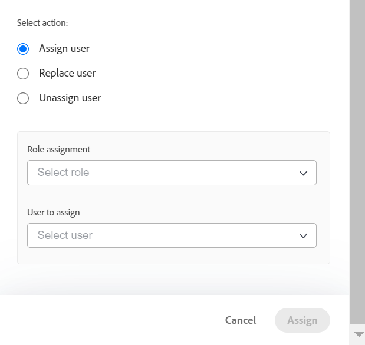

# Attribuer du travail en bloc à l’aide de l’équilibreur de charge de travail

<!--Audited: 07/2024-->

Vous pouvez affecter des ressources à plusieurs tâches et événements en bloc à l’aide de l’équilibreur de charge de travail d’Adobe Workfront.

Pour des informations générales sur l’attribution de travail aux utilisateurs et utilisatrices à l’aide de l’équilibreur de charge de travail, voir [Vue d’ensemble de l’attribution de travail dans l’équilibreur de charge de travail](../../resource-mgmt/workload-balancer/assign-work-in-workload-balancer.md).

## Conditions d’accès

+++ Développez pour afficher les exigences d’accès aux fonctionnalités de cet article.

<table style="table-layout:auto"> 
 <col> 
 <col> 
 <tbody> 
  <tr> 
   <td>Package Adobe Workfront</td> 
   <td>
Tous
</td>
  </tr>
  <tr> 
   <td>Licence Adobe Workfront</td> 
   <td>
Standard

       
Plan, lors de l’utilisation de l’équilibreur de charge de travail dans la zone Ressource ; Travail, lors de l’utilisation de l’équilibreur de charge de travail d’une équipe ou d’un projet
</td>
  </tr>
  <tr> 
   <td>Configurations des niveaux d’accès</td> 
   <td> 
Modifiez l’accès aux éléments suivants :
 
    <ul> 
     <li>Gestion des ressources</li> 
     <li>Projets</li> 
     <li>Tâches</li> 
     <li>Problèmes</li> 
    </ul>
   </td> 
  </tr> 
  <tr> 
   <td>Autorisations d’objet</td> 
   <td>Autorisations Contribuer ou supérieures aux projets, tâches et problèmes qui incluent la création d’affectations.</td> 
  </tr> 
 </tbody> 
</table>

Pour plus d’informations, voir [Conditions d’accès requises dans la documentation Workfront](/help/quicksilver/administration-and-setup/add-users/access-levels-and-object-permissions/access-level-requirements-in-documentation.md).

+++

## Remarques sur les affectations en masse dans l’équilibreur de charge de travail

* Vous pouvez rapidement gérer les affectations de ressources pour plusieurs tâches et événements dans un ou plusieurs projets. Les modifications d’affectations sont immédiatement visibles dans l’équilibreur de charge de travail.
* Vous ne pouvez pas affecter de ressources aux éléments de travail terminés ou aux éléments qui se trouvent dans un projet terminé.
* Vous pouvez effectuer les opérations suivantes lors de l’affectation en bloc de fonctions et d’utilisateurs :

   * Remplacez les affectations entre les utilisateurs et les rôles dans toutes les combinaisons valides.
   * Annuler l’affectation d’un utilisateur ou d’une utilisiatrice à tous ses éléments de travail.

**EXEMPLES**

* Vous devez effectuer des affectations d’utilisateurs et utilisatrices sur plusieurs nouveaux projets. Les projets ont été créés à partir de modèles et les fonctions sont déjà affectées aux différentes tâches des projets. Vous souhaitez affecter une utilisatrice spécifique, Jackie Simms, à toutes les tâches actuellement affectées à une fonction. Vous pouvez utiliser la fonction Remplacer pour affecter ces tâches à Jackie Simms.
* 45 tâches sur 3 projets différents sont affectées à Jackie Simms. Jackie quitte l’entreprise et vous devez maintenant réaffecter ses tâches à une autre personne. Vous pouvez utiliser la fonction Remplacer pour affecter ces tâches à la nouvelle personne.
* 10 tâches sur 2 projets différents sont affectées à un autre utilisateur, Rick Kuvec. Vous réalisez que Rick a été affecté à ces tâches par erreur, mais vous ne savez pas à qui elles doivent être affectées à ce moment. Vous devez annuler l’affectation de Rick à toutes les tâches en même temps. Vous pouvez utiliser la fonction Annuler l’affectation pour retirer Rick de ces tâches.

## Attribuer du travail en masse dans l’équilibreur de charge de travail

1. Accédez à l’équilibreur de charge de travail auquel vous souhaitez attribuer du travail.

   Vous pouvez attribuer du travail aux utilisateurs et utilisatrices à l’aide de l’équilibreur de charge de travail dans la zone Ressources, au niveau du projet ou de l’équipe. Pour plus d’informations sur l’emplacement de l’équilibreur de charge de travail dans Workfront, voir [Localiser l’équilibreur de charge de travail](../../resource-mgmt/workload-balancer/locate-workload-balancer.md).

1. Cliquez sur **Affectations en bloc**  en haut de l’équilibreur de charge de travail.

   Le panneau Affectations groupées s’ouvre à droite de l’équilibreur de charge de travail.

1. (Le cas échéant) Si vous accédez à l’équilibreur de charge de travail à partir de la zone Ressources ou pour une équipe, développez le menu déroulant **Projet : nom** et utilisez les modificateurs de filtre pour sélectionner le ou les projets pour lesquels vous souhaitez effectuer des affectations. Vous pouvez sélectionner les projets par nom (option par défaut) ou par statut.

   Pour plus d’informations sur les modificateurs de filtre Workfront, voir [Modificateurs de filtre et de condition](../../reports-and-dashboards/reports/reporting-elements/filter-condition-modifiers.md).

   >[!NOTE]
   >
   >Le nom du projet est sélectionné par défaut lorsque vous accédez à l’équilibreur de charge de travail pour un projet.

   

1. (Facultatif) Cliquez sur **Sélectionner les tâches de projet** pour sélectionner la ou les tâches pour lesquelles vous souhaitez effectuer des affectations, puis dans le menu déroulant **Tâche : nom**, sélectionnez les tâches par nom (option par défaut) ou par statut et utilisez les modificateurs de filtre pour rechercher des tâches spécifiques.

   Pour plus d’informations sur les modificateurs de filtre Workfront, voir [Modificateurs de filtre et de condition](../../reports-and-dashboards/reports/reporting-elements/filter-condition-modifiers.md).

   >[!NOTE]
   >
   >Vous ne pouvez pas sélectionner de tâches dont le statut est Terminé.

   

   >[!TIP]
   >
   >Laissez cette sélection vide si vous souhaitez effectuer des affectations groupées pour les problèmes ainsi que pour les tâches.

1. (Facultatif) Cliquez sur l’icône **Supprimer**  en regard de l’un des critères sélectionnés

   Ou

   Cliquez sur **Effacer tout** dans le coin supérieur droit du panneau Affectations groupées pour supprimer toutes les sélections.

1. Sélectionnez l’une des options suivantes et procédez comme suit :

   * [&#x200B; Remplacer la ressource &#x200B;](#replace-user)
   * [Désattribuer une ressource](#unassign-user)

   >[!TIP]
   >
   >Si aucun élément ne correspond aux filtres sélectionnés, ces options sont grisées.

<!--

### Assign user {#assign-user}

When you assign a user using Bulk Assignments in the Workload Balancer, the following things occur:

* A user is assigned to all work items currently assigned to a specified role within the selected projects.
* The user is not assigned to the following types of work items:

   * Items that are already assigned to a user.
   * Completed items.

* If the user you selected is not associated with the specified role, the role is replaced by the user in the user's Primary Role.

To assign a user to work items previously assigned to job roles:

1. Start assigning work items using Bulk Assignments in the Workload Balancer as described above and select **Assign**. 

1. In the **Role assignment** field, click the drop-down arrow to choose from a list of roles. Only roles currently assigned within the specified projects are displayed. This is a required field. 

   

1. In the **User to assign** field, click the drop-down arrow to choose from a list of suggested users or to type another user's name.

   Select users from the following areas:

   * **Suggested Assignments**: Users who can fulfill the selected role and who match the criteria for Smart Assignments. For more information, see [Smart assignments overview](../../manage-work/tasks/assign-tasks/smart-assignments.md).
   * **Other Assignments**: All users in the system who can fulfill the selected role. 
   
      >[!TIP]
      >
      >Only the first 50 users are listed in the Other Assignments area.

   After selecting a user, Workfront displays a note about the number of items where the user you specified will be assigned and what job role they will replace.

   >[!TIP]
   >
   >All the roles of the user display in the list, under the user's name.

1. Click **Assign**.

   The specified roles are replaced with the users that you selected.

   You receive a confirmation about how many work items have had the selected role replaced with the selected user.

   

-->

### Remplacer la ressource {#replace-user}

Vous pouvez remplacer une ressource déjà affectée à des tâches par une autre ressource dans les projets sélectionnés.

Le remplacement de la ressource peut être :

* Rôle avec rôle
* Utilisateur avec utilisateur
* Utilisateur avec rôle
* Rôle avec l’utilisateur

Lorsque vous remplacez une ressource par une autre ressource à l’aide d’affectations en bloc dans l’équilibreur de charge de travail, voici ce qui se produit :

* La ressource de remplacement est affectée à toutes les tâches actuellement affectées à la ressource d&#39;origine dans les projets sélectionnés.
* La nouvelle ressource n&#39;est affectée à aucun élément de travail déjà marqué comme Terminé.
* Pour un remplacement utilisateur à utilisateur, si le rôle associé au premier utilisateur ne correspond à aucun des rôles du second utilisateur, le second utilisateur est affecté dans son rôle de Principal.

Pour remplacer une ressource par une autre ressource :

1. Sélectionnez des tâches dans la zone Affectations en bloc de l’équilibreur de charge de travail comme décrit ci-dessus et sélectionnez **Remplacer la ressource**.
1. Dans le champ **Ressource actuellement affectée**, cliquez sur la flèche déroulante pour effectuer une sélection dans une liste de ressources. Seules les ressources actuellement affectées à des éléments de travail incomplets dans les projets spécifiés s&#39;affichent. Champ obligatoire.

   

1. Dans le champ **Ressource à affecter**, cliquez sur la flèche déroulante pour effectuer votre choix dans une liste de ressources suggérées ou pour saisir une autre fonction ou un autre nom d’utilisateur. Les ressources répertoriées en premier correspondent par défaut aux critères des affectations intelligentes. Pour en savoir plus, consultez [Vue d’ensemble des affectations intelligentes](../../manage-work/tasks/assign-tasks/smart-assignments.md).

   Workfront affiche une note sur le nombre d’éléments pour lesquels la ressource actuellement affectée remplacera la seconde ressource.

1. Cliquez sur **Remplacer**.

   La première ressource est remplacée par la seconde dans tous les éléments de travail du projet ou de la tâche sélectionné.

   Vous recevez un message de confirmation indiquant le nombre d&#39;éléments de travail pour lesquels l&#39;affectation d&#39;origine a été remplacée par la deuxième ressource sélectionnée.

### Désattribuer une ressource {#unassign-user}

Vous pouvez annuler l’affectation d’une ressource pour toutes les tâches qui lui sont affectées dans les projets sélectionnés.

Lorsque vous annulez l’affectation d’un utilisateur ou d’une utilisatrice de toutes ses affectations à l’aide des affectations groupées dans l’équilibreur de charge de travail, les événements suivants se produisent :

* L’utilisateur spécifié est supprimé de toutes les tâches qui lui sont affectées.
* Si la personne non affectée est associée à des fonctions, les fonctions demeurent affectées aux éléments de travail lors de la suppression de la personne.

* Si la personne spécifiée est affectée aux éléments de travail terminés, la personne demeure affectée à ces éléments de travail.

Pour plus d’informations sur les affectations d’utilisateurs et d’utilisatrices et de fonctions, voir [Vue d’ensemble de l’affectation de travail dans l’équilibreur de charge de travail](../../resource-mgmt/workload-balancer/assign-work-in-workload-balancer.md).

Pour annuler l’affectation d’un utilisateur ou d’une utilisatrice à des éléments de travail dans les projets sélectionnés ou pour les tâches ou problèmes sélectionnés auxquels la personne est affectée, procédez comme suit :

1. Sélectionnez des tâches dans la zone Affectations en bloc de l’équilibreur de charge de travail comme décrit ci-dessus et sélectionnez **Annuler l’affectation de la ressource**.

1. Dans le champ **Personne à affecter**, cliquez sur la flèche déroulante et choisissez dans la liste d’utilisateurs et d’utilisatrices. Seuls les utilisateurs et utilisatrices affectés actuellement à des tâches incomplètes dans les projets spécifiés s’affichent. Champ obligatoire.

   

   Workfront affiche une note par rapport au nombre d’éléments dont la personne affectée actuellement se verra annuler l’affectation.

1. Cliquez sur **Annuler l’affectation**.\
   Vous recevez une confirmation par rapport au nombre d’éléments de travail dont la personne spécifiée a été supprimée.

