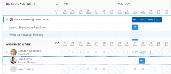

# Vue d’ensemble de l’affectation de travail dans l’équilibreur de charge de travail

En tant que personne gestionnaire de ressources, vous pouvez utiliser l’équilibreur de charge de travail Adobe Workfront pour afficher les éléments de travail qui n’ont pas encore été attribués à des utilisateurs et utilisatrices et leur attribuer ces éléments.

Pour des informations générales sur l’équilibreur de charge de travail, voir [Vue d’ensemble de l’équilibreur de charge de travail](../../resource-mgmt/workload-balancer/overview-workload-balancer.md).

Vous pouvez assigner des éléments de travail (tâches et problèmes) à des utilisateurs et utilisatrices dans d’autres zones de Workfront. Cependant, en utilisant l’équilibreur de charge de travail, vous pouvez visualiser clairement la disponibilité des utilisateurs et utilisatrices ainsi que tous les autres éléments auxquels ils sont affectés avant de leur confier plus de travail.

Pour plus d’informations sur l’attribution d’éléments de travail dans d’autres zones de Workfront, voir les articles suivants :

* [Affecter des tâches](../../manage-work/tasks/assign-tasks/assign-tasks.md)
* [Attribuer des problèmes](../../manage-work/issues/manage-issues/assign-issues.md)

## Disponibilité des utilisateurs et utilisatrices dans l’équilibreur de charge de travail

Vous pouvez attribuer le travail dans l’équilibreur de charge de travail en fonction du temps disponible des utilisateurs et utilisatrices. Pour vous assurer que vous attribuez la bonne quantité de travail à l’utilisateur ou à l’utilisatrice, le nombre total d’heures prévues des éléments de travail attribués doit correspondre aux attributions quotidiennes ou hebdomadaires de l’utilisateur ou de l’utilisatrice.

Vous devez comprendre comment Workfront calcule le temps disponible des utilisateurs et utilisatrices.

Workfront utilise les informations suivantes pour calculer la capacité des utilisateurs et utilisatrices dans l’équilibreur de charge de travail :

* Préférences en matière de gestion des ressources. L’équipe d’administration Workfront détermine la manière dont le temps disponible est calculé pour le système en sélectionnant l’une des options suivantes dans la zone Gestion des ressources de la configuration :

   * Planning par défaut du système Workfront et équivalent temps complet de l’utilisateur ou de l’utilisatrice.
   * Planning de l’utilisateur ou de l’utilisatrice, tel qu’il est indiqué dans la zone Profil de l’utilisateur ou de l’utilisatrice.

     Calcule la disponibilité quotidienne et hebdomadaire des utilisateurs et utilisatrices. Toute exception au planning sélectionné se répercute sur la capacité de l’utilisateur ou de l’utilisatrice dans l’équilibreur de charge de travail.

  Pour plus d’informations, voir [Configurer les préférences de gestion des ressources](../../administration-and-setup/set-up-workfront/configure-system-defaults/configure-resource-mgmt-preferences.md).

  Pour plus d’informations sur les plannings, voir [Créer un planning](../../administration-and-setup/set-up-workfront/configure-timesheets-schedules/create-schedules.md)

* Congés de l’utilisateur ou de l’utilisatrice. Indique les jours où les utilisateurs et utilisatrices prévoient d’être absents.

  Pour plus d’informations, voir [Configurer les congés personnels](../../workfront-basics/manage-your-account-and-profile/configuring-your-user-profile/personal-time-overview.md).

* Temps de travail de l’utilisateur ou de l’utilisatrice. Indique le pourcentage d’équivalent temps complet dont dispose l’utilisateur ou l’utilisatrice pour effectuer le travail lié au projet, sans compter les heures supplémentaires. Définissez la valeur Temps de travail sur 1 pour indiquer que la personne est disponible pour effectuer le travail lié au projet pendant la totalité de son équivalent temps complet.

## Affecter du travail dans l’équilibreur de charge

Vous pouvez affecter des tâches qui n’ont pas encore été attribuées à un utilisateur ou à une utilisatrice ou réaffecter des tâches qui ont été attribuées à des utilisateurs et utilisatrices dans l’équilibreur de charge de travail.

Vous pouvez attribuer du travail dans l’équilibreur de charge de travail des façons suivantes :

* Un élément à la fois en attribuant manuellement chaque élément.

  Vous pouvez effectuer des affectations avancées lorsque vous attribuez des éléments manuellement, un par un.

  Pour plus d’informations, voir [Attribuer des tâches manuellement à l’aide de l’équilibreur de charge de travail](../../resource-mgmt/workload-balancer/assign-work-in-workload-balancer-manually.md).

* Un élément à la fois, en faisant glisser les éléments de travail vers l’utilisateur ou l’utilisatrice cible.

  Pour plus d’informations, voir [Attribuer du travail dans l’équilibreur de charge de travail par glisser-déposer](../../resource-mgmt/workload-balancer/assign-work-in-workload-balancer-by-drag-and-drop.md).

* Plusieurs éléments à la fois, en utilisant l’option Affectations groupées. Vous pouvez définir des règles pour que les éléments soient attribués à plusieurs utilisateurs et utilisatrices à la fois.

  Pour plus d’informations, voir [Attribuer du travail en masse à l’aide de l’équilibreur de charge de travail](../../resource-mgmt/workload-balancer/assign-work-in-workload-balancer-in-bulk.md).

Pour plus d’informations sur l’annulation de l’attribution du travail, voir [Annuler l’attribution du travail dans l’équilibreur de charge de travail](../../resource-mgmt/workload-balancer/unassign-work-in-workload-balancer.md).

## Zones Affectation dans l’équilibreur de charge de travail

Vous pouvez attribuer du travail aux utilisateurs et utilisatrices à l’aide de l’équilibreur de charge de travail dans la zone Ressources, au niveau du projet ou de l’équipe. Pour plus d’informations sur l’emplacement de l’équilibreur de charge de travail dans Workfront, voir [Localiser l’équilibreur de charge de travail](../../resource-mgmt/workload-balancer/locate-workload-balancer.md).

Deux zones de l’équilibreur de charge de travail permettent d’afficher les éléments de travail :

* **Travail non affecté** : affiche les éléments qui ne sont pas attribués à des utilisateurs et utilisatrices.
* **Travail affecté** : affiche les éléments qui sont attribués à des utilisateurs et utilisatrices.

Le tableau suivant décrit les éléments qui s’affichent dans chaque zone en fonction de leur affectation :

<table style="table-layout:auto"> 
 <col> 
 <col> 
 <col> 
 <tbody> 
  <tr> 
   <td><strong>Type d’affectation</strong> </td> 
   <td colspan="2"><strong>Zones dans lesquelles les affectations sont visibles</strong>. </td> 
  </tr> 
  <tr> 
   <td> </td> 
   <td>Travail non affecté </td> 
   <td>Travail affecté </td> 
  </tr> 
  <tr data-mc-conditions=""> 
   <td>Élément non affecté </td> 
   <td>✔ </td> 
   <td> </td> 
  </tr> 
  <tr> 
   <td>Equipe</td> 
   <td>✔</td> 
   <td> </td> 
  </tr> 
  <tr data-mc-conditions=""> 
   <td>Rôle </td> 
   <td>✔ </td> 
   <td> </td> 
  </tr> 
  <tr> 
   <td>Rôle et équipe</td> 
   <td>✔</td> 
   <td> </td> 
  </tr> 
  <tr> 
   <td>l’utilisateur ou de l’utilisatrice</td> 
   <td> </td> 
   <td>✔</td> 
  </tr> 
  <tr> 
   <td>Utilisateur ou utilisatrice et équipe</td> 
   <td> 
 
 </td> 
   <td>✔</td> 
  </tr> 
  <tr> 
   <td>Utilisateur ou utilisatrice, rôle et équipe</td> 
   <td>✔*</td> 
   <td>✔**</td> 
  </tr> 
  <tr data-mc-conditions=""> 
   <td> 
Utilisateur ou utilisatrice et rôle
 </td> 
   <td>✔*</td> 
   <td>✔**</td> 
  </tr> 
 </tbody> 
</table>

&#42;Lorsqu’un élément de travail est affecté à un utilisateur ou une utilisatrice et à un rôle, il ne s’affiche dans la zone Travail non affecté que si le rôle est celui de personne cessionnaire principale.

&#42;&#42;Lorsqu’un élément de travail est attribué à un utilisateur ou une utilisatrice et à une autre entité, il ne s’affiche dans la zone de travail attribué que si la personne est la personne cessionnaire principale.

Pour plus d’informations sur les zones de travail affecté et non affecté de l’équilibreur de charge de travail, voir [Naviguer dans l’équilibreur de charge de travail](../../resource-mgmt/workload-balancer/navigate-the-workload-balancer.md).

## Considérations relatives à plusieurs affectations pour les fonctoins, les équipes et les utilisateurs et utilisatrices

Tenez compte des points suivants lorsque vous affectez plusieurs ressources à un élément de travail :

* Les utilisateurs et utilisatrices peuvent avoir plusieurs fonctions associées à leur profil. Pour plus d’informations sur l’association d’utilisateurs et d’utilisatrices à des fonctions, voir [Modifier le profil d’un utilisateur ou d’une utilisatrice](../../administration-and-setup/add-users/create-and-manage-users/edit-a-users-profile.md).

* Les tâches ou les problèmes sont généralement affectés en premier à une ou plusieurs fonctions ou à une équipe. Lorsque les projets sont prêts à démarrer, ils doivent peut-être également être affectés aux utilisateurs et utilisatrices.\
  Si une tâche ou un problème est assigné à une ou plusieurs fonctions, puis que vous affectez également un utilisateur ou une utilisatrice, Adobe Workfront décide quelle fonction associer à l’utilisateur ou à l’utilisatrice supplémentaire (le cas échéant) selon les règles suivantes :

   * Si une seule fonction est attribuée et qu’elle correspond au rôle principal de l’utilisateur ou de l’utilisatrice, la tâche ou le problème est affecté(e) uniquement à l’utilisateur ou à l’utilisatrice qui remplit son rôle principal.
   * Si plusieurs rôles sont affectés et qu’au moins un des rôles correspond aux rôles secondaires de l’utilisateur ou de l’utilisatrice, la tâche ou le problème est alors assigné(e) à l’utilisateur ou à l’utilisatrice qui remplit l’un de ses autres rôles (que Workfront sélectionne au hasard s’il existe plusieurs correspondances) ainsi que les rôles supplémentaires affectés.
   * Si une ou plusieurs fonctions sont affectées et qu’il n’y a aucune correspondance avec les rôles de l’utilisateur ou de l’utilisatrice, la tâche ou le problème est affecté à la fois au ou aux rôles et à l’utilisateur ou l’utilisatrice.

* Si une tâche ou un problème est affecté à une équipe et que vous affectez également un utilisateur ou une utilisatrice, la tâche ou le problème reste affecté(e) à la fois à l’équipe et à l’utilisateur ou à l’utilisatrice.

<!--

<h2 data-mc-conditions="QuicksilverOrClassic.Quicksilver"> Manually assign one item at a time</h2>

(NOTE: Moved manual assignment and drag-and-drop to their own articles) 

<ol>
<li value="1">Go to the Workload Balancer.</li>
<li value="2"> 
Go to the <strong>Unassigned Work</strong> area and apply a filter to view work items
 
Or
 
Go to the <strong>Assigned Work</strong> area and expand the name of a user to view the work items assigned to them.
 <note type="important">
You cannot view and assign issues from the Unassigned Work area. You can only reassign issues already assigned to users in the Assigned Work area. Otherwise, you can assign issues from a list or at the issue level. For information, see
<a href="../../manage-work/issues/manage-issues/assign-issues.md" class="MCXref xref">Assign issues</a>.
</note> </li>
<li value="3"> 
Click the <strong>More menu</strong>  on the bar of a work item, then click <strong>Assign this to</strong>. 
 
  
 <note type="tip">

You can also use the following shortcuts to assign tasks or issues: 

<ul>
<li>In Windows: CTRL+click the task or issue bar. </li>
<li>In&nbsp;Mac: CMD+click the task or issue bar. </li>
</ul>
</note> </li>
<li value="4"> 
Start typing the name of a user, job role, or team that you want to assign to the item in the <strong>Search people, role or teams</strong> field, select it when it displays in the list, then click&nbsp;<strong>Save</strong>. 
 
  
 
This assigns or reassigns the work item to the specified assignees.
 
If you assign an item to just a team or a job role, the item displays only in the Unassigned Work area. You must assign work items to users in order to display them in the Assigned Work area of the Workload Balancer.
 <note type="tip">

You can assign multiple users or job roles, and you can assign only one team. You can assign only active users, job roles, and teams.

If a user, job role, or a team was assigned before they were deactivated, they remain assigned to the work item. In this case, we recommend the following: 

<ul>
<li> 
Reassign the work item to active resources. 
 </li>
<li> 
Associate the users in a deactivated team with an active team and reassign the work item to the active team. 
 </li>
</ul>
</note> </li>
<li value="5"> 
(Optional) Click the <strong>Show allocations icon</strong> , then click the <strong>More menu</strong>  > <strong>Edit allocations</strong>.
 
Or
 
Double-click a daily or weekly allocation to modify the amount of time the user is allocated to the work item.
 
For information about modifying user allocations in the Workload Balancer, see the "Modify user allocations"&nbsp;section in the article <a href="../../resource-mgmt/workload-balancer/manage-user-allocations-workload-balancer.md" class="MCXref xref">Manage user allocations in the Workload Balancer</a>.
 </li>
</ol>

<h2>Assign an item by dragging and dropping</h2>

(NOTE: consider retitling this to "Assign one item at a time by dragging and dropping" when bulk assignments will come???)&nbsp;

You can assign an item from the Unassigned Work area to a user, or you can reassign an already assigned item to another user in the Assigned Work area.

<ol>
<li value="1">Go to the Workload Balancer.</li>
<li value="2"> 
Go to the <strong>Unassigned Work</strong> area and apply a filter to view work items.
 <note type="important">
You cannot view and assign issues from the Unassigned Work area.
</note> </li>
<li value="3"> 
Click the bar of a work item that indicates either the planned or the projected timeline and drag it over the name of a user in the <strong>Assigned</strong> area.
 
The user you hover over to drop the work item to is highlighted.
 <note type="tip">
The Planned Hours for the user you're hovering over update in real time with the number of daily Planned Hours from the work item, to indicate what the impact of adding a new item might be to their overall allocation.
</note> 
  
 </li>
<li value="4"> 
When you are ready, drop the selected work item in the same line as the user's name in the Assigned Area. The item is assigned and the allocated Planned Hours are updated for the user with the new hours from the work item.
 <note type="tip">

If you enabled Group by Project in the Settings area, the assigned task displays under the corresponding project. If the setting is disabled, the assigned task displays in the user area. 

The item displays according to the Workload Balancer criteria for sorting work items.&nbsp;For more information, see <a href="../../resource-mgmt/workload-balancer/navigate-the-workload-balancer.md" class="MCXref xref">Navigate the Workload Balancer</a>.

</note> </li>
<li value="5"> 
(Optional) Click the <strong>Show allocations icon</strong> , then click the <strong>More menu</strong>  > <strong>Edit allocations</strong>. (NOTE: make sure these are still called this, and that the icon has not changed)
 
Or
 
Double-click a daily or weekly allocation to modify the amount of time the user is allocated to the work item.
 
For information about modifying user allocations in the Workload Balancer, see the "Modify user allocations"&nbsp;section in the article <a href="../../resource-mgmt/workload-balancer/manage-user-allocations-workload-balancer.md" class="MCXref xref">Manage user allocations in the Workload Balancer</a>.
 </li>
</ol> 

<h2>Assign items in bulk</h2>

(NOTE: This is also a separate article. Should we keep this section or the separate article?) 

&nbsp;

-->

<!--

<h2>Unassign work items in the Workload Balancer</h2>

(NOTE: moved this section to a new article. Draft here at release to preview) 

You can either unassign items from users and move them to the Unassigned Work area, or reassign them to other users. 

To unassign work items from users: 

<ol>
<li value="1">In the Workload Balancer, go to the <strong>Assigned Work</strong> area and expand a user.</li>
<li value="2">Do 
<MadCap:conditionalText data-mc-conditions="QuicksilverOrClassic.Draft mode">
one of
</MadCap:conditionalText>
the following:
<ul>
<li class="preview" data-mc-conditions="QuicksilverOrClassic.Draft mode">
Find the item you want to unassign in a user's area, click it, drag and drop it in the Unassigned area or in another user's area. 
</li>
<li>
Click the <strong>More</strong> icon  to the right of the name of a work item, click&nbsp;<strong>Assign this to</strong> , then remove the name of the entities assigned to the work item or enter another name and click&nbsp;<strong>Save</strong>.

</li>
</ul>
The item displays in the Unassigned Work area if it matches the filtering criteria for that area and it is not assigned to any users or it displays in the user area if it is assigned to that user. 
<note type="tip">
Unassigned issues do not display in the Unassigned area.
</note>
For information about filtering information in the Workload Balancer, see <a href="../../resource-mgmt/workload-balancer/filter-information-workload-balancer.md" class="MCXref xref">Manage filters in the Workload Balancer</a>. 
</li>
</ol>

-->
