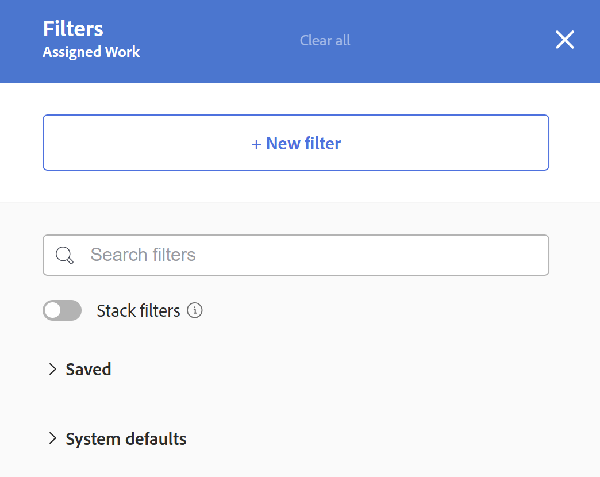
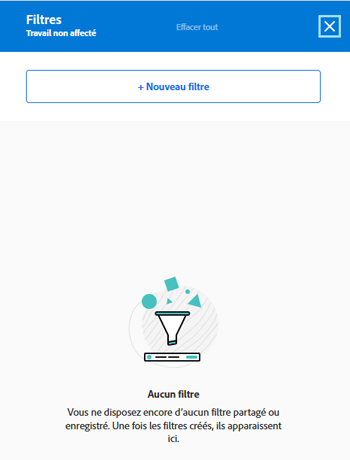
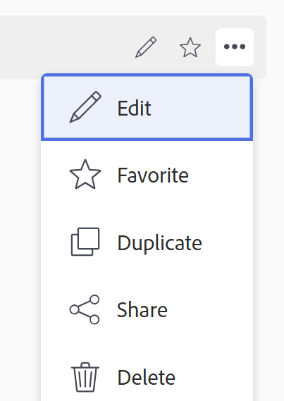

# Filtrage des informations dans l’équilibreur de charge de travail

<!--
(when they add custom fields to fitlering, add the caveat you added for the Resource Planner : only field NAMES and not LABELS are to be found in the drop-down >> ADD THIS IN THE STEP BELOW WHEN ADDING A FILTER)
-->

En tant que gestionnaire de ressources, vous pouvez utiliser l’équilibreur de charge de travail pour afficher et gérer la charge de travail de vos utilisateurs. Pour plus d’informations sur l’équilibreur de charge de travail, consultez les articles suivants :

* [Présentation de l’équilibreur de charge](../../resource-mgmt/workload-balancer/overview-workload-balancer.md)
* [Navigation dans l’équilibreur de charge de travail](../../resource-mgmt/workload-balancer/navigate-the-workload-balancer.md)

>[!IMPORTANT]
>
>Pour rechercher efficacement des tâches et vous concentrer sur les utilisateurs ou les éléments que vous gérez, nous vous recommandons vivement d’utiliser des filtres dans l’équilibreur de charge de travail. Vous pouvez ainsi afficher les informations correctes avant de commencer à gérer les affectations de vos ressources.
>
>Lorsque vous enregistrez et appliquez un nouveau filtre, puis quittez l’équilibreur de charge de travail, le filtre est conservé même après vous être déconnecté et vous être reconnecté.

Cet article contient des informations sur les filtres dans l’équilibreur de charge de travail. Pour plus d’informations sur les filtres dans Workfront, voir [Présentation des filtres](../../reports-and-dashboards/reports/reporting-elements/filters-overview.md).

## Exigences d’accès

Vous devez disposer des éléments suivants :

<table style="table-layout:auto"> 
 <col> 
 </col> 
 <col> 
 </col> 
 <tbody> 
  <tr> 
   <td role="rowheader">Formule Adobe Workfront*</td> 
   <td> 
N’importe quel plan
 </td> 
  </tr> 
  <tr> 
   <td role="rowheader">Licence Adobe Workfront*</td> 
   <td> 
Planifiez l’utilisation de l’équilibreur de charge de travail dans la zone Ressource .

   
Fonctionnement lors de l’utilisation de l’équilibreur de charge de travail d’une équipe ou d’un projet

 </td> 
  </tr> 
  <tr> 
   <td role="rowheader">Niveau d’accès*</td> 
   <td> 
Visualisez ou affichez un accès supérieur aux éléments suivants :
 
    <ul> 
     <li> 
Gestion des ressources
 </li> 
     <li> 
Projets
 </li> 
     <li> 
Tâches
 </li> 
     <li> 
Problèmes
 </li> 
     <li data-mc-conditions="QuicksilverOrClassic.Quicksilver"> 
Filtres, vues et regroupements
 </li> 
    </ul> 
Modifier l’accès aux filtres, vues et groupes lors de la création ou de la modification de filtres 
 
<b>NOTE</b>

Si vous n’avez toujours pas accès à , demandez à votre administrateur Workfront s’il définit des restrictions supplémentaires à votre niveau d’accès. Pour plus d’informations sur la façon dont un administrateur Workfront peut modifier votre niveau d’accès, voir <a href="../../administration-and-setup/add-users/configure-and-grant-access/create-modify-access-levels.md" class="MCXref xref">Création ou modification de niveaux d’accès personnalisés</a>.
 </td>
</tr> 
  <tr> 
   <td role="rowheader">Autorisations d’objet</td> 
   <td> 
Afficher ou des autorisations supérieures pour les projets, tâches, problèmes

   
Gérer les autorisations pour les filtres que vous souhaitez modifier ou supprimer

     
 
Pour plus d’informations sur la demande d’accès supplémentaire, voir <a href="../../workfront-basics/grant-and-request-access-to-objects/request-access.md" class="MCXref xref">Demande d’accès aux objets </a>.
 </td> 
  </tr> 
 </tbody> 
</table>

*Pour connaître le plan, le type de licence ou l’accès dont vous disposez, contactez votre administrateur Workfront.

## Présentation des filtres dans l’équilibreur de charge de travail

Tenez compte des points suivants lorsque vous utilisez des filtres dans l’équilibreur de charge de travail :

* Selon l’emplacement d’accès à l’équilibreur de charge de travail, il se peut que Workfront filtre déjà les informations pour vous. Pour plus d’informations sur les filtres préappliqués, voir la section [Filtres préappliqués dans l’équilibreur de charge de travail](#pre-applied-filters-in-the-workload-balancer) dans cet article.
* Vous pouvez créer et appliquer un filtre sans l’enregistrer, ou enregistrer un filtre pour le réutiliser ultérieurement.
* Lorsque vous appliquez un filtre sans l’enregistrer, vous pouvez revenir aux listes d’origine en actualisant votre page.
* Vous pouvez afficher les filtres que vous avez créés ou ceux que d’autres utilisateurs ont créés et partagés avec vous.
* Lorsque vous supprimez ou modifiez un filtre partagé, celui-ci est également supprimé ou modifié pour toutes les personnes avec lesquelles il est partagé.
* Lorsque vous créez des filtres dans l’équilibreur de charge de travail dans une zone, ils ne sont pas disponibles dans d’autres zones.

  Par exemple, les filtres créés dans la zone Ressource ne sont pas disponibles dans l’équilibreur de charge de travail d’un projet ou d’une équipe.

  Pour plus d’informations sur l’emplacement de l’équilibreur de charge de travail, voir [Localisation de l’équilibreur de charge](../../resource-mgmt/workload-balancer/locate-workload-balancer.md).

* Vous pouvez afficher uniquement les éléments correspondant aux filtres sélectionnés qui correspondent également aux dates dans la chronologie affichée à l’écran de l’équilibreur de charge de travail.

## Filtres préappliqués dans l’équilibreur de charge de travail {#pre-applied-filters-in-the-workload-balancer}

L’équilibreur de charge de travail affiche des informations dans deux zones distinctes :

* **Zone de travail non affectée**: tâches qui ne sont pas encore affectées aux utilisateurs.
* **Zone de travail affectée**: tâches affectées aux utilisateurs.

  Pour plus d’informations sur ce qui s’affiche dans chacune des zones, voir [Navigation dans l’équilibreur de charge de travail](../../resource-mgmt/workload-balancer/navigate-the-workload-balancer.md).

>[!IMPORTANT]
>
>Chaque zone de l’équilibreur de charge de travail possède son propre ensemble de filtres qui fonctionnent indépendamment l’un de l’autre. Vous devez configurer les deux filtres pour indiquer les informations que vous souhaitez voir dans chaque zone.

L’équilibreur de charge de travail affiche les utilisateurs et leurs tâches.
Les tâches affectées aux utilisateurs s’affichent uniquement lorsque les dates des éléments correspondent à la période affichée à l’écran.

Selon l’emplacement d’accès à l’équilibreur de charge de travail, les zones Non affecté et Affecté sont déjà filtrées selon certains critères, comme décrit dans le tableau suivant :

<table style="table-layout:auto"> 
 <col> 
 <col> 
 <col> 
 <tbody> 
  <tr> 
   <td role="rowheader"><strong>Zone Workfront dans laquelle vous accédez à l’équilibreur de charge de travail</strong></td> 
   <td><b>Éléments qui s’affichent par défaut dans la zone de travail non affecté</b> </td> 
   <td><b>Éléments qui s’affichent par défaut dans la zone de travail affectée</b> </td> 
  </tr> 
  <tr> 
   <td role="rowheader">La zone Ressource</td> 
   <td>Aucun élément ne s’affiche ici par défaut. Vous devez personnaliser les filtres pour afficher les tâches dans cette zone.</td> 
   <td>Utilisateurs qui sont membres de l’une de vos équipes et de leurs tâches. </td> 
  </tr> 
  <tr> 
   <td role="rowheader">Une équipe</td> 
   <td>Éléments de travail affectés à l’équipe ou à l’équipe et rôle de tâche. </td> 
   <td> 
Utilisateurs qui sont membres de l’équipe sélectionnée et de leurs tâches.
 </td> 
  </tr> 
  <tr> 
   <td role="rowheader">Un projet</td> 
   <td> 
Les tâches non affectées ou les éléments affectés à des équipes ou à des rôles de tâche dans le projet sélectionné s’affichent dans cette zone.
 </td> 
   <td> 
Utilisateurs affectés à au moins une tâche sur le projet sélectionné et à leurs tâches sur le projet lorsque le filtre par défaut du système <b>Éléments de travail de ce projet</b> est sélectionnée. 

Lorsque le filtre par défaut du système <b>Éléments de travail de ce projet</b> est désélectionnée, la zone de travail affectée d’un projet affiche toutes les tâches des utilisateurs affectés à au moins un élément du projet sélectionné.  
 Ce filtre est désélectionné par défaut.

<b>REMARQUE</b>

Vous pouvez activer l’option Afficher tous les utilisateurs dans l’équilibreur de charge de travail d’un projet pour afficher tous les utilisateurs du système. Pour plus d’informations, voir <a href="../workload-balancer/navigate-the-workload-balancer.md" class="MCXref xref">Navigation dans l’équilibreur de charge de travail</a>

</td> 
  </tr> 
 </tbody> 
</table>

## Création de filtres équilibreurs de charge de travail

Le processus de création de filtres pour les zones de travail non assigné et de travail assigné dans l’équilibreur de charge de travail est identique, quel que soit l’emplacement d’accès à l’équilibreur de charge de travail. Pour plus d’informations sur la localisation de l’équilibreur de charge de travail, voir [Localisation de l’équilibreur de charge](../../resource-mgmt/workload-balancer/locate-workload-balancer.md).

Vous pouvez créer un filtre à partir de zéro ou modifier l’un des filtres prédéfinis. Pour plus d’informations sur les filtres existants que vous pouvez modifier, voir [Modification d’un filtre existant dans l’équilibreur de charge](#edit-an-existing-filter-in-the-workload-balancer) dans cet article.

1. Accédez à l’équilibreur de charge de travail.

   Pour plus d’informations sur l’accès à l’équilibreur de charge de travail, voir [Navigation dans l’équilibreur de charge de travail](../../resource-mgmt/workload-balancer/navigate-the-workload-balancer.md).

1. Cliquez sur le bouton **Filtrer** icon  dans le coin supérieur droit de l’une des options **Travail non attribué** ou le **Travail assigné** zones.

   La zone Créateur de filtres s’affiche à droite. Le nom de la zone pour laquelle vous créez le filtre s’affiche dans l’en-tête de la zone.

   

1. (Facultatif et conditionnel) Si vous accédez à l’équilibreur de charge de travail dans la zone Ressource , le filtre prédéfini Par défaut peut déjà être appliqué à la zone Travail attribué. Vous pouvez modifier et enregistrer une copie du filtre Par défaut.

   >[!TIP]
   >
   >Le filtre Par défaut affiche les utilisateurs appartenant à l’une de vos équipes et à leurs tâches. Vous pouvez modifier une copie de ce filtre.

   Si vous accédez au [!UICONTROL Équilibreur de charge de travail] à partir d’un projet, le[!UICONTROL Éléments de travail de ce projet]&quot; peut déjà être appliqué. Cette option affiche uniquement les tâches affectées aux utilisateurs dans ce projet. Vous pouvez dupliquer et enregistrer une copie de ce filtre.

   Par défaut, la variable [!UICONTROL Équilibreur de charge de travail] d’un projet affiche toutes les tâches affectées à tous les utilisateurs du projet.

1. Cliquez sur **Nouveau filtre.**

   

1. Pour créer un filtre, procédez comme suit :

   1. Sélectionnez un nom de champ dans le premier menu déroulant ou cliquez sur **Parcourir les champs** pour commencer à saisir le nom d’un champ qui ne s’affiche pas par défaut.

      >[!IMPORTANT]
      >
      >Lorsque vous référencez des champs personnalisés, vous devez saisir le nom du champ et non le libellé du champ. Le libellé du champ s’affiche sur un formulaire personnalisé associé à un objet. Pour plus d’informations sur la différence entre le libellé et le nom d’un champ personnalisé, voir [Création ou modification d’un formulaire personnalisé](../../administration-and-setup/customize-workfront/create-manage-custom-forms/create-or-edit-a-custom-form.md).

   1. (Conditionnel) Si vous avez cliqué sur **Parcourir les champs**, saisissez le nom d’un champ dans le champ **Rechercher** et sélectionnez-la lorsqu’elle s’affiche dans la liste.

      

      >[!TIP]
      >
      >Vous pouvez sélectionner un champ parmi les sections suivantes :
      >
      >* **Sélections récentes**: champs pour lesquels vous avez récemment filtré.
      >* **Champs proposés**: les champs les plus couramment utilisés.

   1. Sélectionnez un modificateur dans le deuxième menu déroulant. Pour plus d’informations sur les modificateurs de filtre Workfront, voir [Filtres et modificateurs de condition](../../reports-and-dashboards/reports/reporting-elements/filter-condition-modifiers.md).
   1. Sélectionnez ou saisissez une valeur pour le champ pour lequel vous filtrez.

      >[!NOTE]
      >
      > Lorsque vous souhaitez afficher des objets de travail d’un portfolio spécifique, vous pouvez appliquer le filtre suivant : &quot;Le nom du Portfolio contient le marketing&quot;. Cette option affiche les éléments de travail appartenant à n’importe quel portfolio qui contient le nom &quot;marketing&quot;.
      >
      >

      >[!NOTE]
      >
      >Pour exclure les projets dont l’état est En attente, vous devez appliquer le filtre suivant : &quot;Projet : l’état n’est pas égal à En attente&quot;. Cela empêche les éléments de travail des projets En attente de s’afficher dans l’équilibreur de charge de travail.

   1. (Facultatif) Cliquez sur le **Supprimer** icon  pour supprimer un critère de filtre.

1. (Facultatif) Cliquez sur **Ajouter un filtre** pour ajouter un autre critère de filtrage, répétez les actions de l’étape 4.

   <!--(NOTE: ensure this stays correct)-->

1. Cliquez sur **Appliquer** pour appliquer les résultats du filtre à la zone d’équilibreur de charge de travail sélectionnée sans l’enregistrer.

   La liste des tâches est mise à jour sur la gauche.

   >[!IMPORTANT]
   >
   >Les résultats s’affichent dans l’équilibreur de charge de travail lorsque toutes les instructions de filtre que vous avez ajoutées sont simultanément vraies.

   Le filtre est conservé jusqu’à ce que vous actualisiez la page.

   La variable **Appliquer** est remplacé par un bouton **Enregistrer comme nouveau** bouton .

1. Cliquez sur **Enregistrer comme nouveau** pour enregistrer le filtre en vue d’une utilisation ultérieure.

   

   >[!TIP]
   >
   >Cliquer **Annuler** à tout moment, vous ramène à la zone de création des filtres.

1. Sélectionner **Filtre sans titre** et saisissez le nom du nouveau filtre à la place.
1. Sélectionnez une icône pour le nouveau filtre dans la **Icône** menu déroulant.

   

1. (Facultatif) Ajoutez une description pour le filtre afin d’indiquer ce qui est unique à son sujet. La description s’affiche sous le nom du filtre dans la liste des filtres.
1. Cliquer sur **Enregistrer**.

   Les filtres enregistrés s’affichent dans la zone Mes filtres .

   Pour plus d’informations sur l’application de filtres enregistrés, voir la section [Supprimer un filtre enregistré dans l’équilibreur de charge de travail](#delete-a-saved-filter-in-the-workload-balancer) dans cet article.

1. (Conditionnel) Passez la souris sur la variable **Icône Filtrer**  dans le coin supérieur droit du **Travail non attribué** ou le **Travail assigné** zones pour afficher une info-bulle avec le nom ou le nombre de filtres actuellement appliqués.

   

## Dupliquer un filtre

Vous pouvez dupliquer et éditer un filtre pour en créer un nouveau.

1. Accédez à l’équilibreur de charge de travail.

   Pour plus d’informations sur l’accès à l’équilibreur de charge de travail, voir [Navigation dans l’équilibreur de charge de travail](../../resource-mgmt/workload-balancer/navigate-the-workload-balancer.md).

1. Cliquez sur le bouton **Filtrer** icon  dans le coin supérieur droit de l’une des options **Travail non attribué** ou le **Travail assigné** zones.

   La zone Créateur de filtres s’affiche à droite. Le nom de la zone pour laquelle vous créez le filtre s’affiche dans l’en-tête de la zone.

1. Placez le pointeur de la souris sur un filtre existant, puis cliquez sur **Plus** menu , puis cliquez sur **Dupliquer**.

   

   >[!TIP]
   >
   > Lors de la modification d’un filtre, vous pouvez cliquer sur l’icône **Plus** dans le coin inférieur gauche de la zone Modifier le filtre , puis cliquez sur **Dupliquer**.

1. Editez les informations suivantes pour le filtre dupliqué :

   * Nom

     Par défaut, le nouveau nom du filtre est &quot;(Nom du filtre original) Copier&quot;.

   * Icône
   * Description
   * L’un des champs, modificateurs ou valeurs.

1. (Facultatif) Cliquez sur **Ajouter un filtre** pour ajouter d’autres instructions au filtre dupliqué.
1. Cliquez sur **Enregistrer** pour enregistrer le filtre dupliqué dans la variable **Mes filtres** zone.

   Le filtre d’origine reste inchangé et le filtre dupliqué est enregistré comme un nouveau filtre.

## Modification d’un filtre existant dans l’équilibreur de charge {#edit-an-existing-filter-in-the-workload-balancer}

Vous pouvez modifier un filtre enregistré dans l’équilibreur de charge de travail.

>[!TIP]
>
>Lorsque vous modifiez un filtre partagé avec d’autres utilisateurs, les modifications que vous apportez s’affichent également.

1. Accédez à l’équilibreur de charge de travail.

   Pour plus d’informations sur l’accès à l’équilibreur de charge de travail, voir [Navigation dans l’équilibreur de charge de travail](../../resource-mgmt/workload-balancer/navigate-the-workload-balancer.md).

1. Cliquez sur le bouton **Icône Filtrer**  dans le coin supérieur droit du **Non attribué** ou **Travail assigné** zones.\
   Le créateur de filtres s’affiche à droite.

1. Pointez sur le filtre à modifier, puis cliquez sur **Modifier** .

   

1. Utilisez l’une des méthodes suivantes :

   * Modifier l’une des instructions de filtre
   * Cliquez sur **Ajouter un filtre** pour ajouter de nouvelles instructions de filtre
   * Cliquez sur le bouton **Supprimer** icon  pour supprimer les instructions de filtre existantes.

1. (Facultatif) Cliquez sur **Appliquer**.

   Les résultats sont mis à jour dans l’équilibreur de charge de travail à gauche pour illustrer les modifications que vous avez apportées au filtre.

1. Cliquez sur **Enregistrez.**

   Les résultats sont mis à jour dans l’équilibreur de charge de travail à gauche et le filtre est mis à jour avec les nouvelles informations que vous avez sélectionnées.

## Supprimer un filtre enregistré dans l’équilibreur de charge de travail {#delete-a-saved-filter-in-the-workload-balancer}

Tenez compte des points suivants avant de supprimer un filtre :

* Vous ne pouvez pas récupérer les filtres supprimés.
* Vous ne pouvez pas supprimer de filtres prédéfinis.
* Vous ne pouvez pas supprimer un filtre non enregistré. Ils sont supprimés automatiquement après la déconnexion et la reconnexion à Workfront.
* Lorsque vous supprimez un filtre partagé, il est également supprimé pour tous les utilisateurs avec lesquels il est partagé.
* Une fois tous les filtres enregistrés supprimés, l’équilibreur de charge de travail s’affiche en fonction des valeurs par défaut d’origine.

>[!NOTE]
>
>Lorsque vous supprimez un filtre partagé avec d’autres utilisateurs, il est également supprimé.

1. Accédez à l’équilibreur de charge de travail
1. Cliquez sur le bouton **Icône Filtrer**  dans le coin supérieur droit du **Travail non attribué** ou **Travail assigné** zones.\
   La zone Créateur de filtres s’affiche à droite.

1. Placez le pointeur de la souris sur un filtre, puis cliquez sur la propriété **Plus** menu , puis cliquez sur **Supprimer**.
   

   >[!TIP]
   >
   >Lors de la modification d’un filtre, vous pouvez cliquer sur l’icône **Plus** dans le coin inférieur gauche de la zone Modifier le filtre , puis cliquez sur **Supprimer**.

1. (Facultatif) Cliquez sur **Annuler** pour éviter la suppression et revenir à la liste des filtres.
1. Cliquez sur **Supprimer** pour confirmer la suppression.

   Le filtre est supprimé pour vous et tous les utilisateurs qui y avaient des autorisations.

## Partage d’un filtre dans l’équilibreur de charge

Vous pouvez partager un filtre que vous avez créé ou qui a été partagé avec vous par d’autres utilisateurs.

Tenez compte des points suivants lors du partage de filtres dans l’équilibreur de charge de travail :

* Vous pouvez partager des filtres avec des utilisateurs, des équipes, des rôles et des entreprises actifs ou les rendre visibles pour tous les utilisateurs de votre instance Workfront.
* Les filtres que vous partagez dans la zone Ressource ne sont pas visibles dans l’équilibreur de charge de travail d’un projet ou d’une équipe.
* Les filtres d’équilibreur de charge de travail que vous partagez avec d’autres utilisateurs ne sont pas visibles dans d’autres zones de Workfront.

Pour partager un filtre :

1. Accédez à l’équilibreur de charge de travail
1. Cliquez sur le bouton **Icône Filtrer**  dans le coin supérieur droit du **Travail non attribué** ou **Travail assigné** zones.\
   La zone Créateur de filtres s’affiche à droite.

1. Placez le pointeur de la souris sur un filtre, puis cliquez sur la propriété **Plus** menu , puis cliquez sur **Partagez.**

   

   >[!TIP]
   >
   > Lors de la modification d’un filtre, vous pouvez cliquer sur l’icône **Plus** dans le coin inférieur gauche de la zone Modifier le filtre , puis cliquez sur **Partager**.

   La boîte Partage des filtres s’affiche.

1. Activez la variable **Affichage à l’échelle du système** . Cela permet à quiconque dans Workfront d’afficher le filtre.

   Ou

   Commencez à saisir les noms des utilisateurs, équipes, rôles, groupes ou entreprises avec lesquels vous souhaitez partager le filtre dans la variable **Accéder à** champ .

   

1. (Facultatif) Cliquez sur la flèche pointant vers la droite située en regard du nom d’une entité pour modifier ses autorisations sur le filtre, puis activez l’option **Affichage** ou **Gérer** .

   

1. (Facultatif) Activez ou désactivez les autorisations supplémentaires pour une entité en effectuant l’une des opérations suivantes :

   1. Cliquez sur **Affichage** et désactivez la variable **Partager** . Elle est activée par défaut.

   1. Cliquez sur **Gérer** et désactivez l’option **Partager** ou le **Supprimer** . Ils sont activés par défaut.

   >[!TIP]
   >
   >Les utilisateurs ne peuvent pas recevoir une autorisation supérieure à leur niveau d’accès. S’ils n’ont pas accès aux filtres d’édition dans leur niveau d’accès, ils ne peuvent pas recevoir d’autorisations pour gérer un filtre. Workfront désactive l’option Gérer pour ces utilisateurs et l’option est grisée.

1. Cliquez sur **Partager**. Le filtre est partagé avec les entités que vous avez spécifiées.

   Les filtres que vous avez partagés s’affichent dans la variable **Partagé avec moi** de la zone de filtrage.

   

<!--   

## Add a filter to your favorites list

You can mark a filter as a favorite for quicker access to it. 

The filters that you mark as a favorite do not count towards your system Favorites list. There is no limit for how many filters you can favorite. 

1. Go to the Workload Balancer
1. Click the **Filter** icon  in the upper-right corner of the **Unassigned Work** or **Assigned Work** areas. The filter builder box displays on the right. 
1. Mouse over a filter, then click the **Favorite** . 
(NOTE: insert screen shot here with Favorite as part of this menu - same as above ones but with Favorite)
1. The filter is listed in the **Favorited** section inside the filter panel. 
1. (Optional) Click the **Favorite** icon again to remove the filter from the list of favorite filters
(I logged bugs for "Favorited" and "Unfavorite" wordings - make sure these have not updated)
-->
