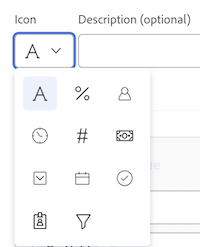
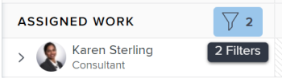

# Filtrer des informations dans l’équilibreur de charge de travail

<!-- Audited: 6/2025 -->

<!--
(when they add custom fields to fitlering, add the caveat you added for the Resource Planner : only field NAMES and not LABELS are to be found in the drop-down >> ADD THIS IN THE STEP BELOW WHEN ADDING A FILTER)
-->

En tant que personne gestionnaire de ressources, vous pouvez utiliser l’équilibreur de charge de travail pour afficher et gérer la charge de travail de vos utilisateurs et utilisatrices. Pour plus d’informations sur l’équilibreur de charge de travail, consultez les articles suivants :

* [Vue d’ensemble de l’équilibreur de charge de travail](../../resource-mgmt/workload-balancer/overview-workload-balancer.md)
* [Trouver l’équilibreur de charge de travail](../../resource-mgmt/workload-balancer/navigate-the-workload-balancer.md)

>[!IMPORTANT]
>
>Pour rechercher efficacement des éléments de travail et vous concentrer sur les utilisateurs et utilisatrices ou les éléments que vous gérez, nous vous recommandons vivement d’utiliser des filtres dans l’équilibreur de charge de travail. Vous pouvez ainsi afficher les informations appropriées avant de commencer à gérer les affectations de vos ressources.
>
>Lorsque vous quittez l’équilibreur de charge de travail après l’enregistrement et l’application d’un nouveau filtre, le filtre reste appliqué même après la déconnexion et la reconnexion.

Cet article contient des informations sur les filtres dans l’équilibreur de charge de travail. Pour plus d’informations sur les filtres dans Workfront, voir [Vue d’ensemble des filtres](../../reports-and-dashboards/reports/reporting-elements/filters-overview.md).

## Conditions d’accès

<table style="table-layout:auto"> 
 <col> 
 <col>
 <tbody> 
  <tr> 
   <td>Package Adobe Workfront</td> 
   <td>
Tous
</td>
  </tr>
  <tr> 
   <td>Licence Adobe Workfront</td> 
   <td>
Standard

       
Plan, lors de l’utilisation de l’équilibreur de charge de travail dans la zone Ressource ; Travail, lors de l’utilisation de l’équilibreur de charge de travail d’une équipe ou d’un projet
</td>
  </tr>
  <tr> 
   <td>Configurations des niveaux d’accès</td> 
   <td> 
Accès Affichage ou niveau supérieur aux éléments suivants :
 
    <ul> 
     <li>Gestion des ressources</li> 
     <li>Projets</li> 
     <li>Tâches</li> 
     <li>Problèmes</li>
     <li>Filtres, vues et regroupements</li>
    </ul>
    
Modifier l’accès aux filtres, vues et regroupements lors de la création ou de la modification de filtres 
 </td>
  </tr> 
  <tr> 
   <td>Autorisations d’objet</td> 
   <td> 
Autorisations d’affichage ou supérieures pour les projets, tâches et problèmes

   
Autorisations de gestion pour les filtres que vous souhaitez modifier ou supprimer.

   </td> 
  </tr> 
 </tbody> 
</table>

Pour plus d’informations, voir [Conditions d’accès requises dans la documentation Workfront](/help/quicksilver/administration-and-setup/add-users/access-levels-and-object-permissions/access-level-requirements-in-documentation.md).

## Vue d’ensemble des filtres dans l’équilibreur de charge de travail

Tenez compte des points suivants lorsque vous utilisez des filtres dans l’équilibreur de charge de travail :

* Selon le point d’accès à l’équilibreur de charge de travail, il se peut que Workfront filtre déjà les informations pour vous. Pour plus d’informations, consultez la section suivante de cet article : [&#x200B; Filtres préappliqués dans l’équilibreur de charge de travail &#x200B;](#pre-applied-filters-in-the-workload-balancer).
* Vous pouvez créer et appliquer un filtre sans l’enregistrer, ou enregistrer un filtre pour le réutiliser ultérieurement.
* Lorsque vous appliquez un filtre sans l’enregistrer, vous pouvez revenir aux listes d’origine en actualisant votre page.
* Vous pouvez afficher les filtres que vous avez créés ou ceux que d’autres utilisateurs et utilisatrices ont créés et partagés avec vous.
* Lorsque vous supprimez ou modifiez un filtre partagé, il est également supprimé ou modifié pour toutes les personnes avec lesquelles vous l’avez partagé.
* Lorsque vous créez des filtres dans l’équilibreur de charge de travail dans une zone, ils ne sont pas disponibles dans les autres zones.

  Par exemple, les filtres créés dans la zone Ressources ne sont pas disponibles dans l’équilibreur de charge de travail d’un projet ou d’une équipe.

  Pour plus d’informations sur l’emplacement de l’équilibreur de charge de travail, voir [Localiser l’équilibreur de charge de travail](../../resource-mgmt/workload-balancer/locate-workload-balancer.md).

* Vous ne pouvez afficher les éléments qui correspondent aux filtres sélectionnés que s’ils correspondent également aux dates de la chronologie affichée dans l’écran Équilibreur de charge de travail .

## Filtres préappliqués dans l’équilibreur de charge de travail {#pre-applied-filters-in-the-workload-balancer}

L’équilibreur de charge de travail affiche des informations dans deux zones distinctes :

* **Zone Tâches non affectées** : tâches qui ne sont pas encore affectées à des utilisateurs.
* **La zone Tâches affectées** : tâches affectées aux utilisateurs.

  Pour plus d’informations sur ce qui s’affiche dans chacune des zones, voir [Naviguer dans l’équilibreur de charge de travail](../../resource-mgmt/workload-balancer/navigate-the-workload-balancer.md).

>[!IMPORTANT]
>
>Chaque zone de l’équilibreur de charge de travail possède son propre ensemble de filtres qui fonctionnent indépendamment l’un de l’autre. Vous devez configurer les deux filtres pour indiquer les informations que vous souhaitez voir dans chaque zone.

L’équilibreur de charge de travail affiche les utilisateurs et utilisatrices et leurs éléments de travail.
Les éléments de travail affectés aux utilisateurs et utilisatrices s’affichent uniquement lorsque les dates des éléments correspondent à la période affichée à l’écran.

Selon le point d’accès à l’équilibreur de charge de travail, les zones de travail affecté et non affecté sont déjà filtrées en fonction de certains critères, comme décrit dans le tableau suivant :

<table style="table-layout:auto"> 
 <col> 
 <col> 
 <col> 
 <tbody> 
  <tr> 
   <td role="rowheader"><strong>Zone Workfront où vous pouvez accéder à l’équilibreur de charge de travail.</strong></td> 
   <td><b>Éléments qui s’affichent par défaut dans la zone de travail non affecté.</b> </td> 
   <td><b>Éléments qui s’affichent par défaut dans la zone de travail affecté.</b> </td> 
  </tr> 
  <tr> 
   <td role="rowheader">Zone Ressources</td> 
   <td>Aucun élément ne s’affiche ici par défaut. Vous devez personnaliser les filtres pour afficher les éléments de travail dans cette zone.</td> 
   <td>Les personnes qui sont membres de l’une de vos équipes et leurs éléments de travail. </td> 
  </tr> 
  <tr> 
   <td role="rowheader">Équipe</td> 
   <td>Les éléments de travail affectés à l’équipe ou à l’équipe et à une fonction. </td> 
   <td> 
Les personnes qui sont membres de l’équipe sélectionnée et leurs éléments de travail.
 </td> 
  </tr> 
  <tr> 
   <td role="rowheader">Un projet</td> 
   <td> 
Les éléments de travail non affectés ou les éléments affectés à des équipes ou à des fonctions dans le projet sélectionné s’affichent dans cette zone.
 </td> 
   <td> 
Les utilisateurs affectés à au moins un élément de travail sur le projet sélectionné et leurs éléments de travail sur le projet lorsque le filtre système <b>Éléments de travail de ce projet</b> est sélectionné. 

Lorsque le filtre <b>Tâches de ce projet</b> par défaut du système est désélectionné, la zone Tâches affectées d’un projet affiche toutes les tâches des utilisateurs affectés à au moins un élément du projet sélectionné.    Ce filtre est désélectionné par défaut.

 <b>Remarque </b> : vous pouvez activer l’option <b>Afficher tous les utilisateurs</b> dans l’équilibreur de charge de travail du projet pour afficher tous les utilisateurs du système. Pour plus d’informations, voir <a href="../workload-balancer/navigate-the-workload-balancer.md" class="MCXref xref">Parcourir l’équilibreur de charge de travail</a>

</td> 
  </tr> 
 </tbody> 
</table>

## Créer des filtres d’équilibreur de charge de travail

Le processus de création de filtres pour les zones Tâches non affectées et Tâches affectées dans l’équilibreur de charge de travail est identique quel que soit l’endroit où vous accédez à l’équilibreur de charge de travail. Pour plus d’informations sur la localisation de l’équilibreur de charge de travail, consultez [Localisation de l’équilibreur de charge de travail](../../resource-mgmt/workload-balancer/locate-workload-balancer.md).

Vous pouvez créer un filtre à partir de zéro ou modifier l’un des filtres prédéfinis. Pour plus d’informations sur les filtres existants que vous pouvez modifier, consultez la section [Modifier un filtre existant dans l’équilibreur de charge de travail](#edit-an-existing-filter-in-the-workload-balancer) dans cet article.

1. Accédez à l’équilibreur de charge de travail.

   Pour plus d’informations sur l’accès à l’équilibreur de charge de travail, consultez [Parcourir l’équilibreur de charge de travail](../../resource-mgmt/workload-balancer/navigate-the-workload-balancer.md).

1. Dans le coin supérieur droit des zones **Tâches non affectées** ou **Tâches affectées**, cliquez sur l’icône **Filtrer** . La zone **Filtres** s’affiche à droite, et le nom de la zone pour laquelle vous créez le filtre s’affiche dans l’en-tête.

   

1. (Facultatif et conditionnel) Si vous accédez à l’équilibreur de charge de travail dans la zone **Ressource**, le filtre par défaut prédéfini peut déjà être appliqué à la zone **Tâches affectées**. Vous pouvez modifier et enregistrer une copie du filtre Par défaut.

   >[!TIP]
   >
   >Le filtre Par défaut affiche les personnes appartenant à l’une de vos équipes et leurs éléments de travail. Vous pouvez modifier une copie de ce filtre.

   Si vous accédez à l’[!UICONTROL équilibreur de charge de travail] à partir d’un projet, le filtre **Tâches de ce projet** peut déjà être appliqué. Cette option affiche uniquement les éléments de travail affectés aux personnes dans ce projet. Vous pouvez dupliquer et enregistrer une copie de ce filtre.

   Par défaut, l’[!UICONTROL équilibreur de charge de travail] du projet affiche toutes les tâches affectées à tous les utilisateurs et utilisatrices du projet.

1. Cliquez sur **Nouveau filtre**.

1. Pour créer un filtre, procédez comme suit :

   1. Sélectionnez un nom de champ dans le premier menu déroulant ou cliquez sur **Parcourir les champs** au bas de la liste déroulante pour saisir le nom d’un champ qui ne s’affiche pas par défaut.

      >[!IMPORTANT]
      >
      >Lorsque vous référencez des champs personnalisés, vous devez saisir le nom du champ et non le libellé du champ. Le libellé du champ s’affiche sur un formulaire personnalisé associé à un objet. Pour plus d’informations sur la différence entre le libellé et le nom d’un champ personnalisé, voir [Création d’un formulaire personnalisé](/help/quicksilver/administration-and-setup/customize-workfront/create-manage-custom-forms/form-designer/design-a-form/design-a-form.md).

   1. (Le cas échéant) Si vous avez cliqué sur **Parcourir les champs**, saisissez le nom d’un champ dans le champ **Rechercher** et sélectionnez-le lorsqu’il s’affiche dans la liste.

      

      >[!TIP]
      >
      >Vous pouvez sélectionner un champ parmi les sections suivantes :
      >
      >* **Sélections récentes** : les champs que vous avez récemment filtrés.
      >* **Suggéré** : champs les plus couramment utilisés.

   1. Sélectionnez un modificateur dans le deuxième menu déroulant. Pour plus d’informations sur les modificateurs de filtre Workfront, consultez [Modificateurs de filtre et de condition](../../reports-and-dashboards/reports/reporting-elements/filter-condition-modifiers.md).
   1. Sélectionnez ou saisissez une valeur pour le champ que vous filtrez.

      >[!NOTE]
      >
      > Lorsque vous souhaitez afficher les objets de travail d&#39;un portfolio spécifique, vous pouvez appliquer le filtre suivant : Portfolio ID Equals &lt; PORTFOLIO NAME >.
      >
      >
      >
      >Pour exclure les projets dont le statut est En attente, vous devez appliquer le filtre suivant : Projet : Le statut n’est pas égal à En attente. Cela empêche les éléments de travail des projets En attente de s’afficher dans l’équilibreur de charge de travail.
      >
      >

   1. (Facultatif) Cliquez sur l’icône **Supprimer**  pour supprimer un critère de filtre.

1. (Facultatif) Cliquez sur **Ajouter un filtre** pour ajouter un autre critère de filtre, puis répétez les actions de l’étape 4.

   <!--(NOTE: ensure this stays correct)-->

1. Cliquez sur **Appliquer** pour appliquer les résultats du filtre à la zone de l’équilibreur de charge de travail sélectionnée sans l’enregistrer. La liste des éléments de travail est mise à jour sur la gauche.

   >[!IMPORTANT]
   >
   >Les résultats s’affichent dans l’équilibreur de charge de travail lorsque toutes les règles de filtrage que vous avez ajoutées sont simultanément vraies.

   Le filtre est conservé jusqu’à ce que vous actualisiez la page et le bouton **Appliquer** est remplacé par un bouton **Enregistrer en tant que nouveau**.

1. Cliquez sur **Enregistrer en tant que nouveau** pour enregistrer le filtre pour une utilisation ultérieure.

   >[!TIP]
   >
   >Cliquer sur **Annuler** à tout moment vous ramène à la zone de création de filtre.

1. Dans le champ **Filtre sans titre**, saisissez le nouveau nom du filtre.
1. (Facultatif) Sélectionnez une icône pour le nouveau filtre dans le menu déroulant **Icône**.

   

1. (Facultatif) Ajoutez un filtre **Description**. La description s’affiche sous le nom du filtre dans la liste des filtres.
1. Cliquer sur **Enregistrer**. Le filtre enregistré s’affiche dans la zone **Mes filtres** de la zone de filtre.

   Pour plus d’informations sur l’application des filtres enregistrés, consultez la section [Supprimer un filtre enregistré dans l’équilibreur de charge de travail](#delete-a-saved-filter-in-the-workload-balancer) dans cet article.

1. (Conditionnel) Placez le pointeur de la souris sur l’icône **Filtre**  dans le coin supérieur droit des zones **Tâches non affectées** ou **Tâches affectées** pour afficher une info-bulle indiquant le nom ou le nombre de filtres actuellement appliqués.

   

## Dupliquer un filtre

Vous pouvez dupliquer et modifier un filtre pour en créer un nouveau.

1. Accédez à l’équilibreur de charge de travail.

   Pour plus d’informations sur l’accès à l’équilibreur de charge de travail, consultez [Parcourir l’équilibreur de charge de travail](../../resource-mgmt/workload-balancer/navigate-the-workload-balancer.md).

1. Dans le coin supérieur droit des zones **Tâches non affectées** ou **Tâches affectées**, cliquez sur l’icône **Filtrer** .  La zone **Filtres** s’affiche à droite, et le nom de la zone pour laquelle vous dupliquez le filtre s’affiche dans l’en-tête.

1. Pointez sur un filtre existant, puis cliquez sur le menu **Plus** .
1. Cliquez sur **Dupliquer**.

   >[!TIP]
   >
   > Lors de la modification d’un filtre, vous pouvez cliquer sur le menu **Plus**  dans le coin inférieur gauche de la zone **Modifier le filtre**, puis cliquer sur **Dupliquer**.

1. Modifiez les informations suivantes pour le filtre dupliqué :

   * Nom
   * Icône
   * Description
   * L’un des champs, modificateurs ou valeurs.

1. (Facultatif) Cliquez sur **Ajouter un filtre** pour ajouter d’autres instructions au filtre dupliqué.
1. Cliquez sur **Enregistrer** pour enregistrer le filtre dupliqué dans la zone **Mes filtres**. Le filtre d’origine reste inchangé et le filtre dupliqué est enregistré comme un nouveau filtre.

## Modifier un filtre existant dans l’équilibreur de charge de travail. {#edit-an-existing-filter-in-the-workload-balancer}

Vous pouvez modifier un filtre enregistré dans l’équilibreur de charge de travail.

>[!TIP]
>
>Lorsque vous modifiez un filtre partagé avec d’autres personnes, elles verront également les modifications que vous apportez.

1. Accédez à l’équilibreur de charge de travail.

   Pour plus d’informations sur l’accès à l’équilibreur de charge de travail, consultez [Parcourir l’équilibreur de charge de travail](../../resource-mgmt/workload-balancer/navigate-the-workload-balancer.md).

1. Dans le coin supérieur droit des zones **Non affecté** ou **Tâches affectées**, cliquez sur l’icône **Filtrer**  . Le créateur de filtres s’affiche à droite.

1. Placez le pointeur de la souris sur le filtre à modifier, puis cliquez sur l’icône **Modifier** .

1. Utilisez l’une des méthodes suivantes :

   * Modifiez l’une des instructions de filtre.
   * Cliquez sur **Ajouter un filtre** pour ajouter de nouvelles instructions de filtre.
   * Cliquez sur l’icône **Supprimer**  pour supprimer les instructions de filtre existantes.

1. (Facultatif) Cliquez Sur **Appliquer**. Les résultats sont mis à jour dans l’équilibreur de charge de travail à gauche pour illustrer les modifications que vous avez apportées au filtre.

1. Cliquer sur **Enregistrer**. Les résultats sont mis à jour dans l’équilibreur de charge de travail à gauche et le filtre est mis à jour avec les nouvelles informations sélectionnées.

## Supprimer un filtre enregistré dans l’équilibreur de charge de travail {#delete-a-saved-filter-in-the-workload-balancer}

Tenez compte des points suivants avant de supprimer un filtre :

* Vous ne pouvez pas récupérer les filtres supprimés.
* Vous ne pouvez pas supprimer les filtres prédéfinis.
* Vous ne pouvez pas supprimer un filtre non enregistré. Ils sont supprimés automatiquement après la déconnexion et la reconnexion à Workfront.
* Lorsque vous supprimez un filtre partagé, il est également supprimé pour tous les utilisateurs avec lesquels il est partagé.
* Une fois tous les filtres enregistrés supprimés, l’équilibreur de charge de travail s’affiche en fonction des valeurs par défaut d’origine.

>[!NOTE]
>
>Lorsque vous supprimez un filtre partagé avec d’autres personnes, il est également supprimé pour celles-ci.

1. Accédez à l’équilibreur de charge de travail.

   Pour plus d’informations sur l’accès à l’équilibreur de charge de travail, consultez [Parcourir l’équilibreur de charge de travail](../../resource-mgmt/workload-balancer/navigate-the-workload-balancer.md).

1. Dans le coin supérieur droit des zones **Tâches non affectées** ou **Tâches affectées**, cliquez sur l’icône **Filtrer** . La zone **Filtres** s’affiche à droite.

1. Placez le pointeur de la souris sur un filtre, cliquez sur le menu **Plus** , puis sur **Supprimer**.

   >[!TIP]
   >
   >Lors de la modification d’un filtre, vous pouvez cliquer sur le menu **Plus**  dans le coin inférieur gauche de la zone **Modifier le filtre**, puis cliquer sur **Supprimer**.

1. (Facultatif) Cliquez sur **Annuler** pour annuler la suppression et revenir à la liste des filtres.
1. Cliquez sur **Supprimer** pour confirmer la suppression. Le filtre est supprimé pour vous et tous les utilisateurs qui y sont autorisés.

## Partager un filtre dans l’équilibreur de charge de travail

Vous pouvez partager un filtre que vous avez créé ou qui a été partagé avec vous par d’autres personnes.

Tenez compte des points suivants lors du partage de filtres dans l’équilibreur de charge de travail :

* Vous pouvez partager des filtres avec des personnes actives, des équipes, des rôles et des entreprises ou les rendre visibles pour tous les utilisateurs et les utilisatrices de votre instance Workfront.
* Les filtres que vous partagez dans la zone Ressource ne sont pas visibles dans l’équilibreur de charge de travail d’un projet ou d’une équipe.
* Les filtres de l’équilibreur de charge de travail que vous partagez avec d’autres personnes ne sont pas visibles dans d’autres zones de Workfront.

Pour partager un filtre :

1. Accédez à l’équilibreur de charge de travail.

   Pour plus d’informations sur l’accès à l’équilibreur de charge de travail, consultez [Parcourir l’équilibreur de charge de travail](../../resource-mgmt/workload-balancer/navigate-the-workload-balancer.md).

1. Dans le coin supérieur droit des zones **Tâches non affectées** ou **Tâches affectées**, cliquez sur l’icône **Filtrer** . La zone **Filtres** s’affiche à droite.

1. Pointez sur un filtre, puis cliquez sur le menu **Plus** .

1. Cliquez sur **Partager**. La zone **Partage de filtres** s’affiche.

   >[!TIP]
   >
   > Lors de la modification d’un filtre, vous pouvez cliquer sur le menu **Plus**  dans le coin inférieur gauche de la zone **Modifier le filtre**, puis cliquer sur **Partager**.

1. Dans le champ **Accorder l’accès à**, saisissez les noms des utilisateurs, des équipes, des rôles, des groupes ou des sociétés avec lesquels vous souhaitez partager le filtre, puis sélectionnez-les lorsqu’elles apparaissent.

1. (Facultatif) Pour modifier les autorisations de filtre d’une entité, cliquez sur la flèche pointant vers la droite en regard de son nom, puis sélectionnez **Afficher** ou **Gérer**.

   

1. (Facultatif) Activez ou désactivez les autorisations supplémentaires pour une entité en effectuant l’une des opérations suivantes :

   1. Cliquez sur **Afficher** et désactivez l’option **Partager**. Cette option est activée par défaut.

   1. Cliquez sur **Gérer** et activez l’option **Partager** ou **Supprimer**.

   >[!TIP]
   >
   >Les utilisateurs ne peuvent pas recevoir une autorisation supérieure à leur niveau d&#39;accès. S’ils n’ont pas accès à Modifier les filtres dans leur niveau d’accès, ils ne peuvent pas recevoir d’autorisations pour gérer un filtre. Workfront désactive l’option Gérer pour ces utilisateurs.

1. Cliquez sur **Partager**. Le filtre est partagé avec les entités que vous avez spécifiées et le filtre partagé s’affiche dans la zone **Partagé avec moi** de la zone **Filtres**.

   

<!--   

## Add a filter to your favorites list

You can mark a filter as a favorite for quicker access to it. 

The filters that you mark as a favorite do not count towards your system Favorites list. There is no limit for how many filters you can favorite. 

1. Go to the Workload Balancer
1. Click the **Filter** icon  in the upper-right corner of the **Unassigned Work** or **Assigned Work** areas. The filter builder box displays on the right. 
1. Mouse over a filter, then click the **Favorite** . 
(NOTE: insert screen shot here with Favorite as part of this menu - same as above ones but with Favorite)
1. The filter is listed in the **Favorited** section inside the filter panel. 
1. (Optional) Click the **Favorite** icon again to remove the filter from the list of favorite filters
(I logged bugs for "Favorited" and "Unfavorite" wordings - make sure these have not updated)
-->
