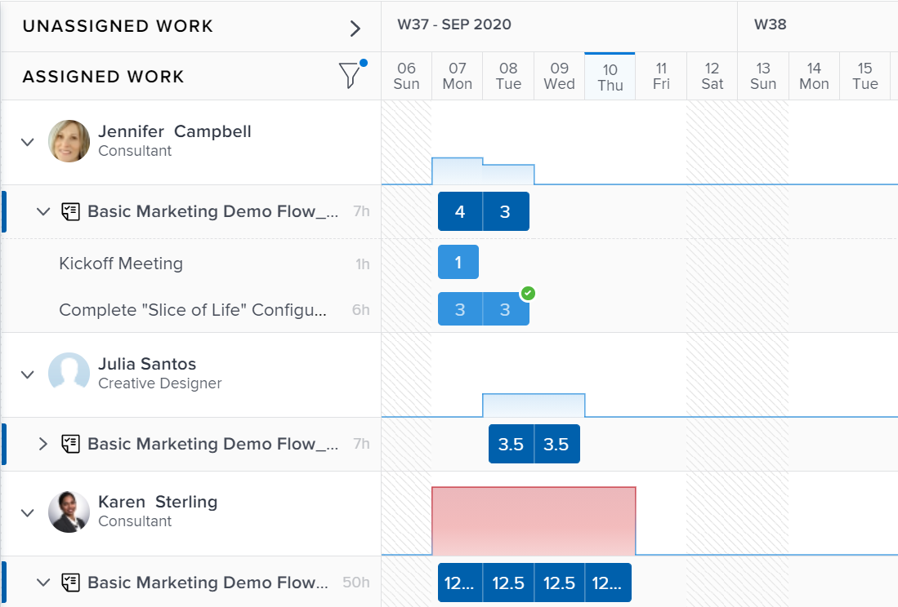
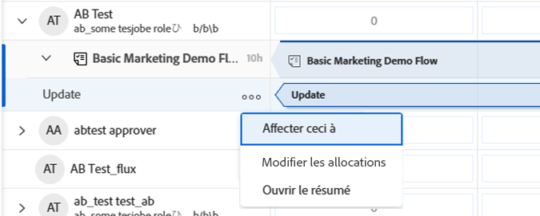

# Gérer les affectations des utilisateurs et utilisatrices dans l’équilibreur de charge de travail

<!-- Audited: 01/2024 -->

En tant que gestionnaire de ressources, vous pouvez affecter du travail aux utilisateurs et utilisatrices et gérer leurs affectations quotidiennes, hebdomadaires ou mensuelles à partir de l’équilibreur de charge de travail afin de vous assurer qu’un nombre d’heures adapté à leurs plannings disponibles leur est alloué.

## Conditions d’accès {#access-requirements}

+++ Développez pour afficher les exigences d’accès aux fonctionnalités de cet article.

Vous devez disposer des accès suivants pour effectuer les étapes décrites dans cet article :

<table style="table-layout:auto"> 
 <col> 
 <col> 
 <tbody> 
  <tr> 
   <td role="rowheader">Formule Adobe Workfront</td> 
   <td> 
Tous 
 </td> 
  </tr> 
  <tr> 
   <td role="rowheader">Licence Adobe Workfront</td> 
   <td>
Nouveau : Standard

       
ou

       
Actuel : planifiez, lors de l’utilisation de l’équilibreur de charge de travail dans la zone Ressource ; 
       Fonctionnement lors de l’utilisation de l’équilibreur de charge de travail d’une équipe ou d’un projet
</td>
  </tr>
  <tr> 
   <td role="rowheader">Configurations des niveaux d’accès</td> 
   <td> 
Modifiez l’accès aux éléments suivants :
 
    <ul> 
     <li>Gestion des ressources</li> 
     <li>Projets</li> 
     <li>Tâches</li> 
     <li>Problèmes</li> 
    </ul>
   </td> 
  </tr> 
  <tr> 
   <td role="rowheader">Autorisations d’objet</td> 
   <td> 
Autorisations « Contribuer » ou supérieures qui incluent « Créer des affectations » pour les tâches et problèmes dont vous souhaitez gérer les affectations. 
 
Ou 
 
Autorisations de gestion pour les tâches pour lesquelles vous souhaitez mettre à jour le nombre d’heures prévues, en plus de modifier les affectations. Pour plus d’informations sur la mise à jour du nombre d’heures prévues dans l’équilibreur de charge de travail, consultez dans cet article la section <a href="#update-task-planned-hours-when-managing-user-allocations">Mettre à jour le nombre d’heures prévues de la tâche lors de la gestion des affectations aux utilisateurs et aux utilisatrices</a>.
 </td> 
  </tr> 
 </tbody> 
</table>

Pour plus d’informations sur ce tableau, voir [Conditions d’accès requises dans la documentation Workfront](/help/quicksilver/administration-and-setup/add-users/access-levels-and-object-permissions/access-level-requirements-in-documentation.md).

+++

## Comprendre les affectations des utilisateurs et des utilisatrices

Les affectations des utilisateurs et des utilisatrices sont des durées qui définissent le temps qui doit être consacré, sur une journée, une journée de la semaine, une semaine ou un mois spécifique, pour terminer un élément de travail. Elles sont incluses dans le nombre d’heures prévues de l’élément de travail.

Cet article décrit comment mettre à jour les affectations d’heures quotidiennes, hebdomadaires ou mensuelles pour les utilisateurs et les utilisatrices à qui des tâches ou des problèmes ont été affectés. Pour plus d’informations sur la gestion des affectations globales des utilisateurs et des utilisatrices et des fonctions aux tâches, consultez la section [Gérer les heures d’affectation des utilisateurs et des utilisatrices et des fonctions aux tâches](../../manage-work/tasks/assign-tasks/manage-allocation-hours-on-tasks.md).

### Vue d’ensemble de l’affectation des utilisateurs et des utilisatrices {#user-allocation-overview}

Vous pouvez afficher l’affectation des utilisateurs et des utilisatrices sous forme d’heures ou de pourcentage dans l’équilibreur de charge de travail. Vous pouvez ajuster les heures ou les pourcentages.

Les affectations des utilisateurs et des utilisatrices sont incluses dans le nombre d’heures prévues d’un élément de travail. Pour plus d’informations sur le nombre d’heures prévues, consultez la section [Vue d’ensemble du nombre d’heures prévues](../../manage-work/tasks/task-information/planned-hours.md).

Le nombre d’heures prévues de la tâche est réparti de manière égale entre tous les jours de la durée de la tâche pour l’utilisateur ou pour l’utilisatrice à qui la tâche a été affectée. Par exemple, si une tâche a une durée de 5 jours et un total de 10 heures prévues, le nombre quotidien des affectations pour la tâche est de 2 heures. L’affectation hebdomadaire est de 10 heures. Cela signifie que la tâche est affectée à un utilisateur ou à une utilisatrice pendant 2 heures par jour. Vous pouvez toutefois modifier manuellement l’allocation quotidienne de l’utilisateur ou de l’utilisatrice à l’aide de l’équilibreur de charge de travail.

>[!CAUTION]
>
>L’équilibreur de charge de travail affiche jusqu’à 1 000 heures prévues par élément de travail par utilisateur et utilisatrice, et jusqu’à 1 000 jours de durée d’un élément. Les allocations dans l’équilibreur de charge de travail affichent zéro lorsque la limite de 1 000 heures ou de 1 000 jours est atteinte. Nous vous recommandons de diviser les tâches en sous-tâches plus petites pour disposer d’un plus grand nombre d’heures prévues ou d’une durée de plus de 1 000 jours.

Tenez compte des points suivants lors de la localisation d’allocations quotidiennes, hebdomadaires ou mensuelles pour des tâches ou des problèmes dans l’équilibreur de charge de travail :

* Vous pouvez afficher les affectations quotidiennes, hebdomadaires et mensuelles des utilisateurs et utilisatrices à leurs éléments de travail. Activez la vue Semaine ou Mois pour afficher les affectations hebdomadaires ou mensuelles.
* Vous pouvez utiliser l’équilibreur de charge de travail pour modifier l’affectation quotidienne, hebdomadaire ou mensuelle des utilisateurs et utilisatrices aux tâches ou problèmes. Pour plus d’informations sur l’ajustement de l’affichage de l’équilibreur de charge de travail, voir [Parcourir l’équilibreur de charge de travail](../../resource-mgmt/workload-balancer/navigate-the-workload-balancer.md).

  >[!NOTE]
  >
  >Nous vous recommandons de choisir la période (quotidienne, hebdomadaire ou mensuelle) que vous souhaitez toujours utiliser lors de la gestion des affectations d’utilisateurs et d’utilisatrices et de ne pas basculer entre ces périodes pour les mêmes éléments de travail. La mise à jour des affectations hebdomadaires pour la même personne pour laquelle vous avez précédemment mis à jour les affectations quotidiennes modifie l’affectation quotidienne pour cette personne.

* Vous pouvez mettre à jour les affectations pour les jours ouvrés et non ouvrés.
* Les horodatages des dates de début et d’achèvement prévues des éléments de travail, ainsi que le planning du projet, sont importants lorsque Workfront calcule automatiquement l’affectation quotidienne pour la tâche.

  >[!INFO]
  >
  > Par exemple, une tâche peut avoir une durée de 2 jours et 2 heures en nombre d’heures prévues et une heure de début prévue de 12 h 00 le premier jour de la durée pour un utilisateur ou une utilisatrice et un planning de projet qui se termine à 17 h 00. La capacité de l’utilisateur ou de l’utilisatrice pour le premier jour est de 5 heures. La capacité de l’utilisateur ou de l’utilisatrice pour le deuxième jour est de 8 heures (si le planning commence à 9 h 00).
  >
  >Workfront calcule l’affectation des 2 heures sur les 2 jours de la durée à l’aide de la formule suivante :
  >
  >`Daily allocation hours = (Total Planned Hours / Total of available hours) * Daily available hours`
  >
  >Dans notre exemple, les heures d’affectation quotidienne pour chaque jour sont les suivantes :
  >   
  >(2 / 13) * 5 = 0,77 heures d’affectation pour le premier jour
  >
  >(2 / 13) * 8 = 1,23 heure d’affectation pour le deuxième jour
  >
  >Dans les calculs ci-dessus, 13 est le total des heures disponibles pour la tâche : 5 + 8 = 13.

* Pour deux personnes dans des fuseaux horaires ou des plannings différents de ceux des personnes affectées, les quantités affectées peuvent apparaître différemment de celles de deux personnes affichant les mêmes éléments de travail.

* Lorsqu’un utilisateur a programmé des congés, le jour ou la partie de la journée s’affiche en arrière-plan gris et une icône d’avion indique le moment du congé. Si l’administrateur ou l’administratrice Workfront a activé le paramètre Congés de l’utilisateur ou de l’utilisatrice dans la zone Configuration afin de prendre en considération les congés de l’utilisateur ou de l’utilisatrice, les heures affectées sont déplacées vers le jour disponible suivant dans la chronologie. Si le paramètre est désactivé, les heures restent affectées pour le jour désigné pour les congés et l’utilisateur ou l’utilisatrice s’affiche comme étant en suraffectation. Pour plus d’informations, voir [Configurer des préférences de projet à l’échelle du système](../../administration-and-setup/set-up-workfront/configure-system-defaults/set-project-preferences.md).

  >[!TIP]
  >
  >Si les congés ont été marqués après l’affectation de l’utilisateur ou de l’utilisatrice à un élément de travail, vous devez recalculer la chronologie du projet pour afficher l’affectation déplacée. Pour plus d’informations, voir [Recalculer la chronologie du projet](../../manage-work/projects/manage-projects/recalculate-project-timeline.md).

   * Lorsque plusieurs utilisateurs sont affectés à une tâche et que le cessionnaire principal a programmé un congé, la chronologie est décalée (si les dates ne sont pas fixes) et les heures planifiées de tous les cessionnaires sont redistribuées sur la nouvelle durée de la tâche. Si la tâche comporte des dates fixes, la chronologie n’est pas modifiée en raison d’un temps de congé et les heures sont réaffectées parmi les jours restants.
   * Si les affectations sont effectuées manuellement, les heures planifiées ne sont pas redistribuées après le congé.

* Si plusieurs utilisateurs et utilisatrices sont affectés à la tâche, le nombre d’heures prévues est réparti uniformément d’abord entre chaque personne, puis uniformément sur chaque jour pour toute la durée de la tâche. Cette répartition devient l’affectation de chaque personne à la tâche.

  Par exemple, vous pouvez rencontrer les scénarios suivants :

   * Pour une tâche d’une durée de 2 jours avec un nombre d’heures prévues de 10 heures affectée à un utilisateur ou utilisatrice, l’affectation quotidienne par défaut à l’utilisateur ou utilisatrice est de 5 heures pour chaque jour.
   * Pour une tâche d’une durée de 2 jours avec un nombre d’heures prévues de 10 heures affectée à deux personnes, l’affectation quotidienne par défaut à chaque personne est de 2,5 heures pour chaque jour.

* Si une tâche ou un problème se termine avant la date d’achèvement prévue, le nombre d’heures affectées pour les jours restants est supprimé et ne compte pas dans l’affectation globale de l’utilisateur ou de l’utilisatrice. Cette option s’affiche uniquement lorsque l’icône Afficher les affectations et le paramètre Afficher les dates prévisionnelles sont activés. Pour plus d’informations sur l’activation des paramètres dans l’équilibreur de charge de travail, voir [Parcourir l’équilibreur de charge de travail](../../resource-mgmt/workload-balancer/navigate-the-workload-balancer.md).

  

* Lorsqu’un utilisateur ou une utilisatrice est en suraffectation, ses heures affectées s’affichent avec un arrière-plan rouge dans le champ utilisateur ou utilisatrice.
* Lorsque l’utilisateur ou l’utilisatrice est en sous-affectation ou que cette personne est affectée à un nombre d’heures égal à ses heures disponibles planifiées, les heures s’affichent avec un arrière-plan bleu.
* Vous pouvez afficher l’affectation des utilisateurs et utilisatrices dans une vue graphique dans la ligne de l’utilisateur ou de l’utilisatrice. Pour plus d’informations sur l’activation de la vue graphique pour les affectations d’utilisateurs et d’utilisatrices, reportez-vous à la section « Parcourir l’équilibreur de charge de travail » de l’article [Parcourir l’équilibreur de charge de travail](../../resource-mgmt/workload-balancer/navigate-the-workload-balancer.md).

  

### Critères qui réinitialisent les affectations d’utilisateurs et d’utilisatrices {#criteria-that-reset-user-allocations}

Toutes les modifications de tâche ne déclenchent pas une redistribution des affectations modifiées. Cependant, certaines actions peuvent réinitialiser les affectations déjà ajustées de vos ressources et les redistribuer uniformément tous les jours pendant la durée de l’élément de travail pour chacune des personnes cessionnaires.

>[!NOTE]
>
>Si vous n’avez pas modifié la distribution automatique des affectations d’éléments de travail, les heures sont redistribuées uniformément entre toutes les personnes cessionnaires en cas de changement du nombre de personnes cessionnaires, de la durée d’une tâche ou du nombre d’heures prévues pour l’élément de travail.

#### Actions qui réinitialisent les affectations ajustées. {#actions-that-reset-adjusted-allocations}

Les actions suivantes réinitialisent ou modifient les affectations quotidiennes, hebdomadaires ou mensuelles pour les utilisateurs et utilisatrices après leur ajustement manuel, comme décrit dans la section [Modifier les affectations des utilisateurs et utilisatrices](#modify-user-allocations) dans cet article :

* Lorsque vous raccourcissez la durée d’un élément de travail qui raccourcit sa durée en nombre de jours, les heures attribuées ajustées des jours perdus sont ajoutées au montant d’affectation du dernier jour de l’élément de travail.
* Lorsque vous modifiez le nombre d’heures prévues sur une affectation ou sur l’élément de travail, le nouveau nombre d’heures prévues est uniformément redistribué pour toute la durée de l’élément de travail.
* Lorsque vous ajoutez ou supprimez une personne cessionnaire pour un élément de travail et que cela entraîne la modification du nombre d’heures prévues de la tâche, les valeurs ajustées sont redistribuées uniformément.

#### Actions qui ne réinitialisent pas les affectations ajustées {#actions-that-do-not-reset-adjusted-allocations}

Les changements suivants apportés à un élément de travail ne déclenchent pas la réinitialisation ou la modification des affectations ajustées :

* Lorsque vous déplacez les jours d’un élément de travail mais que le nombre de jours dans Durée ne change pas, les valeurs affectées ajustées restent identiques et passent aux nouvelles dates.
* Lorsque vous augmentez la durée d’un élément de travail et que cela augmente le nombre de jours dans Durée, les heures affectées ajustées restent identiques pour les jours ajustés. Des jours supplémentaires sont ajoutés à l’élément de travail avec 0 heure affectée.
* Lorsque vous ajoutez ou supprimez une personne cessionnaire pour un élément de travail et que cela n’entraîne pas la modification de la valeur Nombre d’heures prévues de l’élément, les valeurs ajustées restent les mêmes.

## Localiser le nombre d’heures prévues dans l’équilibreur de charge de travail

Vous pouvez modifier les affectations d’utilisateurs et d’utilisatrices à des tâches ou à des problèmes à l’aide de l’équilibreur de charge de travail en recherchant le nombre d’heures prévues pour les tâches ou les problèmes affectés aux utilisateurs et utilisatrices.

Tenez compte des points suivants lorsque vous consultez le nombre d’heures prévues dans l’équilibreur de charge de travail :

* Le nombre total d’heures prévues pour une tâche ou un problème s’affiche en regard du nom de la tâche ou du problème à gauche de l’équilibreur de charge de travail.

* Le nombre total d’heures prévues pour un projet s’affiche en regard du nom du projet à gauche de l’équilibreur de charge de travail. Ceci représente le total des heures prévues pour l’ensemble des tâches et problèmes répertoriés sous le projet dans l’équilibreur de charge de travail et non pas toutes les heures prévues pour le projet.
* Le temps affecté par jour ou par semaine pour toutes les tâches et tous les projets s’affiche uniquement lorsque vous activez manuellement le paramètre Afficher les allocations. Pour plus d’informations sur l’activation des paramètres dans l’équilibreur de charge de travail, consultez [Naviguer dans l’équilibreur de charge de travail](../../resource-mgmt/workload-balancer/navigate-the-workload-balancer.md).

## Modifier les affectations des utilisateurs et utilisatrices {#modify-user-allocations}

Lorsque vous affectez du travail à des utilisateurs et utilisatrices, vous pouvez modifier les affectations des utilisateurs et utilisatrices dans l’équilibreur de charge de travail afin d’éviter de les surcharger ou pour garantir un équilibre précis des heures entre vos ressources. Pour savoir comment déterminer si une personne est surchargée, consultez la section [Vue d’ensemble de l’affectation des utilisateurs et utilisatrices](#user-allocation-overview) de cet article.

1. Assurez-vous que des tâches et des problèmes sont affectés aux utilisateurs et utilisatrices. Pour plus d’informations sur l’affectation de travail aux utilisateurs et utilisatrices dans l’équilibreur de charge de travail, consultez [Vue d’ensemble de l’affectation de travail dans l’équilibreur de charge de travail](../../resource-mgmt/workload-balancer/assign-work-in-workload-balancer.md).
1. Accédez à l’équilibreur de charge de travail.
1. (Facultatif) Cliquez sur **Semaine** ou **Mois** afin de gérer les affectations hebdomadaires ou mensuelles pour les utilisateurs et utilisatrices.

   

1. Dans la zone **Travail affecté**, recherchez la personne pour laquelle vous souhaitez modifier manuellement l’affectation, puis cliquez sur la flèche pointant vers la droite à gauche du nom d’utilisateur ou d’utilisatrice pour développer la section correspondante.

   

1. Cliquez sur la flèche pointant vers la droite à gauche du nom du projet pour développer le projet et afficher les tâches auxquelles la personne est affectée.

   >[!TIP]
   >
   >Vous pouvez modifier les affectations d’utilisateurs et d’utilisatrices uniquement pour les tâches et les problèmes. Vous ne pouvez pas modifier les affectations d’utilisateurs et d’utilisatrices pour les projets.

1. (Facultatif) Cliquez sur l’icône **Afficher les allocations**  afin d’afficher les allocations pour tous les éléments de travail.

   Le nom des tâches et des projets est remplacé par l’affectation de l’utilisateur ou de l’utilisatrice pour la tâche ou le projet.

1. (Facultatif) Cliquez sur l’icône **Paramètres**  et sélectionnez l’une des options suivantes :

   1. **Inclure les heures des problèmes**. Cette option vous permet de gérer les affectations de problèmes en plus des affectations de tâches.
   1. **Afficher le travail terminé**. Cette option affiche les éléments qui ont été terminés et qui sont planifiés pendant la chronologie pour laquelle vous gérez les affectations.
   1. **Afficher le temps restant**. Le nombre total d’heures pour chaque utilisateur et utilisatrice (dans la ligne de l’utilisateur ou de l’utilisatrice) change. Lorsque ce paramètre est activé, l’équilibreur de charge de travail affiche le nombre d’heures disponibles de chaque utilisateur et utilisatrice pour le travail au lieu du nombre d’heures qui lui sont affectées.

      >[!TIP]
      >
      >Lorsque ce paramètre est activé, la modification des affectations réduit le nombre total dans la ligne de l’utilisateur ou de l’utilisatrice.

   1. **Projet** dans la section **Sélectionner le thème de couleurs**. Cela permet d’afficher chaque projet et ses tâches respectives dans des couleurs uniques et de mieux comprendre quels éléments appartiennent à quel projet.
   1. **Pourcentage** dans la section **Afficher l’affectation des utilisateurs et utilisatrices dans**. Cela affiche l’affectation des utilisateurs et utilisatrices sous forme de valeur de pourcentage. La capacité des utilisateurs et utilisatrices selon le planning est considérée comme étant de 100 %. Par exemple, si une personne est associée à un planning de 8 heures par jour, la durée de 8 heures équivaut à une capacité de 100 %. Si vous souhaitez affecter à l’utilisateur ou à l’utilisatrice 4 heures de travail par jour, vous devez mettre à jour son affectation à 50 %.

      >[!NOTE]
      >
      >L’administrateur ou administratrice de Workfront décide du planning à utiliser sur l’ensemble de votre système pour calculer la capacité des utilisateurs et utilisatrices dans la zone Gestion des ressources de Configuration. Pour plus d’informations, consultez [Configurer les préférences de gestion des ressources](../../administration-and-setup/set-up-workfront/configure-system-defaults/configure-resource-mgmt-preferences.md).

1. Cliquez sur le menu **Plus**  pour un élément de travail, puis cliquez sur **Modifier les allocations**.

   

   Ou

   Double-cliquez sur le jour, la semaine ou le mois dans la barre d’une tâche ou d’un problème.

   Les zones d’allocation deviennent modifiables.

1. Cliquez dans la zone de chaque affectation quotidienne, hebdomadaire ou mensuelle pour mettre à jour manuellement le nombre d’heures ou le pourcentage que vous souhaitez affecter à l’utilisateur ou à l’utilisatrice chaque jour, semaine ou mois, puis cliquez sur l’icône **Enregistrer** .

   >[!TIP]
   >
   >Cliquez sur l’icône **Annuler**  pour supprimer les affectations que vous avez ajustées.

   

   Affectations pour la mise à jour de l’utilisateur ou de l’utilisatrice.

   >[!TIP]
   >
   >Si une tâche ou un problème se termine avant la date d’achèvement prévue, le nombre d’heures affectées pour les jours restants est supprimé et ne compte pas dans l’affectation globale de l’utilisateur ou de l’utilisatrice. Ceci s’affiche uniquement lorsque l’icône **Afficher les allocations** et le paramètre **Afficher les dates prévisionnelles** sont activés.

   Les scénarios suivants sont possibles :

   * Pour les tâches dont les types de durée ne sont pas Simple ou pour des problèmes, le total des affectations doit correspondre au nombre d’heures prévues pour que vous puissiez cliquer sur l’icône en forme de coche.
   * Pour les tâches avec un type de durée Simple, le total des affectations peut être supérieur ou inférieur au nombre d’heures prévues et vous pouvez cliquer sur l’icône en forme de coche même si ces nombres ne correspondent pas. Cela met également à jour le nombre d’heures prévues pour la tâche. Vous devez disposer des autorisations et de l’accès appropriés pour mettre à jour le nombre d’heures prévues sur les tâches à partir de l’équilibreur de charge de travail.

     >[!TIP]
     >
     >Une icône représentant un verrou s’affiche à droite du nom de la tâche lorsque vous commencez à ajuster vos affectations pour indiquer que la tâche a un type de durée Simple.

     

   Pour plus d’informations sur les conditions qui doivent être remplies pour mettre à jour le nombre d’heures prévues dans l’équilibreur de charge de travail, voir la section [Mettre à jour le nombre d’heures prévues d’une tâche lors de la gestion des affectations des personnes](#update-task-planned-hours-when-managing-user-allocations) dans cet article. Pour plus d’informations sur les types de durée de tâche, voir [Vue d’ensemble de la durée et du type de durée de la tâche](../../manage-work/tasks/taskdurtn/task-duration-and-duration-type.md).

1. (Le cas échéant) Si la tâche est affectée à plusieurs utilisateurs et utilisatrices, répétez ces étapes pour chaque personne affectée à la tâche afin de mettre à jour les affectations pour chaque utilisateur ou utilisatrice.

   Toute personne ayant accès à l’équilibreur de charge de travail et qui affiche les mêmes personnes et les mêmes projets que ceux que vous avez gérés affiche désormais l’affectation mise à jour des personnes que vous avez gérées.

>[!TIP]
>
>Une icône représentant un crayon s’affiche à droite du nom de l’élément de travail pour indiquer qu’il a été modifié manuellement.

## Mettre à jour le nombre d’heures prévues d’une tâche lors de la gestion des affectations des personnes {#update-task-planned-hours-when-managing-user-allocations}

Vous pouvez mettre à jour le nombre d’heures prévues d’une tâche lors de la gestion des affectations des personnes dans l’équilibreur de charge de travail pour la tâche. Cela se produit lorsque le total des heures affectées mises à jour ne correspond pas au total orginal du nombre d’heures prévues pour une tâche.

>[!IMPORTANT]
>
>* La mise à jour du nombre d’heures prévues pour les tâches peut avoir un impact sur la progression de votre projet.
>* La mise à jour manuelle du nombre d’heures prévues en modifiant les affectations quotidiennes peut avoir un impact sur le nombre d’heures prévues lors de la suppression ultérieure des affectations des tâches. Pour plus d’informations, voir [Vue d’ensemble du nombre d’heures prévues](../../manage-work/tasks/task-information/planned-hours.md).
>
>* Il n’est pas possible de mettre à jour le nombre d’heures prévues pour les problèmes en mettant à jour les affectations dans l’équilibreur de charge de travail.

Cela est possible lorsque les conditions suivantes sont réunies :

* Vous disposez des autorisations et de l’accès appropriés pour gérer le nombre d’heures prévues à partir de l’équilibreur de charge de travail. Notamment ce qui suit :

   * Autorisations de gestion sur les tâches.
   * Mettez à jour le nombre d’heures prévues dans l’accès de l’équilibreur de charge de travail dans la zone Gestion des ressources de votre niveau d’accès.

  Pour plus d’informations sur l’accès nécessaire à l’utilisation de l’équilibreur de charge de travail, voir la section [Conditions d’accès](#access-requirements) dans cet article.

* La tâche a un type de durée Simple.

