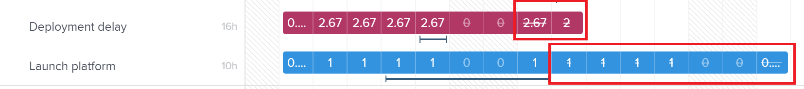

# Gérer les affectations des utilisateurs et utilisatrices dans l’équilibreur de charge de travail

<!-- Audited: 01/2024 -->

En tant que gestionnaire de ressources, vous pouvez affecter du travail aux utilisateurs et utilisatrices et gérer leurs affectations quotidiennes, hebdomadaires ou mensuelles à partir de l’équilibreur de charge de travail afin de vous assurer qu’un nombre d’heures adapté à leurs plannings disponibles leur est alloué.

## Conditions d’accès {#access-requirements}

+++ Développez pour afficher les exigences d’accès aux fonctionnalités de cet article.

Vous devez disposer des éléments suivants :

<table style="table-layout:auto"> 
 <col> 
 <col> 
 <tbody> 
  <tr> 
   <td role="rowheader">Forfait Adobe Workfront</td> 
   <td> 
N’importe quelle 
 </td> 
  </tr> 
  <tr> 
   <td role="rowheader">Licence Adobe Workfront</td> 
   <td>
   
Lors de l’utilisation de l’équilibreur de charge de travail dans la zone Ressources, vous avez besoin des éléments suivants :

   
Nouvelle : standard

   
Ou

   
Actuelle : formule

   
Lors de l’utilisation de l’équilibreur de charge de travail d’une équipe ou d’un projet, vous avez besoin des éléments suivants :

   
Nouvelle : standard

   
Ou

   
Actuelle : Travail

 </td> 
  </tr> 
  <tr> 
   <td role="rowheader">Configuration du niveau d’accès</td> 
   <td> 
Accès en modification aux éléments suivants :
 
    <ul> 
     <li> 
Gestion des ressources
 </li> 
     <li> 
Projets
 </li> 
     <li> 
Tâches
 </li> 
     <li> 
Problèmes
 </li> 
    </ul> </td> 
  </tr> 
  <tr> 
   <td role="rowheader">Autorisations d’objet</td> 
   <td> 
Autorisations de contribution ou supérieures qui incluent Créer des affectations sur les tâches et les problèmes dont vous souhaitez gérer les allocations. 
 
Ou 
 
Autorisations de gestion sur les tâches dont vous souhaitez mettre à jour le nombre d’heures prévues, en plus de la mise à jour des allocations. Pour plus d’informations sur la mise à jour du nombre d’heures prévues dans l’équilibreur de charge de travail, voir la section <a href="#update-task-planned-hours-when-managing-user-allocations">Mettre à jour le nombre d’heures prévues de la tâche lors de la gestion des allocations des utilisateurs et utilisatrices</a> de cet article.
 </td> 
  </tr> 
 </tbody> 
</table>

Pour plus d’informations sur ce tableau, consultez [Conditions d’accès requises dans la documentation Workfront](/help/quicksilver/administration-and-setup/add-users/access-levels-and-object-permissions/access-level-requirements-in-documentation.md).

+++

## Comprendre les allocations d’utilisateurs et d’utilisatrices

Les allocations d’utilisateurs et d’utilisatrices sont des nombres d’heures qui indiquent le temps qu’un utilisateur ou une utilisatrice doit consacrer au cours d’un jour ou d’un jour de semaine, d’une semaine ou d’un mois donné pour terminer l’élément de travail. Elles sont incluses dans le nombre d’heures prévues de l’élément de travail.

Cet article décrit comment mettre à jour les allocations horaires quotidiennes, hebdomadaires ou mensuelles pour les utilisateurs et utilisatrices affectés à des tâches ou à des problèmes. Pour plus d’informations sur la gestion des allocations globales pour les utilisateurs et utilisatrices et les fonctions aux tâches, voir [Gérer les heures d’allocation des utilisateurs et utilisatrices ou des rôles sur les tâches](../../manage-work/tasks/assign-tasks/manage-allocation-hours-on-tasks.md).

### Vue d’ensemble de l’allocation d’utilisateurs et d’utilisatrices {#user-allocation-overview}

Vous pouvez afficher l’allocation d’utilisateurs et d’utilisatrices sous forme d’heures ou de pourcentage dans l’équilibreur de charge de travail. Vous pouvez ajuster les heures ou les pourcentages.

Les allocation d’utilisateurs et d’utilisatrices sont incluses dans le nombre d’heures prévues d’un élément de travail. Pour plus d’informations sur le nombre d’heures prévues, voir [Vue d’ensemble du nombre d’heures prévues](../../manage-work/tasks/task-information/planned-hours.md).

Le nombre d’heures prévues de la tâche est réparti uniformément entre tous les jours compris dans la durée de la tâche pour l’utilisateur ou l’utilisatrice affecté à la tâche. Par exemple, si une tâche a une durée de 5 jours et un nombre d’heures prévues total de 10 heures, le nombre d’allocations quotidiennes de la tâche est de 2 heures. L’allocation hebdomadaire est de 10 heures. Cela signifie qu’un utilisateur ou une utilisatrice est affecté pour travailler sur la tâche 2 heures par jour. Vous pouvez toutefois modifier manuellement l’allocation quotidienne de l’utilisateur ou de l’utilisatrice à l’aide de l’équilibreur de charge de travail.

>[!CAUTION]
>
>L’équilibreur de charge de travail affiche jusqu’à 1 000 heures prévues par élément de travail par utilisateur et utilisatrice, et jusqu’à 1 000 jours de durée d’un élément. Les allocations dans l’équilibreur de charge de travail affichent zéro lorsque la limite de 1 000 heures ou de 1 000 jours est atteinte. Nous vous recommandons de diviser les tâches en sous-tâches plus petites pour disposer d’un plus grand nombre d’heures prévues ou d’une durée de plus de 1 000 jours.

Tenez compte des points suivants lors de la localisation d’allocations quotidiennes, hebdomadaires ou mensuelles pour des tâches ou des problèmes dans l’équilibreur de charge de travail :

* Vous pouvez afficher les allocations quotidiennes, hebdomadaires et mensuelles des utilisateurs et des utilisatrices sur leurs éléments de travail. Activez la vue Semaine ou Mois pour afficher les allocations hebdomadaires ou mensuelles.
* Vous pouvez utiliser l’équilibreur de charge de travail pour modifier l’allocation quotidienne, hebdomadaire ou mensuelle des utilisateurs et des utilisatrices sur les tâches ou les problèmes. Pour plus d’informations sur l’ajustement de la vue de l’équilibreur de charge de travail, voir [Naviguer dans l’équilibreur de charge de travail](../../resource-mgmt/workload-balancer/navigate-the-workload-balancer.md).

  >[!NOTE]
  >
  >Nous vous recommandons de choisir la période (quotidienne, hebdomadaire ou mensuelle) que vous souhaitez toujours utiliser lors de la gestion des allocations d’utilisateurs et d’utilisatrices et de ne pas basculer entre ces périodes pour les mêmes éléments de travail. La mise à jour des allocations hebdomadaires pour le même utilisateur ou la même utilisatrice pour lequel ou laquelle vous avez précédemment mis à jour les allocations quotidiennes modifie l’allocation quotidienne de l’utilisateur ou de l’utilisatrice.

* Vous pouvez mettre à jour les allocations pour les jours ouvrés et non ouvrés.
* Les horodatages des dates de début et d’achèvement prévues des éléments de travail, ainsi que le planning du projet, sont importants lorsque Workfront calcule automatiquement l’allocation quotidienne de la tâche.

  >[!INFO]
  >
  > Par exemple, une tâche peut avoir une durée de 2 jours, 2 heures prévues et une heure de début prévue à 12 h 00 le premier jour de la durée avec un utilisateur ou une utilisatrice et un planning de projet qui se termine à 17 h 00. La capacité de l’utilisateur ou de l’utilisatrice le premier jour est de 5 heures. La capacité de l’utilisateur ou de l’utilisatrice le deuxième jour est de 8 heures (si le planning commence à 9 h 00).
  >
  >Workfront calcule l’allocation des 2 heures sur les 2 jours de la durée à l’aide de la formule suivante :
  >
  >`Daily allocation hours = (Total Planned Hours / Total of available hours) * Daily available hours`
  >
  >Dans notre exemple, les heures d’allocation quotidiennes de chaque jour sont les suivantes :
  >   
  >(2 / 13) * 5 = 0,77 heure d’allocation pour le premier jour.
  >
  >(2 / 13) * 8 = 1,23 heure d’allocation le deuxième jour.
  >
  >Dans les calculs ci-dessus, 13 est le nombre total d’heures disponibles pour la tâche : 5 + 8 = 13.

* Deux utilisateurs et utilisatrices dans des fuseaux horaires ou avec des plannings différents de ceux des utilisateurs et utilisatrices affectés peuvent faire apparaître des allocations différentes à celles de deux utilisateurs et utilisatrices affichant les mêmes éléments de travail.

* Lorsqu’un utilisateur a programmé des congés, le jour ou la partie de la journée s’affiche en arrière-plan gris et une icône d’avion indique le moment du congé. Si l’administrateur ou l’administratrice de Workfront a activé le paramètre Congés de l’utilisateur dans la zone Configuration afin de prendre en compte les congés de l’utilisateur ou l’utilisatrice, les heures allouées sont déplacées vers le jour disponible suivant dans la chronologie. Si le paramètre est désactivé, les heures allouées restent sur le jour désigné de congés et l’utilisateur ou l’utilisatrice s’affiche comme étant surchargé. Pour plus d’informations, voir [Configurer les préférences du projet à l’échelle du système](../../administration-and-setup/set-up-workfront/configure-system-defaults/set-project-preferences.md).

  >[!TIP]
  >
  >Si les congés ont été marqué après l’affectation de l’utilisateur ou de l’utilisatrice à un élément de travail, vous devez recalculer la chronologie du projet pour afficher l’allocation déplacée. Pour plus d’informations, voir [Recalculer les chronologies des projets](../../manage-work/projects/manage-projects/recalculate-project-timeline.md).

   * Lorsque plusieurs utilisateurs sont affectés à une tâche et que le cessionnaire principal a programmé un congé, la chronologie est décalée (si les dates ne sont pas fixes) et les heures planifiées de tous les cessionnaires sont redistribuées sur la nouvelle durée de la tâche. Si la tâche comporte des dates fixes, la chronologie n’est pas modifiée en raison d’un temps de congé et les heures sont réaffectées parmi les jours restants.
   * Si les affectations sont effectuées manuellement, les heures planifiées ne sont pas redistribuées après le congé.

* Si plusieurs utilisateurs et utilisatrices sont affectés à la tâche, le nombre d’heures prévues est réparti uniformément entre chaque utilisateur et utilisatrice en premier, puis uniformément entre chaque jour pendant la durée de la tâche. Cette répartition devient l’allocation de chaque utilisateur et utilisatrice sur la tâche.

  Par exemple, les scénarios suivants peuvent exister :

   * Pour une tâche d’une durée de 2 jours et 10 heures prévues affectées à un utilisateur ou une utilisatrice, l’allocation quotidienne par défaut de l’utilisateur ou l’utilisatrice est de 5 heures par jour.
   * Pour une tâche d’une durée de 2 jours et 10 heures prévues affectées à deux utilisateurs et utilisatrices, l’allocation quotidienne par défaut de chaque utilisateur ou utilisatrice est de 2,5 heures par jour.

* Si une tâche ou un problème s’est terminé avant la date d’achèvement prévue, le nombre d’heures allouées pour les jours restants est supprimé et ne compte pas dans l’allocation globale de l’utilisateur ou de l’utilisatrice. Cette option ne s’affiche que lorsque l’icône Afficher les allocations et le paramètre Afficher les dates prévisionnelles sont activés. Pour plus d’informations sur l’activation des paramètres dans l’équilibreur de charge de travail, voir [Naviguer dans l’équilibreur de charge de travail](../../resource-mgmt/workload-balancer/navigate-the-workload-balancer.md).

  

* Lorsqu’un utilisateur ou une utilisatrice est surchargé, les heures qui lui sont allouées s’affichent sur un arrière-plan rouge dans le champ d’utilisateur ou d’utilisatrice.
* Lorsque l’utilisateur ou l’utilisatrice est sous-alloué ou qu’un nombre d’heures équivalent à son temps disponible planifiée lui est alloué, les heures s’affichent sur un arrière-plan bleu.
* Vous pouvez afficher l’allocation des utilisateurs et des utilisatrices dans une vue graphique dans la ligne de l’utilisateur ou l’utilisatrice. Pour plus d’informations sur l’activation de la vue graphique pour les allocations d’utilisateurs et d’utilisatrices, voir la section « Naviguer dans l’équilibreur de charge de travail » de l’article [Naviguer dans l’équilibreur de charge de travail](../../resource-mgmt/workload-balancer/navigate-the-workload-balancer.md).

  

### Critères réinitialisant les allocations d’utilisateurs et d’utilisatrices {#criteria-that-reset-user-allocations}

Toutes les modifications apportées à une tâche ne déclenchent pas une redistribution des affectations modifiées. Cependant, certaines actions peuvent réinitialiser les allocations déjà ajustées de vos ressources et les redistribuer uniformément sur tous les jours pendant la durée de l’élément de travail pour chacune des personnes cessionnaires.

>[!NOTE]
>
>Si vous n’avez pas modifié la distribution automatique des allocations sur les éléments de travail, les heures sont redistribuées uniformément entre toutes les personnes cessionnaires en cas de changement du nombre de personnes cessionnaires, de la durée d’une tâche ou du nombre d’heures prévues sur l’élément de travail.

#### Actions réinitialisant les allocations ajustées {#actions-that-reset-adjusted-allocations}

Les actions suivantes réinitialisent ou modifient les allocations quotidiennes, hebdomadaires ou mensuelles pour les utilisateurs et les utilisatrices après les avoir ajustées manuellement, comme décrit dans la section [Modifier les allocations d’utilisateurs et d’utilisatrices](#modify-user-allocations) de cet article :

* Lorsque vous réduisez la durée d’un élément de travail et dont le nombre de jours dans sa durée, les heures allouées ajustées par rapport aux jours perdus sont ajoutées à la durée d’allocation le dernier jour de l’élément de travail.
* Lorsque vous modifiez le nombre d’heures prévues sur une affectation ou sur l’élément de travail, le nouveau nombre d’heures prévues est redistribué uniformément sur toute la durée de l’élément de travail.
* Lorsque vous ajoutez ou supprimez une personne cessionnaire d’un élément de travail, entraînant ainsi la modification du nombre d’heures prévues de la tâche, les valeurs ajustées sont redistribuées uniformément.

#### Actions ne réinitialisant pas les allocations ajustées {#actions-that-do-not-reset-adjusted-allocations}

Les modifications suivantes apportées à un élément de travail ne déclenchent pas une réinitialisation ou une modification des allocations ajustées :

* Lorsque vous déplacez les jours d’un élément de travail mais que le nombre de jours pendant la durée ne change pas, les valeurs allouées ajustées restent identiques et appliquent les nouvelles dates.
* Lorsque vous augmentez la durée d’un élément de travail, augmentant ainsi le nombre de jours dans sa durée, les heures allouées ajustées restent identiques pour les jours ajustés. Des jours supplémentaires sont ajoutés à la tâche avec 0 heure allouée.
* Lorsque vous ajoutez ou supprimez une personne cessionnaire d’un élément de travail, n’entraînant ainsi pas la modification du nombre d’heures prévues de l’élément, les valeurs ajustées restent identiques.

## Localiser le nombre d’heures prévues dans l’équilibreur de charge de travail

Vous pouvez modifier les affectations d’utilisateurs et d’utilisatrices à des tâches ou des problèmes à l’aide de l’équilibreur de charge de travail en recherchant le nombre d’heures prévues des tâches ou des problèmes affectés aux personnes.

Tenez compte des points suivants lors de l’affichage du nombre d’heures prévues dans l’équilibreur de charge de travail :

* Le nombre d’heures prévues pour une tâche ou un problème s’affiche en regard du nom de la tâche ou du problème, à gauche de l’équilibreur de charge de travail.

* Le total du nombre d’heures prévues d’un projet s’affiche en regard du nom du projet à gauche de l’équilibreur de charge de travail. Il s’agit du total des heures planifiées pour toutes les tâches et problèmes répertoriés sous le projet dans l’équilibreur de charge de travail et non pas le nombre d’heures prévues du projet.
* Le temps alloué chaque jour ou chaque semaine pour toutes les tâches et tous les projets s’affiche uniquement lorsque vous activez manuellement le paramètre Afficher les affectations. Pour plus d’informations sur l’activation des paramètres dans l’équilibreur de charge de travail, voir [Naviguer dans l’équilibreur de charge de travail](../../resource-mgmt/workload-balancer/navigate-the-workload-balancer.md).

## Modifier les affectations des utilisateurs et utilisatrices {#modify-user-allocations}

Dans le cadre du processus d’affectation de travail à des personnes, vous pouvez modifier les affectations dans l’équilibreur de charge de travail afin que les personnes ne soient jamais surchargées ou encore garantir un équilibre précis des heures entre vos ressources. Pour plus d’informations sur l’identification d’une personne en surcapacité, voir la section [Vue d’ensemble de l’affectation des utilisateurs et utilisatrices](#user-allocation-overview) dans cet article.

1. Assurez-vous que des tâches et des problèmes sont affectés aux personnes. Pour plus d’informations sur l’affectation de travail aux personnes dans l’équilibreur de charge de travail, voir [Vue d’ensemble de l’affectation du travail dans l’équilibreur de charge de travail](../../resource-mgmt/workload-balancer/assign-work-in-workload-balancer.md).
1. Accédez à l’équilibreur de charge de travail.
1. (Facultatif) Cliquez sur **Semaine** ou **Mois** pour gérer les affectations hebdomadaires ou mensuelles pour les personnes.

   

1. Dans la zone **Travail attribué**, recherchez la personne pour laquelle modifier manuellement l’attribution, puis cliquez sur la flèche pointant vers la droite située à gauche de son nom pour développer ses informations.

   

1. Cliquez sur la flèche pointant vers la droite située à gauche du nom du projet pour développer le projet et afficher les tâches auxquelles la personne est affectée.

   >[!TIP]
   >
   >Vous pouvez modifier les affectations des personnes uniquement pour les tâches et les problèmes. Vous ne pouvez pas modifier les affectations des personnes pour les projets.

1. (Facultatif) Cliquez sur l’icône **Afficher les affectations**  pour afficher les affectations pour tous les éléments de travail.

   Le nom des tâches et des projets est remplacé par l’affectation de la personne pour la tâche ou le projet.

1. (Facultatif) Cliquez sur l’icône **Paramètres**  et sélectionnez l’une des options suivantes :

   1. **Inclure les heures des problèmes.** Vous pouvez ainsi gérer les affectations de problèmes en plus des affectations de tâches.
   1. **Afficher le travail terminé.** Cette option affiche les éléments qui ont été terminés et qui sont programmés pendant la chronologie dont vous gérez les affectations.
   1. **Afficher le temps restant.** Le nombre total d’heures pour chaque personne (dans la ligne correspondante) change. Lorsque ce paramètre est activé, l’équilibreur de charge de travail affiche les heures disponibles pour chaque personne au lieu du nombre d’heures qui lui sont attribuées.

      >[!TIP]
      >
      >Lorsque ce paramètre est activé, la modification des attributions diminue le nombre total dans la ligne de la personne.

   1. **Projet** dans la section **Sélectionner le thème de couleurs**. Cette fonction permet d’afficher chaque projet et ses tâches respectives dans des couleurs uniques et facilite la compréhension des éléments appartenant au projet.
   1. **Pourcentage dans la section Afficher l’affectation des utilisateurs dans.****** Cette fonction affiche les affectations des personnes sous forme de valeur de pourcentage. La capacité de la personne selon le planning est considérée comme étant de 100 %. Par exemple, si une personne est associée à un planning de 8 heures par jour, 8 heures équivalent à une capacité de 100 %. Si vous souhaitez affecter à la personne un travail de 4 heures par jour, vous devez passer son affectation à 50 %.

      >[!NOTE]
      >
      >L’administrateur ou l’administratrice de Workfront décide du planning à utiliser sur l’ensemble de votre système pour calculer la capacité de la personne dans la zone Gestion des ressources de la configuration. Pour plus d’informations, voir [Configurer les préférences de gestion des ressources](../../administration-and-setup/set-up-workfront/configure-system-defaults/configure-resource-mgmt-preferences.md).

1. Cliquez sur le menu **Plus**  pour un élément de travail, puis cliquez sur **Modifier les attributions**.

   

   Ou

   Double-cliquez sur le jour, la semaine ou le mois dans la barre d’une tâche ou d’un problème.

   Les zones d’attribution deviennent modifiables.

1. Cliquez dans la zone de chaque attribution quotidienne, hebdomadaire ou mensuelle pour mettre à jour manuellement le nombre d’heures ou le pourcentage pour lequel vous souhaitez que la personne soit affectée chaque jour, semaine ou mois, puis cliquez sur l’icône **Enregistrer** .

   >[!TIP]
   >
   >Cliquez sur l’icône **Annuler**  pour supprimer les affectations que vous avez ajustées.

   

   Les affectations pour la mise à jour de l’utilisateur ou de l’utilisatrice.

   >[!TIP]
   >
   >Si une tâche ou un problème s’est terminé avant la date d’achèvement prévue, le nombre d’heures allouées pour les jours restants est supprimé et ne compte pas dans l’allocation globale de l’utilisateur ou de l’utilisatrice. Ceci s’affiche uniquement lorsque l’icône **Afficher les allocations** et le paramètre **Afficher les dates prévisionnelles** sont activés.

   Les scénarios suivants sont possibles :

   * Pour les tâches dont les types de durée ne sont pas simples ou pour des problèmes, le total des allocations doit correspondre au nombre d’heures prévues de la tâche avant que vous ne puissez cliquer sur l’icône en forme de coche.
   * Pour les tâches dont le type de durée est simple, le total des allocations peut être supérieur ou inférieur au nombre d’heures prévues et vous pouvez cliquer sur l’icône en forme de coche même si elles ne correspondent pas. Le nombre d’heures prévues pour la tâche est également mis à jour. Vous devez disposer des autorisations et de l’accès appropriés pour mettre à jour le nombre d’heures prévues des tâches à partir de l’équilibreur de charge de travail.

     >[!TIP]
     >
     >Une icône représentant un verrou s’affiche à droite du nom de la tâche lorsque vous commencez à ajuster vos allocations pour indiquer que la tâche a un type de durée simple.

     

   Pour plus d’informations sur les conditions qui doivent être remplies pour mettre à jour le nombre d’heures prévues dans l’équilibreur de charge de travail, voir la section Mettre à jour le nombre d’heures prévues de la tâche lors de la gestion des allocations des utilisateurs et utilisatrices dans cet article.  Pour plus d’informations sur les types de durée des tâches, voir [Vue d’ensemble de la durée et du type de durée des tâches](../../manage-work/tasks/taskdurtn/task-duration-and-duration-type.md).

1. (Le cas échéant) Si la tâche est affectée à plusieurs personnes, répétez ces étapes pour chaque personne affectée à la tâche afin de mettre à jour les affectations de chaque personne.

   Toute personne ayant accès à l’équilibreur de charge de travail et qui affiche les mêmes personnes et les mêmes projets que ceux que vous avez gérés affiche désormais l’affectation mise à jour des personnes que vous avez gérées.

>[!TIP]
>
>Une icône représentant un crayon s’affiche à droite du nom de l’élément de travail pour indiquer qu’il a été modifié manuellement.

## Mettre à jour le nombre d’heures prévues de la tâche lors de la gestion des affectations des personnes {#update-task-planned-hours-when-managing-user-allocations}

Vous pouvez mettre à jour le nombre d’heures prévues d’une tâche lors de la gestion des affectations des personnes dans l’équilibreur de charge de travail pour la tâche. Cela se produit lorsque le total des heures allouées mises à jour ne correspond pas au nombre total initial d’heures prévues d’une tâche.

>[!IMPORTANT]
>
>* La mise à jour du nombre d’heures prévues des tâches peut avoir un impact sur la progression de votre projet.
>* La mise à jour manuelle du nombre d’heures prévues en modifiant les affectations quotidiennes peut avoir un impact sur le nombre d’heures prévues lors de la suppression ultérieure des affectations des tâches. Pour plus d’informations, consultez [Vue d’ensemble du nombre d’heures prévues](../../manage-work/tasks/task-information/planned-hours.md).
>
>* Vous pouvez mettre à jour le nombre d’heures prévues des problèmes en mettant à jour les affectations dans l’équilibreur de charge de travail.

Vous pouvez le faire lorsque les conditions suivantes sont réunies :

* Vous disposez des autorisations et de l’accès appropriés pour gérer le nombre d’heures prévues à partir de l’équilibreur de charge de travail. Il s’agit notamment de :

   * Gérer les autorisations pour les tâches.
   * Mettre à jour le nombre d’heures prévues dans l’accès de l’équilibreur de charge de travail dans la zone Gestion des ressources de votre niveau d’accès.

  Pour plus d’informations sur l’accès nécessaire à l’utilisation de l’équilibreur de charge de travail, voir la section [Exigences d’accès](#access-requirements) dans cet article.

* La tâche a un type de durée simple.

