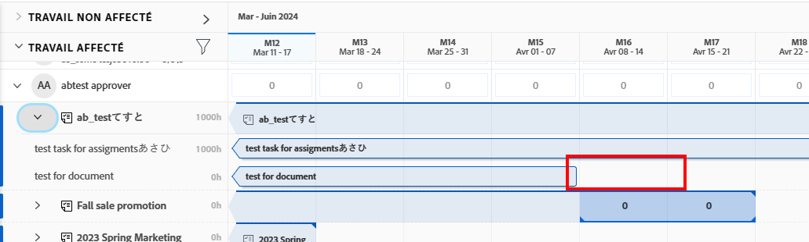
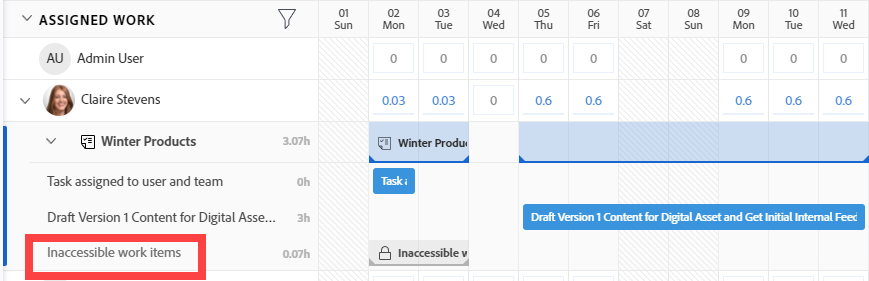
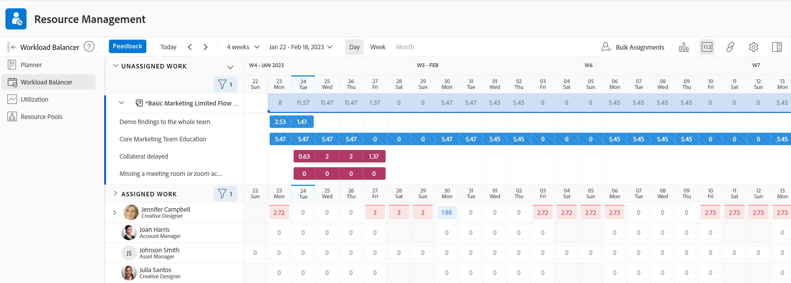
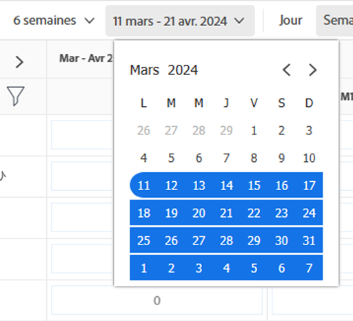
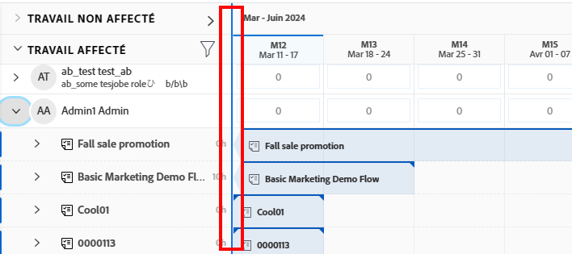
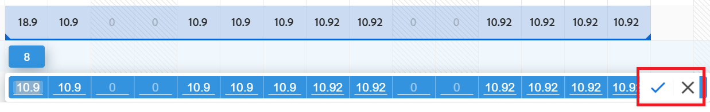
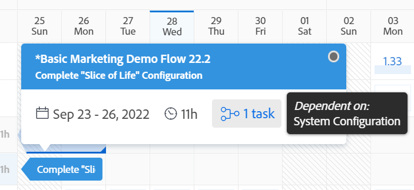

# Trouver l’équilibreur de charge de travail

{{preview-fast-release-general}}

<!--Audited: 12/2024-->

Utilisez l’équilibreur de charge de travail d’Adobe Workfront pour affecter le travail aux utilisateurs et aux utilisatrices en fonction de leur disponibilité. Cet article vous explique comment utiliser les options et les paramètres pour naviguer dans l’équilibreur de charge de travail et afficher les informations qui vous intéressent. D’autres articles répertoriés ici décrivent comment vous pouvez utiliser l’équilibreur de charge de travail pour gérer vos ressources et leurs affectations.

L’équilibreur de charge de travail est disponible dans plusieurs zones d’Adobe Workfront. Son fonctionnement est similaire dans toutes les zones.

Pour plus d’informations sur l’emplacement de l’équilibreur de charge de travail, consultez la section [Localiser l’équilibreur de charge de travail](https://experienceleague.adobe.com/fr/docs/workfront/using/manage-resources/the-workload-balancer/locate-workload-balancer).

## Conditions d’accès

+++ Développez pour afficher les exigences d’accès aux fonctionnalités de cet article.

Vous devez disposer des accès suivants pour effectuer les étapes décrites dans cet article :

<table style="table-layout:auto"> 
 <col> 
 <col> 
 <tbody> 
  <tr> 
   <td role="rowheader">Formule Adobe Workfront</td> 
   <td> 
Tous 
 </td> 
  </tr> 
  <tr> 
   <td role="rowheader">Licence Adobe Workfront</td> 
   <td>
Nouveau : Standard

       
ou

       
Actuelle : planification, lors de l’utilisation de l’équilibreur de charge de travail dans la zone Ressource; 
       Travail, lors de l’utilisation de l’équilibreur de charge de travail d’une équipe ou d’un projet
</td>
  </tr>
  <tr> 
   <td role="rowheader">Configurations des niveaux d’accès</td> 
   <td> 
Accès Affichage ou niveau supérieur aux éléments suivants :
 
    <ul> 
     <li>Gestion des ressources</li> 
     <li>Projets</li> 
     <li>Tâches</li> 
     <li>Problèmes</li> 
    </ul>
   </td> 
  </tr> 
  <tr> 
   <td role="rowheader">Autorisations d’objet</td> 
   <td>Autorisations en affichage ou autorisations supérieures pour les projets, les tâches et les problèmes</td> 
  </tr> 
 </tbody> 
</table>

Pour plus de détails sur les informations contenues dans ce tableau, consultez [Conditions d’accès préalables dans la documentation Workfront](/help/quicksilver/administration-and-setup/add-users/access-levels-and-object-permissions/access-level-requirements-in-documentation.md).

+++

## Remarques concernant l’affichage des éléments dans l’équilibreur de charge de travail

Tenez compte des éléments suivants lors de l’affichage de l’équilibreur de charge de travail :

* L’équilibreur de charge de travail affiche les éléments de travail dans deux zones distinctes, en fonction de leur affectation. Les éléments de travail et les utilisateurs et les utilisatrices s’affichent dans les zones suivantes :

   * **Travail non affecté** : éléments qui n’ont pas d’affectation ou qui sont affectés uniquement à des fonctions ou à des équipes.
   * **Travail affecté** : éléments affectés au moins à un utilisateur ou à une utilisatrice. Les éléments affectés s’affichent sous le nom des personnes affectées.

  >[!NOTE]
  >
  >* Les éléments de travail affectés à une fonction ou équipe et aussi à un utilisateur ou à une utilisatrice apparaissent simultanément dans la zone de travail non affecté et sous le nom de la personne affectée dans la zone de travail affecté.
  >* Les éléments de travail affectés simultanément à un utilisateur ou à une utilisatrice et à une fonction, avec cette dernière comme cessionnaire principale, sont visibles dans la zone de travail non affecté.
  >* Les éléments de travail affectés à plusieurs utilisateurs et utilisatrices s’affichent sous les noms de toutes les personnes affectées dans la zone de travail affecté.
  >* Les affectations de rôles sont affichées sous éléments de travail dans la zone Tâches non affectées lorsque le paramètre Afficher les affectations de rôles est activé. Pour plus d’informations, consultez la section [Personnaliser la vue](#customize-the-view) de cet article.

  Pour plus d’informations, voir [Zones d’affectation dans l’équilibreur de charge de travail](/help/quicksilver/resource-mgmt/workload-balancer/assign-work-in-workload-balancer.md#assignment-areas-in-the-workload-balancer) dans [Présentation de l’affectation de tâches dans l’équilibreur de charge de travail](/help/quicksilver/resource-mgmt/workload-balancer/assign-work-in-workload-balancer.md).

* Lorsqu’aucune tâche n’a été affectée à un projet pendant une période donnée, la barre au niveau du projet est vide pour cette période.

  

* Si vous ne possédez pas les autorisations nécessaires pour accéder à certains éléments, ils apparaîtront comme **éléments de travail inaccessibles** ou **projets inaccessibles**.

  

* Les noms des éléments de travail s’affichent à gauche et leur chronologie s’affiche à droite.
* Le nombre total d’heures prévues pour chaque élément de travail est indiqué à droite du nom de l’élément de travail et à gauche de la barre représentant sa chronologie.
* Le nombre total d’heures prévues pour chaque projet est indiqué à droite du nom du projet et à gauche de la barre représentant sa chronologie.

  Les informations sur le nombre d’heures prévues pour le projet correspondent au total d’heures prévues de tous les éléments répertoriés dans l’équilibreur de charge de travail, et non au total d’heures prévues du projet.

Pour plus d’informations sur l’affichage des informations dans l’équilibreur de charge de travail, consultez également les articles suivants :

* [Localiser l’équilibreur de charge de travail](../workload-balancer/locate-workload-balancer.md)
* [Filtrer des informations dans l’équilibreur de charge de travail](../workload-balancer/filter-information-workload-balancer.md)
* [Partager l’équilibreur de charge de travail avec un lien](../workload-balancer/share-link-for-workload-balancer.md)
* [Mettre à jour les éléments de travail dans l’équilibreur de charge de travail à l’aide du Résumé](../workload-balancer/update-items-in-summary-panel-in-workload-balancer.md)

Pour plus d’informations sur la gestion des ressources à l’aide de l’équilibreur de charge de travail, consultez également les articles suivants :

* [Vue d’ensemble de l’affectation du travail dans l’équilibreur de charge de travail](https://experienceleague.adobe.com/fr/docs/workfront/using/manage-resources/the-workload-balancer/assign-work-in-workload-balancer)
* [Gérer les affectations des utilisateurs et utilisatrices dans l’équilibreur de charge de travail](https://experienceleague.adobe.com/fr/docs/workfront/using/manage-resources/the-workload-balancer/manage-user-allocations-workload-balancer)

## Naviguer dans l’équilibreur de charge de travail pour plusieurs projets dans la zone Ressources

La navigation dans l’équilibreur de charge de travail est similaire dans toutes les zones à partir desquelles vous y accédez.

Les sous-sections suivantes décrivent comment afficher les informations de l’équilibreur de charge de travail pour plusieurs projets.

Vous pouvez ajuster un certain nombre de paramètres et d’options dans l’équilibreur de charge de travail pour afficher les informations pour la période qui vous convient le mieux.

Après avoir sélectionné les paramètres que vous souhaitez appliquer à votre vue, l’équilibreur de charge de travail se souvient de ces paramètres chaque fois que vous y accédez à partir d’un navigateur ou d’un appareil.

### Accéder à l’équilibreur de charge de travail pour plusieurs projets dans la zone Ressources

Pour naviguer dans l’équilibreur de charge de travail pour plusieurs projets, procédez comme suit :

{{step1-to-resourcing}}

1. Cliquez sur **Équilibreur de charge de travail** dans le panneau de gauche.

   

   L’équilibreur de charge de travail affiche les informations relatives à l’affectation du travail à partir de la semaine en cours dans les deux zones suivantes :

   * La zone **Travail non affecté** affiche les éléments de travail suivants :

      * Les éléments de travail (tâches et problèmes) affectés à des rôles, à des équipes ou non affectés s’affichent après l’application de filtres.
Par défaut, la zone Travail non affecté n’affiche aucun élément de travail. Nous vous recommandons d’utiliser des filtres pour afficher des informations pertinentes dans cette zone.

        Pour plus d’informations sur l’utilisation des filtres, voir [Filtrer les informations dans l’équilibreur de charge de travail](../workload-balancer/filter-information-workload-balancer.md).

      * Les affectations de rôles sous éléments de travail s’affichent uniquement lorsque vous activez le paramètre Afficher les affectations de rôles. Pour plus d’informations, consultez la section [Personnaliser la vue](#customize-the-view) de cet article.

      * Les projets ne s’affichent que lorsque vous activez le paramètre Grouper par projet. Pour plus d’informations, voir la section [Personnaliser la vue](#customize-the-view) de cet article.

   * La zone **Travail affecté** affiche les éléments de travail suivants :

      * Tous les utilisateurs et utilisatrices actifs du système s’affichent par défaut dans cette zone. Nous vous recommandons d’utiliser des filtres pour limiter la quantité d’informations dans cette zone. Si des utilisateurs et utilisatrices sont affectés à des éléments, les éléments de travail s’affichent également sous leur nom.

      * Les tâches et les problèmes affectés à au moins un utilisateur ou une utilisatrice s’affichent sous le nom de ce dernier.

        Les éléments de travail sous les noms des utilisateurs et utilisatrices dans la zone Travail affecté sont triés selon les critères suivants, dans cet ordre :

         1. Date de début prévue (la plus ancienne en premier)
         1. Date d’achèvement prévue (la plus ancienne en premier)
         1. Ordre alphabétique par projet (uniquement lorsque les deux premiers critères sont identiques pour plusieurs éléments de travail)

            >[!TIP]
            >
            >* Vous pouvez personnaliser le tri des projets en sélectionnant une option dans le paramètre « Trier les projets par ».
            >
            >* Les projets ne s’affichent que lorsque vous activez le paramètre « Grouper par projet ».
            > 
            >Pour plus d’informations sur la personnalisation des paramètres, voir la section [Personnaliser la vue](#customize-the-view) de cet article.

1. (Facultatif) Cliquez sur l’icône **Filtrer**  dans la zone **Travail affecté**, puis sélectionnez **Filtre par défaut** dans la zone **Suggéré** de la boîte de dialogue des filtres.

   Lorsque vous appliquez le filtre par défaut, les utilisateurs et utilisatrices qui appartiennent à l’une de vos équipes et leurs éléments de travail s’affichent. Vous pouvez modifier une copie de ce filtre.

   >[!TIP]
   >
   >Le filtre par défaut n’est disponible que dans l’équilibreur de charge de travail, dans la zone Ressources.

1. Poursuivez les étapes suivantes pour naviguer dans l’équilibreur de charge de travail :

   * [Sélectionner une période dans l’équilibreur de charge de travail](#select-a-time-frame-in-the-workload-balancer)
   * [Personnaliser la vue](#customize-the-view)
   * [Affecter des éléments de travail et ajuster les affectations des utilisateurs et des utilisatrices](#assign-work-items-and-adjust-user-allocations)
   * [Afficher les affectations dans un graphique](#view-allocations-in-a-chart)

### Sélectionner une période dans l’équilibreur de charge de travail

1. Accédez à l’équilibreur de charge de travail dans la zone **Ressources**, comme décrit dans la section [Accéder à l’équilibreur de charge de travail pour plusieurs projets dans la zone Ressources](#access-the-workload-balancer-for-multiple-projects-in-the-resourcing-area) de cet article.

   L’équilibreur de charge de travail affiche des informations d’affectation de travail à partir de la semaine en cours.

1. Utilisez le défilement horizontal pour afficher la chronologie des éléments de travail qui dépassent les limites de l’écran.
1. Cliquez sur les icônes **précédent et suivant**  dans le coin supérieur gauche pour naviguer dans la chronologie, puis cliquez sur **Aujourd’hui** pour revenir à la semaine en cours.
1. Cliquez sur le **menu déroulant de la chronologie** dans la barre d’outils, puis cliquez sur la date de début de la période que vous souhaitez afficher. Par défaut, la première semaine sélectionnée dans le calendrier est la semaine vers laquelle vous avez navigué.

   

1. Sélectionnez le nombre de semaines que vous souhaitez afficher en même temps dans l’équilibreur de charge de travail parmi les options suivantes :
   * 1 semaine
   * 2 semaines
   * 4 semaines Il s’agit du paramètre par défaut.
   * 6 semaines
   * 3 mois

   

1. Cliquez sur l’une des options suivantes dans la barre d’outils pour afficher les informations selon différentes périodes :
   * **Jour** : affiche les informations par jour pendant quatre semaines en commençant par la date d’aujourd’hui par défaut.
   * **Semaine** : affiche les informations par semaine pendant quatre semaines.
   * **Mois** : affiche les informations par mois pendant trois mois.

1. Continuez à naviguer dans l’équilibreur de charge de travail comme décrit dans les sections suivantes.

### Personnaliser la vue

1. Accédez à l’équilibreur de charge de travail dans la zone **Ressources**, comme décrit dans la section [Accéder à l’équilibreur de charge de travail pour plusieurs projets dans la zone Ressources](#access-the-workload-balancer-for-multiple-projects-in-the-resourcing-area) de cet article.

   Les noms des éléments de travail sont répertoriés sur le côté gauche et sont représentés par des barres sur le côté droit de l’équilibreur de charge de travail. La longueur de la barre représente la chronologie d’un élément de travail.

1. (Facultatif et recommandé) Utilisez des filtres dans les zones Travail non affecté et Travail affecté pour afficher uniquement les éléments de travail ou les utilisateurs et utilisatrices qui vous concernent.

   Pour plus d’informations, voir [Filtrer des informations dans l’équilibreur de charge de travail](../workload-balancer/filter-information-workload-balancer.md).

   Par défaut, les barres bleues représentent les chronologies des projets et des tâches et les barres marron représentent les problèmes.

   Vous pouvez changer la couleur des barres pour les projets et les tâches lorsque vous sélectionnez votre thème de couleur pour correspondre au projet. Pour plus d’informations, continuez à lire cette procédure.

   Les éléments de travail de la zone Travail affecté sont triés par projet selon les critères suivants dans cet ordre :
   1. Date de début prévue (la plus ancienne en premier)
   1. Date d’achèvement prévue (la plus ancienne en premier)
   1. Ordre alphabétique par projet (uniquement lorsque les deux premiers critères sont identiques pour plusieurs éléments de travail)

1. Cliquez sur la flèche **pointant vers la droite** à gauche des zones Non affecté ou Affecté pour développer tous les éléments sous les noms de projet (dans la zone Non affecté) et sous les noms d’utilisateur et utilisatrice (dans la zone Affecté).

   >[!TIP]
   >
   >Les éléments de travail sont répertoriés sous les noms de projet dans la zone Non attribué uniquement lorsque vous activez le paramètre « Regrouper par projet ».

1. Cliquez sur la flèche **pointant vers le bas** à gauche des zones Non affecté ou Affecté pour réduire tous les éléments sous les noms de projet (dans la zone Non affecté) et sous les noms d’utilisateur et utilisatrice (dans la zone Affecté).

1. Pointez dessus, puis faites glisser et déposez la **ligne de séparation** entre le panneau de gauche et la zone de la chronologie pour ajuster la taille du panneau de gauche.

   

1. Cliquez sur l’icône **Paramètres** .

   Le panneau Paramètres s’affiche sur la droite.

   Exemple d’image dans l’environnement de prévisualisation :
   

   Exemple d’image dans l’environnement de production :
   

   Sélectionnez l’une des options ci-dessous pour mettre à jour les informations affichées dans l’équilibreur de charge de travail, puis cliquez sur l’**icône X** en haut à droite de la zone Paramètres pour la fermer.

   * **Regrouper par projet** : lorsque cette option est sélectionnée, les éléments des zones Travail non affecté et Travail affecté sont regroupés par projet. Cette option est sélectionnée par défaut.

   * **Inclure les heures des problèmes** : lorsque cette option est sélectionnée, les problèmes affectés aux utilisateurs et utilisatrices s’affichent sous le nom de l’utilisateur ou de l’utilisatrice dans la zone Travail affecté et les problèmes qui ne sont pas affectés aux utilisateurs et utilisatrices s’affichent dans la zone Travail non affecté. Les heures prévues des problèmes sont prises en compte dans les heures prévues du projet et de l’utilisateur ou utilisatrice dans la zone Travail affecté.
   * **Afficher les dates prévisionnelles** : lorsque cette option est sélectionnée, la chronologie prévisionnelle des éléments de travail s’affiche en plus de la chronologie planifiée. Remarquez ce qui suit :
      * La chronologie prévisionnelle d’un projet, d’une tâche et d’un problème s’affiche sous la forme d’une ligne bleu foncé au-dessus des barres des tâches, des problèmes et des projets.
      * La chronologie prévisionnelle qui se trouve en dehors de la chronologie planifiée s’affiche en bleu clair, même lorsque vous mettez à jour le thème de couleur, comme décrit ci-dessous.
      * La chronologie prévisionnelle des éléments auxquels vous n’avez pas accès s’affiche en gris clair avec une ligne en dessous.
      * Lorsqu’une tâche ou un problème est terminé avant la date d’achèvement prévue, les numéros d’affectation pour les jours restants sont rayés et ne comptent pas dans l’affectation de l’utilisateur ou utilisatrice. Cela s’affiche que lorsque le paramètre Afficher les dates prévisionnelles et l’icône Afficher l’affectation sont tous deux activés.

     >[!TIP]
     >
     >Vous remarquerez que les éléments de travail s’affichent dans l’équilibreur de charge de travail lorsque leurs chronologies planifiées ou prévisionnelles (pas nécessairement les deux en même temps) se produisent au cours de la période sélectionnée.

   * **Afficher le travail terminé** : lorsque cette option est activée, les tâches et les problèmes terminés s’affichent dans la zone de travail affecté. Cette option est activée par défaut.

     Quand une tâche ou un problème est terminé(e), une icône en forme de coche verte apparaît dans le coin supérieur droit de leur barre respective. La même icône s’affiche pour un projet lorsque les tâches ou les problèmes de la période sélectionnée pour le projet sont terminés.
   * **Afficher le temps restant** : lorsque cette fonction est activée, Workfront affiche l’écart entre les heures de disponibilité journalière de l’utilisateur ou de l’utilisatrice, selon ses horaires, et les heures affectées dans la section de travail affecté pour ces personnes. Cette fonction est désactivée par défaut et le temps affecté s’affiche par défaut.
   * **Afficher les affectations de rôle** : lorsque cette option est activée, les affectations de rôle s’affichent dans la zone Tâches non affectées sous les éléments de travail qui leur sont affectés. Cette option est activée par défaut.

   * Dans la section **Sélectionner le thème de couleur**, sélectionnez la couleur que vous souhaitez pour les barres de projet et de tâches.

     >[!TIP]
     >
     >La sélection d’un thème de couleur ne modifie pas la couleur des barres représentant les problèmes. Les problèmes s’affichent toujours dans une barre de couleur marron.

     Sélectionnez l’une des options suivantes :
      * **Par défaut** : les barres de tous les projets et de leurs éléments de travail s’affichent en bleu.
      * **Projet** : les barres associées à chaque projet et à ses tâches changent en fonction du nom du projet. Toutes les tâches appartenant au projet s’affichent dans des barres dont la couleur correspond à celle du projet. Les barres de projet s’affichent dans une teinte plus claire pour se distinguer des tâches. Lorsque les affectations sont masquées, les barres de projet affichent toujours une icône de projet.
      * **Statut du projet** : la couleur des barres représentant chaque projet et ses éléments de travail associés varie selon le statut du projet.

        Le statut du projet est celui associé au groupe du projet. Lorsqu’un groupe n’est associé à aucun statut particulier, la couleur des barres pour les éléments de travail reflète le statut du projet défini au niveau du système. Les statuts définis au niveau du système ainsi que les statuts personnalisés sont affichés. Pour plus d’informations sur les statuts de groupe, consultez la section [Créer ou modifier un statut de groupe](../../administration-and-setup/manage-groups/manage-group-statuses/create-or-edit-a-group-status.md).

   * Dans la section **Afficher l’affectation des utilisateurs et des utilisatrices dans**, sélectionnez l’une des options suivantes :
      * **Heures** : affiche le temps affecté en heures. Il s’agit de la valeur par défaut.
      * **Pourcentage** : affiche le temps affecté en pourcentage du temps total disponible.
   * Dans la section **Préférences de tri**, sélectionnez la façon dont vous souhaitez que les éléments soient triés dans l’équilibreur de charge de travail. Sélectionnez l’une des options suivantes :
      * **Trier les utilisateurs et les utilisatrices par rôle principal** : dans la zone de travail affecté, ces personnes sont listées selon l’ordre alphabétique de leur rôle principal.
      * **Trier les utilisateurs et les utilisatrices par ordre alphabétique** : les noms de ces personnes apparaissent suivant l’ordre alphabétique de leurs prénoms dans la zone de travail affecté.
      * **Trier les projets par** : sélectionnez un champ de projet dans le menu déroulant pour organiser les projets alphabétiquement selon ce champ, que ce soit dans les zones de travail non affecté ou affecté.

   >[!TIP]
   >
   >Le tri par projet est uniquement possible lorsque l’option de regroupement par projet est activée. Dans le cas contraire, ce paramètre est grisé.

1. (Facultatif et le cas échéant) En ajustant le thème de couleur au statut du projet, placez le curseur sur le nom du projet à gauche pour voir s’afficher son statut.

   

### Affecter des éléments de travail et ajuster les affectations des utilisateurs et des utilisatrices

1. Accédez à l’équilibreur de charge de travail dans la zone des ressources, comme décrit dans cet article à la section [Accéder à l’équilibreur de charge de travail pour plusieurs projets dans la zone des ressources](#access-the-workload-balancer-for-multiple-projects-in-the-resourcing-area).
1. Cliquez sur l’**icône Afficher les affectations**  pour consulter le nombre d’heures affectées par jour ou par semaine aux éléments de travail.

   Le nom dans les barres des éléments de travail est alors remplacé par le nombre d’heures prévues, soit quotidiennes soit hebdomadaires, dans les zones de travail non affecté et affecté. Ce paramètre est désactivé par défaut.

   Les jours présentant des surallocations s’affichent en rouge.

   >[!TIP]
   >
   >* L’option Afficher les allocations n’affecte que l’affichage des projets, des tâches, des problèmes et des éléments inaccessibles. Le nombre d’heures prévues par jour pour les utilisateurs et les utilisatrices s’affiche par défaut et ne peut pas être masqué.
   >* Pour visualiser le nombre d’heures quotidiennes prévues par projet, activez l’option Regrouper par projet.
   >* Lorsque vous affichez l’équilibreur de charge de travail par semaine, le nombre affiché représente le nombre d’heures hebdomadaires prévues.

1. (Facultatif) Pointez sur le temps affecté dans la ligne de l’utilisateur ou de l’utilisatrice pour comprendre la capacité et l’affectation de cette personne. La capacité est la disponibilité de l’utilisateur ou de l’utilisatrice en fonction de son planning.

   

1. (Facultatif) Cliquez sur l’icône **Masquer les allocations**  pour afficher le nom des tâches et des événements dans les barres des éléments de travail.
1. Cliquez sur l’icône **Plus de menu**  à droite d’une tâche, d’un événement ou d’un rôle nom, puis cliquez sur l’une des options ci-dessous.

   

   * **Affecter ceci à**, puis commencez à saisir le nom d’un utilisateur, d’une utilisatrice, d’un rôle ou d’une équipe à qui vous voulez affecter le document de travail dans le champ **Rechercher des personnes, des rôles ou des équipes**.

     Cliquez sur **Avancé** pour accéder à l’écran Affectations avancées de l’élément de travail. Pour plus d’informations, voir la section [Créer des affectations avancées](/help/quicksilver/manage-work/tasks/assign-tasks/create-advanced-assignments.md).

     Vous pouvez également utiliser les raccourcis suivants pour affecter des tâches ou des problèmes :

      * Sous Windows : cliquez sur la barre des tâches ou des problèmes en maintenant la touche CTRL enfoncée.
      * Sur Mac : cliquez sur la barre des tâches ou des problèmes en maintenant la touche CMD enfoncée.

     Pour plus d’informations sur l’affectation d’éléments de travail aux utilisateurs et aux utilisatrices dans l’équilibreur de charge de travail, consultez la section [Vue d’ensemble de l’affection du travail dans l’équilibreur de charge de travail](../workload-balancer/assign-work-in-workload-balancer.md).

     >[!NOTE]
     >
     >Les affectations de rôles ne s’affichent sous éléments de travail dans la zone Tâches non affectées que lorsque le paramètre Afficher les affectations de rôles est activé. Pour plus d’informations, consultez la section [Personnaliser la vue](#customize-the-view) de cet article. Les affectations de rôles ne comportent que l’option **Affecter à** dans le menu **Plus**.

     >[!TIP]
     >
     >Si la fonction de délégation a été activée par l’équipe d’administration de Workfront ou de groupes dans votre environnement, utilisez l’onglet des affectations pour affecter des utilisateurs et des utilisatrices à la tâche ou au problème. Pour plus d&#39;informations sur la délégation de travail, voir [Déléguer des tâches et des événements](../../manage-work/delegate-work/how-to-delegate-work.md).

   * **Modifiez les allocations**, puis modifiez les allocations quotidiennes ou hebdomadaires de l’utilisateur ou de l’utilisatrice. Pour plus d’informations sur la gestion des affectations des utilisateurs et utilisatrices, voir [Gérer les affectations des utilisateurs et utilisatrices dans l’équilibreur de charge de travail](../workload-balancer/manage-user-allocations-workload-balancer.md).

   * **Ouvrez le résumé**. Lorsque le panneau Résumé s’ouvre sur la droite, cliquez sur le champ Affectations et commencez à saisir le nom d’un utilisateur ou d’une utilisatrice, d’un rôle ou d’une équipe dans le champ **Rechercher des personnes, des rôles ou des équipes** pour affecter l’élément. Pour plus d’informations, voir la section [Afficher plus d’informations relatives aux tâches et aux problèmes](#display-more-information-about-tasks-and-issues) dans cet article.

1. (Facultatif) Double-cliquez sur une affectation journalière ou hebdomadaire pour un utilisateur ou une utilisatrice dans la barre d’un élément de travail pour modifier le nombre d’heures allouées, puis cliquez sur l’icône **Enregistrer**  pour enregistrer les affectations ou sur l’icône **Annuler**  pour supprimer les affectations que vous avez ajustées.

   >[!TIP]
   >
   >Les icônes Enregistrer et Annuler s’affichent à la fin de la barre chronologique d’une tâche ou d’un problème.
   >
   >

   Pour plus d’informations sur la gestion des affectations des utilisateurs et utilisatrices, voir [Gérer les affectations des utilisateurs et utilisatrices dans l’équilibreur de charge de travail](../workload-balancer/manage-user-allocations-workload-balancer.md).

1. Cliquez sur **Affectations groupées** pour affecter des éléments de travail en masse.

   Pour plus d’informations, voir [Affecter du travail en masse dans l’équilibreur de charge de travail](../workload-balancer/assign-work-in-workload-balancer-in-bulk.md).
1. Faites glisser les éléments de la zone **Travail non affecté** ou d’un utilisateur ou d’une utilisatrice et déposez-les sur une autre personne pour les assigner.

   Pour plus d’informations, voir [Affecter du travail dans l’équilibreur de charge de travail par glisser-déposer](../workload-balancer/assign-work-in-workload-balancer-by-drag-and-drop.md).

### Afficher les affectations dans un graphique

Au lieu d’afficher les affectations sous forme de chiffres quotidiens ou hebdomadaires, vous pouvez les consulter sous forme de graphique.

1. Accédez à l’équilibreur de charge de travail dans la zone Ressources, comme décrit dans la section [Accéder à l’équilibreur de charge de travail pour plusieurs projets dans la zone Ressources](#access-the-workload-balancer-for-multiple-projects-in-the-resourcing-area) de cet article.
1. Cliquez sur l’**icône Graphique**  pour afficher l’affectation des utilisateurs et utilisatrices sous forme de graphique.

   Les jours où l’utilisateur ou l’utilisatrice est en suraffectation s’affichent en rouge, tandis que les jours où la personne est en sous-affectation ou à pleine capacité s’affichent en bleu.

   La taille des blocs indique la durée de l’affectation : plus la case est grande, plus le temps alloué à l’utilisateur ou à l’utilisatrice pour les tâches à effectuer dans la journée ou dans la semaine est important.

   

### Afficher plus d’informations relatives aux tâches et aux problèmes

Vous pouvez obtenir de plus amples informations sur les tâches et les problèmes dans l’équilibreur de charge de travail.

1. Accédez à l’équilibreur de charge de travail dans la zone des ressources, comme décrit dans cet article à la section [Accéder à l’équilibreur de charge de travail pour plusieurs projets dans la zone des ressources](#access-the-workload-balancer-for-multiple-projects-in-the-resourcing-area).
1. Pour afficher plus d’informations dans le panneau de résumé, effectuez l’une des opérations suivantes :

   * Cliquez sur la barre d’une tâche ou d’un problème pour ouvrir le panneau Résumé à droite.
   * Cliquez sur l’icône **Ouvrir le résumé** , puis cliquez sur la barre d’une tâche ou d’un événement pour ouvrir le panneau Résumé.
   * Cliquez sur le menu **Plus** à droite d’une tâche ou d’un problème, puis cliquez sur **Ouvrir le résumé**.

   Pour plus d’informations sur la mise à jour des informations relatives aux tâches dans le résumé de l’équilbreur de charge de travail, consultez la section [Mettre à jour les éléments de travail dans l’équilbreur de charge de travail à l’aide du résumé](../workload-balancer/update-items-in-summary-panel-in-workload-balancer.md).

1. Pointez sur le nom d’une tâche ou d’un problème pour obtenir plus d’informations à son sujet. Une zone s’affiche au-dessus de la tâche ou du problème avec les informations suivantes :

   * Le nom de la tâche ou du problème.
   * Le nom du projet.
   * Les dates de début et d’achèvement prévues.
   * Le nombre d’heures prévues.
   * Pour les tâches, le numéro de la tâche antérieure.
   * Pour les tâches, un indicateur dans le coin supérieur de la zone indique si la tâche est prête ou non à être traitée.

   

1. Cliquez sur le nom d’un élément de travail à gauche pour y accéder. Le document de travail s’ouvre dans un nouvel onglet du navigateur.

### Afficher l’équilibreur de charge de travail en plein écran

1. Accédez à l’équilibreur de charge de travail dans la zone de ressources, comme décrit dans cet article à la section [Accéder à l’équilibreur de charge de travail pour plusieurs projets dans la zone de ressources](#access-the-workload-balancer-for-multiple-projects-in-the-resourcing-area).

1. Cliquez sur l’icône **Plein écran**  pour afficher l’équilibreur de charge de travail en plein écran.

   L’équilibreur de charge de travail occupe tout l’écran. Les fenêtres et les onglets du navigateur sont exclus de la vue.

1. Cliquez sur l’icône **Quitter le mode plein écran**  pour revenir à l’écran par défaut et afficher l’équilibreur de charge de travail dans l’onglet du navigateur.

## Naviguer dans l’équilibreur de charge de travail d’une équipe

La navigation dans l’équilibreur de charge de travail d’une équipe est similaire à celle dans l’équilibreur de charge de travail de plusieurs projets. Pour plus d’informations, voir la section [Naviguer dans l’équilibreur de charge de travail de plusieurs projets](#navigate-the-workload-balancer-for-multiple-projects-in-the-resourcing-area) dans cet article.

{{step1-to-team}}

La page de votre équipe interne s’affiche par défaut.

1. Cliquez sur **Équilibreur de charge de travail** dans le panneau de gauche.

   

   L’équilibreur de charge de travail d’une équipe affiche par défaut les informations suivantes :

   * Dans la zone **Tâches non affectées** : tâches affectées à l’équipe ou à l’équipe et fonctions et qui ne sont pas affectées aux utilisateurs. Les affectations de rôles sont affichées sous éléments de travail dans la zone Tâches non affectées lorsque le paramètre Afficher les affectations de rôles est activé.
   * Dans la zone **Travail affecté** : les éléments de travail attribués aux personnes s’affichent sous le nom de ces dernières.

1. Continuez à naviguer dans l’équilibreur de charge de travail d’une équipe comme décrit dans la section [Parcourir l’équilibreur de charge de travail de plusieurs projets dans la zone Ressources](#navigate-the-workload-balancer-for-multiple-projects-in-the-resourcing-area) de cet article.

## Parcourir l’équilibreur de charge de travail d’un projet unique

{{step1-to-projects}}

1. Cliquez sur le nom d’un projet pour ouvrir la page du projet.
1. Cliquez sur **Équilibreur de charge de travail** dans le panneau de gauche.

   

   L’équilibreur de charge de travail du projet affiche par défaut les informations suivantes :

   * Dans la zone **Tâches non affectées** : tâches du projet affectées à des rôles ou des équipes et non affectés à des utilisateurs. Les affectations de rôles sont affichées sous éléments de travail dans la zone Tâches non affectées lorsque le paramètre Afficher les affectations de rôles est activé.
   * Dans la zone **Travail affecté** : éléments de travail du projet qui sont affectés à au moins une personne.

   Nous vous recommandons d’utiliser des filtres pour n’afficher que les personnes qui sont importantes pour vous.

   Par exemple, vous pouvez envisager de n’afficher que les personnes qui appartiennent à vos équipes ou à vos groupes. Pour plus d’informations, consultez la section [Filtrer les informations dans l’équilibreur de charge de travail](../workload-balancer/filter-information-workload-balancer.md).

1. (Facultatif) Cliquez sur l’icône **Filtre**  dans la zone Travail affecté et sélectionnez l’option **Éléments de travail de ce projet** dans la zone **Suggéré** du panneau de filtre. Ce filtre est désélectionné par défaut.

   Lorsque cette option est sélectionnée, seuls les éléments affectés aux personnes du projet sélectionné s’affichent.

   Si l’option n’est pas sélectionnée, tous les éléments affectés aux personnes du projet s’affichent, quels que soient les projets auxquels ces éléments appartiennent.

1. (Facultatif et recommandé) Appliquez un filtre dans la zone Travail affecté pour afficher les personnes qui sont importantes pour vous mais qui peuvent ne pas être affectées à des éléments du projet, puis cliquez sur l’icône **Afficher tous les utilisateurs et utilisatrices** .

   En affichant toutes les personnes, vous pouvez afficher tous les utilisateurs et toutes les utilisatrices de Workfront qui ne sont pas encore affectés au travail ou à d’autres rôles sur le projet.

   Vous pouvez commencer par appliquer un filtre afin de réduire le nombre de personnes affichées.

   Par exemple, vous devriez peut-être commencer par filtrer les personnes qui appartiennent à vos équipes ou à vos groupes, puis afficher toutes ces personnes.

   Pour plus d’informations sur la création d’un filtre, consultez la section [Filtrer des informations dans l’équilibreur de charge de travail](../workload-balancer/filter-information-workload-balancer.md).

   >[!NOTE]
   >
   > L’option Afficher tous les utilisateurs et utilisatrices n’est disponible que pour l’équilibreur de charge de travail d’un projet.

1. (Facultatif) Cliquez sur l’icône **Afficher les allocations de rôles** .

   Le panneau Affectation des rôles s’affiche.

   Vous pouvez consulter les informations sur le nombre d’heures prévues associé aux fonctions du projet et aux fonctions associées aux initiatives liées aux projets à partir du planificateur de scénarios.

   Pour plus d’informations, consultez la section [Vue d’ensemble de la réconciliation des affectations de ressources entre les projets et les initiatives](../../scenario-planner/overview-reconcile-allocations-between-projects-initiatives.md).

   >[!NOTE]
   >
   >Vous ne pouvez pas consulter les informations sur une fonction liée à une initiative si votre organisation n’a pas acheté de licence pour le planificateur de scénarios Workfront. Dans ce cas, vous ne pouvez consulter que le nombre d’heures prévues associé aux fonctions du projet. Pour plus d’informations, consultez la section [Accès requis pour utiliser le planificateur de scénarios](../../scenario-planner/access-needed-to-use-sp.md).

1. Continuez à parcourir l’équilibreur de charge de travail d’un projet comme décrit dans la section [Parcourir l’équilibreur de charge de travail de plusieurs projets](#navigate-the-workload-balancer-for-multiple-projects-in-the-resourcing-area) de cet article.

<!--old content below - this used to be a one-large-procedure article - outdated, and rewrote it above with several smaller procedures: 

# Navigate the Workload Balancer

<!-drafted note for 22.4 release: remove all production/ preview references at Prod release>

The highlighted information on this page refers to functionality not yet generally available. It is available only in the Preview environment. 

Use the Workload Balancer to understand the availability of your resources as well as to assign work to your users. This article walks you through using the icons and settings available to update the view for and navigate the Workload Balancer.

>[!NOTE]
>
>The Workload Balancer is a resource scheduling tool that will eventually replace the current resource scheduling tools which are currently deprecated. 
>
>For more information about removing the resource scheduling tools and replacing them with the Workload Balancer, see [Deprecation of Resource Scheduling tools in Adobe Workfront](../../resource-mgmt/resource-mgmt-overview/deprecate-resource-scheduling.md).
>
>We recommend that you use the Workload Balancer for scheduling your resources.

The Workload Balancer is available in multiple areas of Adobe Workfront. Navigating it is similar in all areas. This article describes how to navigate the Workload Balancer for multiple projects in the Resourcing area. For more information about where the Workload Balancer is located, see [Locate the Workload Balancer](../../resource-mgmt/workload-balancer/locate-workload-balancer.md).

For information about managing resources using the Workload Balancer, also consider reading the following articles:

* [Overview of assigning work in the Workload Balancer](../../resource-mgmt/workload-balancer/assign-work-in-workload-balancer.md)
* [Manage user allocations in the Workload Balancer](../../resource-mgmt/workload-balancer/manage-user-allocations-workload-balancer.md)

## Access requirements

You must have the following access to perform the steps in this article:

<table style="table-layout:auto"> 
 <col> 
 <col> 
 <tbody> 
  <tr> 
   <td role="rowheader">Adobe Workfront plan*</td> 
   <td> 
Any 
 </td> 
  </tr> 
  <tr> 
   <td role="rowheader">Adobe Workfront license*</td> 
   <td> 
Plan, when using the Workload Balancer in all areas in the Production environment

   
Work, when using the Workload Balancer of a project, in the Preview environment 
 </td> 
  </tr> 
  <tr> 
   <td role="rowheader">Access level configurations*</td> 
   <td> 
View or higher access to the following:
 
    <ul> 
     <li> 
Resource Management
 </li> 
     <li> 
Projects
 </li> 
     <li> 
Tasks
 </li> 
     <li> 
Issues
 </li> 
    </ul> 
If you still don't have access, ask your Workfront administrator if they set additional restrictions in your access level. For information on how a Workfront administrator can change your access level, see <a href="../../administration-and-setup/add-users/configure-and-grant-access/create-modify-access-levels.md" class="MCXref xref">Create or modify custom access levels</a>.
 </td> 
  </tr> 
  <tr> 
   <td role="rowheader">Object permissions</td> 
   <td> 
View or higher permissions to the projects, tasks, and issues 
 
For information on requesting additional access, see <a href="../../workfront-basics/grant-and-request-access-to-objects/request-access.md" class="MCXref xref">Request access to objects </a>.
 </td> 
  </tr> 
 </tbody> 
</table>

*To find out what plan, license type, or access you have, contact your Workfront administrator.

## Considerations for viewing items in the Workload Balancer

Consider the following when viewing the Workload Balancer:

* Projects display in the Workload Balancer only when the Group by Project setting is enabled. This setting is enabled by default.
* Mousing over a task or an issue displays the following additional information about the task or issue:

  * Project name

  * Task or issue name

  * Parent task

  * Planned Start and Completion Dates

  * Number of Planned Hours

  * Ready to start or Not ready status

  

* When a project has no tasks during a period of time, the bar at the project level becomes a dimmed color.

  

* When you don't have permissions to see certain items, they display as **Inaccessible work items** or **Inaccessible projects**.

  

* The names of the work items display on the left and within the timeline selected on the right. 
* The total of Planned Hours for each work item displays to the right of the name of the work items on the left. 
* The total of the Planned Hours for each project displays to the right of the name of the project on the left.

  The Planned Hours information for the project is a total of Planned Hours from all items listed in the Workload Balancer, and not a total of Planned Hours on the project.

## Overview of the Unassigned Work and Assigned Work areas

The Workload Balancer displays work items in two separate areas, depending on their assignments.

The two areas of the Workload Balancer display the following information:

<table style="table-layout:auto"> 
 <col> 
 <col> 
 <tbody> 
  <tr> 
   <td role="rowheader">Unassigned Work</td> 
   <td> 
This area displays tasks and issues unassigned to users. 
 
Projects display when the Group by Project setting is enabled.
 
This area does not display any work items by default. We recommend using filters to display relevant information for you in this area.
 
After you apply a filter, this area displays the following work items:
 
    <ul> 
     <li>unassigned</li> 
     <li>assigned to a team </li> 
     <li>assigned to a job role</li> 
     <li> 
assigned to a team and a role at the same time
 </li> 
    </ul> 
Tip: Items assigned to a user as the primary assignee do not display in the Unassigned Work area. 
 </td> 
  </tr> 
  <tr> 
   <td role="rowheader">Assigned Work</td> 
   <td> 
 All active users in the system display in this area by default. We recommend using filters to limit the amount of information in this area.  
 
Both tasks and issues display in the Assigned Work area. 
 
Projects display when the Group by Project setting is enabled.
 
The work items that the users are assigned to display under their names. 
 
If a work item is assigned to multiple users, the item displays under each assigned user. 
 </td> 
  </tr> 
 </tbody> 
</table>

For information about applying a filter in the Workload Balancer, see [Filter information in the Workload Balancer](../../resource-mgmt/workload-balancer/filter-information-workload-balancer.md).

## Navigate the Workload Balancer

You can update the view in the Workload Balancer to display exactly the information you need to focus on in the time frame that makes the most sense to you.

After selecting the settings you want to apply to your view, the Workload Balancer remembers these settings every time you access it from any browser or device.

1. Click the **Main Menu** icon  in the upper-right corner of Workfront, then click **Resourcing**.
1. Click **Workload Balancer** in the left panel.

   The Workload Balancer displays work assignment information starting with the current week. The names of work items are listed on the left side as well as represented by bars on the right side of the of the Workload Balancer within their respective timelines. By default, blue bars represent the timelines of projects and tasks and maroon bars represent issues.

   >[!TIP]
   >
   >You can change the color of the bars for projects and tasks when you select your color scheme to match the project. For more information, continue reading this procedure.

   The work items that display under the name of users in the Workload Balancer are sorted by the following criteria, in this order:

   1. Planned Start Date (oldest first)
   1. Planned Completion Date (oldest first)
   1. Alphabetical by project (only when the first two criteria are identical for multiple work items)

1. Click the right-pointing arrow to the left of the Unassigned or Assigned areas to expand all items under the project names (in the Unassigned area) and under the user names (in the Assigned area).
1. Click the down-pointing arrow to the left of the Unassigned or Assigned areas to collapse all items under the project names (in the Unassigned area) and under the user names (in the Assigned area).
1. Use the horizontal scroll to navigate the timelines of work items that extends beyond the limits of the screen. 
1. Use the vertical scroll to display additional users and work items. 
1. Drag and drop the separation line between the left panel and the timeline areas to adjust the size of the left panel.

   

1. Click the **Filter icon**  in the upper-right corner of the **Unassigned Work** or the **Assigned Work** areas to select the type of information to display in the Workload Balancer.

   For information about filtering information in the Workload Balancer, see [Manage filters in the Workload Balancer](../../resource-mgmt/workload-balancer/filter-information-workload-balancer.md). 

1. Click the right-pointing arrow next to **Unassigned Work** to expand this area or the down-pointing arrow to collapse it.

   >[!TIP]
   >
   >No items display in this area by default. You must apply a filter to view unassigned work items.

1. Drag and drop the separation line between the **Unassigned Work** and **Assigned Work** areas to adjust their size.

   

1. Click the back or forward icons  to navigate the timeline, then click **Today** to return to the current week. 

1. Click the **time frame drop-down menu** on the toolbar, then click the beginning date of the period you want to display. By default, the first week selected on the calendar is the week you navigated to.

   

1. Click one of the following options in the toolbar to display information by different time frames:

   <table style="table-layout:auto"> 
    <col> 
    <col> 
    <tbody> 
     <tr> 
      <td role="rowheader">Day</td> 
      <td>Displays information by day for four weeks starting with today's date, by default. </td> 
     </tr> 
     <tr> 
      <td role="rowheader">Week</td> 
      <td>Displays information by week for four weeks. </td> 
     </tr> 
     <tr data-mc-conditions=""> 
      <td role="rowheader">Month</td> 
      <td> 
Displays information by month for three months. 
 </td> 
     </tr> 
    </tbody> 
   </table>

1. Select the number of weeks you want to display at one time in the Workload Balancer from the following options:

   * 1 week
   * 2 weeks
   * 4 weeks. This is the default setting.
   * 6 weeks
   * 3 months
        

1. Click the **Settings** icon .

   The Settings panel displays.

   

   Select from the options listed below to update the information you view in the Workload Balancer, then click the **X icon** in the upper-right of the Settings box to close it.

   * **Group by Project**: When this is selected, the items in the Unassigned and Assigned Work areas are grouped by project. This is selected by default.

     

   * **Include hours from issues**: When this is selected, issues assigned to users display under the user's name in the Assigned Work area and issues that are not assigned to users display in the Unassigned Work area. The Planned Hours from the issues count towards the Planned Hours for the project and for the user in the Assigned Work area. 

        

   
      * **Show Projected Dates**: When this is selected, the projected timeline of work items displays in addition to the planned timeline. Notice the following:

         * The projected timeline of project, tasks, and issues displays as a dark blue line above the task, issue, and project bars.
         * The projected timeline that is outside of the planned timeline displays in light blue, even when you update the color theme, as described below.
         * The projected timeline for the items that you have no access to view displays in light gray with a line underneath.
         * When a task or issue completes before the due Planned Completion Date the allocation numbers for the remaining days are struck through and do not count towards the user's allocation. This displays only when both the Show Projected Dates setting and the Show allocation icon are enabled.

         

         >[!TIP]
         >
         >Notice that work items display in the Workload Balancer when either their planned or the projected timelines (not necessarily both at the same time) occur during the timeframe selected.

   * **Show completed work**: When this is enabled, tasks and issues that are completed display in the Assigned Work area. This is enabled by default.

     A green checkmark icon  displays to the upper-right corner of a task or issue bar when they are completed. The same icon displays for a project when the tasks or issues for the selected time frame of the project are completed. 
   
   * **Show remaining time**: When this is enabled, Workfront displays the difference between the daily time for which the user is available to work based on their schedules and the hours for which they are allocated in the Assigned Work area for the users. This is disabled by default and allocated time displays by default.

   * In the **Select color theme** section, select the color that you want for the project and task bars.  

      >[!NOTE]
      >
      >The setting for selecting the color theme  does not affect the color of the issue bars. Issues always display in a maroon-color bar. 

      Select from the following:

      * **Default**: The bars for all projects and their work items display in blue.  
      * **Project**: The bars associated with each project and its tasks change according to the name of the project. All tasks that belong to the project display in bars that match the color of the project. The project bars display in a lighter shade to distinguish them from the tasks. The project bars also include a project icon when choosing not to display allocations.
      * **Project Status**: The bars associated with each project and its work items change to the color of the status of the project.

        >[!TIP]
        >
        >* The project status is that associated with the Group of the project. If the Group does not have group-specific statuses, the color of the work item bars is that of the system-level project status. Both system as well as custom statuses display. For information about group statuses, see [Create or edit a group status](../../administration-and-setup/manage-groups/manage-group-statuses/create-or-edit-a-group-status.md).
        
   * In the **Display user allocation in** section, select from the following:

      * **Hours**: Displays allocated time as hours. This is the default. 
      * **Percentage**: Displays allocated time as a percentage of the total available time

   * In the **Sorting preferences** section, select how you want the items to be sorted in the Workload Balancer. Select from the following options: 

      * **Sort users by Primary Role**: Users display in the alphabetical order of their Primary Roles in the Assigned Work area.

      * **Sort users alphabetically**: Users display in the alphabetical order of their first names in the Assigned Work area.

      * **Sort projects by**: Select a project field from the drop-down menu to sort projects alphabetically by that field in the Unassigned or Assigned Work areas. 

      >[!TIP]
      >
      >You can sort by projects only when the Group by Project setting is enabled. Otherwise, this setting is dimmed.

1. (Optional and conditional) If you changed the color theme to Project Status, hover over the name of a project on the left to view the status of the project.

   

1. (Conditional and recommended) In the Workload Balancer of a project, apply a filter in the Assigned Work area to display users that are important to you but might not be assigned to items on the project, then click the **Show all users** icon . This displays other users in the system that are not yet assigned on the project. For information about how to build a filter, see [Manage filters in the Workload Balancer](../workload-balancer/filter-information-workload-balancer.md).

 
   >[!TIP]
   >
   >The Show all users icon is available only for the Workload Balancer of a project. 

1. Click the **Chart icon**  to display the user allocation in a chart format. Days where the user is overallocated display as red blocks, and days where the user is underallocated or at capacity display as blue blocks. The size of the blocks indicates the amount of the allocation: the larger the box, the more time the user is allocated to work items for that day or week.

   

1. Click the **Show allocations icon**  to view the daily or weekly Planned Hours for work items.

   This replaces the name in the bars of the work items with the amount of daily or weekly Planned Hours in the Unassigned and Assigned Work areas. This setting is disabled by default.

   >[!TIP]
   >
   >* The Show allocations setting only affects what displays for projects, tasks, issues and inaccessible items. Daily Planned Hours for users display by default and cannot be hidden.
   >* You must enable the Group by Project setting to display daily Planned Hours for projects. 
   >* When you view the Workload Balancer by week, the hours displayed are the weekly Planned Hours. 

   Days that show overallocations display in red. 

1. (Optional) Hover over the allocated time in the user line to understand what the capacity and allocation of the user. The capacity is the availability of the user according to their schedule.

   

1. (Optional) Click the **Hide allocations icon**  to display the name of the tasks in the bars of the work items. 
1. Click the **More menu** icon  to the right of a task or issue name, then click one of options below. 

   

      * **Assign this to**, then start typing the name of a user, role, or team you want to assign the work item to in the **Search people, role, or teams** field.
    
      >[!TIP]
      >
      >You can also use the following shortcuts to assign tasks or issues:
      >
      >* In Windows: CTRL+click the task or issue bar.
      >* In Mac: CMD+click the task or issue bar.

      For more information about assigning work items to users in the Workload Balancer, see [Overview of assigning work in the Workload Balancer](../../resource-mgmt/workload-balancer/assign-work-in-workload-balancer.md). 

      >[!TIP]
      >
      >If your Workfront or group administrator enabled delegations in your environment, use the Assignments tab to assign users to the task or issue. For information about delegating work, see [Manage task and issue delegation](../../manage-work/delegate-work/how-to-delegate-work.md).

   * **Edit allocations**, then edit the daily or weekly allocations for the user. For information about managing user allocations, see [Manage user allocations in the Workload Balancer](../../resource-mgmt/workload-balancer/manage-user-allocations-workload-balancer.md).

1. Click the bar of a task or issue to open the Summary panel on the right

   Or

   Click **Open Summary** icon , then click the bar of a task or issue to open the Summary panel

   Or

   Click the **More** menu  to the right of a task or issue, then click **Open Summary**.

   For information about updating task information in the Summary in the Workload Balancer, see [Update work items in the Workload Balancer using the Summary](../../resource-mgmt/workload-balancer/update-items-in-summary-panel-in-workload-balancer.md).

    The Summary panel opens on the right. 

1. Click **Bulk Assignments** to assign work items in bulk.

   For more information, see [Assign work in bulk using the Workload Balancer](../../resource-mgmt/workload-balancer/assign-work-in-workload-balancer-in-bulk.md). 

1. Click the **Full screen** icon  to display the Workload Balancer in full screen, then click the **Exit full screen** icon  to return to the default screen. 
1. (Optional) Double-click a daily or weekly allocation for a user inside the bar of a work item to edit the number of allocated hours, then click the **Save** icon  to save the allocations or the **Cancel** icon  to remove the allocations you adjusted.

   >[!TIP]
   >
   >The Save and Cancel icons display towards the end of a task or an issue's timeline bar.

   For information about managing user allocations, see [Manage user allocations in the Workload Balancer](../../resource-mgmt/workload-balancer/manage-user-allocations-workload-balancer.md). 

1. Click the name of a work item on the left to access it. 
1. Click the **Shareable link icon**  to copy the direct URL for the Workload Balancer to your clipboard. 
1. (Optional) Share the link with any user who does not have direct access to the Workload Balancer.

   For information about sharing the Workload Balancer with a link, see [Share the Workload Balancer with a link](../../resource-mgmt/workload-balancer/share-link-for-workload-balancer.md). 

1. (Conditional) From the Workload Balancer of a project, click the **Show role allocations** icon .

   The Role Allocation panel displays. You can view information about Planned Hours associated with job roles on the project and job roles associated with initiatives from the Scenario Planner. For more information, see [Overview of reconciling resource allocations between projects and initiatives](../../scenario-planner/overview-reconcile-allocations-between-projects-initiatives.md).

   >[!TIP]
   >
   >You cannot view initiative job role information if your organization has not purchased a license for the Workfront Scenario Planner. In this case, you can only view the planned hours associated with job roles on the project. For more information, see [Access needed to use the Scenario Planner](../../scenario-planner/access-needed-to-use-sp.md).

-->
