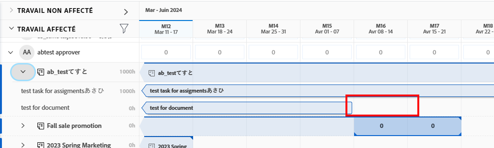
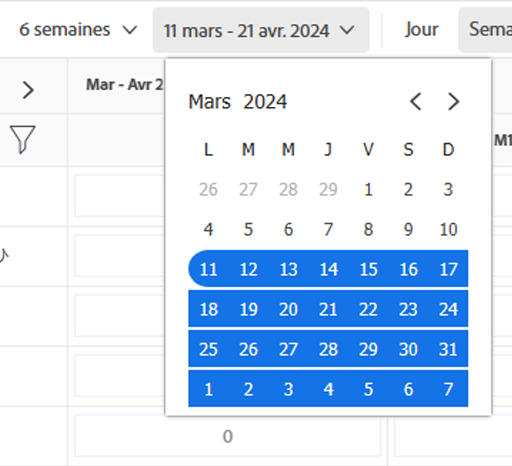
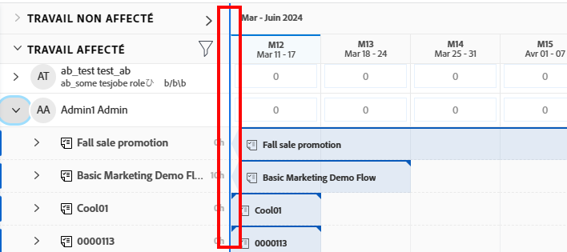
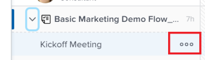
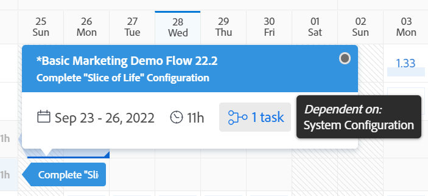

# Trouver l’équilibreur de charge de travail

<!--Audited: 12/2024-->

Utilisez l’équilibreur de charge de travail d’Adobe Workfront pour affecter le travail aux utilisateurs et aux utilisatrices en fonction de leur disponibilité. Cet article vous explique comment utiliser les options et les paramètres pour naviguer dans l’équilibreur de charge de travail et afficher les informations qui vous intéressent. D’autres articles répertoriés ici décrivent comment vous pouvez utiliser l’équilibreur de charge de travail pour gérer vos ressources et leurs affectations.

L’équilibreur de charge de travail est disponible dans plusieurs zones d’Adobe Workfront. Son fonctionnement est similaire dans toutes les zones.

Pour plus d’informations sur l’emplacement de l’équilibreur de charge de travail, consultez la section [Localiser l’équilibreur de charge de travail](https://experienceleague.adobe.com/fr/docs/workfront/using/manage-resources/the-workload-balancer/locate-workload-balancer).

## Conditions d’accès

+++ Développez pour afficher les exigences d’accès aux fonctionnalités de cet article.

<table style="table-layout:auto"> 
 <col> 
 <col> 
 <tbody> 
  <tr> 
   <td>Package Adobe Workfront</td> 
   <td>
Tous
</td>
  </tr>
  <tr> 
   <td>Licence Adobe Workfront</td> 
   <td>
Standard

       
Plan, lors de l’utilisation de l’équilibreur de charge de travail dans la zone Ressource ; Travail, lors de l’utilisation de l’équilibreur de charge de travail d’une équipe ou d’un projet
</td>
  </tr>
  <tr> 
   <td>Configurations des niveaux d’accès</td> 
   <td> 
Accès Affichage ou niveau supérieur aux éléments suivants :
 
    <ul> 
     <li>Gestion des ressources</li> 
     <li>Projets</li> 
     <li>Tâches</li> 
     <li>Problèmes</li> 
    </ul>
   </td> 
  </tr> 
  <tr> 
   <td>Autorisations d’objet</td> 
   <td>Autorisations en affichage ou autorisations supérieures pour les projets, les tâches et les problèmes</td> 
  </tr> 
 </tbody> 
</table>

Pour plus d’informations, voir [Conditions d’accès requises dans la documentation Workfront](/help/quicksilver/administration-and-setup/add-users/access-levels-and-object-permissions/access-level-requirements-in-documentation.md).

+++

## Remarques concernant l’affichage des éléments dans l’équilibreur de charge de travail

Tenez compte des éléments suivants lors de l’affichage de l’équilibreur de charge de travail :

* L’équilibreur de charge de travail affiche les éléments de travail dans deux zones distinctes, en fonction de leur affectation. Les éléments de travail et les utilisateurs et les utilisatrices s’affichent dans les zones suivantes :

  * **Travail non affecté** : éléments qui n’ont pas d’affectation ou qui sont affectés uniquement à des fonctions ou à des équipes.
  * **Travail affecté** : éléments affectés au moins à un utilisateur ou à une utilisatrice. Les éléments affectés s’affichent sous le nom des personnes affectées.

  >[!NOTE]
  >
  >* Les éléments de travail affectés à une fonction ou équipe et aussi à un utilisateur ou à une utilisatrice apparaissent simultanément dans la zone de travail non affecté et sous le nom de la personne affectée dans la zone de travail affecté.
  >* Les éléments de travail affectés simultanément à un utilisateur ou à une utilisatrice et à une fonction, avec cette dernière comme cessionnaire principale, sont visibles dans la zone de travail non affecté.
  >* Les éléments de travail affectés à plusieurs utilisateurs et utilisatrices s’affichent sous les noms de toutes les personnes affectées dans la zone de travail affecté.
  >* Les affectations de rôles sont affichées sous éléments de travail dans la zone Tâches non affectées lorsque le paramètre Afficher les affectations de rôles est activé. Pour plus d’informations, voir la section [Personnaliser la vue](#customize-the-view) de cet article.

  Pour plus d’informations, voir [Zones d’affectation dans l’équilibreur de charge de travail](/help/quicksilver/resource-mgmt/workload-balancer/assign-work-in-workload-balancer.md#assignment-areas-in-the-workload-balancer) dans [Présentation de l’affectation de tâches dans l’équilibreur de charge de travail](/help/quicksilver/resource-mgmt/workload-balancer/assign-work-in-workload-balancer.md).

* Lorsqu’aucune tâche n’a été affectée à un projet pendant une période donnée, la barre au niveau du projet est vide pour cette période.

  

* Si vous ne possédez pas les autorisations nécessaires pour accéder à certains éléments, ils apparaîtront comme **éléments de travail inaccessibles** ou **projets inaccessibles**.

  

* Les noms des éléments de travail s’affichent à gauche et leur chronologie s’affiche à droite.
* Le nombre total d’heures prévues pour chaque élément de travail est indiqué à droite du nom de l’élément de travail et à gauche de la barre représentant sa chronologie.
* Le nombre total d’heures prévues pour chaque projet est indiqué à droite du nom du projet et à gauche de la barre représentant sa chronologie.

  Les informations sur le nombre d’heures prévues pour le projet correspondent au total d’heures prévues de tous les éléments répertoriés dans l’équilibreur de charge de travail, et non au total d’heures prévues du projet.

Pour plus d’informations sur l’affichage des informations dans l’équilibreur de charge de travail, consultez également les articles suivants :

* [Localiser l’équilibreur de charge de travail](../workload-balancer/locate-workload-balancer.md)
* [Filtrer des informations dans l’équilibreur de charge de travail](../workload-balancer/filter-information-workload-balancer.md)
* [Partager l’équilibreur de charge de travail avec un lien](../workload-balancer/share-link-for-workload-balancer.md)
* [Mettre à jour les éléments de travail dans l’équilibreur de charge de travail à l’aide du Résumé](../workload-balancer/update-items-in-summary-panel-in-workload-balancer.md)

Pour plus d’informations sur la gestion des ressources à l’aide de l’équilibreur de charge de travail, consultez également les articles suivants :

* [Vue d’ensemble de l’affectation de travail dans l’équilibreur de charge de travail](https://experienceleague.adobe.com/fr/docs/workfront/using/manage-resources/the-workload-balancer/assign-work-in-workload-balancer)
* [Gérer les affectations des utilisateurs et utilisatrices dans l’équilibreur de charge de travail](https://experienceleague.adobe.com/fr/docs/workfront/using/manage-resources/the-workload-balancer/manage-user-allocations-workload-balancer)

## Naviguer dans l’équilibreur de charge de travail pour plusieurs projets dans la zone Ressources

La navigation dans l’équilibreur de charge de travail est similaire dans toutes les zones à partir desquelles vous y accédez.

Les sous-sections suivantes décrivent comment afficher les informations de l’équilibreur de charge de travail pour plusieurs projets.

Vous pouvez ajuster un certain nombre de paramètres et d’options dans l’équilibreur de charge de travail pour afficher les informations pour la période qui vous convient le mieux.

Après avoir sélectionné les paramètres que vous souhaitez appliquer à votre vue, l’équilibreur de charge de travail se souvient de ces paramètres chaque fois que vous y accédez à partir d’un navigateur ou d’un appareil.

### Accéder à l’équilibreur de charge de travail pour plusieurs projets dans la zone Ressources

Pour naviguer dans l’équilibreur de charge de travail pour plusieurs projets, procédez comme suit :

{{step1-to-resourcing}}

1. Cliquez sur **Équilibreur de charge de travail** dans le panneau de gauche.

   

   L’équilibreur de charge de travail affiche les informations relatives à l’affectation du travail à partir de la semaine en cours dans les deux zones suivantes :

   * La zone **Travail non affecté** affiche les éléments de travail suivants :

     * Les éléments de travail (tâches et problèmes) affectés à des rôles, à des équipes ou non affectés s’affichent après l’application de filtres.
       Par défaut, la zone Travail non affecté n’affiche aucun élément de travail. Nous vous recommandons d’utiliser des filtres pour afficher des informations pertinentes dans cette zone.

       Pour plus d’informations sur l’utilisation des filtres, voir [Filtrer les informations dans l’équilibreur de charge de travail](../workload-balancer/filter-information-workload-balancer.md).

     * Les affectations de rôles sous éléments de travail s’affichent uniquement lorsque vous activez le paramètre Afficher les affectations de rôles . Pour plus d’informations, voir la section [Personnaliser la vue](#customize-the-view) de cet article.

     * Les projets ne s’affichent que lorsque vous activez le paramètre Grouper par projet. Pour plus d’informations, voir la section [Personnaliser la vue](#customize-the-view) de cet article.

   * La zone **Travail affecté** affiche les éléments de travail suivants :

     * Tous les utilisateurs et utilisatrices actifs du système s’affichent par défaut dans cette zone. Nous vous recommandons d’utiliser des filtres pour limiter la quantité d’informations dans cette zone. Si des utilisateurs et utilisatrices sont affectés à des éléments, les éléments de travail s’affichent également sous leur nom.

     * Les tâches et les problèmes affectés à au moins un utilisateur ou une utilisatrice s’affichent sous le nom de ce dernier.

       Les éléments de travail sous les noms des utilisateurs et utilisatrices dans la zone Travail affecté sont triés selon les critères suivants, dans cet ordre :

       1. Date de début prévue (la plus ancienne en premier)
       1. Date d’achèvement prévue (la plus ancienne en premier)
       1. Ordre alphabétique par projet (uniquement lorsque les deux premiers critères sont identiques pour plusieurs éléments de travail)

          >[!TIP]
          >
          >* Vous pouvez personnaliser le tri des projets en sélectionnant une option dans le paramètre « Trier les projets par ».
          >
          >* Les projets ne s’affichent que lorsque vous activez le paramètre « Grouper par projet ».
          > 
          >Pour plus d’informations sur la personnalisation des paramètres, voir la section [Personnaliser la vue](#customize-the-view) de cet article.

1. (Facultatif) Cliquez sur l’icône **Filtrer**  dans la zone **Travail affecté**, puis sélectionnez **Filtre par défaut** dans la zone **Suggéré** de la boîte de dialogue des filtres.

   Lorsque vous appliquez le filtre par défaut, les utilisateurs et utilisatrices qui appartiennent à l’une de vos équipes et leurs éléments de travail s’affichent. Vous pouvez modifier une copie de ce filtre.

   >[!TIP]
   >
   >Le filtre par défaut n’est disponible que dans l’équilibreur de charge de travail, dans la zone Ressources.

1. Poursuivez les étapes suivantes pour naviguer dans l’équilibreur de charge de travail :

   * [Sélectionner une période dans l’équilibreur de charge de travail](#select-a-time-frame-in-the-workload-balancer)
   * [Personnaliser la vue](#customize-the-view)
   * [Affecter des éléments de travail et ajuster les affectations des utilisateurs et des utilisatrices](#assign-work-items-and-adjust-user-allocations)
   * [Afficher les affectations dans un graphique](#view-allocations-in-a-chart)

### Sélectionner une période dans l’équilibreur de charge de travail

1. Accédez à l’équilibreur de charge de travail dans la zone **Ressources**, comme décrit dans la section [Accéder à l’équilibreur de charge de travail pour plusieurs projets dans la zone Ressources](#access-the-workload-balancer-for-multiple-projects-in-the-resourcing-area) de cet article.

   L’équilibreur de charge de travail affiche des informations d’affectation de travail à partir de la semaine en cours.

1. Utilisez le défilement horizontal pour afficher la chronologie des éléments de travail qui dépassent les limites de l’écran.
1. Cliquez sur les icônes **précédent et suivant**  dans le coin supérieur gauche pour naviguer dans la chronologie, puis cliquez sur **Aujourd’hui** pour revenir à la semaine en cours.
1. Cliquez sur le **menu déroulant de la chronologie** dans la barre d’outils, puis cliquez sur la date de début de la période que vous souhaitez afficher. Par défaut, la première semaine sélectionnée dans le calendrier est la semaine vers laquelle vous avez navigué.

   

1. Sélectionnez le nombre de semaines que vous souhaitez afficher en même temps dans l’équilibreur de charge de travail parmi les options suivantes :
   * 1 semaine
   * 2 semaines
   * 4 semaines Il s’agit du paramètre par défaut.
   * 6 semaines
   * 3 mois

   

1. Cliquez sur l’une des options suivantes dans la barre d’outils pour afficher les informations selon différentes périodes :
   * **Jour** : affiche les informations par jour pendant quatre semaines en commençant par la date d’aujourd’hui par défaut.
   * **Semaine** : affiche les informations par semaine pendant quatre semaines.
   * **Mois** : affiche les informations par mois pendant trois mois.

1. Continuez à naviguer dans l’équilibreur de charge de travail comme décrit dans les sections suivantes.

### Personnaliser la vue

1. Accédez à l’équilibreur de charge de travail dans la zone **Ressources**, comme décrit dans la section [Accéder à l’équilibreur de charge de travail pour plusieurs projets dans la zone Ressources](#access-the-workload-balancer-for-multiple-projects-in-the-resourcing-area) de cet article.

   Les noms des éléments de travail sont répertoriés sur le côté gauche et sont représentés par des barres sur le côté droit de l’équilibreur de charge de travail. La longueur de la barre représente la chronologie d’un élément de travail.

1. (Facultatif et recommandé) Utilisez des filtres dans les zones Travail non affecté et Travail affecté pour afficher uniquement les éléments de travail ou les utilisateurs et utilisatrices qui vous concernent.

   Pour plus d’informations, voir [Filtrer des informations dans l’équilibreur de charge de travail](../workload-balancer/filter-information-workload-balancer.md).

   Par défaut, les barres bleues représentent les chronologies des projets et des tâches et les barres marron représentent les problèmes.

   Vous pouvez changer la couleur des barres pour les projets et les tâches lorsque vous sélectionnez votre thème de couleur pour correspondre au projet. Pour plus d’informations, continuez à lire cette procédure.

   Les éléments de travail de la zone Travail affecté sont triés par projet selon les critères suivants dans cet ordre :
   1. Date de début prévue (la plus ancienne en premier)
   1. Date d’achèvement prévue (la plus ancienne en premier)
   1. Ordre alphabétique par projet (uniquement lorsque les deux premiers critères sont identiques pour plusieurs éléments de travail)

1. Cliquez sur la flèche **pointant vers la droite** à gauche des zones Non affecté ou Affecté pour développer tous les éléments sous les noms de projet (dans la zone Non affecté) et sous les noms d’utilisateur et utilisatrice (dans la zone Affecté).

   >[!TIP]
   >
   >Les éléments de travail sont répertoriés sous les noms de projet dans la zone Non attribué uniquement lorsque vous activez le paramètre « Regrouper par projet ».

1. Cliquez sur la flèche **pointant vers le bas** à gauche des zones Non affecté ou Affecté pour réduire tous les éléments sous les noms de projet (dans la zone Non affecté) et sous les noms d’utilisateur et utilisatrice (dans la zone Affecté).

1. Pointez dessus, puis faites glisser et déposez la **ligne de séparation** entre le panneau de gauche et la zone de la chronologie pour ajuster la taille du panneau de gauche.

   

1. Cliquez sur l’icône **Paramètres** .

   Le panneau Paramètres s’affiche sur la droite.

   

   Sélectionnez l’une des options ci-dessous pour mettre à jour les informations affichées dans l’équilibreur de charge de travail, puis cliquez sur l’**icône X** en haut à droite de la zone Paramètres pour la fermer.

   * **Regrouper par projet** : lorsque cette option est sélectionnée, les éléments des zones Travail non affecté et Travail affecté sont regroupés par projet. Cette option est sélectionnée par défaut.

   * **Inclure les heures des problèmes** : lorsque cette option est sélectionnée, les problèmes affectés aux utilisateurs et utilisatrices s’affichent sous le nom de l’utilisateur ou de l’utilisatrice dans la zone Travail affecté et les problèmes qui ne sont pas affectés aux utilisateurs et utilisatrices s’affichent dans la zone Travail non affecté. Les heures prévues des problèmes sont prises en compte dans les heures prévues du projet et de l’utilisateur ou utilisatrice dans la zone Travail affecté.
   * **Afficher les dates prévisionnelles** : lorsque cette option est sélectionnée, la chronologie prévisionnelle des éléments de travail s’affiche en plus de la chronologie planifiée. Remarquez ce qui suit :
     * La chronologie prévisionnelle d’un projet, d’une tâche et d’un problème s’affiche sous la forme d’une ligne bleu foncé au-dessus des barres des tâches, des problèmes et des projets.
     * La chronologie prévisionnelle qui se trouve en dehors de la chronologie planifiée s’affiche en bleu clair, même lorsque vous mettez à jour le thème de couleur, comme décrit ci-dessous.
     * La chronologie prévisionnelle des éléments auxquels vous n’avez pas accès s’affiche en gris clair avec une ligne en dessous.
     * Lorsqu’une tâche ou un problème est terminé avant la date d’achèvement prévue, les numéros d’affectation pour les jours restants sont rayés et ne comptent pas dans l’affectation de l’utilisateur ou utilisatrice. Cela s’affiche que lorsque le paramètre Afficher les dates prévisionnelles et l’icône Afficher l’affectation sont tous deux activés.

     >[!TIP]
     >
     >Vous remarquerez que les éléments de travail s’affichent dans l’équilibreur de charge de travail lorsque leurs chronologies planifiées ou prévisionnelles (pas nécessairement les deux en même temps) se produisent au cours de la période sélectionnée.

   * **Afficher le travail terminé** : lorsque cette option est activée, les tâches et les problèmes terminés s’affichent dans la zone de travail affecté. Cette option est activée par défaut.

     Quand une tâche ou un problème est terminé(e), une icône en forme de coche verte apparaît dans le coin supérieur droit de leur barre respective. La même icône s’affiche pour un projet lorsque les tâches ou les problèmes de la période sélectionnée pour le projet sont terminés.

     >[!NOTE]
     >
     >La visibilité des tâches dans l’équilibreur de charge de travail dépend de l’achèvement de la tâche au niveau de la tâche, et non de celui de l’affectation. Si une tâche comporte plusieurs délégataires et qu&#39;un ou plusieurs d&#39;entre eux sélectionnent « Terminé avec ma partie » mais que le statut global de la tâche n&#39;est pas Terminé, la tâche est considérée comme un travail non terminé. Lorsque l&#39;option **Afficher le travail terminé** est désactivée, la tâche s&#39;affiche toujours car elle n&#39;est pas entièrement terminée.

   * **Afficher le temps restant** : lorsque cette fonction est activée, Workfront affiche l’écart entre les heures de disponibilité journalière de l’utilisateur ou de l’utilisatrice, selon ses horaires, et les heures affectées dans la section de travail affecté pour ces personnes. Cette fonction est désactivée par défaut et le temps affecté s’affiche par défaut.
   * **Afficher les affectations de rôle** : lorsque cette option est activée, les affectations de rôle s’affichent dans la zone Tâches non affectées sous les éléments de travail qui leur sont affectés. Cette option est activée par défaut.

   * Dans la section **Sélectionner le thème de couleur**, sélectionnez la couleur que vous souhaitez pour les barres de projet et de tâches.

     >[!TIP]
     >
     >La sélection d’un thème de couleur ne modifie pas la couleur des barres représentant les problèmes. Les problèmes s’affichent toujours dans une barre de couleur marron.

     Sélectionnez l’une des options suivantes :
     * **Par défaut** : les barres de tous les projets et de leurs éléments de travail s’affichent en bleu.
     * **Projet** : les barres associées à chaque projet et à ses tâches changent en fonction du nom du projet. Toutes les tâches appartenant au projet s’affichent dans des barres dont la couleur correspond à celle du projet. Les barres de projet s’affichent dans une teinte plus claire pour se distinguer des tâches. Lorsque les affectations sont masquées, les barres de projet affichent toujours une icône de projet.
     * **Statut du projet** : la couleur des barres représentant chaque projet et ses éléments de travail associés varie selon le statut du projet.

       Le statut du projet est celui associé au groupe du projet. Lorsqu’un groupe n’est associé à aucun statut particulier, la couleur des barres pour les éléments de travail reflète le statut du projet défini au niveau du système. Les statuts définis au niveau du système ainsi que les statuts personnalisés sont affichés. Pour plus d’informations sur les statuts de groupe, consultez la section [Créer ou modifier un statut de groupe](../../administration-and-setup/manage-groups/manage-group-statuses/create-or-edit-a-group-status.md).

   * Dans la section **Afficher l’affectation des utilisateurs et des utilisatrices dans**, sélectionnez l’une des options suivantes :
     * **Heures** : affiche le temps affecté en heures. Il s’agit de la valeur par défaut.
     * **Pourcentage** : affiche le temps affecté en pourcentage du temps total disponible.
   * Dans la section **Préférences de tri**, sélectionnez la façon dont vous souhaitez que les éléments soient triés dans l’équilibreur de charge de travail. Sélectionnez l’une des options suivantes :
     * **Trier les utilisateurs et les utilisatrices par rôle principal** : dans la zone de travail affecté, ces personnes sont listées selon l’ordre alphabétique de leur rôle principal.
     * **Trier les utilisateurs et les utilisatrices par ordre alphabétique** : les noms de ces personnes apparaissent suivant l’ordre alphabétique de leurs prénoms dans la zone de travail affecté.
     * **Trier les projets par** : sélectionnez un champ de projet dans le menu déroulant pour organiser les projets alphabétiquement selon ce champ, que ce soit dans les zones de travail non affecté ou affecté.

   >[!TIP]
   >
   >Le tri par projet est uniquement possible lorsque l’option de regroupement par projet est activée. Dans le cas contraire, ce paramètre est grisé.

1. (Facultatif et le cas échéant) En ajustant le thème de couleur au statut du projet, placez le curseur sur le nom du projet à gauche pour voir s’afficher son statut.

   

### Affecter des éléments de travail et ajuster les affectations des utilisateurs et des utilisatrices

1. Accédez à l’équilibreur de charge de travail dans la zone des ressources, comme décrit dans cet article à la section [Accéder à l’équilibreur de charge de travail pour plusieurs projets dans la zone des ressources](#access-the-workload-balancer-for-multiple-projects-in-the-resourcing-area).
1. Cliquez sur l’**icône Afficher les affectations**  pour consulter le nombre d’heures affectées par jour ou par semaine aux éléments de travail.

   Le nom dans les barres des éléments de travail est alors remplacé par le nombre d’heures prévues, soit quotidiennes soit hebdomadaires, dans les zones de travail non affecté et affecté. Ce paramètre est désactivé par défaut.

   Les jours présentant des surallocations s’affichent en rouge.

   >[!TIP]
   >
   >* L’option Afficher les allocations n’affecte que l’affichage des projets, des tâches, des problèmes et des éléments inaccessibles. Le nombre d’heures prévues par jour pour les utilisateurs et les utilisatrices s’affiche par défaut et ne peut pas être masqué.
   >* Pour visualiser le nombre d’heures quotidiennes prévues par projet, activez l’option Regrouper par projet.
   >* Lorsque vous affichez l’équilibreur de charge de travail par semaine, le nombre affiché représente le nombre d’heures hebdomadaires prévues.

1. (Facultatif) Pointez sur le temps affecté dans la ligne de l’utilisateur ou de l’utilisatrice pour comprendre la capacité et l’affectation de cette personne. La capacité est la disponibilité de l’utilisateur ou de l’utilisatrice en fonction de son planning.

   

1. (Facultatif) Cliquez sur l’icône **Masquer les allocations**  pour afficher le nom des tâches et des événements dans les barres des éléments de travail.
1. Cliquez sur l’icône **Plus de menu**  à droite d’une tâche, d’un événement ou d’un nom de rôle, puis cliquez sur l’une des options ci-dessous.

   

   * **Affecter ceci à**, puis commencez à saisir le nom d’un utilisateur, d’une utilisatrice, d’un rôle ou d’une équipe à qui vous voulez affecter le document de travail dans le champ **Rechercher des personnes, des rôles ou des équipes**.

     Cliquez sur **Avancé** pour accéder à l’écran Affectations avancées de l’élément de travail. Pour plus d’informations, voir la section [Créer des affectations avancées](/help/quicksilver/manage-work/tasks/assign-tasks/create-advanced-assignments.md).

     Vous pouvez également utiliser les raccourcis suivants pour affecter des tâches ou des problèmes :

     * Sous Windows : cliquez sur la barre des tâches ou des problèmes en maintenant la touche CTRL enfoncée.
     * Sur Mac : cliquez sur la barre des tâches ou des problèmes en maintenant la touche CMD enfoncée.

     Pour plus d’informations sur l’affectation d’éléments de travail aux utilisateurs et aux utilisatrices dans l’équilibreur de charge de travail, consultez la section [Vue d’ensemble de l’affection du travail dans l’équilibreur de charge de travail](../workload-balancer/assign-work-in-workload-balancer.md).

     >[!NOTE]
     >
     >Les affectations de rôles ne s’affichent sous éléments de travail que dans la zone Tâches non affectées lorsque le paramètre Afficher les affectations de rôles est activé. Pour plus d’informations, voir la section [Personnaliser la vue](#customize-the-view) de cet article. Les affectations de rôles ne comportent que l’option **Affecter à** dans le menu **Plus**.

     >[!TIP]
     >
     >Si la fonction de délégation a été activée par l’équipe d’administration de Workfront ou de groupes dans votre environnement, utilisez l’onglet des affectations pour affecter des utilisateurs et des utilisatrices à la tâche ou au problème. Pour plus d&#39;informations sur la délégation de travail, voir [Déléguer des tâches et des événements](../../manage-work/delegate-work/how-to-delegate-work.md).

   * **Modifiez les allocations**, puis modifiez les allocations quotidiennes ou hebdomadaires de l’utilisateur ou de l’utilisatrice. Pour plus d’informations sur la gestion des affectations des utilisateurs et utilisatrices, voir [Gérer les affectations des utilisateurs et utilisatrices dans l’équilibreur de charge de travail](../workload-balancer/manage-user-allocations-workload-balancer.md).

   * **Ouvrez le résumé**. Lorsque le panneau Résumé s’ouvre sur la droite, cliquez sur le champ Affectations et commencez à saisir le nom d’un utilisateur ou d’une utilisatrice, d’un rôle ou d’une équipe dans le champ **Rechercher des personnes, des rôles ou des équipes** pour affecter l’élément. Pour plus d’informations, voir la section [Afficher plus d’informations relatives aux tâches et aux problèmes](#display-more-information-about-tasks-and-issues) dans cet article.

1. (Facultatif) Double-cliquez sur une affectation journalière ou hebdomadaire pour un utilisateur ou une utilisatrice dans la barre d’un élément de travail pour modifier le nombre d’heures allouées, puis cliquez sur l’icône **Enregistrer**  pour enregistrer les affectations ou sur l’icône **Annuler**  pour supprimer les affectations que vous avez ajustées.

   >[!TIP]
   >
   >Les icônes Enregistrer et Annuler s’affichent à la fin de la barre chronologique d’une tâche ou d’un problème.
   >
   >

   Pour plus d’informations sur la gestion des affectations des utilisateurs et utilisatrices, voir [Gérer les affectations des utilisateurs et utilisatrices dans l’équilibreur de charge de travail](../workload-balancer/manage-user-allocations-workload-balancer.md).

1. Cliquez sur **Affectations groupées** pour affecter des éléments de travail en masse.

   Pour plus d’informations, voir [Affecter du travail en masse dans l’équilibreur de charge de travail](../workload-balancer/assign-work-in-workload-balancer-in-bulk.md).
1. Faites glisser les éléments de la zone **Travail non affecté** ou d’un utilisateur ou d’une utilisatrice et déposez-les sur une autre personne pour les assigner.

   Pour plus d’informations, voir [Affecter du travail dans l’équilibreur de charge de travail par glisser-déposer](../workload-balancer/assign-work-in-workload-balancer-by-drag-and-drop.md).

### Afficher les affectations dans un graphique

Au lieu d’afficher les affectations sous forme de chiffres quotidiens ou hebdomadaires, vous pouvez les consulter sous forme de graphique.

1. Accédez à l’équilibreur de charge de travail dans la zone Ressources, comme décrit dans la section [Accéder à l’équilibreur de charge de travail pour plusieurs projets dans la zone Ressources](#access-the-workload-balancer-for-multiple-projects-in-the-resourcing-area) de cet article.
1. Cliquez sur l’**icône Graphique**  pour afficher l’affectation des utilisateurs et utilisatrices sous forme de graphique.

   Les jours où l’utilisateur ou l’utilisatrice est en suraffectation s’affichent en rouge, tandis que les jours où la personne est en sous-affectation ou à pleine capacité s’affichent en bleu.

   La taille des blocs indique la durée de l’affectation : plus la case est grande, plus le temps alloué à l’utilisateur ou à l’utilisatrice pour les tâches à effectuer dans la journée ou dans la semaine est important.

   

### Afficher plus d’informations relatives aux tâches et aux problèmes

Vous pouvez obtenir de plus amples informations sur les tâches et les problèmes dans l’équilibreur de charge de travail.

1. Accédez à l’équilibreur de charge de travail dans la zone des ressources, comme décrit dans cet article à la section [Accéder à l’équilibreur de charge de travail pour plusieurs projets dans la zone des ressources](#access-the-workload-balancer-for-multiple-projects-in-the-resourcing-area).
1. Pour afficher plus d’informations dans le panneau de résumé, effectuez l’une des opérations suivantes :

   * Cliquez sur la barre d’une tâche ou d’un problème pour ouvrir le panneau Résumé à droite.
   * Cliquez sur l’icône **Ouvrir le résumé** , puis cliquez sur la barre d’une tâche ou d’un événement pour ouvrir le panneau Résumé.
   * Cliquez sur le menu **Plus** à droite d’une tâche ou d’un problème, puis cliquez sur **Ouvrir le résumé**.

   Pour plus d’informations sur la mise à jour des informations relatives aux tâches dans le résumé de l’équilbreur de charge de travail, consultez la section [Mettre à jour les éléments de travail dans l’équilbreur de charge de travail à l’aide du résumé](../workload-balancer/update-items-in-summary-panel-in-workload-balancer.md).

1. Pointez sur le nom d’une tâche ou d’un problème pour obtenir plus d’informations à son sujet. Une zone s’affiche au-dessus de la tâche ou du problème avec les informations suivantes :

   * Le nom de la tâche ou du problème.
   * Le nom du projet.
   * Les dates de début et d’achèvement prévues.
   * Le nombre d’heures prévues.
   * Pour les tâches, le numéro de la tâche antérieure.
   * Pour les tâches, un indicateur dans le coin supérieur de la zone indique si la tâche est prête ou non à être traitée.

   

1. Cliquez sur le nom d’un élément de travail à gauche pour y accéder. Le document de travail s’ouvre dans un nouvel onglet du navigateur.

### Afficher l’équilibreur de charge de travail en plein écran

1. Accédez à l’équilibreur de charge de travail dans la zone de ressources, comme décrit dans cet article à la section [Accéder à l’équilibreur de charge de travail pour plusieurs projets dans la zone de ressources](#access-the-workload-balancer-for-multiple-projects-in-the-resourcing-area).

1. Cliquez sur l’icône **Plein écran**  pour afficher l’équilibreur de charge de travail en plein écran.

   L’équilibreur de charge de travail occupe tout l’écran. Les fenêtres et les onglets du navigateur sont exclus de la vue.

1. Cliquez sur l’icône **Quitter le mode plein écran**  pour revenir à l’écran par défaut et afficher l’équilibreur de charge de travail dans l’onglet du navigateur.

## Naviguer dans l’équilibreur de charge de travail d’une équipe

La navigation dans l’équilibreur de charge de travail d’une équipe est similaire à celle dans l’équilibreur de charge de travail de plusieurs projets. Pour plus d’informations, voir la section [Naviguer dans l’équilibreur de charge de travail de plusieurs projets](#navigate-the-workload-balancer-for-multiple-projects-in-the-resourcing-area) dans cet article.

{{step1-to-team}}

La page de votre équipe interne s’affiche par défaut.

1. Cliquez sur **Équilibreur de charge de travail** dans le panneau de gauche.

   

   L’équilibreur de charge de travail d’une équipe affiche par défaut les informations suivantes :

   * Dans la zone **Tâches non affectées** : tâches affectées à l’équipe ou à l’équipe et fonctions et qui ne sont pas affectées aux utilisateurs. Les affectations de rôles sont affichées sous éléments de travail dans la zone Tâches non affectées lorsque le paramètre Afficher les affectations de rôles est activé.
   * Dans la zone **Travail affecté** : les éléments de travail attribués aux personnes s’affichent sous le nom de ces dernières.

1. Continuez à naviguer dans l’équilibreur de charge de travail d’une équipe comme décrit dans la section [Parcourir l’équilibreur de charge de travail de plusieurs projets dans la zone Ressources](#navigate-the-workload-balancer-for-multiple-projects-in-the-resourcing-area) de cet article.

## Parcourir l’équilibreur de charge de travail d’un projet unique

{{step1-to-projects}}

1. Cliquez sur le nom d’un projet pour ouvrir la page du projet.
1. Cliquez sur **Équilibreur de charge de travail** dans le panneau de gauche.

   

   L’équilibreur de charge de travail du projet affiche par défaut les informations suivantes :

   * Dans la zone **Tâches non affectées** : tâches du projet affectées à des rôles ou des équipes et non affectés à des utilisateurs. Les affectations de rôles sont affichées sous éléments de travail dans la zone Tâches non affectées lorsque le paramètre Afficher les affectations de rôles est activé.
   * Dans la zone **Travail affecté** : éléments de travail du projet qui sont affectés à au moins une personne.

   Nous vous recommandons d’utiliser des filtres pour n’afficher que les personnes qui sont importantes pour vous.

   Par exemple, vous pouvez envisager de n’afficher que les personnes qui appartiennent à vos équipes ou à vos groupes. Pour plus d’informations, consultez la section [Filtrer les informations dans l’équilibreur de charge de travail](../workload-balancer/filter-information-workload-balancer.md).

1. (Facultatif) Cliquez sur l’icône **Filtre**  dans la zone Travail affecté et sélectionnez l’option **Éléments de travail de ce projet** dans la zone **Suggéré** du panneau de filtre. Ce filtre est désélectionné par défaut.

   Lorsque cette option est sélectionnée, seuls les éléments affectés aux personnes du projet sélectionné s’affichent.

   Si l’option n’est pas sélectionnée, tous les éléments affectés aux personnes du projet s’affichent, quels que soient les projets auxquels ces éléments appartiennent.

1. (Facultatif et recommandé) Appliquez un filtre dans la zone Travail affecté pour afficher les personnes qui sont importantes pour vous mais qui peuvent ne pas être affectées à des éléments du projet, puis cliquez sur l’icône **Afficher tous les utilisateurs et utilisatrices** .

   En affichant toutes les personnes, vous pouvez afficher tous les utilisateurs et toutes les utilisatrices de Workfront qui ne sont pas encore affectés au travail ou à d’autres rôles sur le projet.

   Vous pouvez commencer par appliquer un filtre afin de réduire le nombre de personnes affichées.

   Par exemple, vous devriez peut-être commencer par filtrer les personnes qui appartiennent à vos équipes ou à vos groupes, puis afficher toutes ces personnes.

   Pour plus d’informations sur la création d’un filtre, consultez la section [Filtrer des informations dans l’équilibreur de charge de travail](../workload-balancer/filter-information-workload-balancer.md).

   >[!NOTE]
   >
   > L’option Afficher tous les utilisateurs et utilisatrices n’est disponible que pour l’équilibreur de charge de travail d’un projet.

1. (Facultatif) Cliquez sur l’icône **Afficher les allocations de rôles** .

   Le panneau Affectation des rôles s’affiche.

   Vous pouvez consulter les informations sur le nombre d’heures prévues associé aux fonctions du projet et aux fonctions associées aux initiatives liées aux projets à partir du planificateur de scénarios.

   Pour plus d’informations, consultez la section [Vue d’ensemble de la réconciliation des affectations de ressources entre les projets et les initiatives](../../scenario-planner/overview-reconcile-allocations-between-projects-initiatives.md).

   >[!NOTE]
   >
   >Vous ne pouvez pas consulter les informations sur une fonction liée à une initiative si votre organisation n’a pas acheté de licence pour le planificateur de scénarios Workfront. Dans ce cas, vous ne pouvez consulter que le nombre d’heures prévues associé aux fonctions du projet. Pour plus d’informations, consultez la section [Accès requis pour utiliser le planificateur de scénarios](../../scenario-planner/access-needed-to-use-sp.md).

1. Continuez à parcourir l’équilibreur de charge de travail d’un projet comme décrit dans la section [Parcourir l’équilibreur de charge de travail de plusieurs projets](#navigate-the-workload-balancer-for-multiple-projects-in-the-resourcing-area) de cet article.

## Naviguer dans l’équilibreur de charge de travail d’un utilisateur

Vous pouvez accéder à l’équilibreur de charge de travail à partir de votre propre profil utilisateur.

{{step1-click-profile-pic}}

1. Cliquez sur **Équilibreur de charge de travail** dans le panneau de gauche.

   L’équilibreur de charge de travail de l’utilisateur s’affiche.

   

   L’équilibreur de charge de travail d’un utilisateur affiche les informations suivantes par défaut :

   * **Travail affecté** : tâches et événements affectés à l’utilisateur spécifique.

   >[!NOTE]
   >
   >L’équilibreur de charge de travail sur un profil utilisateur est en lecture seule et les affectations et les allocations ne peuvent pas être modifiées.

1. Poursuivez la navigation dans l’équilibreur de charge de travail d’un utilisateur comme décrit dans la section [Naviguer dans l’équilibreur de charge de travail pour plusieurs projets](#navigate-the-workload-balancer-for-multiple-projects-in-the-resourcing-area) de cet article.

