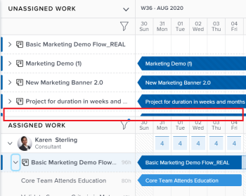

# Navigation dans l’équilibreur de charge de travail

Utilisez l’équilibreur de charge de travail dans Adobe Workfront pour affecter du travail aux utilisateurs en fonction de leur disponibilité. Cet article décrit comment utiliser les paramètres et options pour naviguer dans l’équilibreur de charge de travail et afficher les informations qui vous concernent. Les articles supplémentaires répertoriés ici décrivent comment vous pouvez utiliser l’équilibreur de charge de travail pour gérer vos ressources et leur allocation pour qu’elles fonctionnent.

L’équilibreur de charge de travail est disponible dans plusieurs zones d’Adobe Workfront. La navigation est similaire dans toutes les zones.

Pour plus d’informations sur l’emplacement de l’équilibreur de charge de travail, voir [Localisation de l’équilibreur de charge](https://experienceleague.adobe.com/docs/workfront/using/manage-resources/the-workload-balancer/locate-workload-balancer.html?lang=en).

## Exigences d’accès

<!--drafted - replace table for P&P:

<table style="table-layout:auto"> 
 <col> 
 <col> 
 <tbody> 
  <tr> 
   <td role="rowheader">Adobe Workfront plan*</td> 
   <td> 
Any 
 </td> 
  </tr> 
  <tr> 
   <td role="rowheader">Adobe Workfront license*</td> 
<td>
Current license: Standard 

    Or 

Legacy license:

    <ul>
    <li>
Plan, when using the Workload Balancer for a team or in the Resourcing area 
</li>
    <li>
Work, when using the Workload Balancer of a project 
</li>
    </ul>
 </td> 
  </tr> 
  <tr> 
   <td role="rowheader">Access level configurations*</td> 
   <td> 
View or higher access to the following:
 
    <ul> 
     <li> 
Resource Management
 </li> 
     <li> 
Projects
 </li> 
     <li> 
Tasks
 </li> 
     <li> 
Issues
 </li> 
    </ul> 
If you still don't have access, ask your Workfront administrator if they set additional restrictions in your access level. For information on how a Workfront administrator can change your access level, see <a href="../../administration-and-setup/add-users/configure-and-grant-access/create-modify-access-levels.md" class="MCXref xref">Create or modify custom access levels</a>.
 </td> 
  </tr> 
  <tr> 
   <td role="rowheader">Object permissions</td> 
   <td> 
View or higher permissions to the projects, tasks, and issues 
 
For information on requesting additional access, see <a href="../../workfront-basics/grant-and-request-access-to-objects/request-access.md" class="MCXref xref">Request access to objects </a>.
 </td> 
  </tr> 
 </tbody> 
</table>
-->

Vous devez disposer des accès suivants pour effectuer les étapes de cet article :

<table style="table-layout:auto"> 
 <col> 
 <col> 
 <tbody> 
  <tr> 
   <td role="rowheader">Formule Adobe Workfront*</td> 
   <td> 
Quelconque 
 </td> 
  </tr> 
  <tr> 
   <td role="rowheader">Licence Adobe Workfront*</td> 
   <td> 
Planifiez l’utilisation de l’équilibreur de charge de travail dans la zone Ressource .

   
Fonctionnement lors de l’utilisation de l’équilibreur de charge de travail d’une équipe ou d’un projet

 </td> 
  </tr> 
  <tr> 
   <td role="rowheader">Paramétrages du niveau d'accès*</td> 
   <td> 
Visualisez ou affichez un accès supérieur aux éléments suivants :
 
    <ul> 
     <li> 
Gestion des ressources
 </li> 
     <li> 
Projets
 </li> 
     <li> 
Tâches
 </li> 
     <li> 
Problèmes
 </li> 
    </ul> 
Si vous n’avez toujours pas accès à , demandez à votre administrateur Workfront s’il définit des restrictions supplémentaires à votre niveau d’accès. Pour plus d’informations sur la façon dont un administrateur Workfront peut modifier votre niveau d’accès, voir <a href="../../administration-and-setup/add-users/configure-and-grant-access/create-modify-access-levels.md" class="MCXref xref">Création ou modification de niveaux d’accès personnalisés</a>.
 </td> 
  </tr> 
  <tr> 
   <td role="rowheader">Autorisations d’objet</td> 
   <td> 
Afficher ou des autorisations supérieures pour les projets, les tâches et les problèmes 
 
Pour plus d’informations sur la demande d’accès supplémentaire, voir <a href="../../workfront-basics/grant-and-request-access-to-objects/request-access.md" class="MCXref xref">Demande d’accès aux objets </a>.
 </td> 
  </tr> 
 </tbody> 
</table>

*Pour connaître le plan, le type de licence ou l’accès dont vous disposez, contactez votre administrateur Workfront.

## Considérations pour l’affichage des éléments dans l’équilibreur de charge de travail

Tenez compte des points suivants lors de l’affichage de l’équilibreur de charge de travail :

* L’équilibreur de charge de travail affiche les tâches dans deux zones distinctes, en fonction de leurs affectations. Les éléments de travail et les utilisateurs s’affichent dans les zones suivantes :

   * **Travail non attribué**: éléments qui n’ont aucune affectation ou qui sont affectés uniquement à des rôles de tâche ou à des équipes.
   * **Travail assigné**: éléments affectés à au moins un utilisateur. Les éléments affectés s’affichent sous le nom de l’utilisateur affecté.

  >[!NOTE]
  >
  >* Les tâches affectées à un rôle de tâche ou à une équipe, et également affectées à un utilisateur, s’affichent dans la zone Travail non attribué et sous le nom de l’utilisateur affecté dans la zone Travail attribué.
  >* Les tâches affectées à un utilisateur et un rôle de tâche, où le rôle de tâche est sélectionné comme responsable principal de l’élément, s’affichent dans la zone Travail non attribué.
  >* Les tâches affectées à plusieurs utilisateurs s’affichent sous tous les noms des utilisateurs affectés dans la zone Travail attribué.

  Pour plus d’informations, voir &quot;Attribution de zones dans l’équilibreur de charge de travail&quot; dans [Présentation de l’affectation de travail dans l’équilibreur de charge de travail](/help/quicksilver/resource-mgmt/workload-balancer/assign-work-in-workload-balancer.md).

* Lorsqu’un projet n’a aucune tâche pendant une période donnée, la barre au niveau du projet est vide pour cette période.

  

* Lorsque vous ne disposez pas des autorisations nécessaires pour afficher certains éléments, ils s’affichent sous la forme **Éléments de travail inaccessibles** ou **Projets inaccessibles**.

  

* Les noms des tâches s’affichent à gauche et leur chronologie à droite.
* Le total des heures planifiées de chaque élément de travail s’affiche à droite du nom de l’élément de travail et à gauche de la barre qui représente la chronologie de l’élément de travail.
* Le total des heures planifiées de chaque projet s’affiche à droite du nom du projet et à gauche de la barre qui représente la chronologie du projet.

  Les informations Heures planifiées du projet sont un total des Heures planifiées de tous les éléments répertoriés dans l’équilibreur de charge de travail, et non un total des Heures planifiées du projet.

Pour plus d’informations sur l’affichage des informations dans l’équilibreur de charge de travail, consultez également les articles suivants :

* [Localisation de l’équilibreur de charge](../workload-balancer/locate-workload-balancer.md)
* [Filtrage des informations dans l’équilibreur de charge de travail](../workload-balancer/filter-information-workload-balancer.md)
* [Partage de l’équilibreur de charge de travail avec un lien](../workload-balancer/share-link-for-workload-balancer.md)
* [Mise à jour des éléments de travail dans l’équilibreur de charge de travail à l’aide du résumé](../workload-balancer/update-items-in-summary-panel-in-workload-balancer.md)

Pour plus d’informations sur la gestion des ressources à l’aide de l’équilibreur de charge de travail, voir également les articles suivants :

* [Présentation de l’affectation de travail dans l’équilibreur de charge de travail](https://experienceleague.adobe.com/docs/workfront/using/manage-resources/the-workload-balancer/assign-work-in-workload-balancer.html?lang=en)
* [Gestion des affectations utilisateur dans l’équilibreur de charge de travail](https://experienceleague.adobe.com/docs/workfront/using/manage-resources/the-workload-balancer/manage-user-allocations-workload-balancer.html?lang=en)

## Accédez à l’équilibreur de charge de travail pour plusieurs projets dans la zone Ressource .

La navigation dans l’équilibreur de charge de travail est similaire dans toutes les zones d’accès.

Les sous-sections suivantes décrivent comment afficher les informations dans l’équilibreur de charge de travail pour plusieurs projets.

Vous pouvez ajuster un certain nombre de paramètres et d’options dans l’équilibreur de charge de travail afin d’afficher les informations sur lesquelles vous devez vous concentrer au cours de la période qui vous convient le mieux.

Après avoir sélectionné les paramètres à appliquer à votre vue, l’équilibreur de charge de travail se souvient de ces paramètres chaque fois que vous y accédez depuis un navigateur ou un appareil.

### Accès à l’équilibreur de charge de travail pour plusieurs projets dans la zone Ressource

Pour naviguer dans l’équilibreur de charge de travail pour plusieurs projets :

1. Cliquez sur le bouton **Menu Principal** icon  dans le coin supérieur droit de Workfront, puis cliquez sur **Ressource**.
1. Cliquez sur **Équilibreur de charge de travail** dans le panneau de gauche.

   

   L’équilibreur de charge de travail affiche des informations d’affectation de travail à partir de la semaine en cours dans les deux domaines suivants :

   * La variable **Travail non attribué** affiche les tâches suivantes :

      * Éléments de travail (tâches et problèmes) affectés à des rôles, équipes ou qui ne sont pas affectés s’affichent une fois les filtres appliqués.
La zone de travail Non affecté n’affiche par défaut aucune tâche. Il est recommandé d&#39;utiliser des filtres pour afficher les informations vous concernant dans cette zone.

        Pour plus d’informations sur l’utilisation des filtres, voir [Filtrage des informations dans l’équilibreur de charge de travail](../workload-balancer/filter-information-workload-balancer.md).

      * Les projets s’affichent uniquement lorsque vous activez le paramètre Groupe par projet . Pour plus d’informations, voir la section [Personnalisation de la vue](#customize-the-view) dans cet article.

   * La variable **Travail assigné** affiche les tâches suivantes :

      * Tous les utilisateurs actifs du système s’affichent par défaut dans cette zone. Il est recommandé d&#39;utiliser des filtres pour limiter la quantité d&#39;informations dans cette zone. Si des utilisateurs sont affectés à des éléments, les éléments de travail s’affichent également sous leur nom.

      * Les tâches et les problèmes affectés à au moins un utilisateur s’affichent sous son nom.

        Les tâches sous les noms des utilisateurs dans la zone de travail affectée sont triées selon les critères suivants, dans cet ordre :

         1. Date de début planifiée (la plus ancienne en premier)
         1. Date d’achèvement prévue (la plus ancienne en premier)
         1. Alphabétique par projet (uniquement lorsque les deux premiers critères sont identiques pour plusieurs tâches)

            >[!TIP]
            >
            >* Vous pouvez personnaliser le tri des projets en sélectionnant une option dans le paramètre &quot;Trier les projets par&quot;.
            >
            >* Les projets s’affichent uniquement lorsque vous activez le paramètre &quot;Groupe par projet&quot;.
            > 
            >Pour plus d’informations sur la personnalisation des paramètres, voir la section [Personnalisation de la vue](#customize-the-view) dans cet article.

1. (Facultatif) Cliquez sur le **Filtrer** icon  dans le **Travail assigné** , puis sélectionnez la propriété **Filtre par défaut** dans le **Suggérée** de la zone de filtrage.

   Lors de l’application du filtre Par défaut, les utilisateurs appartenant à l’une de vos équipes et à leurs tâches s’affichent. Vous pouvez modifier une copie de ce filtre.

   >[!TIP]
   >
   >Le filtre Par défaut est disponible uniquement dans l’équilibreur de charge de travail de la zone Ressource .

1. Passez aux étapes suivantes pour naviguer dans l’équilibreur de charge de travail :

   * [Sélectionner une période dans l’équilibreur de charge de travail](#select-a-time-frame-in-the-workload-balancer)
   * [Personnalisation de la vue](#customize-the-view)
   * [Attribution d’éléments de travail et ajustement des affectations utilisateur](#assign-work-items-and-adjust-user-allocations)
   * [Affichage des affectations dans un graphique](#view-allocations-in-a-chart)

### Sélectionner une période dans l’équilibreur de charge de travail

1. Accédez à l’équilibreur de charge de travail dans la **Ressource** , comme décrit dans la section [Accès à l’équilibreur de charge de travail pour plusieurs projets dans la zone Ressource](#access-the-workload-balancer-for-multiple-projects-in-the-resourcing-area) dans cet article.

   L’équilibreur de charge de travail affiche des informations d’affectation de travail à partir de la semaine en cours.

1. Utilisez le défilement horizontal pour afficher la chronologie des tâches qui s’étendent au-delà des limites de l’écran.
1. Cliquez sur le bouton **back ou forward** icônes  dans le coin supérieur gauche pour parcourir la chronologie, puis cliquez sur **Aujourd&#39;hui** pour revenir à la semaine en cours.
1. Cliquez sur le bouton **menu déroulant de la période** dans la barre d’outils, cliquez sur la date de début de la période à afficher. Par défaut, la première semaine sélectionnée dans le calendrier correspond à la semaine à laquelle vous avez accédé.

   

1. Sélectionnez le nombre de semaines que vous souhaitez afficher à la fois dans l’équilibreur de charge de travail parmi les options suivantes :
   * 1 semaine
   * 2 semaines
   * 4 semaines. Il s’agit du paramètre par défaut.
   * 6 semaines
   * 3 mois

   

1. Cliquez sur l’une des options suivantes de la barre d’outils pour afficher les informations selon différentes périodes :
   * **Jour**: affiche des informations par jour pendant quatre semaines à partir de la date du jour, par défaut.
   * **Semaine**: affiche des informations par semaine pendant quatre semaines.
   * **Mois**: affiche des informations par mois pour trois mois.

1. Continuez à naviguer dans l’équilibreur de charge de travail comme décrit dans les sections suivantes.

### Personnalisation de la vue

1. Accédez à l’équilibreur de charge de travail dans la **Ressource** , comme décrit dans la section [Accès à l’équilibreur de charge de travail pour plusieurs projets dans la zone Ressource](#access-the-workload-balancer-for-multiple-projects-in-the-resourcing-area) dans cet article.

   Les noms des tâches sont répertoriés à gauche et sont représentés par des barres situées à droite de l’équilibreur de charge de travail. La longueur de la barre représente la chronologie d’un élément de travail.

1. (Facultatif et recommandé) Utilisez des filtres dans les zones Travail non assigné et Travail assigné pour afficher uniquement les tâches ou les utilisateurs qui vous intéressent.

   Pour plus d’informations, voir [Filtrage des informations dans l’équilibreur de charge de travail](../workload-balancer/filter-information-workload-balancer.md).

   Par défaut, les barres bleues représentent les chronologies des projets et des tâches et les barres de mise en forme représentent des problèmes.

   Vous pouvez modifier la couleur des barres pour les projets et les tâches lorsque vous sélectionnez le thème de couleur correspondant au projet. Pour plus d’informations, continuez à lire cette procédure.

   Les éléments de travail de la zone de travail affectée sont triés par projets selon les critères suivants, dans cet ordre :
   1. Date de début planifiée (la plus ancienne en premier)
   1. Date d’achèvement prévue (la plus ancienne en premier)
   1. Alphabétique par projet (uniquement lorsque les deux premiers critères sont identiques pour plusieurs tâches)

1. Cliquez sur le bouton **flèche pointant vers la droite** à gauche des zones Non affecté ou Affecté pour développer tous les éléments sous les noms de projet (dans la zone Non affecté) et sous les noms d’utilisateur (dans la zone Affecté).

   >[!TIP]
   >
   >Les éléments de travail sont répertoriés sous les noms de projet dans la zone Non affecté uniquement lorsque vous activez le paramètre &quot;Groupe par projet&quot;.

1. Cliquez sur le bouton **Flèche pointant vers le bas** à gauche des zones Non affecté ou Affecté afin de réduire tous les éléments sous les noms de projet (dans la zone Non affecté) et sous les noms d’utilisateur (dans la zone Affecté).

1. Faites glisser et déposez le **ligne de séparation** entre le panneau de gauche et la zone de chronologie pour ajuster la taille du panneau de gauche.

   

1. Cliquez sur le bouton **Paramètres** icon .

   Le panneau Paramètres s’affiche à droite.

   

   Sélectionnez parmi les options répertoriées ci-dessous pour mettre à jour les informations que vous consultez dans l’équilibreur de charge de travail, puis cliquez sur le bouton **Icône X** dans l’angle supérieur droit de la zone Paramètres pour la fermer.

   * **Groupe par projet**: lorsque cette option est sélectionnée, les éléments des zones Travail non attribué et Travail attribué sont regroupés par projet. Cette option est sélectionnée par défaut.

   * **Inclure les heures des problèmes**: lorsque cette option est sélectionnée, les problèmes affectés aux utilisateurs s’affichent sous le nom de l’utilisateur dans la zone Travail attribué et les problèmes qui ne sont pas affectés aux utilisateurs s’affichent dans la zone Travail non attribué. Les heures planifiées issues des problèmes sont comptabilisées dans les heures planifiées du projet et de l’utilisateur dans la zone de travail affectée.
   * **Afficher les dates prévues**: lorsque cette option est sélectionnée, la chronologie prévisionnelle des tâches s’affiche en plus de la chronologie planifiée. Notez les points suivants :
      * La chronologie prévue du projet, des tâches et des problèmes s’affiche sous la forme d’une ligne bleu foncé au-dessus des barres de tâche, de problème et de projet.
      * La chronologie projetée en dehors de la chronologie planifiée s’affiche en bleu clair, même lorsque vous mettez à jour le thème de couleur, comme décrit ci-dessous.
      * La chronologie prévue pour les éléments auxquels vous n’avez pas accès s’affiche en gris clair avec une ligne en dessous.
      * Lorsqu’une tâche ou un problème se termine avant la date d’achèvement planifiée prévue, les chiffres d’attribution pour les jours restants sont atteints et ne sont pas pris en compte dans l’attribution de l’utilisateur. Cette option s’affiche uniquement lorsque le paramètre Afficher les dates prévues et l’icône Afficher l’attribution sont activés.

     >[!TIP]
     >
     >Notez que les éléments de travail s’affichent dans l’équilibreur de charge de travail lorsque les chronologies planifiées ou projetées (pas nécessairement les deux en même temps) se produisent pendant la période sélectionnée.

   * **Afficher le travail terminé**: lorsque cette option est activée, les tâches terminées et les problèmes s’affichent dans la zone de travail attribué. Cette option est activée par défaut.

     Une icône en forme de coche verte s’affiche dans le coin supérieur droit d’une tâche ou d’une barre de problèmes une fois qu’elles sont terminées. La même icône s’affiche pour un projet lorsque les tâches ou les problèmes de la période sélectionnée du projet sont terminés.
   * **Afficher le temps restant**: lorsque cette option est activée, Workfront affiche la différence entre l’heure quotidienne à laquelle l’utilisateur est disponible pour travailler selon ses horaires et les heures pour lesquelles il est affecté dans la zone de travail affectée pour les utilisateurs. Cette option est désactivée par défaut et l’heure allouée s’affiche par défaut.
   * Dans le **Sélectionner le thème de couleur** , sélectionnez la couleur de votre choix pour les barres de projet et de tâche.

     >[!TIP]
     >
     >Le paramètre de sélection du thème de couleur n’affecte pas la couleur des barres de problème. Les problèmes s’affichent toujours dans une barre de couleur marron.

     Sélectionnez l’une des options suivantes :
      * **Par défaut**: les barres de tous les projets et de leurs tâches s’affichent en bleu.
      * **Projet**: les barres associées à chaque projet et à ses tâches changent en fonction du nom du projet. Toutes les tâches qui appartiennent au projet s’affichent dans des barres qui correspondent à la couleur du projet. Les barres de projet s’affichent dans une ombre plus claire pour les distinguer des tâches. Les barres de projet incluent également une icône de projet lorsque vous choisissez de ne pas afficher les affectations.
      * **État du projet**: les barres associées à chaque projet et à ses éléments de travail changent en couleur de l’état du projet.

        Le statut du projet est celui associé au groupe du projet. Si le groupe ne dispose pas d’états spécifiques au groupe, la couleur des barres d’éléments de travail est celle de l’état du projet au niveau du système. Les états système et personnalisés s’affichent. Pour plus d’informations sur les états d’un groupe, voir [Création ou modification d’un état de groupe](../../administration-and-setup/manage-groups/manage-group-statuses/create-or-edit-a-group-status.md).

   * Dans le **Afficher l’affectation des utilisateurs dans** , sélectionnez l’une des options suivantes :
      * **Heures**: affiche le temps alloué sous forme d’heures. Il s’agit du paramètre par défaut.
      * **Pourcentage**: affiche le temps alloué en pourcentage du temps disponible total
   * Dans le **Tri des préférences** , sélectionnez le mode de tri des éléments dans l’équilibreur de charge de travail. Sélectionnez l’une des options suivantes :
      * **Tri des utilisateurs par rôle de Principal**: les utilisateurs s’affichent dans l’ordre alphabétique de leurs rôles de Principal dans la zone Travail attribué.
      * **Trier les utilisateurs par ordre alphabétique**: les utilisateurs s’affichent dans l’ordre alphabétique de leur prénom dans la zone Travail attribué.
      * **Tri des projets par**: sélectionnez un champ de projet dans le menu déroulant pour trier les projets par ordre alphabétique en fonction de ce champ dans les zones Travail non assigné ou Travail assigné.

   >[!TIP]
   >
   >Vous pouvez trier les projets uniquement lorsque le paramètre Groupe par projet est activé. Sinon, ce paramètre est grisé.

1. (Facultatif et conditionnel) Lorsque vous définissez le thème de couleur sur État du projet, passez la souris sur le nom d’un projet à gauche pour afficher l’état du projet.

   

### Attribution d’éléments de travail et ajustement des affectations utilisateur

1. Accédez à l’équilibreur de charge de travail dans la zone Ressource, comme décrit dans la section . [Accès à l’équilibreur de charge de travail pour plusieurs projets dans la zone Ressource](#access-the-workload-balancer-for-multiple-projects-in-the-resourcing-area) dans cet article.
1. Cliquez sur le bouton **Icône Afficher les attributions**  pour afficher les heures planifiées quotidiennes ou hebdomadaires des tâches.

   Cette opération remplace le nom dans les barres des tâches par le nombre d’heures planifiées quotidiennes ou hebdomadaires dans les zones Travail non assigné et Affecté. Ce paramètre est désactivé par défaut.

   Les jours qui présentent des suraffectations s’affichent en rouge.

   >[!TIP]
   >
   >* L’option Afficher les allocations affecte uniquement les éléments affichés pour les projets, les tâches, les problèmes et les éléments inaccessibles. Les heures planifiées quotidiennes pour les utilisateurs s’affichent par défaut et ne peuvent pas être masquées.
   >* Vous devez activer le paramètre Regrouper par projet pour afficher les heures planifiées quotidiennes pour les projets.
   >* Lorsque vous affichez l’équilibreur de charge de travail par semaine, les heures affichées sont les heures planifiées hebdomadaires.

1. (Facultatif) Passez la souris sur le temps alloué dans la ligne utilisateur pour comprendre la capacité et l’allocation de l’utilisateur. La capacité est la disponibilité de l’utilisateur selon son planning.

   

1. (Facultatif) Cliquez sur le **Icône Masquer les attributions**  pour afficher le nom des tâches et des problèmes dans les barres des tâches.
1. Cliquez sur le bouton **Plus de menu** icon  à droite du nom d’une tâche ou d’un problème, puis cliquez sur l’une des options ci-dessous.

   

   * **Attribuez-le à**, puis commencez à saisir le nom d’un utilisateur, d’un rôle ou d’une équipe auquel vous souhaitez affecter l’élément de travail dans la variable **Recherche de personnes, de rôles ou d’équipes** champ .

     Vous pouvez également utiliser les raccourcis suivants pour affecter des tâches ou des problèmes :

      * Sous Windows : cliquez sur la barre de tâches ou de problèmes tout en maintenant la touche Ctrl enfoncée.
      * Dans Mac : cliquez sur la barre de tâches ou de problèmes tout en maintenant la touche CMD.

     Pour plus d’informations sur l’affectation d’éléments de travail aux utilisateurs dans l’équilibreur de charge de travail, voir [Présentation de l’affectation de travail dans l’équilibreur de charge de travail](../workload-balancer/assign-work-in-workload-balancer.md).

     >[!TIP]
     >
     >Si l’administrateur de Workfront ou de groupe a activé les délégations dans votre environnement, utilisez l’onglet Affectations pour affecter des utilisateurs à la tâche ou au problème. Pour plus d’informations sur la délégation de travail, voir [Gérer la délégation des tâches et des problèmes](../../manage-work/delegate-work/how-to-delegate-work.md).

   * **Modifier les attributions**, puis modifiez les allocations quotidiennes ou hebdomadaires de l’utilisateur. Pour plus d’informations sur la gestion des affectations d’utilisateurs, voir [Gestion des affectations utilisateur dans l’équilibreur de charge de travail](../workload-balancer/manage-user-allocations-workload-balancer.md).

   * **Résumé ouvert**. Le panneau Résumé s’ouvre à droite, puis cliquez sur le champ Affectations et commencez à saisir le nom d’un utilisateur, d’un rôle ou d’une équipe dans le champ **Recherche de personnes, de rôles ou d’équipes** pour affecter l’élément. Pour plus d’informations, voir la section [Affichage d’informations supplémentaires sur les tâches et les problèmes](#display-more-information-about-tasks-and-issues) dans cet article.

1. (Facultatif) Cliquez deux fois sur une allocation quotidienne ou hebdomadaire pour un utilisateur dans la barre d’un élément de travail afin de modifier le nombre d’heures allouées, puis cliquez sur le bouton **Enregistrer** icon  pour enregistrer les affectations ou la variable **Annuler** icon  pour supprimer les allocations que vous avez ajustées.

   >[!TIP]
   >
   >Les icônes Enregistrer et Annuler s’affichent vers la fin d’une tâche ou de la barre de chronologie d’un problème.
   >
   >

   Pour plus d’informations sur la gestion des affectations d’utilisateurs, voir [Gestion des affectations utilisateur dans l’équilibreur de charge de travail](../workload-balancer/manage-user-allocations-workload-balancer.md).

1. Cliquez sur **Affectations en bloc** pour affecter des tâches en bloc.

   Pour plus d’informations, voir [Affectation du travail en masse à l’aide de l’équilibreur de charge de travail](../workload-balancer/assign-work-in-workload-balancer-in-bulk.md).
1. Faites glisser des éléments à partir du **Travail non attribué** ou d’un utilisateur et déposez-le sur un autre utilisateur pour l’affecter.

   Pour plus d’informations, voir [Affectez un travail à l’équilibreur de charge de travail en le faisant glisser et en le déposant](../workload-balancer/assign-work-in-workload-balancer-by-drag-and-drop.md).

### Affichage des affectations dans un graphique

Au lieu d’afficher les allocations sous forme de nombres quotidiens ou hebdomadaires, vous pouvez les afficher sous forme de graphique.

1. Accédez à l’équilibreur de charge de travail dans la zone Ressource, comme décrit dans la section . [Accès à l’équilibreur de charge de travail pour plusieurs projets dans la zone Ressource](#access-the-workload-balancer-for-multiple-projects-in-the-resourcing-area) dans cet article.
1. Cliquez sur le bouton **Icône Graphique**  pour afficher l’affectation des utilisateurs sous la forme d’un graphique.

   Les jours où l’utilisateur est suralloué s’affichent sous forme de blocs rouges, et les jours où l’utilisateur est sous-affecté ou à capacité s’affichent sous forme de blocs bleus.

   La taille des blocs indique la quantité de l’allocation : plus la boîte est grande, plus l’utilisateur est affecté aux tâches pour cette journée ou cette semaine.

   

### Affichage d’informations supplémentaires sur les tâches et les problèmes

Vous pouvez afficher plus d’informations sur les tâches et les problèmes dans l’équilibreur de charge de travail.

1. Accédez à l’équilibreur de charge de travail dans la zone Ressource, comme décrit dans la section . [Accès à l’équilibreur de charge de travail pour plusieurs projets dans la zone Ressource](#access-the-workload-balancer-for-multiple-projects-in-the-resourcing-area) dans cet article.
1. Pour afficher plus d’informations dans le panneau Résumé, effectuez l’une des opérations suivantes :

   * Cliquez sur la barre d’une tâche ou d’un problème pour ouvrir le panneau Résumé à droite.
   * Cliquez sur le bouton **Résumé ouvert** icon , puis cliquez sur la barre d’une tâche ou d’un problème pour ouvrir le panneau Résumé .
   * Cliquez sur le bouton **Plus** à droite d’une tâche ou d’un problème, puis cliquez sur **Résumé ouvert**.

   Pour plus d’informations sur la mise à jour des informations de tâche dans le résumé de l’équilibreur de charge de travail, voir [Mise à jour des éléments de travail dans l’équilibreur de charge de travail à l’aide du résumé](../workload-balancer/update-items-in-summary-panel-in-workload-balancer.md).

1. Passez la souris sur le nom d’une tâche ou d’un problème pour afficher plus d’informations à son sujet. Une boîte s’affiche au-dessus de la tâche ou du problème avec les informations suivantes :

   * Nom de la tâche ou du problème.
   * Nom du projet.
   * Les dates de début et de fin prévues.
   * Nombre d’heures planifiées.
   * Pour les tâches, le numéro du prédécesseur.
   * Pour les tâches, un indicateur dans le coin supérieur de la boîte indique si la tâche est prête à être travaillée ou non.

   

1. Cliquez sur le nom d’un élément de travail à gauche pour y accéder. L’élément de travail s’ouvre dans un nouvel onglet du navigateur.

### Afficher l’équilibreur de charge de travail en plein écran

1. Accédez à l’équilibreur de charge de travail dans la zone Ressource, comme décrit dans la section . [Accès à l’équilibreur de charge de travail pour plusieurs projets dans la zone Ressource](#access-the-workload-balancer-for-multiple-projects-in-the-resourcing-area) dans cet article.

1. Cliquez sur le bouton **Plein écran** icon  pour afficher l’équilibreur de charge de travail en plein écran.

   L’équilibreur de charge de travail occupe tout l’écran. Les fenêtres et les onglets du navigateur sont exclus de la vue.

1. Cliquez sur le bouton **Quitter le plein écran** icon  pour revenir à l’écran par défaut et afficher l’équilibreur de charge de travail dans l’onglet du navigateur.

## Navigation dans l’équilibreur de charge de travail d’une équipe

La navigation dans l’équilibreur de charge de travail d’une équipe est similaire à la manière dont vous naviguez dans l’équilibreur de charge de travail pour plusieurs projets. Pour plus d’informations, voir la section [Navigation dans l’équilibreur de charge de travail pour plusieurs projets](#navigate-the-workload-balancer-for-multiple-projects-in-the-resourcing-area) dans cet article.

1. Cliquez sur le bouton **Menu principal** icon , puis cliquez sur **Équipes**.
La page de votre équipe d’accueil s’affiche par défaut.
1. Cliquez sur **Équilibreur de charge de travail** dans le panneau de gauche. L’équilibreur de charge de travail d’une équipe doit s’afficher par défaut.

   

   L&#39;équilibreur de charge de travail d&#39;une équipe affiche par défaut les informations suivantes :

   * Dans le **Travail non attribué** zone : tâches affectées à l’équipe ou à l’équipe et rôles de tâche, et qui ne sont pas affectées aux utilisateurs.
   * Dans le **Travail assigné** zone : les éléments de travail affectés aux utilisateurs s’affichent sous les noms des utilisateurs.

1. Continuez à naviguer dans l’équilibreur de charge de travail d’une équipe, comme décrit dans la section [Accédez à l’équilibreur de charge de travail pour plusieurs projets dans la zone Ressource .](#navigate-the-workload-balancer-for-multiple-projects-in-the-resourcing-area) de cet article.

## Navigation dans l’équilibreur de charge de travail d’un seul projet

1. Cliquez sur le bouton **Menu principal** icon , puis cliquez sur **Projets**.
1. Cliquez sur le nom d’un projet pour ouvrir la page du projet.
1. Cliquez sur **Équilibreur de charge de travail** dans le panneau de gauche. Vous devrez peut-être cliquer sur **Afficher plus**, puis **Équilibreur de charge de travail**.

   

   L’équilibreur de charge de travail pour le projet affiche les informations suivantes, par défaut :

   * Dans le **Travail non attribué** zone : éléments de travail du projet qui sont affectés à des rôles ou à des équipes et qui ne sont pas affectés aux utilisateurs.
   * Dans le **Travail assigné** zone : éléments de travail du projet affectés à au moins un utilisateur.

   Nous vous recommandons d’utiliser des filtres pour afficher uniquement les utilisateurs qui sont importants pour vous.

   Par exemple, vous pouvez envisager d’afficher uniquement les utilisateurs qui appartiennent à vos équipes ou groupes. Pour plus d’informations, voir [Filtrage des informations dans l’équilibreur de charge de travail](../workload-balancer/filter-information-workload-balancer.md).

1. (Facultatif) Cliquez sur le **Filtrer** icon  dans la zone de travail affectée et sélectionnez l’option **Éléments de travail de ce projet** de l’option **Suggérée** de la zone de filtrage. Ce filtre est désélectionné par défaut.

   Lorsque cette option est sélectionnée, seuls les éléments affectés aux utilisateurs sur le projet sélectionné s’affichent.

   Lorsque l’option n’est pas sélectionnée, tous les éléments affectés aux utilisateurs du projet s’affichent, quels que soient les projets auxquels ces éléments appartiennent.

1. (Facultatif et recommandé) Appliquez un filtre dans la zone de travail affecté afin d’afficher les utilisateurs qui sont importants pour vous, mais qui peuvent ne pas être affectés aux éléments du projet, puis cliquez sur le bouton **Afficher tous les utilisateurs** icon .

   En affichant tous les utilisateurs, vous pouvez afficher tous les utilisateurs de Workfront qui ne sont pas encore affectés au travail ou à d’autres rôles du projet.

   Vous pouvez d’abord appliquer un filtre afin de réduire le nombre d’utilisateurs que vous affichez.

   Par exemple, vous souhaitez peut-être d’abord filtrer les utilisateurs appartenant à vos équipes ou groupes, puis afficher tous ces utilisateurs.

   Pour plus d’informations sur la création d’un filtre, voir [Filtrage des informations dans l’équilibreur de charge de travail](../workload-balancer/filter-information-workload-balancer.md).

   >[!NOTE]
   >
   > L’option Afficher tous les utilisateurs est disponible uniquement pour l’équilibreur de charge de travail d’un projet.

1. (Facultatif) Cliquez sur le **Afficher les attributions de rôles** icon .

   Le panneau Attribution des rôles s’affiche.

   Vous pouvez afficher des informations sur les heures planifiées associées aux rôles de tâche sur le projet et sur les rôles de tâche associés aux initiatives liées aux projets à partir du planificateur de scénario.

   Pour plus d’informations, voir [Présentation de la réconciliation des allocations de ressources entre les projets et les initiatives](../../scenario-planner/overview-reconcile-allocations-between-projects-initiatives.md).

   >[!NOTE]
   >
   >Vous ne pouvez pas afficher les informations sur les rôles de tâche d’initiative si votre entreprise n’a pas acheté de licence pour le planificateur de scénario Workfront. Dans ce cas, vous pouvez uniquement afficher les heures planifiées associées aux rôles de tâche sur le projet. Pour plus d’informations, voir [Accès nécessaire pour utiliser le planificateur de scénarios](../../scenario-planner/access-needed-to-use-sp.md).

1. Poursuivez la navigation dans l’équilibreur de charge de travail d’un projet, comme décrit dans la section [Navigation dans l’équilibreur de charge de travail pour plusieurs projets](#navigate-the-workload-balancer-for-multiple-projects-in-the-resourcing-area) de cet article.

<!--old content below - this used to be a one-large-procedure article - outdated, and rewrote it above with several smaller procedures: 

# Navigate the Workload Balancer

<!-drafted note for 22.4 release: remove all production/ preview references at Prod release>

The highlighted information on this page refers to functionality not yet generally available. It is available only in the Preview environment. 

Use the Workload Balancer to understand the availability of your resources as well as to assign work to your users. This article walks you through using the icons and settings available to update the view for and navigate the Workload Balancer.

>[!NOTE]
>
>The Workload Balancer is a resource scheduling tool that will eventually replace the current resource scheduling tools which are currently deprecated. 
>
>For more information about removing the resource scheduling tools and replacing them with the Workload Balancer, see [Deprecation of Resource Scheduling tools in Adobe Workfront](../../resource-mgmt/resource-mgmt-overview/deprecate-resource-scheduling.md).
>
>We recommend that you use the Workload Balancer for scheduling your resources.

The Workload Balancer is available in multiple areas of Adobe Workfront. Navigating it is similar in all areas. This article describes how to navigate the Workload Balancer for multiple projects in the Resourcing area. For more information about where the Workload Balancer is located, see [Locate the Workload Balancer](../../resource-mgmt/workload-balancer/locate-workload-balancer.md).

For information about managing resources using the Workload Balancer, also consider reading the following articles:

* [Overview of assigning work in the Workload Balancer](../../resource-mgmt/workload-balancer/assign-work-in-workload-balancer.md)
* [Manage user allocations in the Workload Balancer](../../resource-mgmt/workload-balancer/manage-user-allocations-workload-balancer.md)

## Access requirements

You must have the following access to perform the steps in this article:

<table style="table-layout:auto"> 
 <col> 
 <col> 
 <tbody> 
  <tr> 
   <td role="rowheader">Adobe Workfront plan*</td> 
   <td> 
Any 
 </td> 
  </tr> 
  <tr> 
   <td role="rowheader">Adobe Workfront license*</td> 
   <td> 
Plan, when using the Workload Balancer in all areas in the Production environment

   
Work, when using the Workload Balancer of a project, in the Preview environment 
 </td> 
  </tr> 
  <tr> 
   <td role="rowheader">Access level configurations*</td> 
   <td> 
View or higher access to the following:
 
    <ul> 
     <li> 
Resource Management
 </li> 
     <li> 
Projects
 </li> 
     <li> 
Tasks
 </li> 
     <li> 
Issues
 </li> 
    </ul> 
If you still don't have access, ask your Workfront administrator if they set additional restrictions in your access level. For information on how a Workfront administrator can change your access level, see <a href="../../administration-and-setup/add-users/configure-and-grant-access/create-modify-access-levels.md" class="MCXref xref">Create or modify custom access levels</a>.
 </td> 
  </tr> 
  <tr> 
   <td role="rowheader">Object permissions</td> 
   <td> 
View or higher permissions to the projects, tasks, and issues 
 
For information on requesting additional access, see <a href="../../workfront-basics/grant-and-request-access-to-objects/request-access.md" class="MCXref xref">Request access to objects </a>.
 </td> 
  </tr> 
 </tbody> 
</table>

*To find out what plan, license type, or access you have, contact your Workfront administrator.

## Considerations for viewing items in the Workload Balancer

Consider the following when viewing the Workload Balancer:

* Projects display in the Workload Balancer only when the Group by Project setting is enabled. This setting is enabled by default.
* Mousing over a task or an issue displays the following additional information about the task or issue:

  * Project name

  * Task or issue name

  * Parent task

  * Planned Start and Completion Dates

  * Number of Planned Hours

  * Ready to start or Not ready status

  

* When a project has no tasks during a period of time, the bar at the project level becomes a dimmed color.

  

* When you don't have permissions to see certain items, they display as **Inaccessible work items** or **Inaccessible projects**.

  

* The names of the work items display on the left and within the timeline selected on the right. 
* The total of Planned Hours for each work item displays to the right of the name of the work items on the left. 
* The total of the Planned Hours for each project displays to the right of the name of the project on the left.

  The Planned Hours information for the project is a total of Planned Hours from all items listed in the Workload Balancer, and not a total of Planned Hours on the project.

## Overview of the Unassigned Work and Assigned Work areas

The Workload Balancer displays work items in two separate areas, depending on their assignments.

The two areas of the Workload Balancer display the following information:

<table style="table-layout:auto"> 
 <col> 
 <col> 
 <tbody> 
  <tr> 
   <td role="rowheader">Unassigned Work</td> 
   <td> 
This area displays tasks and issues unassigned to users. 
 
Projects display when the Group by Project setting is enabled.
 
This area does not display any work items by default. We recommend using filters to display relevant information for you in this area.
 
After you apply a filter, this area displays the following work items:
 
    <ul> 
     <li>unassigned</li> 
     <li>assigned to a team </li> 
     <li>assigned to a job role</li> 
     <li> 
assigned to a team and a role at the same time
 </li> 
    </ul> 
Tip: Items assigned to a user as the primary assignee do not display in the Unassigned Work area. 
 </td> 
  </tr> 
  <tr> 
   <td role="rowheader">Assigned Work</td> 
   <td> 
 All active users in the system display in this area by default. We recommend using filters to limit the amount of information in this area.  
 
Both tasks and issues display in the Assigned Work area. 
 
Projects display when the Group by Project setting is enabled.
 
The work items that the users are assigned to display under their names. 
 
If a work item is assigned to multiple users, the item displays under each assigned user. 
 </td> 
  </tr> 
 </tbody> 
</table>

For information about applying a filter in the Workload Balancer, see [Filter information in the Workload Balancer](../../resource-mgmt/workload-balancer/filter-information-workload-balancer.md).

## Navigate the Workload Balancer

You can update the view in the Workload Balancer to display exactly the information you need to focus on in the time frame that makes the most sense to you.

After selecting the settings you want to apply to your view, the Workload Balancer remembers these settings every time you access it from any browser or device.

1. Click the **Main Menu** icon  in the upper-right corner of Workfront, then click **Resourcing**.
1. Click **Workload Balancer** in the left panel.

   The Workload Balancer displays work assignment information starting with the current week. The names of work items are listed on the left side as well as represented by bars on the right side of the of the Workload Balancer within their respective timelines. By default, blue bars represent the timelines of projects and tasks and maroon bars represent issues.

   >[!TIP]
   >
   >You can change the color of the bars for projects and tasks when you select your color scheme to match the project. For more information, continue reading this procedure.

   The work items that display under the name of users in the Workload Balancer are sorted by the following criteria, in this order:

   1. Planned Start Date (oldest first)
   1. Planned Completion Date (oldest first)
   1. Alphabetical by project (only when the first two criteria are identical for multiple work items)

1. Click the right-pointing arrow to the left of the Unassigned or Assigned areas to expand all items under the project names (in the Unassigned area) and under the user names (in the Assigned area).
1. Click the down-pointing arrow to the left of the Unassigned or Assigned areas to collapse all items under the project names (in the Unassigned area) and under the user names (in the Assigned area).
1. Use the horizontal scroll to navigate the timelines of work items that extends beyond the limits of the screen. 
1. Use the vertical scroll to display additional users and work items. 
1. Drag and drop the separation line between the left panel and the timeline areas to adjust the size of the left panel.

   

1. Click the **Filter icon**  in the upper-right corner of the **Unassigned Work** or the **Assigned Work** areas to select the type of information to display in the Workload Balancer.

   For information about filtering information in the Workload Balancer, see [Manage filters in the Workload Balancer](../../resource-mgmt/workload-balancer/filter-information-workload-balancer.md). 

1. Click the right-pointing arrow next to **Unassigned Work** to expand this area or the down-pointing arrow to collapse it.

   >[!TIP]
   >
   >No items display in this area by default. You must apply a filter to view unassigned work items.

1. Drag and drop the separation line between the **Unassigned Work** and **Assigned Work** areas to adjust their size.

   

1. Click the back or forward icons  to navigate the timeline, then click **Today** to return to the current week. 

1. Click the **time frame drop-down menu** on the toolbar, then click the beginning date of the period you want to display. By default, the first week selected on the calendar is the week you navigated to.

   

1. Click one of the following options in the toolbar to display information by different time frames:

   <table style="table-layout:auto"> 
    <col> 
    <col> 
    <tbody> 
     <tr> 
      <td role="rowheader">Day</td> 
      <td>Displays information by day for four weeks starting with today's date, by default. </td> 
     </tr> 
     <tr> 
      <td role="rowheader">Week</td> 
      <td>Displays information by week for four weeks. </td> 
     </tr> 
     <tr data-mc-conditions=""> 
      <td role="rowheader">Month</td> 
      <td> 
Displays information by month for three months. 
 </td> 
     </tr> 
    </tbody> 
   </table>

1. Select the number of weeks you want to display at one time in the Workload Balancer from the following options:

   * 1 week
   * 2 weeks
   * 4 weeks. This is the default setting.
   * 6 weeks
   * 3 months
        

1. Click the **Settings** icon .

   The Settings panel displays.

   

   Select from the options listed below to update the information you view in the Workload Balancer, then click the **X icon** in the upper-right of the Settings box to close it.

   * **Group by Project**: When this is selected, the items in the Unassigned and Assigned Work areas are grouped by project. This is selected by default.

     

   * **Include hours from issues**: When this is selected, issues assigned to users display under the user's name in the Assigned Work area and issues that are not assigned to users display in the Unassigned Work area. The Planned Hours from the issues count towards the Planned Hours for the project and for the user in the Assigned Work area. 

        

   
      * **Show Projected Dates**: When this is selected, the projected timeline of work items displays in addition to the planned timeline. Notice the following:

         * The projected timeline of project, tasks, and issues displays as a dark blue line above the task, issue, and project bars.
         * The projected timeline that is outside of the planned timeline displays in light blue, even when you update the color theme, as described below.
         * The projected timeline for the items that you have no access to view displays in light gray with a line underneath.
         * When a task or issue completes before the due Planned Completion Date the allocation numbers for the remaining days are struck through and do not count towards the user's allocation. This displays only when both the Show Projected Dates setting and the Show allocation icon are enabled.

         

         >[!TIP]
         >
         >Notice that work items display in the Workload Balancer when either their planned or the projected timelines (not necessarily both at the same time) occur during the timeframe selected.

   * **Show completed work**: When this is enabled, tasks and issues that are completed display in the Assigned Work area. This is enabled by default.

     A green checkmark icon  displays to the upper-right corner of a task or issue bar when they are completed. The same icon displays for a project when the tasks or issues for the selected time frame of the project are completed. 
   
   * **Show remaining time**: When this is enabled, Workfront displays the difference between the daily time for which the user is available to work based on their schedules and the hours for which they are allocated in the Assigned Work area for the users. This is disabled by default and allocated time displays by default.

   * In the **Select color theme** section, select the color that you want for the project and task bars.  

      >[!NOTE]
      >
      >The setting for selecting the color theme  does not affect the color of the issue bars. Issues always display in a maroon-color bar. 

      Select from the following:

      * **Default**: The bars for all projects and their work items display in blue.  
      * **Project**: The bars associated with each project and its tasks change according to the name of the project. All tasks that belong to the project display in bars that match the color of the project. The project bars display in a lighter shade to distinguish them from the tasks. The project bars also include a project icon when choosing not to display allocations.
      * **Project Status**: The bars associated with each project and its work items change to the color of the status of the project.

        >[!TIP]
        >
        >* The project status is that associated with the Group of the project. If the Group does not have group-specific statuses, the color of the work item bars is that of the system-level project status. Both system as well as custom statuses display. For information about group statuses, see [Create or edit a group status](../../administration-and-setup/manage-groups/manage-group-statuses/create-or-edit-a-group-status.md).
        
   * In the **Display user allocation in** section, select from the following:

      * **Hours**: Displays allocated time as hours. This is the default. 
      * **Percentage**: Displays allocated time as a percentage of the total available time

   * In the **Sorting preferences** section, select how you want the items to be sorted in the Workload Balancer. Select from the following options: 

      * **Sort users by Primary Role**: Users display in the alphabetical order of their Primary Roles in the Assigned Work area.

      * **Sort users alphabetically**: Users display in the alphabetical order of their first names in the Assigned Work area.

      * **Sort projects by**: Select a project field from the drop-down menu to sort projects alphabetically by that field in the Unassigned or Assigned Work areas. 

      >[!TIP]
      >
      >You can sort by projects only when the Group by Project setting is enabled. Otherwise, this setting is dimmed.

1. (Optional and conditional) If you changed the color theme to Project Status, hover over the name of a project on the left to view the status of the project.

   

1. (Conditional and recommended) In the Workload Balancer of a project, apply a filter in the Assigned Work area to display users that are important to you but might not be assigned to items on the project, then click the **Show all users** icon . This displays other users in the system that are not yet assigned on the project. For information about how to build a filter, see [Manage filters in the Workload Balancer](../workload-balancer/filter-information-workload-balancer.md).

 
   >[!TIP]
   >
   >The Show all users icon is available only for the Workload Balancer of a project. 

1. Click the **Chart icon**  to display the user allocation in a chart format. Days where the user is overallocated display as red blocks, and days where the user is underallocated or at capacity display as blue blocks. The size of the blocks indicates the amount of the allocation: the larger the box, the more time the user is allocated to work items for that day or week.

   

1. Click the **Show allocations icon**  to view the daily or weekly Planned Hours for work items.

   This replaces the name in the bars of the work items with the amount of daily or weekly Planned Hours in the Unassigned and Assigned Work areas. This setting is disabled by default.

   >[!TIP]
   >
   >* The Show allocations setting only affects what displays for projects, tasks, issues and inaccessible items. Daily Planned Hours for users display by default and cannot be hidden.
   >* You must enable the Group by Project setting to display daily Planned Hours for projects. 
   >* When you view the Workload Balancer by week, the hours displayed are the weekly Planned Hours. 

   Days that show overallocations display in red. 

1. (Optional) Hover over the allocated time in the user line to understand what the capacity and allocation of the user. The capacity is the availability of the user according to their schedule.

   

1. (Optional) Click the **Hide allocations icon**  to display the name of the tasks in the bars of the work items. 
1. Click the **More menu** icon  to the right of a task or issue name, then click one of options below. 

   

      * **Assign this to**, then start typing the name of a user, role, or team you want to assign the work item to in the **Search people, role, or teams** field.
    
      >[!TIP]
      >
      >You can also use the following shortcuts to assign tasks or issues:
      >
      >* In Windows: CTRL+click the task or issue bar.
      >* In Mac: CMD+click the task or issue bar.

      For more information about assigning work items to users in the Workload Balancer, see [Overview of assigning work in the Workload Balancer](../../resource-mgmt/workload-balancer/assign-work-in-workload-balancer.md). 

      >[!TIP]
      >
      >If your Workfront or group administrator enabled delegations in your environment, use the Assignments tab to assign users to the task or issue. For information about delegating work, see [Manage task and issue delegation](../../manage-work/delegate-work/how-to-delegate-work.md).

   * **Edit allocations**, then edit the daily or weekly allocations for the user. For information about managing user allocations, see [Manage user allocations in the Workload Balancer](../../resource-mgmt/workload-balancer/manage-user-allocations-workload-balancer.md).

1. Click the bar of a task or issue to open the Summary panel on the right

   Or

   Click **Open Summary** icon , then click the bar of a task or issue to open the Summary panel

   Or

   Click the **More** menu  to the right of a task or issue, then click **Open Summary**.

   For information about updating task information in the Summary in the Workload Balancer, see [Update work items in the Workload Balancer using the Summary](../../resource-mgmt/workload-balancer/update-items-in-summary-panel-in-workload-balancer.md).

    The Summary panel opens on the right. 

1. Click **Bulk Assignments** to assign work items in bulk.

   For more information, see [Assign work in bulk using the Workload Balancer](../../resource-mgmt/workload-balancer/assign-work-in-workload-balancer-in-bulk.md). 

1. Click the **Full screen** icon  to display the Workload Balancer in full screen, then click the **Exit full screen** icon  to return to the default screen. 
1. (Optional) Double-click a daily or weekly allocation for a user inside the bar of a work item to edit the number of allocated hours, then click the **Save** icon  to save the allocations or the **Cancel** icon  to remove the allocations you adjusted.

   >[!TIP]
   >
   >The Save and Cancel icons display towards the end of a task or an issue's timeline bar.

   For information about managing user allocations, see [Manage user allocations in the Workload Balancer](../../resource-mgmt/workload-balancer/manage-user-allocations-workload-balancer.md). 

1. Click the name of a work item on the left to access it. 
1. Click the **Shareable link icon**  to copy the direct URL for the Workload Balancer to your clipboard. 
1. (Optional) Share the link with any user who does not have direct access to the Workload Balancer.

   For information about sharing the Workload Balancer with a link, see [Share the Workload Balancer with a link](../../resource-mgmt/workload-balancer/share-link-for-workload-balancer.md). 

1. (Conditional) From the Workload Balancer of a project, click the **Show role allocations** icon .

   The Role Allocation panel displays. You can view information about Planned Hours associated with job roles on the project and job roles associated with initiatives from the Scenario Planner. For more information, see [Overview of reconciling resource allocations between projects and initiatives](../../scenario-planner/overview-reconcile-allocations-between-projects-initiatives.md).

   >[!TIP]
   >
   >You cannot view initiative job role information if your organization has not purchased a license for the Workfront Scenario Planner. In this case, you can only view the planned hours associated with job roles on the project. For more information, see [Access needed to use the Scenario Planner](../../scenario-planner/access-needed-to-use-sp.md).

-->