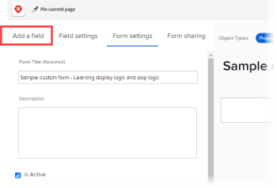

# Ajouter une logique d’affichage et une logique de saut dans un formulaire personnalisé

Vous pouvez utiliser des règles intelligentes pour rendre un formulaire personnalisé dynamique et plus pertinent pour les utilisateurs et les utilisatrices qui le remplissent. Lorsqu’un utilisateur ou une utilisatrice répond d’une certaine manière à un champ à choix multiples sur un formulaire, une règle intelligente lui indique ce que vous souhaitez voir après, en fonction de cette réponse.

Les champs à choix multiples sont de type liste déroulante, cases à cocher et cases d’option.

* **Logique d’affichage** : vous configurez une règle de logique d’affichage sur le champ, le widget ou la section que vous souhaitez que l’utilisateur ou l’utilisatrice ne voie qu’après avoir sélectionné un choix spécifique dans un champ à choix multiples précédent.

  **Exemple :** vous créez un formulaire de demande de contenu marketing dans lequel les membres de votre entreprise peuvent demander un nouveau logo, une mise à jour de site web, une brochure ou d’autres types de contenu marketing. En fonction du type de contenu souhaité par l’utilisateur ou l’utilisatrice, vous devez lui demander différents types de détails, tels que les couleurs souhaitées et des idées de conception si la personne a besoin d’un logo, ou une liste des fonctionnalités du produit si elle a besoin d’une brochure.

  Sur le champ qui demande les couleurs et des détails pour un nouveau logo, vous pouvez ajouter une règle de logique d’affichage qui affiche ce champ uniquement une fois que l’utilisateur ou l’utilisatrice a sélectionné la case d’option Logo dans le premier champ.

  De même, sur le champ qui demande des informations sur les fonctionnalités du produit, vous pouvez ajouter une règle de logique d’affichage qui n’affiche ce champ qu’après qu’un utilisateur ou une utilisatrice ait sélectionné la case d’option Brochure dans le premier champ.

  

  Vous pouvez configurer des règles de logique d’affichage sur n’importe quel champ personnalisé, widget ou saut de section qui suit un champ à choix multiples.

* **Règle de logique de saut** : vous configurez cette règle pour masquer les parties d’un formulaire dont l’utilisateur ou l’utilisatrice n’a pas besoin. Lorsque l’utilisateur ou l’utilisatrice sélectionne un élément spécifique dans un champ à choix multiples précédent, la règle de logique de saut l’ignore jusqu’à la fin du formulaire ou dans un champ, un widget ou une section personnalisé que la personne souhaite voir.

  **Exemple :** quelqu’un utilise le formulaire de demande de contenu marketing ci-dessus pour demander un article technique, fourni par le service des ventes et non par le service marketing. Pour cette personne, une règle de logique de saut peut masquer la question qui demande des détails et passer à une ligne de texte qui la renvoie au service dont elle a besoin.

  

  Dans ce cas, vous pouvez ajouter un champ de texte descriptif qui renvoie l’utilisateur ou l’utilisatrice au service des ventes. Dans le premier champ personnalisé qui demande le type de contenu marketing dont l’utilisateur ou l’utilisatrice a besoin, vous pouvez ajouter une règle de logique de saut qui n’affiche que la ligne de texte lorsqu’une personne sélectionne la case d’option Article technique dans le premier champ.

  Cela s’avère particulièrement utile si vous ajoutez de nombreux autres champs concernant les logos, les mises à jour de site web et les brochures que cette personne n’a pas besoin de voir.
Vous pouvez appliquer une règle de logique de saut uniquement à un champ personnalisé, et non à un widget ou à une section.

## Conditions d’accès

Vous devez disposer des éléments suivants pour effectuer les étapes décrites dans cet article :

<table style="table-layout:auto"> 
 <col> 
 <col> 
 <tbody> 
  <tr data-mc-conditions=""> 
   <td role="rowheader"> 
Formule Adobe Workfront*
 </td> 
   <td>Tous</td> 
  </tr> 
  <tr> 
   <td role="rowheader">Licence Adobe Workfront*</td> 
   <td> 
Plan 
 </td> 
  </tr> 
  <tr data-mc-conditions=""> 
   <td role="rowheader">Configurations du niveau d’accès*</td> 
   <td> 
Accès administratif aux formulaires personnalisés
 
Pour plus d’informations sur la manière dont les administrateurs et administratrices Workfront accordent cet accès, consultez <a href="../../administration-and-setup/add-users/configure-and-grant-access/grant-users-admin-access-certain-areas.md" class="MCXref xref">Accorder un accès administratif à certaines zones aux utilisateurs et utilisatrices</a>.
 </td> 
  </tr>  
 </tbody> 
</table>

&#42;Pour connaître le plan, le type de licence ou les configurations de niveau d’accès dont vous disposez, contactez votre administrateur ou administratrice Workfront.

## Créer un exemple de formulaire personnalisé avec une logique d’affichage et de saut

La meilleure façon d’apprendre à ajouter une logique d’affichage et de saut à un formulaire personnalisé est de suivre l’exemple pratique décrit dans les deux sections suivantes :

* [Logique d’affichage - exemple pratique](#display-logic-practical-example)
* [Logique de saut - exemple pratique](#skip-logic-practical-example)

### Logique d’affichage - exemple pratique {#display-logic-practical-example}

Dans cet exemple, vous allez créer un formulaire personnalisé avec un champ à cases d’option à choix multiples. Vous allez ensuite ajouter une logique d’affichage qui connecte ce champ à un second champ.

1. Cliquez sur l’icône **Menu principal**  dans le coin supérieur droit d’Adobe Workfront, puis cliquez sur **Configuration** .

1. Dans le panneau de gauche, sélectionnez **Formulaires personnalisés** .

1. Cliquez sur **Nouveau formulaire personnalisé**, sélectionnez **Projet** dans la zone qui s’affiche, puis cliquez sur **Continuer**.

1. Dans la zone de texte **Titre du formulaire**, saisissez **Exemple de formulaire personnalisé : apprendre la logique d’affichage et la logique de saut** pour nommer le formulaire.

   

1. Pour ajouter le premier champ du formulaire :

   1. Ouvrez l’onglet **Ajouter un champ**.

      

   1. Sélectionnez le type de champ **Cases d’option**, puis saisissez *De quel type de contenu marketing avez-vous besoin ?* en tant que **Libellé** du champ.

   1. Dans **Choix**, remplacez **Choix 1** et **Choix 2** par les phrases suivantes pour créer deux options que les utilisateurs et utilisatrices peuvent choisir dans le champ :

      *Mettre à jour le site web*

      *Concevoir un logo*

1. Pour ajouter le champ personnalisé suivant et lui ajouter une règle de logique d’affichage :

   1. Rouvrez l’onglet **Ajouter un champ** et ajoutez un nouveau champ **Cases d’option** appelé *De quel type de mise à jour de site web avez-vous besoin ?*

      Nous ajouterons les choix pour ce champ ultérieurement.

   1. Dans la section **Paramètres supplémentaires**, sélectionnez **Ajouter une logique**.

      

1. Dans la zone qui s’affiche, avec l’onglet **Logique d’affichage** ouvert, configurez le second champ de sorte qu’il s’affiche uniquement pour les utilisateurs et utilisatrices qui ont sélectionné *Conception de site web* dans le premier champ :

   1. Dans la première liste déroulante, sélectionnez **De quel type de contenu marketing avez-vous besoin ?**
   1. Dans la deuxième liste déroulante, sélectionnez **Conception de site web**.
   1. Laissez la troisième liste déroulante définie sur **Sélectionné** et cliquez sur **Enregistrer**.

   Les petits carrés de couleur avec un D indiquent que le deuxième champ est connecté grâce à la logique d’affichage à la sélection de l’utilisateur ou utilisatrice dans le premier champ :

   

1. Sélectionnez **Prévisualisation** pour vous assurer que la logique fonctionne comme vous le souhaitez sur le formulaire, puis choisissez **Fermer la prévisualisation**.

1. Cliquez sur **Enregistrer + Fermer** pour enregistrer le formulaire, puis continuez sur [Logique de saut - exemple pratique](#skip-logic-practical-example) ci-dessous.

### Logique de saut - exemple pratique {#skip-logic-practical-example}

La logique de saut fonctionne de la même manière que la logique d’affichage, mais agit à l’inverse : au lieu d’afficher des champs personnalisés à choix multiples spécifiques en fonction des sélections précédentes, vous déterminez ceux qui doivent être masqués (ignorés), car ils ne sont pas pertinents pour l’utilisateur ou utilisatrice.

Pour en savoir plus, continuez à travailler sur l’exemple de formulaire personnalisé que vous avez créé dans la section [Logique d’affichage - exemple pratique](#display-logic-practical-example) de cet article.

1. Cliquez sur l’icône **Menu Principal**  dans le coin supérieur droit d’Adobe Workfront, puis sur **Configuration** .

1. Cliquez sur **Formulaires personnalisés**.
1. Cliquez sur le nom du formulaire **Exemple de formulaire personnalisé : apprentissage de la logique d’affichage et de la logique de saut** que vous avez créé lors des étapes précédentes pour l’ouvrir et le modifier.
1. Sélectionnez le champ déroulant que vous avez créé nommé *De quel type de site web avez-vous besoin ?*, ajoutez les options suivantes pour le champ, puis cliquez sur **Appliquer** :

   *E-commerce*

   *Brochure*

   *Abonnement*

1. Ouvrez l’onglet **Ajouter un champ**, créez un champ **Champ de texte avec mise en forme** appelé *Quel est l’objectif du site web ?*, puis cliquez sur **Appliquer**.

   Dans cette organisation, un site de documentation d’aide est créé par l’équipe d’écriture technique et non par le service marketing. Par conséquent, aucune information supplémentaire n’est nécessaire de la part d’un utilisateur ou une utilisatrice qui sélectionne la documentation d’aide dans le deuxième champ. Nous allons créer une ligne de texte (un champ de texte descriptif) qui lui indiquera de consulter plutôt l’équipe d’écriture technique. Et nous utiliserons une règle de logique de saut qui ignore cet utilisateur ou cette utilisatrice dans cette ligne de texte.

1. Pour créer la ligne de texte :

   1. Ouvrez l’onglet **Ajouter un champ** et créez un **Champ de texte descriptif**.

   1. Pour le **Libellé**, saisissez *Consulter l’équipe d’écriture technique*.

   1. Pour le **Texte descriptif**, saisissez *Consultez l’équipe d’écriture technique au sujet de la création de la documentation d’aide en ligne.*.

   1. Sélectionnez **Appliquer**.

1. Pour créer la règle de logique de saut :

   1. Sélectionnez le second champ déroulant, *De quel type de site web avez-vous besoin ?*
   1. Dans la section **Paramètres supplémentaires**, sélectionnez **Modifier la logique**.
   1. Dans la zone qui s’affiche, ouvrez l’onglet **Logique de saut**.
   1. Définissez le premier champ déroulant sur **Documentation d’aide**, laissez le deuxième champ déroulant défini sur **Sélectionné**, puis définissez le troisième sur **Consulter l’équipe d’écriture technique**.
   1. Sélectionnez **Enregistrer**.

   Les petits carrés de logique de saut avec un S indiquent que l’utilisateur ou utilisatrice sautera quelque chose après avoir sélectionné un certain choix dans le deuxième champ.

   

1. Cliquez sur **Prévisualisation** pour vous assurer que la logique s’applique comme vous le souhaitez.
1. Cliquez sur **Enregistrer + Fermer**.

En créant un formulaire comme celui-ci, vous pouvez ajouter d’autres champs de texte pour demander des informations aux utilisateurs et utilisatrices qui sélectionnent E-commerce ou Brochure dans le deuxième champ. Ces champs peuvent demander qui est l’audience cible du site web, quel est l’objectif de sa création, quel est le budget, etc.

Et avec les règles de logique, vous pouvez créer des chemins de questions.

Par exemple, pour les utilisateurs et utilisatrices qui sélectionnent E-commerce, vous pouvez créer des champs contenant des questions sur les photos, descriptions, prix et options de paiement des produits. Pour les utilisateurs et utilisatrices qui sélectionnent Brochure, vous pouvez créer des champs demandant des informations sur le contenu.

Un utilisateur ou une utilisatrice qui a sélectionné la documentation d’aide ne verra jamais ces champs supplémentaires qui ne sont pas pertinents pour lui.

>[!TIP]
>
>Vous pouvez ajouter une logique d’affichage et une logique de saut à un champ personnalisé si tous les éléments suivants sont vrais à propos du champ :
>
>* Il s’agit d’un champ à choix multiples (cases d’option, liste déroulante ou cases à cocher).
>* Il est précédé d’un champ à choix multiples.
>* Il est suivi d’un autre champ personnalisé.
>

<!--
<h2 data-mc-conditions="QuicksilverOrClassic.Draft mode">Multi-field display logic statements</h2>
-->

