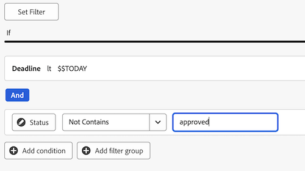
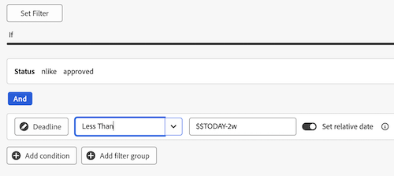

# Créer un tableau de bord de rapports à réviser et à approuver

Vous pouvez créer un tableau de bord de rapports dans la zone Tableaux de bord de la zone de travail pour afficher des informations détaillées et de haut niveau sur les révisions et les validations avec la fonctionnalité de validations unifiées.

>[!IMPORTANT]
>
>Cette fonctionnalité est disponible uniquement pour les clients utilisant le service d’approbations unifiés et inscrits à la version bêta des tableaux de bord du canevas.

## Créer un tableau de bord

{{step1-to-dashboards}}

1. Dans le panneau de gauche, cliquez sur **Tableaux de bord des zones de travail**.
1. Cliquez sur **Nouveau tableau de bord**.
1. Nommez votre tableau de bord .
1. (Facultatif) Ajoutez une description.
1. Cliquez sur **Créer**.
   

Une fois que vous avez créé un tableau de bord, vous pouvez commencer à ajouter des indicateurs de performance clés, des graphiques et des Tables. Pour plus d’informations, reportez-vous aux sections suivantes :

* [Ajout d’informations de révision et d’approbation de haut niveau avec des ICP et des graphiques](#add-high-level-review-and-approval-information-with-kpis-and-charts)
* [Ajoutez des informations détaillées sur l’approbation et la révision à l’aide Tables](#add-detailed-review-and-approval-information-with-tables)

## Ajout d’informations de révision et d’approbation de haut niveau avec des ICP et des graphiques

Vous pouvez afficher des informations de niveau supérieur sur les approbations de documents à l’aide des IPC et des graphiques. Les informations de zoom avant ne sont pas disponibles actuellement dans la version bêta.

### KPI

#### Approbations en attente

1. [Créez un tableau de bord](#create-a-dashboard) comme décrit dans la section ci-dessus.
1. Dans la carte **KPI**, cliquez sur **Ajouter**.
1. Saisissez _En attente_ dans la zone de texte **Titre de l’indicateur de performance clé**.
1. Tapez _Approbations en attente_ dans la zone de texte **Légende des indicateurs de performance clés**. Ce texte décrit l’affichage de l’indicateur de performance clé.
1. En haut de la page, cliquez sur **Sélectionner le champ de KPI**.
1. Faites défiler vers le bas et recherchez le **dossier Approbation du document**.
1. Choisissez **Statut**, puis sélectionnez **Nombre** dans le menu déroulant.
1. Cliquez sur **Modifier le filtre** > **Ajouter une condition**.
   1. Cliquez dans le filtre de condition vide, cliquez sur **Choisir un champ**, puis choisissez **Statut**.
   1. Laissez l’opérateur sur **Égal** et saisissez _en attente de révision_ dans la zone de texte.
      
1. Cliquez sur **Terminé** dans le coin supérieur droit de l’écran.

#### Approbations en retard

1. [Créez un tableau de bord](#create-a-dashboard) comme décrit dans la section ci-dessus.
1. Dans la carte **KPI**, cliquez sur **Ajouter**.
1. Saisissez _Overdue_ dans la zone de texte **Titre de l’indicateur de performance clé**.
1. Tapez _Échéance de l’étape d’approbation dans le passé_ dans la zone de texte **Légende des indicateurs de performance clés**. Ce texte décrit l’affichage de l’indicateur de performance clé.
1. En haut de la page, cliquez sur **Sélectionner le champ de KPI**.
1. Faites défiler vers le bas et recherchez le **dossier Approbation du document**.
1. Choisissez **Statut**, puis sélectionnez **Nombre** dans le menu déroulant.
1. Cliquez sur **Modifier le filtre** > **Ajouter une condition** :
   1. Cliquez dans le filtre de condition vide, cliquez sur **Choisir un champ**, puis choisissez **Échéance**.
   1. Remplacez l’opérateur par **Inférieur à**, puis activez Date relative sur, puis saisissez _$$TODAY_ dans la zone de texte.
      
1. Cliquez sur **Ajouter une condition** :
   1. Cliquez dans le filtre de condition vide, cliquez sur **Choisir un champ**, puis choisissez **Statut**.
   1. Définissez l’opérateur sur **Non contient**, puis saisissez _« approuvé_ » dans la zone de texte.
      
1. Cliquez sur **Terminé** dans le coin supérieur droit de l’écran.

#### Validations terminées

1. [Créez un tableau de bord](#create-a-dashboard) comme décrit dans la section ci-dessus.
1. Dans la **carte KPI** , cliquez sur **Ajouter**.
1. Saisissez _terminé_ dans la zone de texte Titre de **l’indicateur** de performance clé.
1. _Saisissez le nombre_ d’états d’approbation dans la zone de texte Légende de **l’indicateur** de performance clé. Ce texte décrit le contenu de l’indicateur de performance clé.
1. En haut de la page, cliquez sur **Sélectionner le champ** KPI.
1. Faites défiler vers le bas et recherchez le dossier Approbation du **document**.
1. Choisissez **Statut**, puis sélectionnez **Nombre** dans le menu déroulant.
1. Cliquez sur **Modifier le filtre** > **Ajouter une condition** :
   1. Cliquez dans le filtre de condition vide, cliquez sur **Choisir un champ**, puis choisissez **Statut**.
   1. Remplacez l’opérateur par **Contient** et saisissez _Approved_ dans la zone de texte.
      
1. Cliquez sur **Ajouter condition** :
   1. Cliquez sur **Et** pour le remplacer par **Ou**.
   1. Cliquez dans le filtre de condition vide, cliquez sur **Choisir un champ**, puis choisissez **Statut**.
   1. Remplacez l’opérateur par **Est égal à**, puis saisissez _Révisé_ dans la zone de texte.
      
1. Cliquez sur **Terminé** dans le coin supérieur droit de l’écran.

#### Approbations abandonnées

1. [Créez un tableau de bord](#create-a-dashboard) comme décrit dans la section précédente.
1. Dans la **carte KPI** , cliquez sur **Ajouter**.
1. Type _abandonné_ dans la zone de texte Titre **de l’indicateur** de performance clé.
1. Date limite d’approbation de type _de plus de 2 semaines dans_ la zone de texte Légende de **l’indicateur** de performance clé. Ce texte décrit le contenu de l’indicateur de performance clé.
1. En haut de la page, cliquez sur **Sélectionner le champ** KPI.
1. Faites défiler vers le bas et trouvez le **dossier** Document Approval Stage.
1. Choisissez **Echéance**, puis Compter **** dans le menu déroulant.
1. Cliquez sur **Modifier le filtre** > **Ajouter une condition** :
   1. Cliquez sur dans le filtre de condition vide, cliquez sur Sélectionner un champ, puis choisissez ****&#x200B;État **.**
   1. Définissez l’opérateur sur **Non contient**, puis tapez _« approuvé_ » dans la zone de texte.
      
1. Cliquez sur **Ajouter une condition** :
   1. Cliquez dans le filtre de condition vide, cliquez sur **Choisir un champ**, puis choisissez **Échéance**.
   1. Remplacez l’opérateur par **Inférieur à**, puis activez Date relative sur, puis saisissez _$$TODAY-2w_ dans la zone de texte.
      
1. Cliquez sur **Terminé** dans le coin supérieur droit de l’écran.

### Graphiques

#### Graphique à barres Approbations par décision

1. [Créez un tableau de bord](#create-a-dashboard) comme décrit dans la section ci-dessus.
1. Dans la carte **Graphique**, cliquez sur **Ajouter**.
1. Saisissez _Validations par décision_ dans la zone de texte **Nom**.
1. (Facultatif) Saisissez une description dans la zone de texte **Description**. Ce texte s’affiche sous forme d’info-bulle en regard du nom du graphique.
1. Cliquez sur **Ouvrir les détails du graphique**.
1. Dans le menu déroulant **Type de graphique**, laissez l’option **Graphique à barres** sélectionnée.
1. Dans le menu déroulant **Type de barre**, laissez l’option **Simple** sélectionnée.
1. Cliquez sur **Mettre à jour le champ** pour l’**Axe inférieur (X)** et choisissez le premier dossier **Approbation du document** puis **Statut**.
1. Définissez le Type d’agrégation sur **Nombre**.
1. Cliquez sur **Mettre à jour le champ** pour l’axe **Gauche (Y)** et choisissez la première option **Approbation du document** puis **Statut**.
1. Cliquez sur l’onglet Filtre .
1. Cliquez sur **Modifier le filtre** > **Ajouter une condition** :
   1. Cliquez dans le filtre de condition vide, cliquez sur **Choisir un champ**, puis choisissez **Version du document**.
   1. Définissez l’opérateur sur **N’est pas nul**.
      
1. Cliquez sur **Terminé** dans le coin supérieur droit de l’écran.

#### Graphique à barres Révisions

1. [Créez un tableau de bord](#create-a-dashboard) comme décrit dans la section ci-dessus.
1. Dans la **carte graphique** , cliquez sur **Ajouter**.
1. Tapez _Révisions dans la zone de_ **texte Nom** .
1. Tapez _Nombre de révisions des documents dont les décisions sont incomplètes et prévues avant la fin du mois_ dans la zone de texte **Description**. Ce texte s’affiche sous forme d’info-bulle en regard du nom du graphique.
1. Cliquez sur **Ouvrir les détails du graphique**.
1. Dans le menu déroulant **Type de graphique**, laissez l’option **Graphique à barres** sélectionnée.
1. Dans le **menu déroulant Type de** barre, laissez **Simple** sélectionné.
1. Cliquez sur **Mettre à jour le champ** pour l’axe **** inférieur (X) et choisissez le premier **dossier Approbation** du document, puis **Version du document** > **Version**.
1. Définissez le type d’agrégation sur **Count**.
1. Cliquez sur **Mettre à jour le champ** pour l’axe **** gauche (Y), puis choisissez la première **option Approbation** du document, puis **Version du** document > **Nom** > **document**.
1. Cliquez sur l’icône de l’onglet](assets/filter-tab.png) Filtre
1. Cliquez sur **Modifier le filtre** > **Ajouter une condition** :
   1. Cliquez sur le filtre de condition vide, cliquez sur **Sélectionner un champ**, puis sélectionnez **Date limite** de la phase d’approbation.
   1. Remplacez l’opérateur par **Inférieur ou égal à**, puis activez l’option Définir la date relative sur et saisissez _$$TODAYem_ dans la zone de texte.
      
1. Cliquez sur **Terminé** dans le coin supérieur droit de l’écran.

## Ajouter des informations de révision et d’approbation détaillées avec les tableaux

### Liste des approbations en attente

1. [Créez un tableau de bord](#create-a-dashboard) comme décrit dans la section précédente.
1. Sur la carte du **tableau** , cliquez sur **Ajouter**.
1. Tapez _Approbations_ en attente dans la zone de **texte Nom** .
1. (Facultatif) Saisissez une description dans la zone de **texte Description** . Ce texte s’affiche sous forme d’info-bulle en regard du nom du graphique.
1. Cliquez sur **Ouvrir les paramètres de** colonne.
1. Cliquez sur **Ajouter une colonne**, faites défiler vers le bas et cliquez sur le premier **dossier Approbations de** document, puis choisissez **État**.
1. Ajouter les colonnes suivantes :

   <table>
    <tr>
    <td><strong>Nom du projet</strong></td>
    <td>Version de document &gt; Nom &gt; de &gt; de projet de document</td>
    </tr>
    <tr>
    <td><strong>Nom du document</strong></td>
    <td>Version du document &gt; Document &gt; saisissez _Name_ dans la zone de recherche.</td>
    </tr>
    <tr>
    <td><strong>Version du document</strong></td>
    <td>Version Du Document &gt; Document &gt; Version</td>
    </tr>
    <tr>
    <td><strong>Échéance</strong></td>
    <td>Document &gt; Étape d’approbation &gt; Échéance</td>
    </tr>
    <tr>
    <td><strong>Demandé par</strong></td>
    <td>Document &gt; Étape d’approbation &gt; Participants à l’étape d’approbation* &gt; Demandeur &gt; saisissez _Name_ dans la zone de recherche.</td>
    </tr>
     <tr>
    <td><strong>Date demandée</strong></td>
    <td>Document &gt; Étape d’approbation &gt; Participants à l’étape d’approbation* &gt; Créé à</td>
    </tr>
     <tr>
    <td><strong>Approbateur</strong></td>
    <td>Document &gt; Étape d’approbation &gt; Participants à l’étape d’approbation* &gt; Utilisateur participant &gt; saisissez _Name_ dans la zone de recherche.</td>
    </tr>
    <table>

   *Les participants à l’étape d’approbation sont tronqués à la page de l’étape d’approbation.

1. Passez à [ Ajouter le filtre requis ci-dessous ](#add-the-required-filter).

#### Ajouter le filtre des validations en attente obligatoire

1. Cliquez sur l’onglet Filtre .
1. Cliquez sur **Modifier le filtre** > **Ajouter une condition** :
   1. Cliquez dans le filtre de condition vide, cliquez sur **Choisir un champ**, puis choisissez **Statut**.
   1. Remplacez l’opérateur par **Égal**, puis saisissez _en attente d’approbation_.
      
1. Ajoutez des filtres facultatifs comme décrit ci-dessous ou cliquez sur **Terminé** dans le coin supérieur droit de l’écran.

**Filtres facultatifs**

Pour afficher des informations plus spécifiques en fonction de votre cas d’utilisation, vous pouvez ajouter des conditions de filtre supplémentaires. Vous pouvez recréer le tableau et ajouter de nouvelles conditions de filtrage par cas d’utilisation.

+++ Développer pour afficher d’autres options de filtre

**Mes projets**

1. Cliquez sur **Modifier le filtre** > **Ajouter une condition** :
   1. Cliquez dans le filtre de condition vide, cliquez sur **Choisir un champ**, puis choisissez **Version du document** > **Document** > **Projet** > **Propriétaire** > saisissez _Name_ dans la zone de recherche.
   1. Remplacez l’opérateur par **Égal**, puis choisissez **Moi (utilisateur connecté)** pour afficher les projets dans Workfront dans lesquels vous êtes marqué comme propriétaire du projet.
      
1. Cliquez sur **Terminé** dans le coin supérieur droit de l’écran.

**Approbations que j&#39;ai envoyées**

1. Cliquez sur **Modifier le filtre** > **Ajouter une condition** :
   1. Cliquez dans le filtre de condition vide, cliquez sur **Choisir un champ**, puis choisissez **Étape d’approbation** > **Participants à l’étape d’approbation** > **Demandeur** > saisissez _Nom_ dans la zone de recherche.
   1. Définissez l’opérateur sur **Égal,** puis choisissez **Moi (utilisateur connecté)** pour afficher des projets dans Workfront dans lesquels vous êtes marqué comme propriétaire du projet.
      
1. Cliquez sur **Terminé** dans le coin supérieur droit de l’écran.

+++

### Liste des approbations en retard

1. [Créez un tableau de bord](#create-a-dashboard) comme décrit dans la section précédente.
1. Sur la carte du tableau, cliquez sur **Ajouter**.
1. Saisissez _Approbations en retard_ dans la zone de texte **Nom**.
1. (Facultatif) Saisissez une description dans la zone de texte **Description**. Ce texte s’affiche sous forme d’info-bulle en regard du nom du graphique.
1. Cliquez sur **Ouvrir les paramètres de colonne**.
1. Cliquez sur **Ajouter une colonne**, faites défiler vers le bas et cliquez sur le premier **dossier Approbations de** document, puis choisissez **État**.
1. Ajouter les colonnes suivantes :

   <table>
    <tr>
    <td><strong>Nom du projet</strong></td>
    <td>Version du document &gt; Document &gt; Projet &gt; Nom</td>
    </tr>
    <tr>
    <td><strong>Nom du document</strong></td>
    <td>Version du document &gt; Document &gt; saisissez _Name_ dans la zone de recherche.</td>
    </tr>
    <tr>
    <td><strong>Version du document</strong></td>
    <td>Version Du Document &gt; Document &gt; Version</td>
    </tr>
    <tr>
    <td><strong>Échéance</strong></td>
    <td>Étape d’approbation &gt; document &gt; date limite</td>
    </tr>
    <tr>
    <td><strong>Demandé par</strong></td>
    <td>Étape de l’approbation du document &gt; &gt; de l’approbation Participants à l’étape * &gt; Demandeur &gt; tapez _Name_ dans la zone de recherche.</td>
    </tr>
     <tr>
    <td><strong>Date demandée</strong></td>
    <td>Étape d’approbation du document &gt; &gt; Étape d’approbation Les participants* &gt; créés le</td>
    </tr>
     <tr>
    <td><strong>Approbateur</strong></td>
    <td>Document &gt; Étape d’approbation &gt; Participants à l’étape d’approbation* &gt; Utilisateur participant &gt; saisissez _Name_ dans la zone de recherche.</td>
    </tr>
    <table>

   *Les participants à l’étape d’approbation sont tronqués à la page de l’étape d’approbation.

1. Passez à [ Ajouter le filtre requis ci-dessous ](#add-the-required-filter-1).

#### Ajouter le filtre des approbations en retard obligatoire

1. Cliquez sur l’onglet Filtre .
1. Cliquez sur **Modifier le filtre** > **Ajouter une condition** :
   1. Cliquez dans le filtre de condition vide, cliquez sur **Choisir un champ**, puis choisissez **Étape d&#39;approbation** > **Échéance**.
   1. Remplacez l’opérateur par **Inférieur à**, activez le bouton (bascule) **Définir la date relative** puis saisissez _$$TODAY_.
      
1. Ajoutez des filtres facultatifs comme décrit ci-dessous ou cliquez sur **Terminé** dans le coin supérieur droit de l’écran.

**Filtres facultatifs**

Pour afficher des informations plus spécifiques en fonction de votre cas d’utilisation, vous pouvez ajouter des conditions de filtre supplémentaires. Vous pouvez recréer le tableau et ajouter de nouvelles conditions de filtre facultatives par cas d’utilisation.

+++ Développer pour afficher des options de filtre supplémentaires

**Mes projets**

1. Cliquez sur **Modifier le filtre** > **Ajouter une condition** :
   1. Cliquez dans le filtre de condition vide, cliquez sur **Choisir un champ**, puis choisissez **Version du document** > **Document** > **Projet** > **Propriétaire** > saisissez _Name_ dans la zone de recherche.
   1. Remplacez l’opérateur par **Égal**, puis choisissez **Moi (utilisateur connecté)** pour afficher les projets dans Workfront dans lesquels vous êtes marqué comme propriétaire du projet.
      
1. Cliquez sur **Terminé** dans le coin supérieur droit de l’écran.

**Approbations que j&#39;ai envoyées**

1. Cliquez sur **Modifier le filtre** > **Ajouter une condition** :
   1. Cliquez dans le filtre de condition vide, cliquez sur **Choisir un champ**, puis choisissez **Étape d’approbation** > **Participants à l’étape d’approbation** > **Demandeur** > saisissez _Nom_ dans la zone de recherche.
   1. Remplacez l’opérateur par **Égal**, puis choisissez **Moi (utilisateur connecté)** pour afficher les projets dans Workfront dans lesquels vous êtes marqué comme propriétaire du projet.
      
1. Cliquez sur **Terminé** dans le coin supérieur droit de l’écran.

**Mon équipe**

1. Cliquez sur **Modifier le filtre** > **Ajouter une condition** :
   1. Cliquez sur le filtre de condition vide, cliquez sur **Choisir un champ**, puis choisissez **Étape d’approbation** > **Étape d’approbation Participants >**&#x200B;Équipe **des participants** > _tapez Nom_ dans la zone de recherche.
   1. Remplacez l’opérateur par **Égal**, puis choisissez **Mes équipes par défaut (Utilisateur connecté)** ou **Mes autres équipes (Utilisateur connecté)** pour afficher les projets affectés à votre équipe par défaut ou aux autres équipes auxquelles vous appartenez.
      
1. Cliquez sur **Terminé** dans le coin supérieur droit de l’écran.
+++
