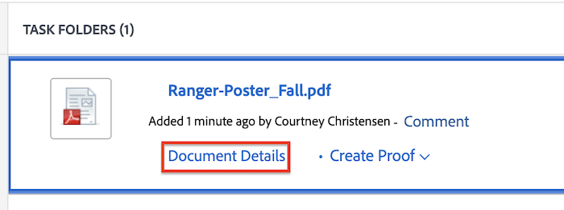
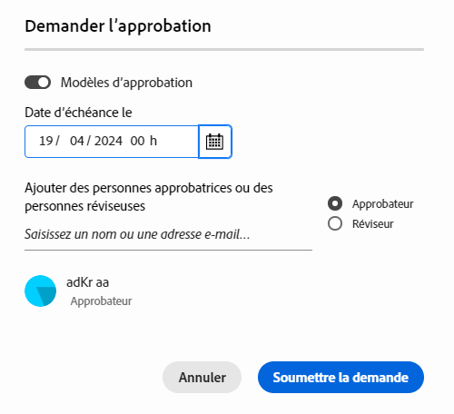
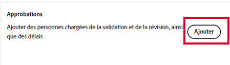

# Créer un workflow d’approbation de document

Les informations mises en surbrillance sur cette page font référence à des fonctionnalités qui ne sont pas encore disponibles de manière générale. Cette option n’est disponible que dans l’environnement de prévisualisation de sandbox.

Vous pouvez demander à d’autres personnes ou équipes d’approuver un document dans Adobe Workfront, ou leur demander de réviser un document sans avoir à l’approuver.

>[!IMPORTANT]
>
>Le contenu de cet article fait référence à la fonctionnalité d’approbation de document mise à jour, disponible uniquement pour des comptes spécifiques. Pour plus d’informations sur les processus d’approbation standard, reportez-vous aux articles répertoriés dans la section [Approbations de travail](/help/quicksilver/review-and-approve-work/manage-approvals/manage-approvals.md).

## Conditions d’accès

+++ Développez pour afficher les exigences d’accès aux fonctionnalités de cet article.

<table style="table-layout:auto"> 
 <col> 
 <col> 
 <tbody> 
  <tr> 
   <td role="rowheader">Package Adobe Workfront</td> 
   <td> 
Tous
 </td> 
  </tr> 
  <tr> 
   <td role="rowheader">Licence Adobe Workfront</td>  
   <td>
   
Contributeur ou supérieur

   
Révision ou supérieur

   
Si vous utilisez l'intégration Frame.io, vous devez disposer d'une licence Standard pour créer des workflows d'approbation.

   </td> 
  </tr> 
  <tr> 
   <td role="rowheader">Configurations des niveaux d’accès</td> 
   <td> 
Affichage ou accès supérieur pour Projets, Tâches, Problèmes, Modèles, Portfolios, Programmes, Rapports, Tableaux de bord, Calendriers et Documents
 </td> 
  </tr>
  <tr> 
   <td role="rowheader">Autorisations d’objet</td> 
   <td> 
Gérer l’accès à l’objet associé à la demande d’accès ou d’approbation 
 </td> 
  </tr> 
 </tbody> 
</table>

Pour plus d’informations, voir [Conditions d’accès requises dans la documentation Workfront](/help/quicksilver/administration-and-setup/add-users/access-levels-and-object-permissions/access-level-requirements-in-documentation.md).

+++

## Créez une demande de révision ou d’approbation de document à partir de la page de document dans votre environnement de production

1. Pointez sur le document, puis cliquez sur sélectionnez Détails du document.
   

1. À côté du nom du document, sélectionnez la version du document pour laquelle créer une approbation dans le menu déroulant de la version. La dernière version est sélectionnée par défaut.

1. Cliquez sur **Approbations** dans le panneau de gauche.

1. (Facultatif) Définissez une date limite pour l’approbation. Les utilisateurs et les équipes sont avertis par e-mail 72 heures, puis 24 heures avant l’échéance spécifiée.

1. Pour ajouter un approbateur, cliquez sur le bouton **Approbateur** et commencez à saisir un nom d’utilisateur ou d’équipe.

1. Pour ajouter un réviseur ou une réviseuse, cochez la case **Réviseur** et commencez à saisir le nom d’un utilisateur, d’une utilisatrice ou d’une équipe.

   

1. Répétez l’étape précédente pour ajouter d’autres approbateurs, approbatrices, réviseurs ou réviseuses.

## Créez une demande de révision ou d’approbation de document à partir du panneau Résumé du document dans votre environnement de production

1. Accédez au projet, à la tâche ou au problème qui contient le document, puis sélectionnez **Documents**.

1. Cliquez sur le document dont vous avez besoin et le panneau de gauche Résumé du document s’ouvre.

1. Sélectionnez la version du document pour laquelle vous souhaitez créer une approbation dans le menu déroulant de la version. La dernière version est sélectionnée par défaut.

1. Faites défiler la page jusqu’à la section **Approbations** dans le volet Résumé du document, puis cliquez sur **Ajouter**.

1. (Facultatif) Définissez une date limite pour l’approbation. Les utilisateurs et les équipes sont avertis par e-mail 72 heures, puis 24 heures avant l’échéance spécifiée.

1. Pour ajouter un approbateur, cliquez sur le bouton **Approbateur** et commencez à saisir un nom d’utilisateur ou d’équipe.

1. Pour ajouter un réviseur ou une réviseuse, cochez la case **Réviseur** et commencez à saisir le nom d’un utilisateur, d’une utilisatrice ou d’une équipe.

   

1. Répétez l’étape précédente pour ajouter d’autres approbateurs, approbatrices, réviseurs ou réviseuses.

## Créez un workflow d’approbation à partir du panneau Résumé dans votre environnement de prévisualisation, dans la zone des documents hérités

Si votre organisation utilise le stockage Workfront, la zone des documents hérités s’affiche lorsque vous accédez aux documents dans Workfront. Pour plus d’informations sur le stockage Workfront, consultez la section [Stockage Workfront par rapport au stockage d’entreprise Adobe](/help/quicksilver/review-and-approve-work/esm-overview.md#workfront-storage-vs-adobe-enterprise-storage).

Pour créer un workflow de validation :

1. Accédez au projet, à la tâche ou à l’événement contenant le document, puis sélectionnez **Documents** dans le panneau de gauche.

1. Cliquez sur le document dont vous avez besoin pour ouvrir le panneau Résumé du document correspondant.

1. Sélectionnez la version du document pour laquelle vous souhaitez créer une approbation dans le menu déroulant de la version. La dernière version est sélectionnée par défaut.

1. Faites défiler l’écran jusqu’à la section **Validations**, puis cliquez sur **Créer un workflow**.

1. Renseignez les détails suivants :

   <table>
   <tr>
   <td><strong>Nom de l’étape</strong></td>
   <td>Ajoutez un nom d’étape. Vous pouvez remplacer le nom par un nom plus explicite, tel que <em> Révision initiale </em> ou <em> Approbation finale </em>.</td>
   </tr>
   <tr>
   <td><strong>Ajouter des noms ou des adresses e-mail</strong></td>
   <td>Commencez à saisir le nom d’un utilisateur ou d’une équipe à ajouter en tant qu’approbateur ou réviseur. Si vous avez uniquement des réviseurs, ils seront avertis et auront la possibilité de terminer la révision, mais aucune décision ne sera requise ou prise.</td>
   </tr>
   <tr>
   <td><strong>Une décision requise (facultatif)</strong></td>
   <td>La première personne qui prend une décision termine l’étape.</td>
   </tr>
   <tr>
   <td><strong>Date d’échéance (facultatif)</strong></td>
   <td>Définissez une date d’échéance pour l’approbation. Les utilisateurs et les équipes sont avertis par e-mail 72 heures, puis 24 heures avant la date d’échéance spécifiée.</td>
   </tr>
   </table>

1. (Facultatif) Répétez l’étape précédente pour ajouter d’autres étapes si nécessaire.

   >[!NOTE]
   >
   >Si vous ajoutez plusieurs étapes, le workflow d’approbation se poursuit dans l’ordre dans lequel elles sont répertoriées. Lorsque toutes les décisions requises sont prises, l’étape suivante commence et l’étape précédente est verrouillée.

   

## Créez un workflow d’approbation à partir du panneau Résumé dans la zone du nouveau document

Si votre entreprise utilise le stockage d’entreprise, la nouvelle zone de documents s’affiche lorsque vous accédez aux documents dans Workfront. Pour plus d’informations sur le stockage d’entreprise, consultez [Présentation du stockage d’entreprise](/help/quicksilver/review-and-approve-work/esm-overview.md).

Pour créer un workflow de validation :

1. Accédez au projet, à la tâche ou à l’événement contenant le document, puis sélectionnez **Documents** dans le panneau de gauche.

1. Cliquez sur le document, puis sur l’icône Validations sur le côté droit de la page.

   

1. Cliquez sur **Créer un workflow**, puis renseignez les informations suivantes :

   <table>
   <tr>
   <td><strong>Nom de l’étape</strong></td>
   <td>Ajoutez un nom d’étape. Vous pouvez remplacer le nom par un nom plus explicite, tel que <em> Révision initiale </em> ou <em> Approbation finale </em>.</td>
   </tr>
   <tr>
   <td><strong>Ajouter des noms ou des adresses e-mail</strong></td>
   <td>Commencez à saisir le nom d’un utilisateur ou d’une équipe à ajouter en tant qu’approbateur ou réviseur. Si vous avez uniquement des réviseurs, ils seront avertis et auront la possibilité de terminer la révision, mais aucune décision ne sera requise ou prise.</td>
   </tr>
   <tr>
   <td><strong>Une décision requise (facultatif)</strong></td>
   <td>La première personne qui prend une décision termine l’étape.</td>
   </tr>
   <tr>
   <td><strong>Date d’échéance (facultatif)</strong></td>
   <td>Définissez une date d’échéance pour l’approbation. Les utilisateurs et les équipes sont avertis par e-mail 72 heures, puis 24 heures avant la date d’échéance spécifiée.</td>
   </tr>
   </table>

1. (Facultatif) Répétez l’étape précédente pour ajouter d’autres étapes si nécessaire.

   >[!NOTE]
   >
   >Si vous ajoutez plusieurs étapes, le workflow d’approbation se poursuit dans l’ordre dans lequel elles sont répertoriées. Lorsque toutes les décisions requises sont prises, l’étape suivante commence et l’étape précédente est verrouillée.

   

<!--
## Resubmit an approval on a new version

Document approval decisions are not automatically reset when you upload a new version. For example, if your document is approved with changes, the decision will show "changes" as the decision, even if you upload a new version with the specified changes. You can clear the decision on a new version if you manually resubmit the approval.

1. Go to the project, task, or issue that contains the document, then select **Documents**.
1. Find the document you need.

1. Scroll down to the **Approvals** section in the Summary, click the More icon, then click Resubmit.

   
-->
