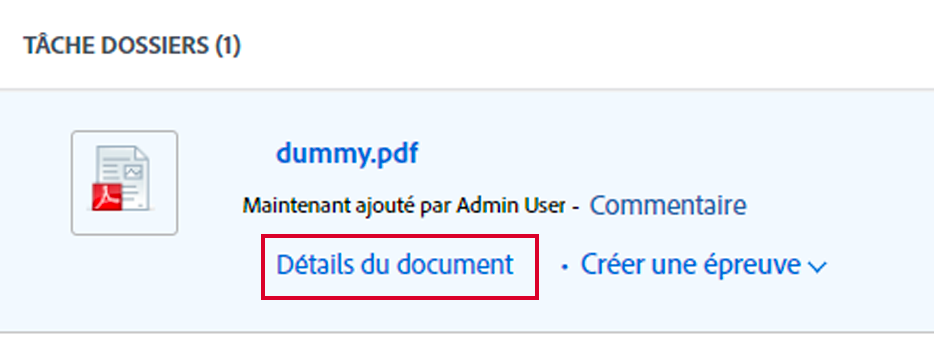
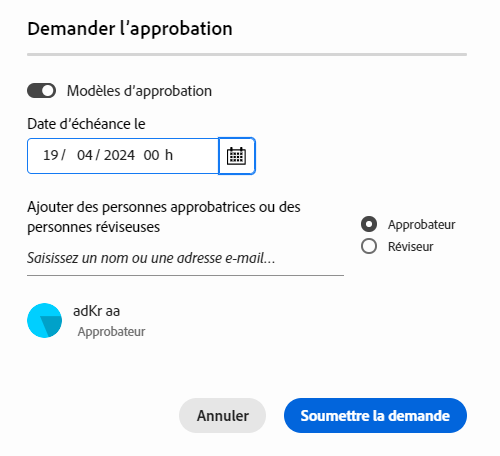

# Créer une demande de révision ou d’approbation de document

Vous pouvez demander l’approbation d’un document dans Adobe Workfront à d’autres utilisateurs ou équipes, ou demander à ces utilisateurs de le réviser sans avoir à l’approuver.

>[!IMPORTANT]
>
>Le contenu de cet article fait référence à la fonctionnalité d’approbation de document mise à jour, disponible uniquement pour des comptes spécifiques. Pour plus d’informations sur les processus d’approbation standard, reportez-vous aux articles répertoriés dans la section [Approbations de travail](/help/quicksilver/review-and-approve-work/manage-approvals/manage-approvals.md).

## Conditions d’accès

+++ Développez pour afficher les exigences d’accès aux fonctionnalités de cet article.

Vous devez disposer des accès suivants pour effectuer les étapes décrites dans cet article :

<table style="table-layout:auto"> 
 <col> 
 <col> 
 <tbody> 
  <tr> 
   <td role="rowheader">Formule Adobe Workfront*</td> 
   <td> 
Tous
 </td> 
  </tr> 
  <tr> 
   <td role="rowheader">Licence Adobe Workfront*</td>  
   <td> 
Révision ou supérieur
 </td> 
  </tr> 
  <tr> 
   <td role="rowheader">Configurations du niveau d’accès*</td> 
   <td> 
Affichage ou accès supérieur pour Projets, Tâches, Problèmes, Modèles, Portfolios, Programmes, Rapports, Tableaux de bord, Calendriers et Documents
 
Remarque : si vous n’avez toujours pas d’accès, demandez à votre équipe d’administration Workfront s’il existe des restrictions supplémentaires à votre niveau d’accès. Pour plus d’informations sur la façon dont un administrateur ou une administratrice Workfront peut modifier votre niveau d’accès, voir <a href="/help/quicksilver/administration-and-setup/add-users/configure-and-grant-access/create-modify-access-levels.md" class="MCXref xref">Créer ou modifier des niveaux d’accès personnalisés</a>.
 </td> 
  </tr>
  <tr> 
   <td role="rowheader">Autorisations d’objet</td> 
   <td> 
Gérer l’accès à l’objet associé à la demande d’accès ou d’approbation 
 
Pour plus d’informations sur la demande d’accès supplémentaire, voir <a href="/help/quicksilver/workfront-basics/grant-and-request-access-to-objects/request-access.md" class="MCXref xref">Demander l’accès aux objets</a>.
 </td> 
  </tr> 
 </tbody> 
</table>

&#42;Pour connaître le forfait, le type de licence ou l’accès dont vous disposez, contactez votre administrateur ou administratrice Workfront.

+++

## Créer d’une demande de révision ou d’approbation de document à partir de la page du document

1. Pointez sur le document, puis cliquez sur sélectionnez Détails du document.
   

1. À côté du nom du document, sélectionnez la version du document pour laquelle créer une approbation dans le menu déroulant de la version. La version la plus récente est sélectionnée par défaut.

1. Cliquez sur **Approbations** dans le volet de gauche.

1. (Facultatif) Définissez une date limite de validation. Les utilisateurs et les équipes sont avertis par e-mail 72 heures, puis 24 heures avant la date limite spécifiée.

1. Pour ajouter un approbateur ou une approbatrice, cliquez sur **Approbateur** et commencez à saisir le nom d’un utilisateur, d’une utilisatrice ou d’une équipe.

1. Pour ajouter un réviseur ou une réviseuse, cochez la case **Réviseur** et commencez à saisir le nom d’un utilisateur, d’une utilisatrice ou d’une équipe.

   

1. Répétez l’étape précédente pour ajouter d’autres approbateurs, approbatrices, réviseurs ou réviseuses.

## Créer une demande de révision ou d’approbation de document à partir du volet Résumé du document

1. Accédez au projet, à la tâche ou au problème qui contient le document, puis sélectionnez **Documents**.

1. Cliquez sur le document dont vous avez besoin pour ouvrir le volet Résumé du document.

1. Sélectionnez la version du document pour laquelle vous souhaitez créer une approbation dans le menu déroulant de la version. La version la plus récente est sélectionnée par défaut.

1. Faites défiler la page jusqu’à la section **Approbations** dans le volet Résumé du document, puis cliquez sur **Ajouter**.

1. (Facultatif) Définissez une date limite de validation. Les utilisateurs et les équipes sont avertis par e-mail 72 heures, puis 24 heures avant la date limite spécifiée.

1. Pour ajouter un approbateur ou une approbatrice, cliquez sur **Approbateur** et commencez à saisir le nom d’un utilisateur, d’une utilisatrice ou d’une équipe.

1. Pour ajouter un réviseur ou une réviseuse, cochez la case **Réviseur** et commencez à saisir le nom d’un utilisateur, d’une utilisatrice ou d’une équipe.

   

1. Répétez l’étape précédente pour ajouter d’autres approbateurs, approbatrices, réviseurs ou réviseuses.

<!--
## Resubmit an approval on a new version

Document approval decisions are not automatically reset when you upload a new version. For example, if your document is approved with changes, the decision will show "changes" as the decision, even if you upload a new version with the specified changes. You can clear the decision on a new version if you manually resubmit the approval.

1. Go to the project, task, or issue that contains the document, then select **Documents**.
1. Find the document you need.

1. Scroll down to the **Approvals** section in the Summary, click the More icon, then click Resubmit.

   
-->
