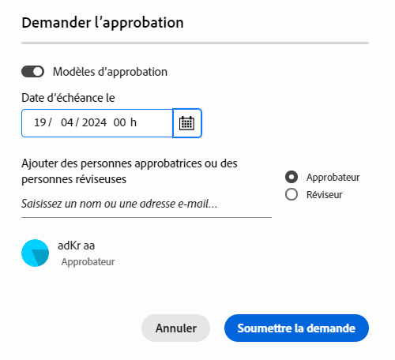
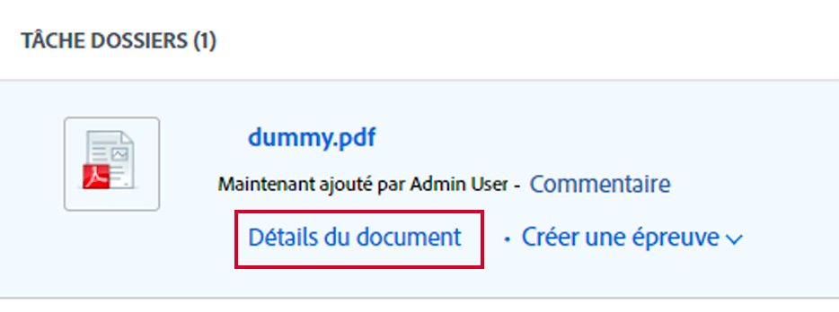

# Créer une demande de révision ou d’approbation pour une ressource Frame.io

>[!IMPORTANT]
>
>Le contenu de cet article fait référence à une fonctionnalité d’approbation mise à jour qui n’est disponible que pour des comptes spécifiques. Pour plus d’informations sur les processus d’approbation standard, reportez-vous aux articles répertoriés dans la section [Approbations de travail](/help/quicksilver/review-and-approve-work/manage-approvals/manage-approvals.md).

<!--
## Access requirements

You must have the following access to perform the steps in this article:

<table style="table-layout:auto"> 
 <col> 
 <col> 
 <tbody> 
  <tr> 
   <td role="rowheader">Adobe Workfront plan*</td> 
   <td> 
Any
 </td> 
  </tr> 
  <tr> 
   <td role="rowheader">Adobe Workfront license*</td>  
   <td> 
Review or higher
 </td> 
  </tr> 
  <tr> 
   <td role="rowheader">Access level configurations*</td> 
   <td> 
View or higher access to Projects, Tasks, Issues, Templates, Portfolios, Programs, Reports, Dashboards, and Calendars, Documents
 
Note: If you still don't have access, ask your Workfront administrator if they set additional restrictions in your access level. For information on how a Workfront administrator can modify your access level, see <a href="/help/quicksilver/administration-and-setup/add-users/configure-and-grant-access/create-modify-access-levels.md" class="MCXref xref">Create or modify custom access levels</a>.
 </td> 
  </tr>
  <tr> 
   <td role="rowheader">Object permissions</td> 
   <td> 
Manage access to the object associated with the request access or approval 
 
For information on requesting additional access, see <a href="/help/quicksilver/workfront-basics/grant-and-request-access-to-objects/request-access.md" class="MCXref xref">Request access to objects </a>.
 </td> 
  </tr> 
 </tbody> 
</table>

&#42;To find out what plan, license type, or access you have, contact your Workfront administrator.
-->

## Créer une demande de révision ou d&#39;approbation à partir du résumé du document

1. Accédez au projet, à la tâche ou à l&#39;événement contenant le Frame.io connecté, puis sélectionnez **Documents**.

   >[!TIP]
   >
   >Les ressources connectées Frame.io sont dotées du logo Frame.io.

1. Cliquez sur la ressource connectée Frame.io pour ouvrir le panneau Résumé du document .

1. (Facultatif) Dans le menu déroulant **Version**, sélectionnez la version de la ressource pour laquelle vous souhaitez créer une approbation. La dernière version est sélectionnée par défaut.

1. Faites défiler l’écran jusqu’à la section **Validations**, puis cliquez sur **Ajouter**.

   

1. (Facultatif) Définissez une date limite pour l’approbation. Les utilisateurs et les équipes sont avertis par e-mail 72 heures, puis 24 heures avant l’échéance spécifiée.

1. Pour ajouter un approbateur ou une approbatrice, cliquez sur **Approbateur** et commencez à saisir le nom d’un utilisateur, d’une utilisatrice ou d’une équipe.

1. Pour ajouter un réviseur ou une réviseuse, cochez la case **Réviseur** et commencez à saisir le nom d’un utilisateur, d’une utilisatrice ou d’une équipe.

   

1. Répétez l’étape précédente pour ajouter d’autres approbateurs, approbatrices, réviseurs ou réviseuses.

## Créer une demande de révision ou d’approbation à partir de la page Détails du document

1. Pointez sur le document, puis cliquez sur **Détails du document**.
   

1. Près du nom du document, sélectionnez la version du document pour lequel vous souhaitez créer une approbation. La dernière version est sélectionnée par défaut.

1. Dans le panneau de gauche, cliquez sur **Validations**.

1. (Facultatif) Définissez une date limite pour l’approbation. Les utilisateurs et les équipes sont avertis par e-mail 72 heures, puis 24 heures avant l’échéance spécifiée.

1. Pour ajouter un approbateur ou une approbatrice, cliquez sur **Approbateur** et commencez à saisir le nom d’un utilisateur, d’une utilisatrice ou d’une équipe.

1. Pour ajouter un réviseur ou une réviseuse, cochez la case **Réviseur** et commencez à saisir le nom d’un utilisateur, d’une utilisatrice ou d’une équipe.

   

1. Répétez l’étape précédente pour ajouter d’autres approbateurs, approbatrices, réviseurs ou réviseuses.

<!--
## Resubmit an approval on a new version

Document approval decisions are not automatically reset when you upload a new version. For example, if your document is approved with changes, the decision will show "changes" as the decision, even if you upload a new version with the specified changes. You can clear the decision on a new version if you manually resubmit the approval.

1. Go to the project, task, or issue that contains the document, then select **Documents**.
1. Find the document you need.

1. Scroll down to the **Approvals** section in the Summary, click the More icon, then click Resubmit.

   
-->
