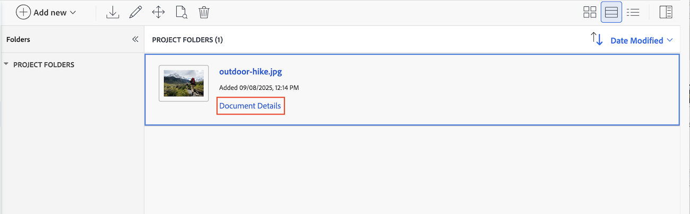

# Charger une nouvelle version du document et demander une approbation

Si un document est marqué « A besoin d’être retravaillé » lors d’une révision précédente, vous pouvez charger une nouvelle version dans le document d’origine et commencer une nouvelle série d’approbations. Une fois que vous avez chargé une nouvelle version du document, les versions précédentes sont verrouillées.

Si le nom de fichier de la nouvelle version est différent de celui de la version précédente, Workfront affiche le document avec le nom de fichier le plus récent.

Lorsqu&#39;une nouvelle version est ajoutée à un document avec des approbations en attente, l&#39;approbation de la version précédente indique « Retiré ». Le processus d’approbation précédent se termine, même si certains participants n’ont pas encore pris de décision.

Si la dernière version du document est supprimée, les versions précédentes restent verrouillées. Si vous devez modifier une version précédente, vous devez la déverrouiller manuellement.

## Conditions d’accès

+++ Développez pour afficher les exigences d’accès aux fonctionnalités de cet article.

<table style="table-layout:auto"> 
 <col> 
 </col> 
 <col> 
 </col> 
 <tbody> 
  <tr> 
   <td role="rowheader">Package Adobe Workfront</td> 
   <td> 
Tous
 </td> 
  </tr> 
  <tr> 
   <td role="rowheader">Licences Adobe Workfront</td> 
   <td> 
Requête ou supérieure

   
Contributeur ou supérieur

   
Si vous utilisez l'intégration Frame.io, vous devez disposer d'une licence Standard pour créer des workflows d'approbation.

    </td> 
  </tr> 
  <tr data-mc-conditions=""> 
   <td role="rowheader">Configurations des niveaux d’accès</td> 
   <td> 
Accès en modification aux documents
 </td> 
  </tr> 
  <tr data-mc-conditions=""> 
   <td role="rowheader">Autorisations d’objet</td> 
   <td> 
Accès Modifier à l’objet associé au document
 </td> 
  </tr> 
 </tbody> 
</table>

Pour plus d’informations, voir [Conditions d’accès requises dans la documentation Workfront](/help/quicksilver/administration-and-setup/add-users/access-levels-and-object-permissions/access-level-requirements-in-documentation.md).

+++

## Effectuez un glisser-déposer pour ajouter une nouvelle version dans la zone des documents hérités

Si votre organisation utilise le stockage Workfront, la zone des documents hérités s’affiche lorsque vous accédez aux documents dans Workfront. Pour plus d’informations sur le stockage Workfront, consultez la section [Stockage Workfront par rapport au stockage d’entreprise Adobe](/help/quicksilver/review-and-approve-work/esm-overview.md#workfront-storage-vs-adobe-enterprise-storage).

>[!NOTE]
>
>Glisser-déposer ne fonctionne pas avec Internet Explorer.

Si vous avez besoin d’une autre phase de révision et d’approbation d’un document, vous pouvez créer une nouvelle version du document dans Workfront.

Vous pouvez ajouter les participants précédents, de nouveaux participants ou une combinaison des deux. Vous pouvez afficher des informations sur les versions précédentes et les participants sur la page Détails du document .

Pour ajouter une nouvelle version :

1. Accédez au document dans Workfront.
1. Glissez-déposez le nouveau fichier en haut du document précédent. Une nouvelle version est automatiquement créée.

1. Une fois le chargement du document terminé, sélectionnez le document pour ouvrir le panneau Résumé du document . Vous verrez ici le numéro de version en haut du panneau.
   

1. Faites défiler l’écran jusqu’à la section **Validations**.

1. Cliquez sur **Créer un workflow**, puis renseignez les informations suivantes :

   <table>
   <tr>
   <td><strong>Nom de l’étape</strong></td>
   <td>Ajoutez un nom d’étape. Vous pouvez remplacer le nom par un nom plus explicite, tel que <em> Révision initiale </em> ou <em> Approbation finale </em>.</td>
   </tr>
   <tr>
   <td><strong>Ajouter des noms ou des adresses e-mail</strong></td>
   <td>Commencez à saisir le nom d’un utilisateur ou d’une équipe à ajouter en tant qu’approbateur ou réviseur. Si vous avez uniquement des réviseurs, ils seront avertis et auront la possibilité de terminer la révision, mais aucune décision ne sera requise ou prise.</td>
   </tr>
   <tr>
   <td><strong>Une décision requise (facultatif)</strong></td>
   <td>La première personne qui prend une décision termine l’étape.</td>
   </tr>
   <tr>
   <td><strong>Date d’échéance (facultatif)</strong></td>
   <td>Définissez une date d’échéance pour l’approbation. Les utilisateurs et les équipes sont avertis par e-mail 72 heures, puis 24 heures avant la date d’échéance spécifiée.</td>
   </tr>
   </table>

1. (Facultatif) Répétez l’étape précédente pour ajouter d’autres étapes si nécessaire.

   >[!NOTE]
   >
   >Si vous ajoutez plusieurs étapes, le workflow d’approbation se poursuit dans l’ordre dans lequel elles sont répertoriées. Lorsque toutes les décisions requises sont prises, l’étape suivante commence et l’étape précédente est verrouillée.

1. (Facultatif) Pour ajouter un modèle d’approbation existant, sélectionnez un modèle dans la partie gauche de la boîte de dialogue.

   >[!TIP]
   >
   >   Les utilisateurs disposant d&#39;une licence Standard peuvent créer des modèles d&#39;approbation réutilisables à partir de la zone Configuration. Pour plus d’informations, voir [Création d’un modèle de workflow d’approbation pour les documents](/help/quicksilver/review-and-approve-work/document-reviews-and-approvals/manage-document-approvals/create-approval-template.md).

1. Une fois que vous avez ajouté toutes les étapes et tous les participants dont vous avez besoin, cliquez sur **Demander l’approbation**.

   Le workflow d’approbation démarre et les approbateurs reçoivent une notification indiquant que leur approbation est nécessaire pour la nouvelle version du document. La version précédente du document est verrouillée et toutes les approbations en attente sur la version précédente sont retirées.

   
   <!--1. To add all previous participants, click **Add all**. You can also add new participants or remove previous participants as needed.-->
