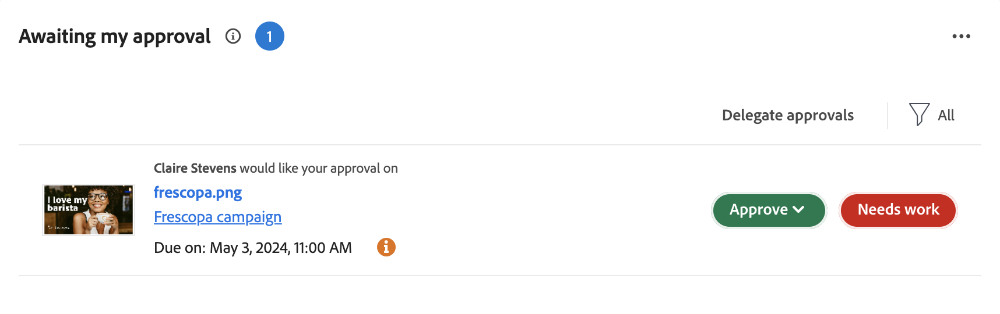

# Prise en main de la révision et de l’approbation des ressources

Le nouveau workflow d’approbation et de révision des ressources repose sur une intégration étroite entre Workfront et Frame.io. Cette intégration tire le meilleur parti de ce que chaque produit a à offrir et les combine pour créer une expérience qui permet à toutes les personnes impliquées dans la création de contenu de travailler dans leurs outils de choix, tout en ayant accès aux commentaires, aux fichiers et aux mises à jour d’état, le tout synchronisé sur les deux systèmes en temps réel.

Pour plus d’informations sur Frame.io, voir [Prise en main de Frame.io](https://support.frame.io/en/collections/49298-getting-started).

## Lancement et planification du travail dans Workfront

L’administrateur de Workfront active l’intégration entre Workfront et Frame.io en configurant le compte Frame.io par défaut dans la zone Configuration, puis en désignant les utilisateurs de Frame.io dans Workfront. Cela permet au coordinateur de planifier et de lancer des travaux à l’aide de projets Workfront et de workflows de révision et d’approbation officiels.

### Configuration du compte Frame.io par défaut [!BADGE Bientôt disponible]{type=Informative}

>[!IMPORTANT]
>
>Cette fonctionnalité sera bientôt disponible. Pour l’instant, les comptes Frame.io sont ajoutés manuellement par l’équipe Workfront. Contactez votre gestionnaire de compte d’Adobe.

Les administrateurs de Workfront lancent l’intégration de Workfront et de Frame.io en ajoutant un compte Frame.io par défaut dans la zone Configuration de Workfront. Une fois le compte Frame.io par défaut configuré, tous les projets créés dans Workfront ont un projet miroir créé dans Frame.io.

<!--For more information, see [].

 in procedure article we need to cover how groups work with projects and how the frame account is associated with a group. And that accounts other than the default can be added on a 1:1 basis using the dev token. -->

### Activer les utilisateurs de Frame.io disponibles maintenant

Les utilisateurs de Workfront qui utilisent régulièrement Frame.io doivent être marqués comme des utilisateurs de Frame.io. Les administrateurs de Workfront peuvent désigner des utilisateurs de Frame.io dans le profil utilisateur de Workfront.

>[!TIP]
>
>Nous recommandons d’activer les utilisateurs qui travaillent régulièrement dans des outils de création et de charger des ressources pour révision et approbation en tant qu’utilisateurs de Frame.io.

Lorsqu’un utilisateur est marqué comme utilisateur de Frame.io dans Workfront et est ajouté à un projet,

* Ils sont ajoutés en tant que collaborateur dans Frame.io
* Ils peuvent envoyer des ressources de Frame.io à Workfront pour révision et approbation formelles.
* Ils peuvent afficher des informations dans le dossier de synchronisation unidirectionnelle à partir de Workfront.

Pour plus d’informations, voir [].

### Création d’un projet connecté à Frame.io

Une fois que le compte Frame.io par défaut est ajouté et que les utilisateurs de Frame.io sont désignés, les coordinateurs de projet peuvent créer des projets Workfront connectés à Frame.io. Lorsque vous créez un projet connecté, vous pouvez :

* **Affecter des utilisateurs de Frame.io à des tâches**: les utilisateurs activés pour Frame.io sont avertis par e-mail lorsqu’ils sont affectés à une tâche Workfront, ce qui indique qu’il reste du travail à faire.
* **Partage du projet avec les utilisateurs de Frame.io**: lorsqu’un projet est partagé avec des utilisateurs activés pour Frame.io, ils ont accès au projet à l’intérieur de Workfront et de Frame.io.
* **Partage de contenu créatif avec Frame.io**: les coordinateurs de projet peuvent envoyer des instructions et du matériel de Workfront directement à l’utilisateur créatif de Frame.io à l’aide d’un dossier de projet de synchronisation unidirectionnelle. [!BADGE Bientôt disponible]{type=Informative}
* **Suivi de la progression de la tâche**: les créatifs peuvent envoyer des ressources terminées et marquer les tâches comme terminées, le tout sans quitter Frame.io.

Pour plus d’informations, voir [].

<!--Preassign approval templates to tasks coming in the future-->

## Création et collaboration de contenu dans Frame.io

Les créatifs peuvent rester dans leurs outils de choix et avoir la liberté de créer, d&#39;itérer et d&#39;effectuer des critiques par les pairs sur Frame.io.

Lorsqu’un élément créatif est ajouté à un projet connecté, il peut effectuer les opérations suivantes dans Frame.io :

<!--* Access instructions from the project coordinator -->
* Réaliser des examens par les pairs informels
* Envoi de ressources terminées à Workfront pour révision et approbation formelles
* Modifier l’état d’une tâche ou la marquer comme terminée
* Charger de nouvelles versions, puis les soumettre à nouveau pour approbation <!--do they have to send to frame.io again?-->

Pour plus d’informations sur la révision des ressources dans Frame.io, voir [].

## Révision et approbation de ressources

Une fois qu’un créatif envoie une ressource terminée à Workfront à partir de Frame.io, le coordinateur de projet peut lancer le processus de révision et d’approbation formel dans Workfront.

Une fois le processus d’approbation créé, les réviseurs et les approbateurs reviennent sur Frame.io pour ajouter des commentaires et marquer la ressource. Ils peuvent également prendre la décision d’approbation dans la visionneuse Frame.io.

### Lancer des révisions et des approbations formelles dans Workfront

Les coordinateurs de projet peuvent créer une révision et des validations uniques ou des modèles d’approbation réutilisables. Toutes les activités de révision et d’approbation de Frame.io sont également enregistrées dans Workfront.

#### Ajout de réviseurs et d’approbateurs

Les coordinateurs de projet ont la possibilité d’affecter des réviseurs, des approbateurs ou une combinaison des deux :

* **Réviseurs** peuvent ajouter des commentaires et marquer des ressources. Une fois la révision terminée, ils peuvent la marquer comme terminée. Le fait de marquer la révision comme terminée n’est pas nécessaire pour que la ressource aille de l’avant dans le processus d’approbation.<!--example of when to add reviewers-->
* **Approbateurs** peuvent ajouter des commentaires et marquer des ressources. Ils doivent prendre la décision de faire avancer le processus d’approbation.

#### Créer un workflow de révision et d’approbation

Les validants et les validants peuvent être ajoutés à un workflow de validation à usage unique ou à un modèle de validation réutilisable :

* **Validations à usage unique**: dans le projet ou la tâche où réside la ressource, le coordinateur de projet peut affecter les réviseurs et les approbateurs et définir une date limite d’achèvement. Les validants et les approbateurs sont rappelés par email 72 et 24 heures avant le délai ainsi que le délai lui-même.

* **Modèles de validation**: dans la zone Configuration de Workfront , les coordinateurs de projet peuvent créer des modèles d’approbation fiables. Dans un modèle, les utilisateurs peuvent ajouter des validants et des approbateurs et spécifier un délai d’achèvement. Lorsque le modèle de validation est appliqué à une ressource, la date limite est calculée à partir de la période spécifiée.

  Une fois créé, un modèle peut être appliqué aux ressources envoyées à partir de Frame.io pour lancer le processus de révision et d’approbation formel dans Workfront.
  

  Pour plus d’informations, voir [Créer et gérer des modèles d’approbation]
  <!--add link.-->

* Télécharger une ressource à partir de Workfront et l’envoyer pour la révision et l’approbation <!-- delayed? -Need more info on this workflow -->

### Approbation des ressources dans Frame.io

Les parties prenantes peuvent passer en revue et approuver les ressources connectées à l’aide de la visionneuse Frame.io.

Pour plus d’informations sur la révision des ressources dans Frame.io, voir <!-- get link from frame team?-->

#### Accès à la visionneuse Frame.io

Les utilisateurs peuvent accéder à la visionneuse Frame.io de la manière suivante :

* Notifications par courrier électronique Workfront
* Le widget J’attends mon approbation dans la nouvelle zone d’accueil de Workfront
  

>[!NOTE]
>
>Les utilisateurs Workfront externes sont avertis par e-mail et sont invités à créer une connexion à Frame.io pour réviser et approuver les ressources.
<!-- is this right?-->

#### Ajouter des commentaires et marquer des ressources

Tous les commentaires effectués dans la visionneuse Frame.io sont également enregistrés dans l’onglet Mises à jour de Workfront . Les réponses effectuées dans Workfront n’apparaissent pas dans Frame.io. Si les commentaires sont marqués comme &quot;Equipe uniquement&quot; dans la visionneuse Frame.io, ils n’apparaîtront pas dans l’onglet Mises à jour de Workfront .

#### Prendre une décision

Une fois toute l’activité de révision terminée, les approbateurs doivent prendre l’une des décisions suivantes :

* Approuver : la ressource n’a pas besoin de modifications et est prête à être utilisée.
* Approuver avec des modifications : la ressource nécessite des modifications et est prête à être utilisée une fois qu’elle a été effectuée. Aucune validation supplémentaire n’est requise.
* Travail nécessaire : la ressource nécessite des modifications et n’est pas prête à être utilisée. Une fois les modifications spécifiées effectuées, la ressource doit être chargée sous la forme d’une nouvelle version et passer par un autre cycle de validations. <!--is the same approval workflow automatically applied? Does the coordinator have to do anything to get the approval going? -->

Les réviseurs peuvent marquer la fin de leur révision dans la visionneuse Frame.io, mais cela n’est pas nécessaire pour que la ressource puisse avancer dans le processus d’approbation. <!--check if this is accurate -->

<!-- upload assets directly to workfront to be reviewed in Frame.io/ Will have to send manually at first

Reviewer/approver needs to go through email to get to frame vier
-->

### Suivi des mesures de révision et d’approbation

Les coordinateurs de projet peuvent suivre la progression de toutes les validations en cours dans la zone d’accueil de Workfront avec le widget suivant :

* **Toutes les validations**: affiche 2 graphiques avec des informations sur le temps d’approbation moyen et les décisions, ainsi que des listes de vues des approbations en attente et en retard.
  

### Envoi de ressources approuvées à Adobe Experience Manager Assets

<!-- deprioritized?-->
Utilisez l’intégration native pour envoyer des ressources approuvées à Adobe Experience Manager Assets.

^ need plus d’informations

## Exemple de workflow d’approbation de ressource de campagne

<!-- do we still want something like this?-->

 - nécessite probablement une version différente de celle-ci ou même une présentation vidéo
