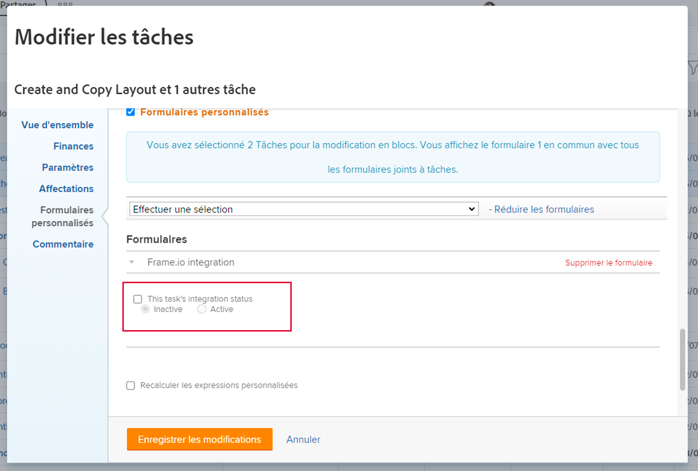

# Connecter Workfront et Frame.io

>[!IMPORTANT]
>
>Le contenu de cet article fait référence à la fonctionnalité d’approbation de document mise à jour, disponible uniquement pour des comptes spécifiques. Pour plus d’informations sur les processus d’approbation standard, reportez-vous aux articles répertoriés dans la section [Approbations de travail](/help/quicksilver/review-and-approve-work/manage-approvals/manage-approvals.md).

Workfront tire parti de Frame.io dans le processus de révision et d’approbation pour permettre aux utilisateurs et utilisatrices de travailler en tout lieu. Le processus de gestion et d’approbation de projets est effectué dans Workfront et la révision est réalisée dans Frame.io. Pour configurer l’intégration, vous devez compléter toutes les sections suivantes :

* [Connecter un groupe Workfront à une équipe Frame.io](#connect-a-workfront-group-to-a-frameio-team)
* [Créer un projet Workfront et ajouter un groupe connecté](#create-a-workfront-project-and-add-a-connected-group)

## Conditions d’accès

* Votre entreprise doit être intégrée manuellement à la version bêta en utilisant la fonctionnalité décrite dans cet article. Pour plus d’informations, voir [Intégration native d’Adobe Workfront et de Frame.io bêta](/help/quicksilver/review-and-approve-work/Documents/wf-frame-alpha.md).

## Connecter un groupe Workfront à une équipe Frame.io

Nous améliorons continuellement cette fonctionnalité en vue d’une disponibilité générale en mai.

### Conditions préalables

* Créez une équipe Frame.io à mapper à un groupe Workfront.
* Recherchez le jeton de développement de l’API pour l’équipe. Pour plus d’informations, consultez la section [Jetons de développement](https://developer.frame.io/docs/getting-started/authentication#developer-tokens) sur le site de développement de Frame.io.

### Connecter un groupe Workfront à une équipe Frame.io

{{step-1-to-setup}}

1. Dans le panneau de gauche, cliquez sur **Groupes**.
1. Sélectionnez un groupe existant ou cliquez sur **Créer un groupe**.
1. Dans le panneau de gauche, cliquez sur **Se connecter à Frame.io**.
   
1. Saisissez le jeton de développement d’API.
1. Cliquez sur **Lancer la connexion**.
1. (Le cas échéant) Si vous êtes administrateur ou administratrice de plusieurs comptes Frame.io, sélectionnez le compte à utiliser.

## Créer un projet Workfront et ajouter un groupe connecté

Une fois un groupe Workfront connecté à une équipe Frame.io, vous devez créer un projet avec ce groupe connecté.

### Conditions préalables

* Un groupe Workfront doit être connecté à une équipe Frame.io, comme expliqué dans la section précédente.

### Créer un projet Workfront et ajouter un groupe connecté

{{step1-to-projects}}

1. Créez un projet à partir de zéro ou d’un modèle. Pour plus d’informations sur la création d’un projet, consultez la section [Créer un projet](/help/quicksilver/manage-work/projects/create-projects/create-project.md).

1. Dans le panneau de gauche, recherchez **Détails du projet**.

1. Recherchez le champ **Groupe** sur le côté droit de l’écran, puis supprimez le groupe par défaut.

1. Dans le menu déroulant, recherchez le groupe souhaité. Les groupes connectés à Frame.io affichent l’icône Frame.io.
   

1. Apportez toute autre modification à la configuration du projet.

1. Cliquez sur **Enregistrer les modifications**.

1. Passez à la section suivante.

### Ajouter une tâche et définir le statut d’intégration sur Actif

>[!NOTE]
>
>Les sous-tâches ne sont actuellement pas prises en charge dans les projets Frame.io connectés.

1. Créez les tâches à remplir dans Frame.io.

1. Sélectionnez les tâches nécessaires, puis cliquez sur **Modifier**.

1. Faites défiler l’écran jusqu’à **Formulaires personnalisés** et recherchez le formulaire d’intégration Frame.io.

   >[!IMPORTANT]
   >
   >Un groupe Frame.io connecté doit être affecté à la zone Détails du projet pour que ce formulaire s’affiche. Pour plus d’informations, consultez la section [Créer un projet Workfront et ajouter un groupe connecté](#create-a-workfront-project-and-add-a-connected-group) de cet article.

1. Activez la case **Statut d’intégration de cette tâche**, puis sélectionnez **Actif**.
   

1. Cliquez sur **Enregistrer les modifications**. Une icône Frame.io s’affiche en regard du nom du projet.

1. Affectez des personnes ou des équipes aux tâches.

   >[!NOTE]
   >
   >Les personnes ou équipes ajoutés aux tâches sont également ajoutés au projet Frame.io.

1. Chargez des documents ou des documents créatifs dans la zone Documents du projet.

Le projet n’est toujours pas connecté. Vous devez passer à la section suivante pour terminer l’intégration.

### Activer le projet dans Frame.io

1. Modifiez le statut du projet de **Planification** à **En cours** ou à un statut personnalisé égal à En cours. L’intégration est maintenant terminée et le projet, les tâches et tous les documents sont générés dans Frame.io.

L’icône Frame.io en regard du nom du projet devient violette pour signaler que l’intégration a réussi. Les utilisateurs et utilisatrices reçoivent un e-mail d’invitation au projet Frame.io.

>[!IMPORTANT]
>
>Une fois le projet connecté à Frame.io, les modifications apportées au groupe de projets ne sont pas répercutées dans Frame.io.
