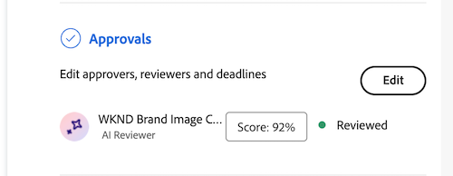

# Afficher le score et le retour d’informations du réviseur de l’IA

>[!NOTE]
>
>Cette fonctionnalité est actuellement en version bêta.

Quelques secondes après l’envoi de la demande de révision et d’approbation, vous pouvez afficher le score et le retour d’informations du réviseur de l’IA dans le panneau Résumé du document .

Le réviseur de l’IA n’est pas conçu pour être un décideur dans le workflow de révision et d’approbation. Il ne fournit qu’un score et des recommandations pour aligner la ressource sur les exigences de marque spécifiées.

## Afficher le score et le retour d’informations

Vous pouvez afficher le score et les commentaires du réviseur de l’IA dans le panneau Résumé du document ou dans l’onglet Approbations de la page Détails du document .

1. Dans l’e-mail de notification Workfront, cliquez sur **Accéder à la révision**.
ou
Accédez à la zone Documents où le document est chargé, puis ouvrez le panneau Résumé du document .
1. Cliquez sur **Score**.
   

Dans la fenêtre Évaluation et commentaires , le réviseur de l’IA explique comment la ressource ne respecte pas les instructions spécifiées.

## Chargez une nouvelle version et ajoutez à nouveau un réviseur d’IA.

Si vous devez ajuster la ressource en fonction des commentaires du réviseur de l’IA, vous pouvez charger une nouvelle version et démarrer une nouvelle révision.

Pour plus d’informations, voir [Charger une nouvelle version du document et demander une approbation](/help/quicksilver/review-and-approve-work/document-reviews-and-approvals/manage-document-approvals/upload-new-doc-version.md).
