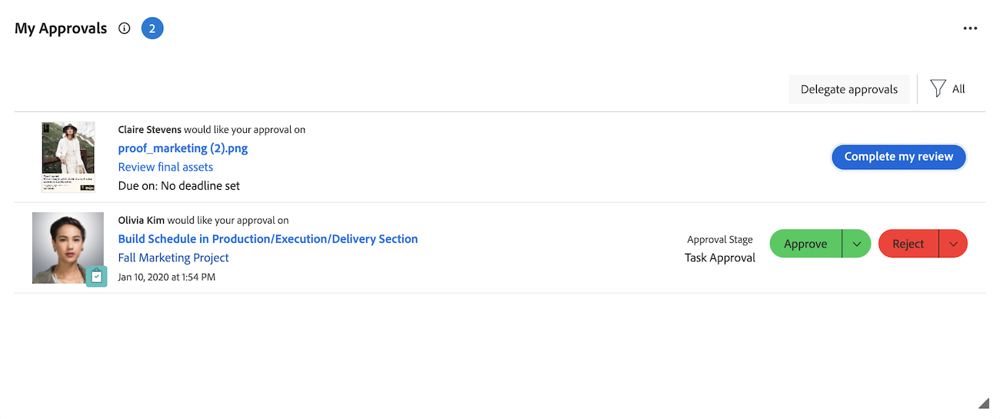

# Approuver du travail

<!--

(NOTE:&nbsp;From&nbsp;Courtney: Linked to Training sites/ articles , don't change title and link)

-->

Si vous êtes une personne chargée de l’approbation, il est essentiel que vous examiniez régulièrement les travaux en attente de votre approbation.

Pour plus d’informations sur la création de processus d’approbation, voir [Créer un processus d’approbation pour des éléments de travail](../../administration-and-setup/customize-workfront/configure-approval-milestone-processes/create-approval-processes.md).

Pour plus d’informations sur l’association des approbations à du travail dans Workfront, voir [Associer un processus d’approbation nouveau ou existant à du travail](../../review-and-approve-work/manage-approvals/associate-approval-with-work.md).

## Conditions d’accès

+++ Développez pour afficher les exigences d’accès aux fonctionnalités de cet article.

Vous devez disposer des accès suivants pour effectuer les étapes décrites dans cet article :

<table style="table-layout:auto"> 
 <col> 
 <col> 
 <tbody> 
  <tr> 
   <td role="rowheader">Formule Adobe Workfront*</td> 
   <td> 
Tous
 </td> 
  </tr> 
  <tr> 
   <td role="rowheader">Licence Adobe Workfront*</td> 
   <td> 
Révision ou supérieur
 </td> 
  </tr> 
  <tr> 
   <td role="rowheader">Configurations du niveau d’accès*</td> 
   <td> 
Accès Afficher ou supérieur aux objets associés à des approbations
 
Remarque : si vous n’avez toujours pas d’accès, demandez à votre équipe d’administration Workfront s’il existe des restrictions supplémentaires à votre niveau d’accès. Pour plus d’informations sur la façon dont un administrateur ou une administratrice Workfront peut modifier votre niveau d’accès, voir <a href="../../administration-and-setup/add-users/configure-and-grant-access/create-modify-access-levels.md" class="MCXref xref">Créer ou modifier des niveaux d’accès personnalisés</a>.
 </td> 
  </tr> 
  <tr> 
   <td role="rowheader">Autorisations d’objet</td> 
   <td> 
Autorisations Afficher ou supérieures pour les objets associés aux approbations
 
Pour plus d’informations sur la demande d’accès supplémentaire, voir <a href="../../workfront-basics/grant-and-request-access-to-objects/request-access.md" class="MCXref xref">Demander l’accès aux objets </a>.
 </td> 
  </tr> 
 </tbody> 
</table>

Pour connaître le plan, le type de licence ou l’accès dont vous disposez, contactez votre administrateur ou administratrice Workfront.

+++

## Localiser des approbations dans Adobe Workfront

Vous pouvez afficher et gérer les approbations dans différentes zones de Workfront.

Pour plus d’informations sur l’affichage des éléments en attente d’approbation ou des éléments que vous avez soumis pour approbation, consultez la section [Afficher les approbations](../../review-and-approve-work/manage-approvals/view-approvals.md).

## Approuver le travail depuis la zone d’accueil

1. Cliquez sur l’icône **[!UICONTROL Menu principal]**  dans le coin supérieur droit, puis cliquez sur **[!UICONTROL Accueil]**.
1. (Conditionnel) Cliquez sur **Personnaliser** pour ajouter le widget **Mes approbations**.
1. (Conditionnel) Cliquez sur le menu déroulant **Filtre**, puis sélectionnez **Toutes** pour voir les approbations qui vous sont affectées et qui vous sont déléguées.

   >[!NOTE]
   >
   >Les approbations affectées à des fonctions ou à des groupes ne s’affichent pas dans la page d’accueil. Les approbations affectées aux équipes s’affichent dans le widget Mes approbations pour chaque membre de l’équipe.

1. Sélectionnez l’élément pour lequel vous souhaitez prendre une décision d’approbation.

   

1. Cliquez sur l’une des options disponibles lorsque vous prenez une décision d’approbation dans le panneau de droite. Les options suivantes s’affichent dans le coin supérieur droit de la page, en fonction du type d’élément que vous approuvez :

   <table>
   <tr>
      <td>
      
<strong>Accès</strong>

      </td>
      <td>
      
<strong>Éléments de travail</strong>

      </td>
      <td>
      
<strong>Documents</strong>

      </td>
      <td>
      
<strong>Épreuves</strong>

      </td>
   </tr>
   <tr>
      <td>
       <ul>
      <li>Subvention</li>
      <li>Ignorer</li>
      </ul>
      Vous pouvez ajuster le niveau d’accès dans le menu déroulant <b>Modifier l’accès</b> si vous le souhaitez.
      </td>
      <td>
         <ul>
         <li>Approuver</li>
         <li>Rejeter</li>
         </ul>
      Vous pouvez laisser un commentaire avec votre décision en cliquant sur le menu déroulant dans le bouton de décision.
      </td>
      <td>
   Affecté en tant qu'approbateur
         <ul>
         <li>Approuver</li>
         <li>Approuver avec des modifications</li>
         <li>Travail nécessaire</li>
         </ul>
   Affecté en tant que réviseur/réviseuse
         <ul>
         <li>Terminer mon examen</li>
         </ul>
      Les options de cette colonne s'appliquent uniquement aux validations unifiées. Les approbations de documents hérités apparaissent comme les approbations d’éléments de travail. 
      </td>
      <td>
         <ul>
         <li>Accéder au BAT</li>
         </ul>
         Vous prenez votre décision dans la visionneuse d’épreuves. Pour plus d’informations sur la révision d’une épreuve, consultez la section <a href="../../review-and-approve-work/proofing/reviewing-proofs-within-workfront/review-proofs-in-wf.md">Réviser des épreuves dans Adobe Workfront</a>.
      </td>
   </tr>
   </table>

Une fois la décision prise, l’approbation est supprimée du widget Mon approbation .

## Ouvrir une épreuve à partir d’un projet, d’une tâche ou d’un problème

Lorsque vous attendez l’approbation d’un projet, d’une tâche ou d’un problème, vous avez la possibilité d’approuver ou de rejeter cette approbation directement à partir du projet, de la tâche ou du problème en question. Vous pouvez également consulter les détails de la procédure d’approbation.

Pour approuver un travail directement à partir d’un projet, d’une tâche ou d’un problème, procédez comme suit :

1. Accédez au projet, à la tâche ou problème qui nécessite votre approbation.

   Les détails concernant le processus d’approbation d’un projet, d’une tâche ou d’un problème s’affichent dans l’en-tête de l’élément.

   

   Les informations d’approbation suivantes sont disponibles :

   <table style="table-layout:auto"> 
    <col> 
    <col> 
    <tbody> 
     <tr> 
      <td role="rowheader">Statut</td> 
      <td>Statut actuel du projet, de la tâche ou du problème. Il s’agit du statut actuel de l’élément en attente d’approbation. Le statut est validé une fois que chaque étape du processus d’approbation a été approuvée.</td> 
     </tr> 
     <tr> 
      <td role="rowheader">Étapes d’approbation</td> 
      <td>Étapes du processus d’approbation.  L’étape en cours qui est en attente d’approbation est affichée comme étant « En attente ». Les étapes déjà validées sont marquées comme approuvées, tandis que celles qui n’ont pas encore été approuvées ont le statut « Non démarré ».</td> 
     </tr> 
    </tbody> 
   </table>

1. Cliquez sur **Approuver** ou **Rejeter**, selon que vous souhaitez approuver ou rejeter le processus d’approbation.\
   L’étape d’approbation en attente a désormais été validée, et le processus d’approbation passe à l’étape suivante. Le statut est approuvé lorsque toutes les étapes ont été approuvées.

## Approuver un document directement à partir d’un document

1. Accédez à la zone des documents qui contient le document nécessitant votre approbation.
1. Sélectionnez le document, puis cliquez sur **Approuver**, **Modifier**, ou **Rejeter**.\
   \
   

1. (Facultatif) Si une épreuve a été générée pour le document, vous pouvez approuver le document dans l’interface de relecture, comme décrit dans [Approuver un document à partir d’une épreuve](#approve-a-document-from-a-proof).

## Approuver un document à partir d’une notification d’approbation par e-mail

En fonction de vos paramètres de notification, vous pouvez recevoir par e-mail des notifications d’approbation de documents nécessitant votre intervention pour une décision d’approbation. Lorsque vous recevez un e-mail contenant un bouton **Prendre une décision d’approbation**, vous pouvez lancer le processus d’approbation directement à partir de cet e-mail :

1. Dans l’e-mail, cliquez sur **Prendre une décision d’approbation** pour ouvrir la page des détails du document de l’épreuve.
1. Pour accéder au document, effectuez l’une des actions suivantes :

   * Affichez les métadonnées du document.
   * Si une épreuve a été créée pour la révision du document avec des balises et des commentaires, cliquez sur **Ouvrir l’épreuve**  dans le coin supérieur droit et passez en revue l’épreuve.

     <!--   
     [Andrzej, does it make sense to leave this here if it's s document approval?&nbsp;Would there never be a proof in that situation?]   
     -->

     Pour plus d’informations sur la révision des épreuves, consultez la section [Réviser des épreuves dans Adobe Workfront](../../review-and-approve-work/proofing/reviewing-proofs-within-workfront/review-proofs-in-wf.md).

1. Cliquez sur l’option **Décision** dans le coin supérieur droit pour approuver, approuver avec des modifications ou rejeter le document.

## Approuver un document à partir d’une épreuve {#approve-a-document-from-a-proof}

Vous pouvez approuver un document dans la visionneuse de relecture. Pour plus d’informations, consultez la section [Prendre une décision sur une épreuve dans la visionneuse de relecture](../../review-and-approve-work/proofing/reviewing-proofs-within-workfront/make-a-decision-on-a-proof/make-decisions-on-proof.md) dans l’article [Prendre une décision sur une épreuve dans la visionneuse de relecture](../../review-and-approve-work/proofing/reviewing-proofs-within-workfront/make-a-decision-on-a-proof/make-decisions-on-proof.md).
