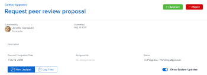
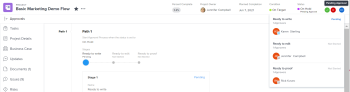

# Approuver du travail

<!--

(NOTE:&nbsp;From&nbsp;Courtney: Linked to Training sites/ articles , don't change title and link)

-->

Si vous êtes défini en tant qu’approbateur, vous devez régulièrement examiner le travail qui attend votre approbation.

Pour plus d&#39;informations sur la création de processus d&#39;approbation, voir [Création d&#39;un processus d&#39;approbation pour les tâches](../../administration-and-setup/customize-workfront/configure-approval-milestone-processes/create-approval-processes.md).

Pour plus d&#39;informations sur l&#39;association des approbations avec le travail dans Workfront, voir [Associer un processus d&#39;approbation nouveau ou existant au travail](../../review-and-approve-work/manage-approvals/associate-approval-with-work.md).

## Conditions d’accès

Vous devez disposer des accès suivants pour effectuer les étapes de cet article :

<table style="table-layout:auto"> 
 <col> 
 <col> 
 <tbody> 
  <tr> 
   <td role="rowheader">Forfait Adobe Workfront*</td> 
   <td> 
N’importe quelle
 </td> 
  </tr> 
  <tr> 
   <td role="rowheader">Licence Adobe Workfront*</td> 
   <td> 
Révision ou supérieur
 </td> 
  </tr> 
  <tr> 
   <td role="rowheader">Configurations des niveau d’accès*</td> 
   <td> 
Afficher ou avoir un accès supérieur aux objets associés aux approbations
 
Remarque : si vous n’avez toujours pas d’accès, demandez à votre équipe d’administration Workfront s’il existe des restrictions supplémentaires à votre niveau d’accès. Pour plus d’informations sur la façon dont un administrateur ou une administratrice Workfront peut modifier votre niveau d’accès, voir <a href="../../administration-and-setup/add-users/configure-and-grant-access/create-modify-access-levels.md" class="MCXref xref">Créer ou modifier les niveaux d’accès personnalisés</a>.
 </td> 
  </tr> 
  <tr> 
   <td role="rowheader">Autorisations d’objet</td> 
   <td> 
Afficher ou avoir des autorisations supérieures sur les objets associés aux approbations
 
Pour plus d’informations sur la demande d’accès supplémentaire, voir <a href="../../workfront-basics/grant-and-request-access-to-objects/request-access.md" class="MCXref xref">Demander l’accès aux objets</a>.
 </td> 
  </tr> 
 </tbody> 
</table>

&#42;Pour connaître le forfait, le type de licence ou l’accès dont vous disposez, contactez votre administrateur ou administratrice Workfront.

## Localisation des approbations dans Adobe Workfront

Vous pouvez afficher et gérer les validations dans différentes zones de Workfront.

Pour plus d’informations sur l’affichage des éléments en attente d’approbation ou des éléments que vous avez vous-même soumis pour approbation, voir [Affichage des approbations](../../review-and-approve-work/manage-approvals/view-approvals.md).

## Approuver le travail depuis la zone d’accueil

1. Cliquez sur l’icône **Accueil**  dans le coin supérieur gauche d’Adobe Workfront.

   >[!NOTE]
   >
   >Votre administrateur ou administratrice Workfront peut apporter les modifications suivantes à l’icône Accueil de votre environnement :
   >
   >   
   >* La remplacer par une image personnalisée pour illustrer votre entreprise. Dans ce cas, l’icône sera différente de celle présentée dans cet article.
   >* Remplacer la page à laquelle elle est liée par une autre page. Dans ce cas, cliquez sur **Menu Principal**  dans le coin supérieur droit de la page, puis sur **Accueil**.

1. Cliquez sur le menu déroulant **Filtre** .

   

1. Sélectionnez **Validations**.\
   Toutes les tâches qui nécessitent votre approbation s’affichent. 

   >[!NOTE]
   >
   >Les approbations affectées à des rôles de tâche ou à des groupes ne s’affichent pas dans Accueil. Les approbations affectées à des équipes s’affichent dans le regroupement Demande d’équipe de la liste de travail.

1. (Facultatif) Modifiez l’ordre d’affichage des validations, comme décrit dans la section &quot;Grouper et trier par date, projet ou priorité&quot; de l’article [Afficher les éléments dans la liste de travail de la zone d’accueil](../../workfront-basics/using-home/using-the-home-area/display-items-in-home-work-list.md).
1. Sélectionnez l’élément pour lequel vous souhaitez prendre une décision d’approbation.

   

1. Cliquez sur l’une des options disponibles lors d’une décision d’approbation dans le panneau de droite. Les options suivantes s’affichent dans le coin supérieur droit de la page, selon le type d’élément que vous approuvez :

   * **Projets :** Cliquez sur **Approve** ou **Reject**.

   * **Tâches :** Cliquez sur **Approve** ou **Reject** .

   * **Problèmes :** Cliquez sur **Approve** ou **Reject** .

   * **Fiches horaires :** Cliquez sur **Approve** ou **Reject** .

   * **Documents :** Cliquez sur **Approve**, **Reject** ou **Changes**.\
      Tenez compte des points suivants lors de l’affichage de  validations :

      * Les validations de BAT s&#39;affichent ici lorsqu&#39;un utilisateur partage un BAT avec vous, comme décrit dans la section &quot;Partager un lien vers un BAT&quot; de l&#39;article [Partager un BAT dans Adobe Workfront](../../review-and-approve-work/proofing/managing-proofs-within-workfront/share-a-proof-in-workfront.md).
      * Les validations de vérification ne s’affichent dans la zone d’accueil que si votre environnement Workfront est intégré à un compte Workfront Proof Premium. Si vous ne pouvez pas utiliser le correctif comme décrit ici, contactez votre administrateur Workfront.
      * Vous recevez une notification in-app, vous informant de la validation.\
        Pour plus d’informations sur les notifications in-app, voir [Affichage et gestion des notifications in-app](../../workfront-basics/using-notifications/view-and-manage-in-app-notifications.md).

      * Le nom de l’utilisateur qui a demandé l’approbation s’affiche en regard de l’image miniature dans la zone Accueil, avec le texte suivant :\
        &quot;*L’utilisateur A* souhaite votre approbation pour...&quot;

        <!--      
        <MadCap:conditionalText data-mc-conditions="QuicksilverOrClassic.Draft mode">      
        (NOTE:&nbsp;From&nbsp;Courtney: Is this true?)      
        </MadCap:conditionalText>      
        -->

        Si le nom d’utilisateur n’est pas disponible, le texte suivant s’affiche :\
        &quot;Une nouvelle version d&#39;un BAT est prête à être affichée&quot;
      * Pour prendre une décision d’approbation sur le BAT, cliquez sur **Aller au BAT**, cliquez sur **Terminer la révision**, puis sur l’une des options disponibles. Les options disponibles lors de l&#39;approbation d&#39;un BAT sont les suivantes : **Approuvé**, **Approuvé avec des modifications**, **Modifications requises** et **Non pertinent**.

      * Une fois qu’une décision a été prise sur le BAT, le BAT reste dans l’onglet Mes approbations avec le texte &quot;Décision effectuée&quot; jusqu’à ce que vous cliquiez sur le bouton **Actualiser** ou jusqu’à ce que vous actualisiez la page du navigateur.

        Pour plus d’informations sur la révision d’un BAT, voir [Vérification des BAT dans Adobe Workfront](../../review-and-approve-work/proofing/reviewing-proofs-within-workfront/review-proofs-in-wf.md).

   * **Accès :** Sélectionnez le niveau d’accès à accorder dans le menu déroulant **Modifier l’accès**, puis cliquez sur **Accorder l’accès**. Ou cliquez sur **Ignorer**.

## Approuver le travail directement à partir d’un projet, d’une tâche ou d’un problème

Lorsqu’un projet, une tâche ou un problème est en attente d’approbation, vous pouvez approuver ou refuser l’approbation directement à partir du projet, de la tâche ou de l’émission. Vous pouvez également afficher les détails concernant le processus de validation.

Pour approuver le travail directement à partir d’un projet, d’une tâche ou d’un problème :

1. Accédez au projet, à la tâche ou au problème qui nécessite votre approbation.

   Les informations d’approbation concernant le processus d’approbation actuel d’un projet, d’une tâche ou d’un problème s’affichent dans l’en-tête de l’élément.

   

   Les informations de validation suivantes sont disponibles :

   <table style="table-layout:auto"> 
    <col> 
    <col> 
    <tbody> 
     <tr> 
      <td role="rowheader">Statut</td> 
      <td>État actuel du projet, de la tâche ou du problème. Il s’agit de l’état actuel de l’élément en attente de l’approbation. Le statut est approuvé une fois chaque étape du processus de validation validée.</td> 
     </tr> 
     <tr> 
      <td role="rowheader">Etapes de validation</td> 
      <td>Les étapes du processus de validation.   L'étape en cours de validation est affichée sous la forme En attente . Les étapes qui ont déjà été approuvées s’affichent comme Approuvé ; les étapes qui n’ont pas encore été approuvées s’affichent comme Pas commencé .</td> 
     </tr> 
    </tbody> 
   </table>

1. Cliquez sur **Approve** ou **Reject**, selon que vous souhaitez approuver ou rejeter le processus d’approbation.\
   L’étape de validation en attente de validation est maintenant approuvée et le processus de validation passe à l’étape suivante. L’état est approuvé une fois toutes les étapes approuvées.

## Approuver un document directement à partir d’un document 

1. Accédez à la zone de documents contenant le document qui doit être approuvé.
1. Sélectionnez le document, puis cliquez sur **Approve**, **Changes** ou **Reject**.\
   \
   

1. (Facultatif) Si un BAT a été généré pour le document, vous pouvez approuver le document dans l’interface de vérification, comme décrit dans la section [Approuver un document à partir d’un BAT](#approve-a-document-from-a-proof).

## Approuver un document à partir d’un email de notification de validation

Selon vos paramètres de notification, vous pouvez recevoir des emails vous informant des documents pour lesquels d’autres utilisateurs doivent vous demander de prendre une décision d’approbation. Lorsque vous recevez un e-mail contenant un bouton **Apporter une décision d’approbation**, vous pouvez démarrer le processus d’approbation directement à partir de l’e-mail :

1. Dans l’e-mail, cliquez sur **Prendre une décision d’approbation** pour ouvrir la page Détails du document du BAT .
1. Pour consulter le document, effectuez l’une des opérations suivantes :

   * Affichez les métadonnées relatives au document.
   * Si un BAT a été créé pour la révision du document avec des balises et des commentaires, cliquez sur **Ouvrir le BAT**  près du coin supérieur droit et passez en revue le BAT.

     <!--   
     [Andrzej, does it make sense to leave this here if it's s document approval?&nbsp;Would there never be a proof in that situation?]   
     -->

     Pour plus d’informations sur la vérification des bons à tirer, voir [Vérification des bons à tirer dans Adobe Workfront](../../review-and-approve-work/proofing/reviewing-proofs-within-workfront/review-proofs-in-wf.md).

1. Cliquez sur une option **Décision** dans le coin supérieur droit pour approuver, approuver avec des modifications ou rejeter le document.

## Approbation d’un document à partir d’un BAT {#approve-a-document-from-a-proof}

Vous pouvez approuver un document dans la visionneuse de vérification. Pour plus d’informations, voir [Prendre une décision sur un BAT dans la visionneuse de correctifs](../../review-and-approve-work/proofing/reviewing-proofs-within-workfront/make-a-decision-on-a-proof/make-decisions-on-proof.md) dans l’article [Prendre une décision sur un BAT dans la visionneuse de correctifs](../../review-and-approve-work/proofing/reviewing-proofs-within-workfront/make-a-decision-on-a-proof/make-decisions-on-proof.md).
