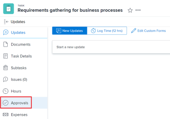
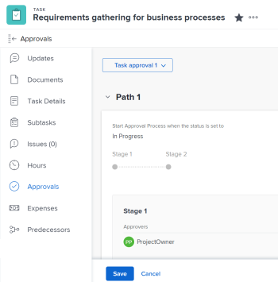

# Associer un processus d’approbation nouveau ou existant au travail

Cet article décrit comment associer des processus d’approbation à des éléments de travail. Pour plus d’informations sur l’association d’approbations à des épreuves ou à des documents, voir les articles suivants :

* [Créer une épreuve avancée avec un workflow automatisé](../../review-and-approve-work/proofing/creating-proofs-within-workfront/create-automated-proof-workflow.md)
* [Demander l’approbation de documents](../../review-and-approve-work/manage-approvals/request-document-approvals.md)

Vous pouvez associer un processus d’approbation global ou à usage unique à un élément de travail dans Adobe Workfront. Les scénarios suivants sont possibles :

* Associez un processus d’approbation global existant à un projet, une tâche, un problème, un modèle ou une tâche de modèle. Certains processus d’approbation globaux sont accessibles à tous les groupes du système. Les processus d’approbation globaux au niveau du groupe ne sont accessibles qu’à certains groupes.
* Créez un processus d’approbation à usage unique et associez-le à un projet, une tâche, un problème, un modèle ou une tâche de modèle existant.

>[!NOTE]
>
>Cet article utilise le terme « processus d’approbation globale » pour faire la différence avec le terme « processus d’approbation à usage unique ». Un processus d’approbation globale peut être utilisé à plusieurs reprises.
>
>Le terme « processus d’approbation globale au niveau du groupe » fait référence à un processus d’approbation qui peut être utilisé à plusieurs reprises pour des éléments et dont les statuts sont associés uniquement à un groupe spécifique.

Pour plus d’informations générales sur les processus d’approbation, voir [Vue d’ensemble des processus d’approbation](../../review-and-approve-work/manage-approvals/approval-process-in-workfront.md).

Pour plus d’informations sur la création d’un processus d’approbation global, voir [Créer un processus d’approbation pour les éléments de travail](../../administration-and-setup/customize-workfront/configure-approval-milestone-processes/create-approval-processes.md).

## Conditions d’accès

+++ Développez pour afficher les exigences d’accès aux fonctionnalités de cet article.

Vous devez disposer des accès suivants pour effectuer les étapes décrites dans cet article :

<table style="table-layout:auto"> 
 <col> 
 <col> 
 <tbody> 
  <tr> 
   <td role="rowheader">Formule Adobe Workfront*</td> 
   <td> 
Tous 
 </td> 
  </tr> 
  <tr> 
   <td role="rowheader">Licence Adobe Workfront*</td> 
   <td> 
Travail ou supérieur
 </td> 
  </tr> 
  <tr> 
   <td role="rowheader">Niveau d’accès*</td> 
   <td> 
Accès en modification ou supérieur aux projets, tâches, problèmes ou modèles
 
Remarque : si vous n’avez toujours pas d’accès, demandez à votre équipe d’administration Workfront s’il existe des restrictions supplémentaires à votre niveau d’accès. Pour plus d’informations sur la façon dont un administrateur ou une administratrice Workfront peut modifier votre niveau d’accès, voir <a href="../../administration-and-setup/add-users/configure-and-grant-access/create-modify-access-levels.md" class="MCXref xref">Créer ou modifier des niveaux d’accès personnalisés</a>.
 </td> 
  </tr> 
  <tr> 
   <td role="rowheader">Autorisations d’objet</td> 
   <td> 
Autorisations de gestion pour le projet, la tâche, le problème ou le modèle
 
Pour plus d’informations sur la demande d’accès supplémentaire, voir <a href="../../workfront-basics/grant-and-request-access-to-objects/request-access.md" class="MCXref xref">Demander l’accès aux objets </a>.
 </td> 
  </tr> 
 </tbody> 
</table>

Pour connaître le plan, le type de licence ou l’accès dont vous disposez, contactez votre administrateur ou administratrice Workfront.

+++

## Remarques sur l’association des processus d’approbation aux éléments de travail

En plus des remarques décrites ci-dessous, nous vous recommandons de revoir les remarques générales sur les processus d’approbation dans Workfront. Pour plus d’informations, voir [Vue d’ensemble du processus d’approbation](../../review-and-approve-work/manage-approvals/approval-process-in-workfront.md).

<!--
  <li data-mc-conditions="QuicksilverOrClassic.Draft mode">Approvals can only be associated with the status of a project, task, or issue in Workfront.</li>
  -->

<!--
  <li data-mc-conditions="QuicksilverOrClassic.Draft mode"> 
Each approval process corresponds with a status option in the Workfront system. When you change the status of a work item, an attached approval for that status requires the status change to be confirmed before the new status can be assigned to the item.
 
(NOTE: the two drafted bullets have been moved to the approval-process-in-workfront article)
 </li>
  -->

* Vous devez créer le projet, la tâche, le problème, le modèle ou la tâche de modèle avant que le processus d’approbation puisse y être associé.
* Lorsque vous joignez un processus d’approbation à un élément pour un statut passé et dans lequel l’élément se trouve actuellement, le processus d’approbation n’est pas déclenché et aucune notification n’est envoyée aux personnes approbatrices.

  **Exemple :** Si une tâche est à l’état Terminé et que vous joignez un processus de validation associé à l’état Terminé, la validation ne se déclenche pas.

* Lorsque vous joignez un processus d’approbation au premier statut d’un élément (en utilisant un modèle pour les tâches et les projets, en utilisant les paramètres de configuration de la file d’attente pour les problèmes, ou en définissant les paramètres de tâche d’un projet pour les nouvelles tâches), les processus d’approbation sont contournés si l’approbation soumise est rappelée. Dans ce cas, les personnes approbatrices ne reçoivent aucune notification.

  Pour plus d’informations sur le rappel des approbations, voir [Afficher les approbations](../../review-and-approve-work/manage-approvals/view-approvals.md).

  >[!TIP]
  >
  >Le premier statut d’une tâche ou d’un problème est Nouveau. Le premier état d’un projet est l’état sélectionné par votre administrateur Workfront dans les préférences du projet de votre système. Pour plus d’informations, voir [Configurer les préférences du projet à l’échelle du système](../../administration-and-setup/set-up-workfront/configure-system-defaults/set-project-preferences.md).

* L’association des processus d’approbation à un objet n’est pas enregistrée dans la zone des mises à jour de l’objet.
* Vous ne pouvez pas associer un processus d’approbation à une tâche parent.
* l’ajout d’un utilisateur ou d’une utilisatrice, d’une équipe ou d’un rôle en tant que responsable de l’approbation ne lui donne pas automatiquement des droits sur l’objet associé à cette approbation. Les autorisations sur l’objet leur sont accordées lorsque l’étape d’approbation est déclenchée. Sinon, les objets doivent être partagés avant qu’une décision d’approbation ne puisse être prise.

Les sections suivantes décrivent les différentes méthodes permettant d’associer un processus d’approbation à un projet, une tâche ou un problème.

## Associer un processus d’approbation global à un élément de travail {#associate-a-global-approval-process-with-a-work-item}

Vous pouvez associer un processus d’approbation global à un élément de travail (projet, tâche, problème, modèle, tâche de modèle).

Le processus d’approbation globale doit être accessible au groupe associé à l’élément de travail ou à tous les groupes du système.

>[!NOTE]
>
>Vous pouvez associer des processus d’approbation de projet à un modèle et des processus d’approbation de tâche à une tâche de modèle. Ensuite, lorsqu’une personne utilise le modèle pour créer un projet, le processus d’approbation devient respectivement un processus d’approbation de projet ou de tâche. Un processus d’approbation à usage unique associé à un modèle ou une tâche de modèle reste un processus d’approbation à usage unique pour les projets et les tâches.

Pour plus d’informations sur la façon dont les administrateurs et administratrices Workfront peuvent configurer un processus d’approbation global pour tous les groupes du système, et sur la façon dont les administrateurs et administratrices de groupe peuvent créer des approbations pour un groupe, voir [Créer un processus d’approbation pour les éléments de travail](../../administration-and-setup/customize-workfront/configure-approval-milestone-processes/create-approval-processes.md).

>[!NOTE]
>
>Vous pouvez également modifier un processus d’approbation global pour répondre à vos besoins spécifiques. Pour plus d’informations, voir la section [Modifier un processus d’approbation global pour l’utiliser sur un objet spécifique](#modify-a-global-approval-process-for-use-on-a-specific-object) dans cet article.

Pour associer un processus d’approbation globale existant à un projet, une tâche, un problème, un modèle ou une tâche modèle :

1. Accédez à l’élément de travail auquel associer un processus d’approbation.
1. Cliquez sur **Approbations** dans le panneau de gauche.

   Vous devrez peut-être cliquer sur **Afficher plus**, puis sur **Approbations**.

   

1. 

   Le processus d’approbation sélectionné s’affiche.

1. Développez le menu déroulant **Utiliser un existant** et sélectionnez un processus d’approbation existant.

   

   Le processus d’approbation sélectionné s’affiche.

   

1. Cliquer sur **Enregistrer**.
1. (Facultatif) Cliquez sur Modifier le processus d’approbation pour modifier l’approbation existante que vous avez jointe à l’élément. La procédure d’approbation globale devient ainsi une procédure d’approbation à usage unique. Pour plus d’informations, voir la section [Modifier un processus d’approbation global pour l’utiliser sur un objet spécifique](#modify-a-global-approval-process-for-use-on-a-specific-object) dans cet article.

## Modifier une procédure d’approbation globale pour l’utiliser sur un objet spécifique {#modify-a-global-approval-process-for-use-on-a-specific-object}

Votre administrateur ou administratrice Workfront ou de groupe crée des processus d’approbation globaux que vous pouvez utiliser, comme décrit dans [Créer un processus d’approbation pour les éléments de travail](../../administration-and-setup/customize-workfront/configure-approval-milestone-processes/create-approval-processes.md).

La modification d’une procédure d’approbation globale attachée à un élément est identique à la modification d’une procédure d’approbation à usage unique.

Vous pouvez modifier un processus d’approbation global pour l’adapter aux besoins spécifiques du projet, de la tâche ou du problème que vous lui associez.

>[!IMPORTANT]
>
>Lorsque vous modifiez un processus d’approbation global, il devient un processus d’approbation à usage unique qui ne peut être utilisé que sur l’objet pour lequel vous l’avez modifié. La procédure d’approbation globale reste inchangée.
>
>Tenez compte des limitations suivantes lorsque vous modifiez une procédure d’approbation globale :
>
>* Le processus d’approbation n’est modifié que pour le projet, la tâche ou le problème auquel vous l’associez.
>* Toute modification ultérieure apportée par l’administration au processus d’approbation globale original ne se répercute pas sur le processus d’approbation globale que vous avez modifié.
>

Pour modifier un processus d’approbation déjà attaché à un élément :

1. Ajoutez un processus d’approbation global au projet, à la tâche ou au problème.

   Pour plus d’instructions, voir la section [Associer un processus d’approbation global à un élément de travail](#associate-a-global-approval-process-with-a-work-item) dans cet article.

   >[!IMPORTANT]
   >
   >Veillez à cliquer sur **Enregistrer** lorsque vous ajoutez l’approbation.

1. Une fois la procédure d’approbation globale ajoutée, cliquez sur l’icône **Modifier**  dans le coin supérieur droit de la page d’approbation. Cette action transforme la procédure d’approbation globale ou au niveau du groupe en une procédure d’approbation à usage unique.
1. Apportez des modifications à la procédure d’approbation existante. Pour plus d’informations, voir la section [Associer un processus d’approbation à usage unique à un projet, une tâche, un problème, un modèle ou une tâche de modèle](#associate-a-single-use-approval-process-with-a-project-task-issue-template-or-template-task) dans cet article.
1. Cliquez sur **Enregistrer**, puis cliquez à nouveau sur **Enregistrer** pour confirmer que vous souhaitez convertir le processus d’approbation global en un processus d’approbation à usage unique disponible uniquement pour cet objet.

## Associer un processus d’approbation à usage unique à un projet, une tâche, un problème, un modèle ou une tâche de modèle {#associate-a-single-use-approval-process-with-a-project-task-issue-template-or-template-task}

Vous pouvez créer un processus d’approbation à usage unique pour un projet, une tâche ou un problème spécifique.

Vous pouvez également associer un processus d’approbation à usage unique à un modèle ou à une tâche de modèle, afin qu’il soit disponible pour les projets et les tâches créés à partir du modèle.

>[!NOTE]
>
>Vous pouvez associer un processus d’approbation à usage unique à n’importe quel statut de niveau système ou de niveau groupe pour un projet, une tâche, un problème, un modèle ou une tâche de modèle. Pour plus d’informations sur les statuts Workfront, voir [Créer ou modifier un statut](../../administration-and-setup/customize-workfront/creating-custom-status-and-priority-labels/create-or-edit-a-status.md).

La création d’un processus d’approbation de cette manière vous permet de créer un processus d’approbation personnalisé pour répondre à vos besoins. Toutefois, le processus d’approbation ne pourra pas être associé à d’autres éléments de travail à l’avenir.

Vous pouvez également modifier un processus d’approbation global pour un élément spécifique, qui devient alors un processus d’approbation à usage unique. Pour plus d’informations, voir la section [Modifier un processus d’approbation global pour l’utiliser sur un objet spécifique](#modify-a-global-approval-process-for-use-on-a-specific-object) dans cet article.

Pour créer un processus d’approbation à usage unique :

1. Accédez au projet, à la tâche, au problème, au modèle ou à la tâche de modèle auquel associer un processus d’approbation.
1. Cliquez sur **Approbations** dans le panneau de gauche.

   Vous devrez peut-être cliquer sur **Afficher plus** > **Approbations**.

   

1. Cliquez sur **Créer une utilisation unique**.

   

1. Effectuez les étapes à partir de l’étape 6 de la section « Créer un processus d’approbation global au niveau du système ou du groupe pour les éléments de travail » dans l’article [Créer un processus d’approbation pour les éléments de travail](../../administration-and-setup/customize-workfront/configure-approval-milestone-processes/create-approval-processes.md).

   <!--
   
(NOTE: overtime, ensure step 6 is still accurate here)&nbsp;

   -->

   >[!TIP]
   >
   >Une fois que vous avez joint le processus d’approbation à usage unique, il s’affiche comme « `<Custom>` » dans le champ Processus d’approbation à l’intérieur de la zone Modifier des modèles et des tâches de modèle. Pour plus d’informations sur la modification des modèles ou des tâches de modèle, voir les articles suivants :
   >
   >* [Modifier les modèles de projet](../../manage-work/projects/create-and-manage-templates/edit-templates.md)
   >* [Modifier une tâche de modèle](../../manage-work/projects/create-and-manage-templates/edit-template-task.md)

   <!--
   >
(NOTE: this will need to be removed when they bring the new Edit Template/ Template Task boxes to NWE) 
   >
   -->

## Retirer ou supprimer un processus d’approbation d’un élément de travail

Vous pouvez retirer un processus d’approbation global ou au niveau d’un groupe, ou vous pouvez supprimer un processus d’approbation à usage unique d’un projet, d’une tâche ou d’un problème qui lui était précédemment associé.

Les scénarios suivants existent :

* Le fait de retirer le processus d’approbation au niveau global ou au niveau du groupe ne supprime pas l’approbation. L’autorisation reste disponible pour une utilisation future.
* La suppression d’un processus d’approbation à usage unique le supprime de Workfront et il ne peut pas être récupéré.

Pour retirer ou supprimer un processus d’approbation d’un élément de travail, procédez comme suit :

1. Accédez au projet, à la tâche, au problème, au modèle ou à la tâche de modèle pour qui vous souhaitez retirer un processus d’approbation que vous avez précédemment ajouté.
1. Cliquez sur **Approbations** dans le panneau de gauche.

   Vous devrez peut-être cliquer sur **Afficher plus** > **Approbations**.

   

1. Cliquez sur l’une des icônes suivantes dans le coin supérieur droit de la section Approbations, en fonction du type d’approbation associé à l’élément :

   * **Icône Retirer**  pour les approbations globales ou au niveau du groupe.
   * **Icône Supprimer**  pour les approbations à usage unique.

1. Cliquez sur **Retirer** ou **Supprimer** pour confirmer.

   Le processus d’approbation est retiré de l’élément de travail.

## Associer automatiquement un processus d’approbation aux éléments de travail

Vous pouvez associer automatiquement un processus d’approbation aux éléments de travail à l’aide des workflows suivants :

* Pour les projets et les tâches, vous pouvez associer un processus d’approbation à l’aide d’un modèle. Vous pouvez joindre un processus d’approbation existant à l’onglet Approbation des modèles ou à l’onglet Approbation des tâches de modèle. Pour plus d’informations sur l’association d’une approbation existante à un élément de travail, voir [Associer un processus d’approbation global à un élément de travail](#associate-a-global-approval-process-with-a-work-item) dans cet article.
* Pour les nouvelles tâches d’un projet existant, vous pouvez associer un processus d’approbation global ou un processus d’approbation global au niveau du groupe dans la zone Paramètres de la tâche de la zone Modifier le projet. Pour plus d’informations, voir la section « Paramètres de la tâche » dans l’article [Modifier les projets](../../manage-work/projects/manage-projects/edit-projects.md).
* Pour les problèmes, vous pouvez associer une approbation à chaque nouveau problème ajouté à un projet en associant un processus d’approbation existant à une file d’attente des demandes. Pour plus d’informations sur la configuration des files d’attente des demandes, voir [Créer une file d’attente des demandes](../../manage-work/requests/create-and-manage-request-queues/create-request-queue.md).
