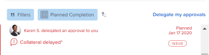

# Déléguer une demande d’approbation

Vous pouvez déléguer temporairement la tâche à laquelle vous êtes affecté lorsque vous êtes absent du bureau. Vous pouvez déléguer des tâches et des affectations d’émission ou déléguer des demandes d’approbation. Cet article décrit comment déléguer des demandes d’approbation. Pour plus d’informations sur la délégation des tâches et des affectations de problèmes, voir [Gérer la délégation de tâche et de problème](../../manage-work/delegate-work/how-to-delegate-work.md).

Vous pouvez déléguer les types d’approbations suivants, quelle que soit la manière dont l’approbation vous a été attribuée (directement à vous, à une équipe dont vous faites partie ou à votre rôle de tâche) :

* Approbation de projet
* Approbation de tâches
* Approbation de problèmes

Vous ne pouvez pas déléguer les validations de feuille de temps, de document ou de BAT.

>[!NOTE]
>
>Pour garantir qu’aucune incohérence ne se produise avec les dates que vous programmez pour que vos approbations soient déléguées, nous vous recommandons de faire correspondre le fuseau horaire de votre profil utilisateur à celui de votre planning. Pour plus d’informations, consultez les articles suivants :
>
>* [Créer un planning](../../administration-and-setup/set-up-workfront/configure-timesheets-schedules/create-schedules.md)
>* [Modifier le profil d’un utilisateur](../../administration-and-setup/add-users/create-and-manage-users/edit-a-users-profile.md)
>

## Conditions d’accès

+++ Développez pour afficher les exigences d’accès aux fonctionnalités de cet article.

Vous devez disposer des accès suivants pour effectuer les étapes de cet article :

<table style="table-layout:auto"> 
 <col> 
 </col> 
 <col> 
 </col> 
 <tbody> 
  <tr> 
   <td role="rowheader">
Forfait Adobe Workfront*
</td> 
   <td> 
N’importe quelle
 </td> 
  </tr> 
  <tr> 
   <td role="rowheader">
Licence Adobe Workfront*
</td> 
   <td> 
Révision ou supérieur
 </td> 
  </tr> 
 </tbody> 
</table>

Pour connaître le plan ou le type de licence dont vous disposez, contactez votre administrateur Workfront.

+++

## Comprendre l’accès des utilisateurs pour les approbations déléguées

Au cours de la période de validation désignée, l’utilisateur à qui vous déléguez une demande de validation dispose des fonctionnalités suivantes :

* Peut approuver ou rejeter des demandes d’approbation existantes lorsqu’aucune décision n’a été prise
* Peuvent approuver et rejeter les nouvelles demandes de validation reçues au cours d’une période spécifiée
* Accorde l’accès Affichage aux objets en attente d’approbation

  >[!NOTE]
  >
  > L’administrateur Adobe Workfront peut empêcher les utilisateurs d’accéder à certains types d’objets. Lorsqu’un utilisateur n’a pas accès à un type d’objet et qu’une approbation de ce type est déléguée à l’utilisateur, celui-ci ne dispose pas de l’accès Affichage à l’objet. Cependant, l’utilisateur peut toujours approuver ou rejeter les demandes d’approbation de la page **Accueil**, comme décrit dans [Valider le travail](../../review-and-approve-work/manage-approvals/approving-work.md).\
  >Par exemple, l’utilisateur A appartient au groupe A. L’administrateur de Workfront a restreint les droits d’accès au groupe A afin que les utilisateurs de ce groupe ne puissent pas afficher les tâches dans Workfront. Si une demande d’approbation de tâche est déléguée à l’utilisateur A, l’utilisateur A ne peut pas afficher la tâche à laquelle elle est associée. Cependant, l’utilisateur A peut approuver ou rejeter la demande de validation à partir de la page d’accueil.

  Pour plus d’informations sur la manière dont l’administrateur de Workfront peut restreindre l’accès aux types d’objets dans Configuration, voir  [Créez ou modifiez des niveaux d’accès personnalisés](../../administration-and-setup/add-users/configure-and-grant-access/create-modify-access-levels.md). 

Une fois la délégation d’approbation arrêtée ou annulée, l’utilisateur désigné comme approbateur :

* N’a plus accès à l’approbation du travail pour les éléments qui doivent être approuvés.
* Continue d’avoir l’accès Affichage aux tâches\
  Les utilisateurs auxquels l’accès aux objets a été accordé via une délégation d’approbation conservent cet accès même après l’arrêt ou le rappel de la délégation d’approbation. Pour supprimer l’accès aux vues des objets auxquels l’utilisateur a eu accès au moment de la délégation des approbations, vous devez accéder à l’objet et supprimer les droits d’accès directement de l’objet.

## Déléguer les demandes d’approbation dans la zone Accueil

Vous pouvez déléguer des demandes de validation depuis la zone Accueil .

### Déléguer vos approbations à un autre utilisateur {#delegate-your-approvals-to-another-user}

Vous pouvez déléguer les types d’approbations suivants, quelle que soit la manière dont l’approbation vous a été attribuée (directement à vous, à une équipe dont vous faites partie ou à votre rôle de tâche) :

* Approbation de projet
* Approbation de tâches
* Approbation de problèmes

Vous ne pouvez pas déléguer les validations de feuille de temps, de document ou de BAT.

Tenez compte des points suivants lors de la délégation des approbations :

* Lorsque vous déléguez des approbations, toutes vos approbations sont déléguées. Vous ne pouvez pas déléguer des demandes de validation individuelles.
* Vous ne pouvez déléguer les approbations qu’à un seul utilisateur ; vous ne pouvez pas déléguer les approbations à plusieurs utilisateurs en même temps.\
  Toutes les approbations pour tous les projets, tâches et problèmes sont déléguées à l’utilisateur désigné.
* Au maximum 5 utilisateurs peuvent déléguer des approbations au même utilisateur en même temps. En d’autres termes, un seul utilisateur ne peut pas être désigné comme approbateur temporaire pour plus de 5 utilisateurs en même temps.
* L’activité relative aux validations s’affiche dans l’onglet Mises à jour . L’option Afficher les mises à jour du système doit être activée. L’utilisateur déléguant la validation et l’utilisateur à qui les validations sont déléguées reçoivent tous deux une notification par email concernant l’activité de validation.

Pour déléguer des approbations à un autre utilisateur :

1. Cliquez sur l’icône **Accueil**  dans le coin supérieur gauche d’Adobe Workfront.

   >[!NOTE]
   >
   >Votre administrateur ou administratrice Workfront peut apporter les modifications suivantes à l’icône Accueil de votre environnement :
   >
   >* La remplacer par une image personnalisée pour illustrer votre entreprise. Dans ce cas, l’icône sera différente de celle présentée dans cet article.
   >* Remplacer la page à laquelle elle est liée par une autre page. Dans ce cas, cliquez sur **Menu Principal**  dans le coin supérieur droit de la page, puis sur **Accueil**.

   Ou

   Cliquez sur l’icône **Menu principal** > **votre nom** > **Heure désactivée** dans le panneau de gauche.

1. (Facultatif et conditionnel) Dans la zone Accueil, cliquez sur le menu déroulant **Filtre**, puis cliquez sur **Approbations**.

1. (Conditionnel) Cliquez sur **Déléguer mes approbations**

   Ou

   Si votre administrateur système ou groupe a activé la délégation de tâche et de problème, cliquez sur **Déléguer**, puis sur **Déléguer les approbations**.

   

1. Indiquez les informations suivantes dans la section Déléguer mes approbations :

   * **Nom** : commencez à saisir le nom de l’utilisateur auquel vous souhaitez déléguer les approbations, puis cliquez sur le nom lorsqu’il apparaît dans le menu déroulant.
   * **Date de début** : sélectionnez la date de début du transfert des approbations. Le transfert commence à 00:00 à la date que vous sélectionnez.\
     La Date de début doit être la date actuelle ou ultérieure.
   * **Date de fin** : effectuez l’une des opérations suivantes :

      * Sélectionnez la date à laquelle les validations doivent cesser d&#39;être transférées. Le transfert se termine à 23 h 59 à la date que vous sélectionnez.
      * Sélectionnez **No end date** pour configurer Workfront afin de déléguer les approbations indéfiniment.

1. Cliquer sur **Enregistrer**.

### Mettre à jour ou arrêter une délégation d’approbation {#update-or-stop-an-approval-delegation}

1. Cliquez sur l’icône **Accueil**  dans le coin supérieur gauche d’Adobe Workfront.

   >[!NOTE]
   >
   >Votre administrateur ou administratrice Workfront peut apporter les modifications suivantes à l’icône Accueil de votre environnement :
   >
   >* La remplacer par une image personnalisée pour illustrer votre entreprise. Dans ce cas, l’icône sera différente de celle présentée dans cet article.
   >* Remplacer la page à laquelle elle est liée par une autre page. Dans ce cas, cliquez sur **Menu Principal**  dans le coin supérieur droit de la page, puis sur **Accueil**.

1. Cliquez sur le menu déroulant **Filtre**, puis sur **Approbations**.

1. (Conditionnel) Cliquez sur **Modifier la délégation**

   Ou

   Si l’administrateur de votre système ou de votre groupe a activé la tâche et émis la délégation, cliquez sur **Modifier la délégation**, puis sur **Déléguer les approbations**.

1. (Conditionnel) Effectuez l’une des opérations suivantes :

   * Pour mettre à jour la délégation d&#39;approbation existante : modifiez les informations affichées, puis cliquez sur **Enregistrer**.

   * Pour arrêter la délégation existante : cliquez sur **Arrêter la délégation**, puis sur **Arrêter la délégation** pour confirmer.

     

### Afficher les validations déléguées {#view-delegated-approvals}

Vous ne pouvez afficher que les types de délégations de validation suivants dans la liste de travail :

* Approbation de projet
* Approbation de tâches
* Approbation de problèmes

Pour afficher les validations déléguées :

1. Cliquez sur l’icône **Accueil**  dans le coin supérieur gauche d’Adobe Workfront.

   >[!NOTE]
   >
   >Votre administrateur ou administratrice Workfront peut apporter les modifications suivantes à l’icône Accueil de votre environnement :
   >
   >* La remplacer par une image personnalisée pour illustrer votre entreprise. Dans ce cas, l’icône sera différente de celle présentée dans cet article.
   >* Remplacer la page à laquelle elle est liée par une autre page. Dans ce cas, cliquez sur **Menu Principal**  dans le coin supérieur droit de la page, puis sur **Accueil**.

1. Cliquez sur le menu déroulant **Filtre**, puis sur **Approbations**.\
   Par défaut, toutes les validations sont répertoriées dans la liste, y compris les validations qui vous ont été attribuées et les validations qui vous ont été déléguées.

   
