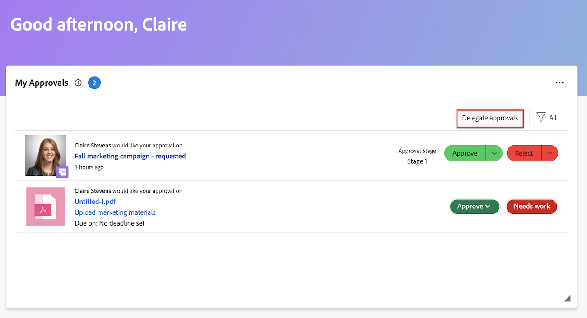

# Déléguer une demande d’approbation

Vous pouvez déléguer temporairement le travail qui vous est confié pendant que vous n’êtes pas au bureau. Vous pouvez déléguer des affectations de tâches et d&#39;événements, ou vous pouvez déléguer des demandes d&#39;approbation. Cet article décrit comment déléguer des demandes d’approbation. Pour plus d&#39;informations sur la délégation des affectations de tâches et d&#39;événements, voir [Déléguer des tâches et des événements](../../manage-work/delegate-work/how-to-delegate-work.md).

Vous pouvez déléguer les types d’approbations suivants, quelle que soit la manière dont l’approbation vous a été affectée (directement, à une équipe dont vous êtes membre ou à votre fonction) :

* Approbations de projets
* Approbations de tâches
* Approbations de problèmes

Vous ne pouvez pas déléguer l’approbation des feuilles de temps, des documents ou des épreuves.

>[!NOTE]
>
>Pour éviter toute incohérence avec les dates prévues pour la délégation des approbations, nous vous recommandons de faire correspondre le fuseau horaire de votre profil utilisateur à celui de votre planning. Pour plus d’informations, consultez les articles suivants :
>
>* [Créer un planning](../../administration-and-setup/set-up-workfront/configure-timesheets-schedules/create-schedules.md)
>* [Modifier le profil d’une personne](../../administration-and-setup/add-users/create-and-manage-users/edit-a-users-profile.md)
>

## Conditions d’accès

+++ Développez pour afficher les exigences d’accès aux fonctionnalités de cet article.

Vous devez disposer des accès suivants pour effectuer les étapes décrites dans cet article :

<table style="table-layout:auto"> 
 <col> 
 </col> 
 <col> 
 </col> 
 <tbody> 
  <tr> 
   <td role="rowheader">
Formule Adobe Workfront*
</td> 
   <td> 
Tous
 </td> 
  </tr> 
  <tr> 
   <td role="rowheader">
Licence Adobe Workfront*
</td> 
   <td> 
Révision ou supérieur
 </td> 
  </tr> 
 </tbody> 
</table>

Pour connaître le type de licence ou de plan dont vous disposez, contactez votre administrateur Workfront.

+++

## Présentation de l’accès utilisateur aux approbations déléguées

Pendant la période d’approbation désignée, la personne à laquelle vous déléguez une demande d’approbation dispose des capacités suivantes :

* Peut approuver ou rejeter les demandes d’approbation existantes lorsqu’aucune décision n’a été prise.
* Peut approuver et refuser les nouvelles demandes d’approbation reçues au cours d’une période donnée.
* Bénéficie d’un accès en affichage aux objets en attente d’approbation.

  >[!NOTE]
  >
  >L’administration d’Adobe Workfront peut restreindre l’accès utilisateur à certains types d’objets.Lorsqu’une personne n’a pas accès à un type d’objet et qu’une approbation de ce type lui est déléguée, l’accès en affichage à l’objet ne lui est pas accordé. Toutefois, la personne peut toujours approuver ou refuser les demandes d’approbation à partir de la page **Accueil**, comme décrit dans la section [Approuver le travail](../../review-and-approve-work/manage-approvals/approving-work.md).\
  >Par exemple, la personne A appartient au groupe A. L’administration de Workfront a restreint les droits d’accès du groupe A de sorte que les personnes membres de ce groupe ne peuvent pas visualiser les tâches dans Workfront. Si une demande d’approbation de tâche est déléguée à la personne A, celle-ci ne peut pas voir la tâche à laquelle l’approbation est associée. Toutefois, la personne A peut approuver ou refuser la demande d’approbation à partir de la page d’accueil.

  Pour plus d’informations sur la façon dont l’administration de Workfront peut restreindre l’accès aux types d’objets dans la configuration, consultez la section [Créer ou modifier des niveaux d’accès personnalisés](../../administration-and-setup/add-users/configure-and-grant-access/create-modify-access-levels.md).

Après l’arrêt ou l’annulation de la délégation d’approbation, la personne approbatrice :

* n’a plus accès à l’approbation du travail pour les éléments nécessitant une approbation ;
* continue d’avoir un accès en affichage aux éléments de travail.\
  Les personnes qui ont reçu un accès en affichage à des objets par le biais d’une délégation d’approbation conservent cet accès en affichage, même après l’arrêt ou l’annulation de la délégation d’approbation. Pour supprimer l’accès en affichage à tous les objets auxquels la personne avait accès pendant la période de délégation des approbations, vous devez accéder à l’objet et supprimer les droits d’accès directement au niveau de l’objet.

## Déléguer vos approbations à une autre personne {#delegate-your-approvals-to-another-user}

Vous pouvez déléguer les types d’approbations suivants, quelle que soit la manière dont l’approbation vous a été affectée (directement, à une équipe dont vous êtes membre ou à votre fonction) :

* Approbations de projets
* Approbations de tâches
* Approbations de problèmes

Vous ne pouvez pas déléguer l’approbation des feuilles de temps, des documents ou des épreuves.

Tenez compte des éléments suivants lorsque vous déléguez des approbations :

* Lorsque vous déléguez des approbations, toutes vos approbations sont déléguées. Vous ne pouvez pas déléguer des demandes d’approbation individuelles.
* Vous ne pouvez déléguer des approbations qu’à une seule personne, et non à plusieurs personnes en même temps.\
  Toutes les approbations pour tous les projets, tâches et problèmes sont déléguées à la personne que vous avez désignée.
* Au maximum 5 personnes peuvent déléguer des approbations à une même personne en même temps. Ainsi, une même personne ne peut pas être désignée comme approbatrice temporaire pour plus de 5 personnes en même temps.
* L’activité relative aux approbations s’affiche dans l’onglet Mises à jour. L’option Afficher les mises à jour système doit être activée. La personne qui délègue l’approbation et la personne à laquelle les approbations sont déléguées reçoivent toutes deux une notification par e-mail concernant l’activité d’approbation.

### Déléguer les approbations à partir de la zone d’Accueil

Pour déléguer des approbations à une autre personne, procédez comme suit :

1. Cliquez sur l’icône **[!UICONTROL Menu principal]**  dans le coin supérieur droit, puis cliquez sur **[!UICONTROL Accueil]**.
1. (Conditionnel) Cliquez sur **Personnaliser** pour ajouter le widget **Mes approbations**.
1. Accédez au widget Mes approbations, puis cliquez sur **Déléguer mes approbations**.

   >[!NOTE]
   >
   >Les administrateurs Workfront peuvent désactiver les délégations d’approbation dans la zone de configuration. Si les délégations d&#39;approbation sont désactivées, le bouton Déléguer les approbations ne s&#39;affiche pas.

   

1. Spécifiez les informations suivantes dans la section Déléguer mes approbations :

   * **Nom** : commencez à saisir le nom de la personne à laquelle vous souhaitez déléguer des approbations, puis cliquez sur le nom lorsqu’il apparaît dans le menu déroulant.
   * **Date de début** : sélectionnez la date à laquelle les approbations doivent commencer à être transférées. Le transfert commence à 12 :00 le matin à la date que vous avez choisie.\
     La date de début doit être la date actuelle ou une date dans le futur.
   * **Date de fin** : effectuez l’une des opérations suivantes :
      * Sélectionnez la date à laquelle les approbations cesseront d’être transférées. Le transfert se termine à 23 :59 à la date que vous avez choisie.
      * Sélectionnez **Aucune date de fin** pour que Workfront délègue les approbations pour une durée indéfinie.

1. Cliquer sur **Enregistrer**.

### Déléguer les approbations à partir de votre profil utilisateur

1. Cliquez sur l’icône **Menu principal** > **votre nom** > **Congés** dans le panneau de gauche.
1. Cliquez sur **Déléguer les approbations**.

   >[!NOTE]
   >
   >Les administrateurs Workfront peuvent désactiver les délégations d’approbation dans la zone de configuration. Si les délégations d&#39;approbation sont désactivées, le bouton Déléguer les approbations ne s&#39;affiche pas.

1. Spécifiez les informations suivantes dans la section Déléguer mes approbations :

   * **Nom** : commencez à saisir le nom de la personne à laquelle vous souhaitez déléguer des approbations, puis cliquez sur le nom lorsqu’il apparaît dans le menu déroulant.
   * **Date de début** : sélectionnez la date à laquelle les approbations doivent commencer à être transférées. Le transfert commence à 12 :00 le matin à la date que vous avez choisie.\
     La date de début doit être la date actuelle ou une date dans le futur.
   * **Date de fin** : effectuez l’une des opérations suivantes :
      * Sélectionnez la date à laquelle les approbations cesseront d’être transférées. Le transfert se termine à 23 :59 à la date que vous avez choisie.
      * Sélectionnez **Aucune date de fin** pour que Workfront délègue les approbations pour une durée indéfinie.

## Mettre à jour ou arrêter une délégation d’approbation {#update-or-stop-an-approval-delegation}

1. Cliquez sur l’icône **[!UICONTROL Menu principal]**  dans le coin supérieur droit, puis cliquez sur **[!UICONTROL Accueil]**.
1. (Conditionnel) Cliquez sur **Personnaliser** pour ajouter le widget **Mes approbations**.

1. Accédez au widget Mes approbations, puis cliquez sur **Modifier la délégation**.
   
<!--
   Or

   If your system or group administrator enabled task and issue delegation, click **Edit delegation**, then click **Delegate approvals**.   -->

1. (Le cas échéant) Effectuez l’une des opérations suivantes :

   * Pour mettre à jour la délégation d’approbation existante : modifiez les informations affichées, puis cliquez sur **Enregistrer**.

   * Pour arrêter la délégation existante : cliquez sur **Arrêter la délégation**, puis sur **Arrêter la délégation** pour confirmer l’opération.

## Afficher les approbations déléguées {#view-delegated-approvals}

Vous ne pouvez afficher que les types de délégation d’approbation suivants dans le widget Mes approbations :

* Approbations de projets
* Approbations de tâches
* Approbations de problèmes

Pour consulter les approbations déléguées :

1. Cliquez sur l’icône **[!UICONTROL Menu principal]**  dans le coin supérieur droit, puis cliquez sur **[!UICONTROL Accueil]**.
1. (Conditionnel) Cliquez sur **Personnaliser** pour ajouter le widget **Mes approbations**.
1. Dans le widget **Mes approbations**, cliquez sur le menu déroulant **Filtre**, puis sur **Approbations déléguées**.\
   Toutes les approbations qui vous ont été déléguées sont répertoriées dans la liste.
