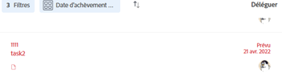
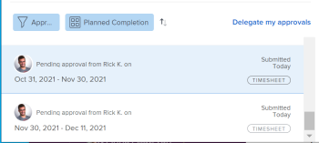
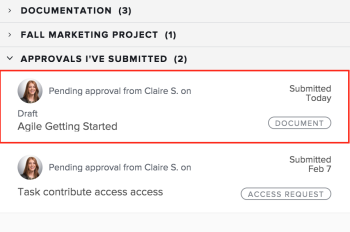

# Rappeler des approbations soumises

Vous pouvez vous souvenir de l’un des objets suivants soumis à validation :

* Projets
* Tâches
* Problèmes
* Feuilles de temps
* Documents
* Demandes d&#39;accès

## Conditions d’accès

+++ Développez pour afficher les exigences d’accès aux fonctionnalités de cet article.

Vous devez disposer des accès suivants pour effectuer les étapes de cet article :

<table style="table-layout:auto"> 
 <col> 
 <col> 
 <tbody> 
  <tr> 
   <td role="rowheader">Forfait Adobe Workfront*</td> 
   <td> 
N’importe quelle
 </td> 
  </tr> 
  <tr> 
   <td role="rowheader">Licence Adobe Workfront*</td> 
   <td> 
Requête ou supérieure
 </td> 
  </tr> 
  <tr> 
   <td role="rowheader">Configurations des niveau d’accès*</td> 
   <td> 
Affichage ou accès supérieur à Projets, tâches, problèmes, feuilles de calcul, documents
 
Remarque : si vous n’avez toujours pas d’accès, demandez à votre équipe d’administration Workfront s’il existe des restrictions supplémentaires à votre niveau d’accès. Pour plus d’informations sur la façon dont un administrateur ou une administratrice Workfront peut modifier votre niveau d’accès, voir <a href="../../administration-and-setup/add-users/configure-and-grant-access/create-modify-access-levels.md" class="MCXref xref">Créer ou modifier les niveaux d’accès personnalisés</a>.
 </td> 
  </tr> 
  <tr> 
   <td role="rowheader">Autorisations d’objet</td> 
   <td> 
Consulter l'objet associé à la validation ou accéder à un accès supérieur 
 
Pour plus d’informations sur la demande d’accès supplémentaire, voir <a href="../../workfront-basics/grant-and-request-access-to-objects/request-access.md" class="MCXref xref">Demander l’accès aux objets</a>.
 </td> 
  </tr> 
 </tbody> 
</table>

Pour connaître le plan, le type de licence ou l’accès dont vous disposez, contactez votre administrateur Workfront.

+++

## Projets

Lorsque vous rappelez l’approbation d’un projet, celui-ci reprend son état avant le lancement du processus d’approbation.

Si vous vous souvenez d’une validation associée à l’état de début du projet, le processus d’approbation est ignoré et le projet reste dans l’état de début.

>[!NOTE]
>
>Vous pouvez associer le premier état d’un projet ou d’une tâche à un processus de validation à l’aide d’un modèle. Pour plus d’informations sur l’ajout de validations à un modèle, voir  [Modifier les modèles de projet](../../manage-work/projects/create-and-manage-templates/edit-templates.md).

Pour rappeler une approbation de projet que vous avez envoyée :

1. Cliquez sur l’icône **Accueil**  dans le coin supérieur gauche d’Adobe Workfront.

   >[!NOTE]
   >
   >Votre administrateur ou administratrice Workfront peut apporter les modifications suivantes à l’icône Accueil de votre environnement :
   >
   >* La remplacer par une image personnalisée pour illustrer votre entreprise. Dans ce cas, l’icône sera différente de celle présentée dans cet article.
   >* Remplacer la page à laquelle elle est liée par une autre page. Dans ce cas, cliquez sur **Menu Principal**  dans le coin supérieur droit de la page, puis sur **Accueil**.

1. Dans la zone **Liste de travail**, accédez au regroupement **Validations que j&#39;ai envoyées**.

1. Cliquez sur une approbation **Projet** dans la liste de travail.

   Le projet s’ouvre alors à droite de la liste des tâches.

   

1. Cliquez sur **Rappeler** dans le coin supérieur droit du panneau de droite.

## Tâches

Lorsque vous rappelez la validation d’une tâche, celle-ci reprend son état avant le lancement du processus de validation.

Si vous rappelez une validation associée au statut de début de la tâche, le processus de validation est ignoré et la tâche reste dans le statut de début.

>[!NOTE]
>
>Vous pouvez associer le premier état d’un projet ou d’une tâche à un processus de validation à l’aide d’un modèle. Pour plus d’informations sur l’ajout d’approbations à un modèle, voir [Modifier des modèles de projet](../../manage-work/projects/create-and-manage-templates/edit-templates.md).

Pour rappeler une validation de tâche que vous avez envoyée :

1. Cliquez sur l’icône **Accueil**  dans le coin supérieur gauche d’Adobe Workfront.

   >[!NOTE]
   >
   >Votre administrateur ou administratrice Workfront peut apporter les modifications suivantes à l’icône Accueil de votre environnement :
   >
   >* La remplacer par une image personnalisée pour illustrer votre entreprise. Dans ce cas, l’icône sera différente de celle présentée dans cet article.
   >* Remplacer la page à laquelle elle est liée par une autre page. Dans ce cas, cliquez sur **Menu Principal**  dans le coin supérieur droit de la page, puis sur **Accueil**.

1. Dans la zone **Liste de travail**, accédez au regroupement **Validations que j&#39;ai envoyées**.

1. Cliquez sur une approbation **Tâche** dans la liste de travail.

   La tâche s’ouvre alors à droite de la liste de tâches.

   

1. Cliquez sur **Rappeler** dans le coin supérieur droit du panneau de droite.

## Problèmes

Lorsque vous rappelez l’approbation d’un problème, celui-ci revient à son état avant le lancement du processus d’approbation.

Si vous rappelez une validation associée à l’état de début de la publication, le processus d’approbation est ignoré et le problème reste dans l’état de début.

>[!NOTE]
>
>Vous pouvez associer le premier statut d&#39;une question à un processus de validation à l&#39;aide d&#39;un modèle. Pour plus d’informations sur la création d’une file d’attente de requêtes, voir [Création d’une file d’attente de requêtes](../../manage-work/requests/create-and-manage-request-queues/create-request-queue.md).

1. Cliquez sur l’icône **Accueil**  dans le coin supérieur gauche d’Adobe Workfront.

   >[!NOTE]
   >
   >Votre administrateur ou administratrice Workfront peut apporter les modifications suivantes à l’icône Accueil de votre environnement :
   >
   >* La remplacer par une image personnalisée pour illustrer votre entreprise. Dans ce cas, l’icône sera différente de celle présentée dans cet article.
   >* Remplacer la page à laquelle elle est liée par une autre page. Dans ce cas, cliquez sur **Menu Principal**  dans le coin supérieur droit de la page, puis sur **Accueil**.

1. Dans la zone **Liste de travail**, accédez au regroupement **Validations que j&#39;ai envoyées**.

1. Cliquez sur une approbation **Problème** dans la liste de travail.

   Le problème s’affiche alors à droite de la liste des tâches.

   

1. Cliquez sur **Rappeler** dans le coin supérieur droit du panneau de droite.

## Feuilles de temps

Lorsque vous rappelez une approbation de feuille de temps, celle-ci revient à l’état dans lequel elle se trouvait avant d’être soumise à validation.

1. Cliquez sur l’icône **Accueil**  dans le coin supérieur gauche d’Adobe Workfront.

   >[!NOTE]
   >
   >Votre administrateur ou administratrice Workfront peut apporter les modifications suivantes à l’icône Accueil de votre environnement :
   >
   >* La remplacer par une image personnalisée pour illustrer votre entreprise. Dans ce cas, l’icône sera différente de celle présentée dans cet article.
   >* Remplacer la page à laquelle elle est liée par une autre page. Dans ce cas, cliquez sur **Menu Principal**  dans le coin supérieur droit de la page, puis sur **Accueil**.

1. Dans la zone **Liste de travail**, accédez au regroupement **Validations que j&#39;ai envoyées**.

1. Cliquez sur une approbation **Frise chronologique** dans la liste de travail.

   La feuille de temps s’ouvre alors à droite de la liste des tâches.

   

1. Cliquez sur **Rappeler** dans le coin supérieur droit du panneau de droite.

## Documents

Pour rappeler une approbation de document, vous devez supprimer manuellement un ou tous les utilisateurs de l’approbation.

1. Cliquez sur l’icône **Accueil**  dans le coin supérieur gauche d’Adobe Workfront.

   >[!NOTE]
   >
   >Votre administrateur ou administratrice Workfront peut apporter les modifications suivantes à l’icône Accueil de votre environnement :
   >
   >* La remplacer par une image personnalisée pour illustrer votre entreprise. Dans ce cas, l’icône sera différente de celle présentée dans cet article.
   >* Remplacer la page à laquelle elle est liée par une autre page. Dans ce cas, cliquez sur **Menu Principal**  dans le coin supérieur droit de la page, puis sur **Accueil**.

1. Dans la zone **Liste de travail**, accédez au regroupement **Validations que j&#39;ai envoyées**.

1. Cliquez sur une approbation **Document** dans la liste de travail.

   Le document s’ouvre alors à droite de la liste des tâches.

   

1. Cliquez sur **Gérer les approbations** dans le coin supérieur droit du panneau de droite. La boîte de dialogue Gérer les approbations s’ouvre alors.
1. Cliquez sur l’icône **Supprimer** en ligne avec le nom d’un utilisateur dans la zone Gérer les approbations. Supprimez tous les utilisateurs pour que l’approbation du document soit complètement retirée.

   

## Demandes d&#39;accès

1. Cliquez sur l’icône **Accueil**  dans le coin supérieur gauche d’Adobe Workfront.

   >[!NOTE]
   >
   >Votre administrateur ou administratrice Workfront peut apporter les modifications suivantes à l’icône Accueil de votre environnement :
   >
   >* La remplacer par une image personnalisée pour illustrer votre entreprise. Dans ce cas, l’icône sera différente de celle présentée dans cet article.
   >* Remplacer la page à laquelle elle est liée par une autre page. Dans ce cas, cliquez sur **Menu Principal**  dans le coin supérieur droit de la page, puis sur **Accueil**.

1. Dans la zone **Liste de travail**, accédez au regroupement **Validations que j&#39;ai envoyées**.

1. Cliquez sur une approbation **Demande d’accès** dans la liste de travail.

   La demande d’accès s’affiche alors à droite de la liste des tâches.

   

1. Cliquez sur **Rappeler** dans le coin supérieur droit du panneau de droite.
