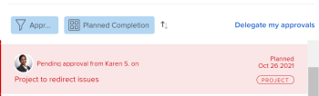

# Rappeler les approbations soumises

Vous pouvez rappeler l’un des objets suivants soumis à approbation :

* Projets
* Tâches
* Problèmes
* Feuilles de temps
* Documents
* Demandes d&#39;accès

## Conditions d’accès

+++ Développez pour afficher les exigences d’accès aux fonctionnalités de cet article.

<table style="table-layout:auto"> 
 <col> 
 <col> 
 <tbody> 
  <tr> 
   <td role="rowheader">Package Adobe Workfront</td> 
   <td> 
Tous
 </td> 
  </tr> 
  <tr> 
   <td role="rowheader">Licence Adobe Workfront</td> 
   <td>
   
Contribuer ou version ultérieure

   
Requête ou supérieure

   </td> 
  </tr> 
  <tr> 
   <td role="rowheader">Configurations des niveaux d’accès</td> 
   <td> 
Accès en affichage ou supérieur aux projets, tâches, problèmes, feuilles de temps, et aux documents
</td> 
  </tr> 
  <tr> 
   <td role="rowheader">Autorisations d’objet</td> 
   <td> 
Accès en affichage ou supérieur aux objets associés aux approbations 
</td> 
  </tr> 
 </tbody> 
</table>

Pour plus d’informations, voir [Conditions d’accès requises dans la documentation Workfront](/help/quicksilver/administration-and-setup/add-users/access-levels-and-object-permissions/access-level-requirements-in-documentation.md).

+++

## Projets

Lorsque vous rappelez l’approbation d’un projet, celui-ci reprend son statut avant le lancement du processus d’approbation.

Si vous rappelez une approbation associée au statut initial du projet, le processus d’approbation est ignoré et le projet reste au statut initial.

>[!NOTE]
>
>Vous pouvez associer le premier statut d’un projet ou d’une tâche à un processus d’approbation à l’aide d’un modèle.Pour plus d’informations sur l’ajout d’approbations à un modèle, voir  [Modifier des modèles de projet](../../manage-work/projects/create-and-manage-templates/edit-templates.md).

Pour rappeler une approbation de projet que vous avez envoyée :

1. Cliquez sur l’icône **Accueil**  dans le coin supérieur gauche d’Adobe Workfront.

   >[!NOTE]
   >
   >Votre administrateur ou administratrice Workfront peut apporter les modifications suivantes à l’icône Accueil de votre environnement :
   >
   >* La remplacer par une image personnalisée pour illustrer votre entreprise. Dans ce cas, l’icône sera différente de celle présentée dans cet article.
   >* Remplacer la page à laquelle elle est liée par une autre page. Dans ce cas, cliquez sur l&#39;icône **Menu principal**  dans le coin supérieur droit de la page, puis cliquez sur **Accueil**.

1. Dans la zone **Liste de tâches**, accédez au regroupement **Approbations que j’ai envoyées**.

1. Cliquez sur une approbation d’**épreuve** dans la liste de travail.

   Le projet s’affiche alors à droite de la liste de travail.

   

1. Cliquez sur **Rappeler** dans le coin supérieur droit du panneau de droite.

## Tâches

Lorsque vous rappelez l’approbation d’une tâche, celle-ci reprend son statut avant le lancement du processus d’approbation.

Si vous rappelez une approbation associée au statut initial de la tâche, le processus d’approbation est ignoré et la tâche reste au statut initial.

>[!NOTE]
>
>Vous pouvez associer le premier statut d’un projet ou d’une tâche à un processus d’approbation à l’aide d’un modèle. Pour plus d’informations sur l’ajout d’approbation à un modèle, voir [Modifier des modèles de projet](../../manage-work/projects/create-and-manage-templates/edit-templates.md).

Pour rappeler une approbation de tâche que vous avez envoyée :

1. Cliquez sur l’icône **Accueil**  dans le coin supérieur gauche d’Adobe Workfront.

   >[!NOTE]
   >
   >Votre administrateur ou administratrice Workfront peut apporter les modifications suivantes à l’icône Accueil de votre environnement :
   >
   >* La remplacer par une image personnalisée pour illustrer votre entreprise. Dans ce cas, l’icône sera différente de celle présentée dans cet article.
   >* Remplacer la page à laquelle elle est liée par une autre page. Dans ce cas, cliquez sur l&#39;icône **Menu principal**  dans le coin supérieur droit de la page, puis cliquez sur **Accueil**.

1. Dans la zone **Liste de travail**, accédez au regroupement **Approbations que j’ai envoyées**.

1. Cliquez sur une approbation de **tâche** dans la liste de travail.

   La tâche s’ouvre alors à droite de la liste de travail.

   

1. Cliquez sur **Rappeler** dans le coin supérieur droit du panneau de droite.

## Problèmes

Lorsque vous rappelez l’approbation d’un problème, celui-ci revient à son statut avant le lancement du processus d’approbation.

Si vous rappelez une approbaation associée au statut de début du problème, le processus d’approbation est ignoré et le problème reste au statut de début.

>[!NOTE]
>
>Vous pouvez associer le premier statut d’un problème à un processus d’approbation à l’aide d’un modèle. Pour plus d’informations sur la création d’une file d’attente des demandes, voir [Créer une file d’attente des demandes](../../manage-work/requests/create-and-manage-request-queues/create-request-queue.md).

1. Cliquez sur l’icône **Accueil**  dans le coin supérieur gauche d’Adobe Workfront.

   >[!NOTE]
   >
   >Votre administrateur ou administratrice Workfront peut apporter les modifications suivantes à l’icône Accueil de votre environnement :
   >
   >* La remplacer par une image personnalisée pour illustrer votre entreprise. Dans ce cas, l’icône sera différente de celle présentée dans cet article.
   >* Remplacer la page à laquelle elle est liée par une autre page. Dans ce cas, cliquez sur l&#39;icône **Menu principal**  dans le coin supérieur droit de la page, puis cliquez sur **Accueil**.

1. Dans la zone **Liste de travail**, accédez au regroupement **Approbaations que j’ai envoyées**.

1. Cliquez sur une approbation de **problème** dans la liste de travail.

   Le problème s’affiche alors à droite de la liste de travail.

   

1. Cliquez sur **Rappeler** dans le coin supérieur droit du panneau de droite.

## Feuilles de temps

Lorsque vous rappelez une approbation de feuille de temps, celle-ci revient au statut dans lequel elle se trouvait avant d’être soumise pour approbation.

1. Cliquez sur l’icône **Accueil**  dans le coin supérieur gauche d’Adobe Workfront.

   >[!NOTE]
   >
   >Votre administrateur ou administratrice Workfront peut apporter les modifications suivantes à l’icône Accueil de votre environnement :
   >
   >* La remplacer par une image personnalisée pour illustrer votre entreprise. Dans ce cas, l’icône sera différente de celle présentée dans cet article.
   >* Remplacer la page à laquelle elle est liée par une autre page. Dans ce cas, cliquez sur l&#39;icône **Menu principal**  dans le coin supérieur droit de la page, puis cliquez sur **Accueil**.

1. Dans la zone **Liste de travail**, accédez au regroupement **Approbations que j’ai envoyées**.

1. Cliquez sur une approbation de **feuille de temps** dans la liste de travail.

   La feuille de temps s’ouvre alors à droite de la liste de travail.

   

1. Cliquez sur **Rappeler** dans le coin supérieur droit du panneau de droite.

## Documents

Pour rappeler une approbation de document, vous devez supprimer manuellement une ou toutes les personnes de l’approbation.

1. Cliquez sur l’icône **Accueil**  dans le coin supérieur gauche d’Adobe Workfront.

   >[!NOTE]
   >
   >Votre administrateur ou administratrice Workfront peut apporter les modifications suivantes à l’icône Accueil de votre environnement :
   >
   >* La remplacer par une image personnalisée pour illustrer votre entreprise. Dans ce cas, l’icône sera différente de celle présentée dans cet article.
   >* Remplacer la page à laquelle elle est liée par une autre page. Dans ce cas, cliquez sur l&#39;icône **Menu principal**  dans le coin supérieur droit de la page, puis cliquez sur **Accueil**.

1. Dans la zone **Liste de travail**, accédez au regroupement **Approbations que j’ai envoyées**.

1. Cliquez sur une approbation de **Document** dans la liste de travail.

   Le document s’ouvre alors à droite de la liste de travail.

   

1. Cliquez sur **Gérer les approbations** dans le coin supérieur droit du panneau de droite. La boîte de dialogue Gérer les approbations s’ouvre alors.
1. Cliquez sur l’icône **Supprimer** alignée avec le nom d’une personne dans la zone Gérer les approbations. Supprimez toutes les personnes pour que l’approbation du document soit complètement rappelée.

   

## Demandes d&#39;accès

1. Cliquez sur l’icône **Accueil**  dans le coin supérieur gauche d’Adobe Workfront.

   >[!NOTE]
   >
   >Votre administrateur ou administratrice Workfront peut apporter les modifications suivantes à l’icône Accueil de votre environnement :
   >
   >* La remplacer par une image personnalisée pour illustrer votre entreprise. Dans ce cas, l’icône sera différente de celle présentée dans cet article.
   >* Remplacer la page à laquelle elle est liée par une autre page. Dans ce cas, cliquez sur l&#39;icône **Menu principal**  dans le coin supérieur droit de la page, puis cliquez sur **Accueil**.

1. Dans la zone **Liste de travail**, accédez au regroupement **Approbations que j’ai envoyées**.

1. Cliquez sur une approbation de **Demande d’accès** dans la liste de travail.

   L’approbation de demande d’accès s’ouvre alors à droite de la liste de travail.

   

1. Cliquez sur **Rappeler** dans le coin supérieur droit du panneau de droite.
