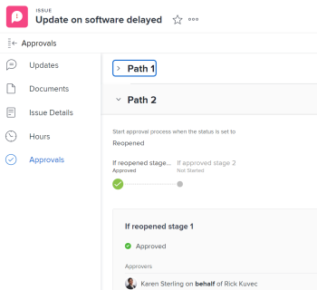

# Afficher les approbations

Les informations mises en surbrillance sur cette page font référence à des fonctionnalités qui ne sont pas encore disponibles de manière générale. Cette option n’est disponible que dans l’environnement de prévisualisation de sandbox.

Les processus d’approbation offrent une flexibilité permettant de créer des approbations à plusieurs étapes pour des projets, des tâches et des problèmes. Les administrateurs et administratrices Adobe Workfront définissent les processus d’approbation pour assurer la cohérence de l’ensemble du système.

Pour plus d’informations sur la création de processus d’approbation, voir [Créer un processus d’approbation pour des éléments de travail](../../administration-and-setup/customize-workfront/configure-approval-milestone-processes/create-approval-processes.md).

Pour plus d’informations sur l’association des approbations à du travail dans Workfront, voir [Associer un processus d’approbation nouveau ou existant à du travail](../../review-and-approve-work/manage-approvals/associate-approval-with-work.md).

## Conditions d’accès

+++ Développez pour afficher les exigences d’accès aux fonctionnalités de cet article.

<table style="table-layout:auto"> 
 <col> 
 <col> 
 <tbody> 
  <tr> 
   <td role="rowheader">Package Adobe Workfront</td> 
   <td> 
Tous
 </td> 
  </tr> 
  <tr> 
   <td role="rowheader">Licence Adobe Workfront</td> 
   <td>
   

Contribuer ou plus

   
Révision ou supérieur

   </td> 
  </tr> 
  <tr> 
   <td role="rowheader">Configurations des niveaux d’accès</td> 
   <td>
Accès Afficher ou supérieur aux objets associés à des approbations
 </td> 
  </tr> 
  <tr> 
   <td role="rowheader">Autorisations d’objet</td> 
   <td> 
Autorisations Afficher ou supérieures pour les objets associés aux approbations
</td> 
  </tr> 
 </tbody> 
</table>

Pour plus d’informations, voir [Conditions d’accès requises dans la documentation Workfront](/help/quicksilver/administration-and-setup/add-users/access-levels-and-object-permissions/access-level-requirements-in-documentation.md).

+++

## Localiser des approbations dans Adobe Workfront

Vous pouvez afficher ou gérer des approbations à partir de plusieurs zones dans Workfront. Pour plus d’informations sur la gestion des approbations dans les différentes zones, voir [Approuver du travail](../../review-and-approve-work/manage-approvals/approving-work.md).

Vous pouvez afficher ou gérer des approbations dans les zones suivantes :

* Dans la zone Accueil

   * Tous les projets, tâches, événements, feuilles de temps, documents, accès et demandes Workfront Planning en attente de votre approbation, sont affichés dans le widget Mes approbations de la zone Accueil.
   * Les approbations que vous avez envoyées vous-même s’affichent également dans le widget Mes approbations de la zone Accueil lorsque vous sélectionnez l’option de filtre Mes approbations envoyées . Pour plus d’informations, voir la section [Réviser le travail que vous soumettez pour approbation dans la zone Accueil](#review-work-you-submit-for-approval-in-the-home-area) dans cet article.
   * Les approbations sont supprimées du widget Mes approbations de la zone d’Accueil lorsque le projet, la tâche ou l’événement associé est marqué comme Résolu, En attente, Fermé ou Annulé.

  Pour plus d’informations sur l’utilisation de la page d’accueil, voir [Commencer avec la page d’accueil](../../workfront-basics/using-home/using-the-home-area/get-started-with-home.md).

* Dans l’en-tête d’un projet, d’une tâche, d’un problème, d’un document ou d’une épreuve
* Dans la section Approbations d’un projet, d’une tâche ou d’un problème
* Dans un rapport

  >[!NOTE]
  >
  >Vous ne pouvez pas prendre de décision sur une approbation à partir d’un rapport.

  Vous pouvez créer un rapport d’approbation de projet, de tâche, de problème ou de document qui contient les informations d’approbation.

  Pour plus d’informations sur la création de rapports, voir [Créer un rapport personnalisé](../../reports-and-dashboards/reports/creating-and-managing-reports/create-custom-report.md).

## Réviser le travail que vous soumettez pour approbation dans la zone Accueil. {#review-work-you-submit-for-approval-in-the-home-area}

1. Cliquez sur l’icône **[!UICONTROL Menu principal]**  dans le coin supérieur droit, puis cliquez sur **[!UICONTROL Accueil]**.
1. (Conditionnel) Cliquez sur **Personnaliser** pour ajouter le widget **Mes approbations**.
1. (Conditionnel) Cliquez sur le menu déroulant **Filtre**, puis sélectionnez **Approbations que j’ai envoyées** pour afficher les approbations que vous avez envoyées.

## Afficher le statut d’approbation d’un objet

Vous pouvez afficher le statut d’approbation d’un objet dans les sections suivantes :

<table style="table-layout:auto"> 
 <col> 
 <col> 
 <tbody> 
  <tr> 
   <td role="rowheader">Mises à jour </td> 
   <td> 
Affiche tous les statuts d’approbation lorsqu’ils se produisent. Les statuts d’approbation s’affichent à côté des autres statuts affichés dans la section <strong>Mises à jour</strong>.
 </td> 
  </tr> 
  <tr> 
   <td role="rowheader">Approbations</td> 
   <td> 
Affiche des informations plus détaillées sur le processus d’approbation, telles que les étapes individuelles du processus d’approbation et si les approbateurs et approbatrices ont approuvé ou non.
 </td> 
  </tr> 
 </tbody> 
</table>

### Utiliser la zone Mises à jour pour afficher le statut d’une approbation {#use-the-updates-area-to-view-an-approval-status}

Lorsqu’une approbation est lancée sur un projet, une tâche ou un événement, un statut s’affiche dans l’onglet **Mises à jour** de l’objet, indiquant le statut de l’approbation. Un nouveau statut s’affiche chaque fois que l’objet passe par le processus d’approbation. Cela inclut les événements suivants :

* Un processus d’approbation est lancé sur un objet. Le processus d’approbation est démarré lorsque le statut est modifié.
* L’objet est rejeté
* L’objet est approuvé

>[!TIP]
>
>Si une approbation est appliquée à une tâche, les mises à jour de l’approbation sont affichées dans l’onglet Mises à jour de la tâche, et non dans l’onglet Mises à jour du projet dans lequel se trouve la tâche.

### Utiliser la zone Approbations pour afficher le statut d’une approbation {#use-the-approvals-area-to-view-an-approval-status}

Vous pouvez obtenir une visibilité sur l’emplacement où une tâche ou un événement sur lequel vous travaillez actuellement se trouve dans le processus d’approbation. Vous pouvez voir les informations suivantes :

* La phase du processus d’approbation.
* Les approbateurs et approbatrices qui l’ont déjà approuvé.
* Les approbateurs et approbatrices qui ne l’ont pas encore approuvé.

Pour voir l’état actuel d’une tâche ou d’un problème dans le processus d’approbation, procédez comme suit :

1. Accédez au projet, à la tâche ou au problème auquel ou à laquelle l’approbation est associée.
1. Dans le panneau de gauche, cliquez sur **Validations**.

   L’onglet Approbations affiche toutes les informations sur tous les parcours et étapes d’approbation précédents. Vous pouvez voir qui a pris une décision sur l’approbation ou si l’approbation est définie pour une équipe, une fonction, ou bien un utilisateur ou une utilisatrice.

   

   Pour plus d’informations sur la création d’un processus d’approbation, voir [Créer un processus d’approbation pour des éléments de travail](../../administration-and-setup/customize-workfront/configure-approval-milestone-processes/create-approval-processes.md).
