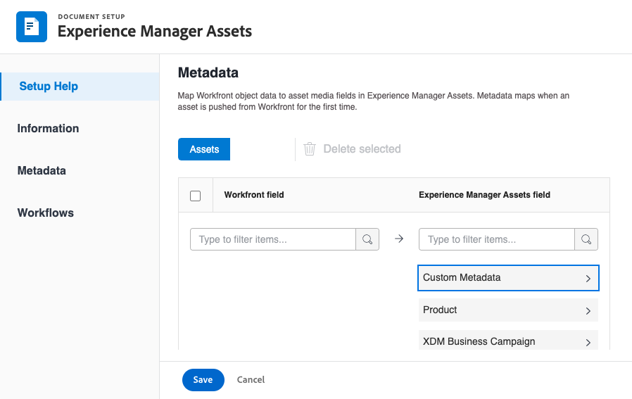

# Utilisation de Adobe Experience Manager avec l’intégration Frame.io

Vous pouvez utiliser le [!DNL Experience Manager Assets]&#x200B;&#x200B; pour gérer et stocker vos ressources numériques qui ont passé le cycle de révision et d’approbation. Cette intégration vous permet d’exploiter les fonctionnalités de Adobe Experience Manager, Frame.io et Workfront afin de rationaliser vos processus de gestion de contenu et de collaboration.

## Configuration de l’intégration de Experience Manager Assets

Vous pouvez connecter votre travail à votre contenu dans [!DNL Experience Manager Assets] :

* Transférer des ressources et des métadonnées à partir d’[!DNL Adobe Workfront] vers [!DNL Experience Manager Assets]
* Faciliter les cas d’utilisation de contrôle de version
* Suivi des métadonnées des ressources
* Synchroniser les métadonnées de projet entre [!DNL Workfront] et [!DNL Experience Manager Assets]

>[!NOTE]
>
>Vous pouvez également connecter plusieurs référentiels [!DNL Experience Manager Assets] à un environnement [!UICONTROL Workfront] ou plusieurs environnements [!DNL Workfront] à un référentiel [!DNL Experience Manager Assets] dans les ID d’organisation. Suivez les instructions de configuration de cet article pour chaque intégration que vous souhaitez configurer.

## Conditions d’accès

+++ Développez pour afficher les exigences d’accès aux fonctionnalités de cet article.

<table>
  <tr>
   <td>Package Adobe Workfront
   </td>
   <td> 
Prime ou Ultimate

    
Workflow Ultimate

   </td>
  </tr>
    <tr>
   <td>Licences Adobe Workfront
   </td>
   <td>
  
Pour configurer l’intégration :

   
Standard

   
Plan

Pour envoyer des documents à Experience Manager Assets :

   
Contributeur ou version ultérieure

   
Requête ou supérieure

   </td>
  </tr>
  </tr>
    <tr>
   <td>Licences Adobe Experience Manager
   </td>
   <td>Standard
   </td>
  </tr>
  <tr>
   <td>Produits supplémentaires
   </td>
   <td>Vous devez avoir [!DNL Experience Manager Assets as a Cloud Service], et vous devez faire l’objet d’un ajout au produit en tant qu’utilisateur ou utilisatrice.
   </td>
  </tr>
   <tr>
   <td>Configurations des niveaux d’accès
   </td>
   <td>Vous devez être administrateur ou administratrice [!DNL Workfront].
   </td>
  </tr>
</table>

Pour plus d’informations sur ce tableau, voir la section [Conditions d’accès requises dans la documentation Workfront](/help/quicksilver/administration-and-setup/add-users/access-levels-and-object-permissions/access-level-requirements-in-documentation.md).

+++

## Conditions préalables

Avant de commencer

* Vous devez avoir [!DNL Workfront] et [!DNL Adobe Experience Manager Assets] associés à un ID d’organisation dans l’[!DNL Adobe Admin Console]. Pour plus d’informations, voir [Différences d’administration basées sur les plateformes ([!DNL Adobe Workfront]/[!DNL Adobe Business Platform])](/help/quicksilver/administration-and-setup/get-started-wf-administration/actions-in-admin-console.md).
* Votre instance Workfront doit utiliser Adobe Enterprise Storage.

## Configurer les informations d’intégration

{{step-1-to-setup}}

1. Sélectionnez **[!UICONTROL Documents]** dans le panneau de gauche, puis Intégration **[!UICONTROL [!DNL Experience Manager]]**.
1. Sélectionner **[!UICONTROL Ajouter une intégration [!DNL Experience Manager]]**.
1. Dans le champ **[!UICONTROL Nom]**, saisissez le nom que les utilisateurs et utilisatrices doivent voir lorsqu’ils interagissent avec cette intégration dans Workfront et Experience Manager Assets.
1. Dans le champ **[!UICONTROL URL de navigation]**, le système renseigne automatiquement l’URL de navigation. Cette URL en lecture seule est utilisée pour créer un lien vers l’instance [!DNL Experience Manager] de votre organisation à partir du [!UICONTROL Menu principal] pour un accès rapide.
1. Sélectionnez un référentiel dans le menu déroulant Référentiel de ressources **[!UICONTROL [!DNL Experience Manager]]**. Le système renseigne automatiquement les référentiels [!DNL Experience Manager] associés à l’ID d’organisation auquel votre profil utilisateur est affecté.
   

1. Cliquez sur **[!UICONTROL Enregistrer]** ou passez à la section [Configurer les métadonnées (facultatif)](#set-up-metadata-optional) de cet article.

   >[!IMPORTANT]
   >
   >En raison de la complexité de l’intégration, vous ne pouvez pas modifier le référentiel après avoir enregistré la configuration initiale.

## Configurer les métadonnées (facultatif)

Vous pouvez mapper des données d’objet [!DNL Workfront] aux champs de média de ressources dans [!DNL Experience Manager] Assets.

>[!NOTE]
>
>Vous ne pouvez mapper les métadonnées que dans une seule direction : de [!DNL Workfront] vers [!DNL Experience Manager]. Les métadonnées des documents liés à [!DNL Workfront] à partir d’[!DNL Experience Manager] ne peuvent pas être transférées vers [!DNL Workfront].

### Configurer les champs de métadonnées

Avant de commencer à mapper les champs de métadonnées, vous devez configurer les champs de métadonnées dans Workfront et Experience Manager Assets.

Pour configurer les champs de métadonnées, procédez comme suit :

1. Configurez un schéma de métadonnées dans [!DNL Experience Manager Assets] comme expliqué dans [Configurer le mappage des métadonnées de ressource entre Adobe  [!DNL Workfront]  et  [!DNL Experience Manager Assets]](https://experienceleague.adobe.com/en/docs/experience-manager-cloud-service/content/assets/integrations/configure-asset-metadata-mapping).

1. Configurez les champs de formulaire personnalisés dans Workfront. [!DNL Workfront] comporte de nombreux champs personnalisés intégrés que vous pouvez utiliser. Cependant, vous pouvez également créer vos propres champs personnalisés, comme expliqué dans la section [Créer un formulaire personnalisé](/help/quicksilver/administration-and-setup/customize-workfront/create-manage-custom-forms/form-designer/design-a-form/design-a-form.md).

+++ **Développer pour afficher plus d’informations sur les champs Workfront et Experience Manager Assets pris en charge** 

**Balises Experience Manager Assets**

Vous pouvez mapper n’importe quel champ pris en charge par Workfront à une balise dans Experience Manager Assets. Pour cela, vous devez vous assurer que les valeurs de balise dans Experience Manager Assets correspondent à Workfront.

* Les balises et les valeurs de champ Workfront doivent correspondre exactement à l’orthographe et au format.
* Les valeurs de champ Workfront mappées aux balises Experience Manager Assets doivent être toutes en minuscules, même si la balise dans Experience Manager Assets comportent des lettres majuscules.
* Les valeurs de champ Workfront ne doivent pas inclure d’espaces.
* La valeur de champ dans Workfront doit également inclure la structure de dossiers de la balise Experience Manager Assets.
* Pour mapper plusieurs champs de texte d’une seule ligne à des balises, saisissez une liste séparée par des virgules des valeurs de balise du côté Workfront du mappage de métadonnées, et `xcm:keywords` du côté Experience Manager Assets. Chaque valeur de champ correspond à une balise distincte. Vous pouvez utiliser un champ calculé pour combiner plusieurs champs Workfront en un seul champ de texte séparé par des virgules.
* Vous pouvez mapper des valeurs à partir de champs de liste déroulante, de case d’option ou de case à cocher en saisissant une liste des valeurs disponibles dans ce champ, séparées par des virgules.

>[!INFO]
>
>**Exemple** : pour correspondre à la balise affichée ici dans la structure de dossiers, la valeur de champ dans Workfront est `landscapes:trees/spruce`. Notez les minuscules dans la valeur du champ Workfront.
>
>Si vous souhaitez que la balise soit située le plus à gauche dans l’arborescence des balises, elle doit être suivie d’un signe deux-points. Dans cet exemple, pour mapper la balise de paysage, la valeur de champ dans Workfront est `landscapes:`.
>
>

Une fois les balises créées dans Experience Manager Assets, elles s’affichent dans la liste déroulante Balises de la section Métadonnées. Pour lier un champ à une balise, sélectionnez `xcm:keywords` dans la liste déroulante du champ Experience Manager Assets de la zone de mappage des métadonnées.

Pour plus d’informations sur les balises dans Experience Manager Assets, notamment sur la création et la gestion des balises, voir [Administrer les balises](https://experienceleague.adobe.com/en/docs/experience-manager-64/administering/contentmanagement/tags).

**Champs de schéma de métadonnées personnalisés Experience Manager Assets**

Vous pouvez mapper des champs Workfront intégrés et personnalisés à des champs de schéma de métadonnées personnalisés dans Experience Manager Assets.

Les champs de métadonnées personnalisés créés dans Experience Manager Assets sont organisés dans leur propre section dans la zone de configuration des métadonnées.

<!-- 
link to documentation about creating schema - waiting on response from Anuj about best article to link to
-->

**Champs Workfront**

Vous pouvez mapper des champs Workfront intégrés et personnalisés à Experience Manager Assets. Les valeurs de champ suivantes doivent correspondre au niveau des majuscules/minuscules et de l’orthographe entre Workfront et Experience Manager Assets :

* Champs de liste déroulante
* Champs à sélection multiple

>[!TIP]
>
> Pour vérifier si les valeurs de champ correspondent exactement, accédez à :
>
> * Configuration > Formulaires personnalisés dans Workfront ou le champ dans l’objet.
> * Ressources > Schémas de métadonnées dans Experience Manager Assets

+++

### Mapper les métadonnées de ressources

Les métadonnées sont mappées lorsqu’une ressource est transférée à partir de [!DNL Workfront] pour la première fois. Les documents contenant des champs intégrés ou personnalisés sont automatiquement associés aux champs spécifiés lors de la première envoi d’une ressource à [!DNL Experience Manager Assets].

Pour mapper les métadonnées des ressources :

<!--
1. Select **[!UICONTROL Assets]** above the metadata table.
-->
1. Dans la colonne du champ **[!UICONTROL [!DNL Workfront]]**, choisissez un champ Workfront intégré ou personnalisé.

   >[!NOTE]
   >
   >Vous pouvez mapper un seul champ [!DNL Workfront] à plusieurs champs [!UICONTROL Experience Manager Assets]. Vous ne pouvez pas mapper plusieurs champs [!DNL Workfront] à un seul champ [!DNL Experience Manager Assets].
   ><!--To map a Workfront field to an Experience Manager Assets tag, see -->

1. Dans le champ [!DNL Experience Manager Assets], recherchez dans les catégories prérenseignées ou saisissez au moins deux lettres dans le champ de recherche pour accéder à d’autres catégories.
1. Répétez les étapes 2 et 3 si nécessaire.
   
1. Cliquez sur [!UICONTROL **Enregistrer**] ou accédez à la section [Synchronisation des métadonnées d’objet](#object-metadata-sync) de cet article.

### Synchronisation des métadonnées d’objet

Champs [!DNL Experience Manager] qui sont mappés à [!DNL Workfront] champs de portefeuille, de programme, de projet, de tâche, de problème et de document se mettent à jour automatiquement lorsque le champ est modifié dans [!DNL Workfront].

Lorsque cette option est activée, toute ressource qui a été transmise à Adobe Experience Manager affiche une vue en temps réel des métadonnées Adobe Experience Manager du document sur la page Détails du document dans Workfront.

1. Activez le champ **[!UICONTROL Métadonnées de l’objet de synchronisation]**, puis cliquez sur **Enregistrer**.

>[!IMPORTANT]
>
>Les utilisateurs doivent disposer d’un accès en écriture dans [!DNL Experience Manager] pour les ressources résidant dans l’objet afin que les métadonnées se synchronisent lors de leur mise à jour.

## Envoyer un document vers Experience Manager Assets ou Assets Essentials

Vous pouvez envoyer des documents depuis Workfront vers Experience Manager Assets ou Assets Essentials. Les documents chargés et envoyés de Workfront vers Assets Essentials sont toujours comptabilisés dans votre stockage global de documents.

Les ressources envoyées vers Experience Manager par le biais de cette intégration sont limitées à une taille de **5 Go**.

<!--In the Preview environment, Assets sent to Experience Manager through this integration have a size limit of **30 GB**.-->

Les champs de métadonnées sont mappés pour la première fois lorsque vous envoyez une ressource depuis Workfront vers Experience Manager Assets ou Assets Essentials. Toutes les métadonnées configurées pour mapper des objets parent sont également envoyées. Pour plus d’informations sur la configuration du mappage des métadonnées, voir [Configurer l’intégration d’Experience Manager Assets as a Cloud Service](/help/quicksilver/administration-and-setup/configure-integrations/configure-aacs-integration.md) ou [Configurer l’intégration d’Experience Manager Assets Essentials](/help/quicksilver/documents/adobe-workfront-for-experience-manager-assets-essentials/setup-asset-essentials.md).

>[!INFO]
>
>**Exemple** lorsque vous envoyez pour la première fois une ressource jointe à un projet, les métadonnées sont mappées à Experience Manager Assets ou Assets Essentials, ainsi qu’à toutes les métadonnées mappées à partir des objets parents tels qu’un portfolio et un programme.

### Envoyer un document depuis Workfront

Lorsqu’un utilisateur ou une utilisatrice envoie un document depuis Workfront vers Experience Manager Assets ou Assets Essentials, les métadonnées mappées sont transférées avec le document. Une fois le document envoyé, les modifications apportées aux métadonnées du document dans Workfront ne sont pas reflétées dans Assets ou Assets Essentials. Si un champ mappé dans Workfront est modifié, vous devez envoyer une nouvelle version du document avec les métadonnées mises à jour à Assets ou Assets Essentials.

Pour envoyer un document, procédez comme suit :

1. Accédez à la zone **Documents** dans Workfront, puis sélectionnez le document à envoyer.
1. Cliquez sur **Envoyer à**, puis sélectionnez l’intégration d’Experience Manager que votre administrateur ou administratrice a configurée.

   >[!NOTE]
   >
   >L’équipe d’administration de Workfront peut choisir n’importe quel nom pour cette intégration, qui peut donc ne pas contenir spécifiquement les mentions Assets ou Assets Essentials.

   

1. Sélectionnez l’emplacement de la ressource, puis cliquez sur **Sélectionner un dossier**.
1. Lorsque vous trouvez la destination souhaitée, cliquez sur **Enregistrer**.

### Envoyer une nouvelle version

Vous pouvez ajouter une nouvelle version à un document que vous avez précédemment chargé vers Workfront. Pour plus d’informations, voir [Charger une nouvelle version d’un document](/help/quicksilver/documents/managing-documents/upload-new-document-version.md). Une fois la dernière version téléchargée, vous pouvez l’envoyer vers Assets Essentials. Si un champ mappé dans Workfront a été modifié, la nouvelle version met à jour les métadonnées dans Assets Essentials lors de l’envoi.

>[!IMPORTANT]
>
>Avant de charger une nouvelle version dans Workfront, nous vous recommandons de renommer le fichier. Si vous chargez une nouvelle version portant le même nom de fichier qu’une version précédente, seule la version la plus récente peut être téléchargée à partir de Workfront. Toutes les versions peuvent être téléchargées à partir de Experience Manager Assets ou d’Assets Essentials, quel que soit le nom du fichier. <!--Is this still a thing with ESM?-->

Pour envoyer la version la plus récente, procédez comme suit :

1. Accédez à la zone **Documents** dans Workfront, puis recherchez le document.
1. Sélectionnez **Envoyer à**, puis sélectionnez l’intégration d’Experience Manager que votre administrateur ou administratrice a configurée.

   >[!NOTE]
   >
   >L’administrateur ou l’administratrice de Workfront peut choisir n’importe quel nom pour cette intégration. Il peut donc ne pas mentionner spécifiquement Assets ou Assets Essentials.

   

1. Cliquer sur **Enregistrer**. La nouvelle version enregistre au même emplacement que la version précédente.
