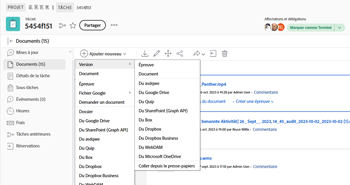

# Créer une nouvelle version d’un BAT

Gérer les commentaires sur plusieurs versions ou révisions d’un travail peut s’avérer un énorme défi. Workfront simplifie ce processus en vous permettant de créer et de comparer plusieurs versions d’un BAT.

Tenez compte des informations suivantes lorsque vous créez une version d’un BAT :

* Vous pouvez autoriser un utilisateur à voir une version, mais pas une autre. À l’inverse, si vous partagez une version ultérieure avec un utilisateur, celui-ci ne peut pas voir les versions antérieures, sauf si vous revenez en arrière et accordez explicitement à l’utilisateur l’accès à ces versions antérieures.
* Pour créer une nouvelle version d&#39;un BAT, vous devez disposer des droits d&#39; édition sur le BAT.

   Voir [Gestion des rôles de BAT dans le BAT Workfront](../../../workfront-proof/wp-work-proofsfiles/share-proofs-and-files/manage-proof-roles.md) et [Profils d’autorisations de BAT dans le BAT Workfront](../../../workfront-proof/wp-acct-admin/account-settings/proof-perm-profiles-in-wp.md) pour obtenir plus d’informations sur qui dispose de droits de modification sur un BAT.

   Pour plus d’informations sur le partage des versions de BAT, voir  [Partage d’un bon à tirer dans un bon à tirer Workfront](../../../workfront-proof/wp-work-proofsfiles/share-proofs-and-files/share-proof.md).

>[!IMPORTANT]
>
>Si un BAT est créé dans Adobe Workfront, toutes les nouvelles versions créées pour ce BAT doivent également être créées dans Workfront. Vous ne pouvez pas créer de version d’un BAT dans Workfront BAT si ce BAT a été créé dans Workfront.

## Exigences d’accès

Vous devez disposer des accès suivants pour effectuer les étapes de cet article :

<table style="table-layout:auto"> 
 <col> 
 <col> 
 <tbody> 
  <tr> 
   <td role="rowheader">Formule Adobe Workfront*</td> 
   <td> 
Formule actuelle : Pro ou version ultérieure
 
ou
 
Plan hérité : Sélectionner ou Premium
 
Pour plus d’informations sur la vérification de l’accès avec les différents plans, voir <a href="/help/quicksilver/administration-and-setup/manage-workfront/configure-proofing/access-to-proofing-functionality.md" class="MCXref xref">Accès aux fonctionnalités de vérification dans Workfront</a>.
 </td> 
  </tr> 
  <tr> 
   <td role="rowheader">Licence Adobe Workfront*</td> 
   <td> 
Formule actuelle : Travail ou plan
 
Plan hérité : N’importe quel (la vérification doit être activée pour l’utilisateur)
 </td> 
  </tr> 
  <tr> 
   <td role="rowheader">Profil d'autorisation pour l'épreuve </td> 
   <td>Manager ou version ultérieure</td> 
  </tr> 
  <tr> 
   <td role="rowheader">Paramétrages du niveau d'accès*</td> 
   <td> 
Modifier l’accès aux documents
 
Pour plus d’informations sur la demande d’accès supplémentaire, voir <a href="../../../workfront-basics/grant-and-request-access-to-objects/request-access.md" class="MCXref xref">Demande d’accès aux objets </a>.
 </td> 
  </tr> 
 </tbody> 
</table>

&#42;Pour connaître le plan, le rôle ou le profil d’autorisation de BAT dont vous disposez, contactez votre administrateur Workfront ou Workfront BAT.

## Création d’une version d’un BAT dans Workfront

Il existe plusieurs façons de charger une nouvelle version de BAT dans Workfront. Les paramètres de BAT par défaut peuvent être transférés ou non depuis la version précédente, selon la méthode que vous choisissez :

* **Générer automatiquement des bons à tirer lors du téléchargement de documents**: Les paramètres de BAT par défaut ne sont pas reportés. Si ce paramètre est activé dans votre profil utilisateur, les paramètres de BAT par défaut ne sont pas transférés lorsque vous faites glisser et déposez une nouvelle version.
* **Créer un BAT > Simple**: Les paramètres de BAT par défaut ne sont pas reportés. Si vous sélectionnez Simple lors de la création d’une version de BAT, les paramètres par défaut du BAT ne sont pas transférés de la version précédente.
* **Ajouter > Version > Bon à tirer**: Les paramètres de BAT par défaut sont transférés depuis la version précédente.
* **Créer un BAT > Avancé**: Les paramètres de BAT par défaut sont transférés depuis la version précédente.

   <table>
  <tbody>
  <tr>
  <td>Générer des épreuves automatiquement lors du chargement de documents</td>
  <td>Les paramètres de BAT par défaut ne sont pas reportés. Si ce paramètre est activé dans votre profil utilisateur, les paramètres de BAT par défaut ne sont pas transférés lorsque vous faites glisser et déposez une nouvelle version.</td>
  </tr>
  <tr>
  <td>Créer un BAT &gt; Simple</td>
  <td>Les paramètres de BAT par défaut ne sont pas reportés. Si vous sélectionnez Simple lors de la création d’une version de BAT, les paramètres par défaut du BAT ne sont pas transférés de la version précédente.</td>
  </tr>
  <tr>
  <td>Ajouter &gt; Version &gt; Bon à tirer</td>
  <td>Les paramètres de BAT par défaut sont transférés depuis la version précédente.</td>
  </tr>
  <tr>
  <td>Créer un BAT &gt; Avancé</td>
  <td>Les paramètres de BAT par défaut sont transférés depuis la version précédente.</td>
  </tr>
  </tbody>
  </table>

Pour créer une version d&#39;un BAT :

1. Ouvrez la liste des documents contenant le BAT.
1. A partir du système de fichiers de votre ordinateur, placez un nouveau fichier sur le BAT.

   Ou

   Sélectionnez la ligne où le BAT est répertorié, puis cliquez sur **Ajouter** > **Version**, puis cliquez sur l’option que vous souhaitez utiliser pour ajouter la nouvelle version du BAT.

   

## Créez une version d’un BAT à partir de la visionneuse de vérification de performance (BAT Workfront uniquement)

Si vous utilisez le BAT Workfront autonome, vous pouvez créer une nouvelle version d’un BAT contenant un seul fichier ou une capture web. 

>[!NOTE]
>
>Si votre compte est en formule Entreprise et que vous téléchargez plusieurs fichiers ou captures web, ils sont automatiquement combinés dans une seule nouvelle version. Veuillez consulter [Création d’un BAT multi-page](../../../review-and-approve-work/proofing/creating-proofs-within-workfront/create-multi-page-proof.md) pour plus d’informations.

Pour créer une version d’un BAT dans Workfront BAT :

1. Ouvrez le BAT.
1. Cliquez sur le bouton **Version** menu déroulant dans le coin supérieur gauche, puis cliquez sur **+ Nouvelle version** dans la zone qui s’affiche.

   Sur le **Nouvelle version du BAT** qui s’affiche, vous pouvez voir tous les réviseurs de la version précédente, y compris leurs rôles et leurs paramètres de notification électronique. Vous pouvez facilement modifier les rôles et notifications des réviseurs existants ou supprimer les réviseurs existants de la nouvelle version de cette page.

1. Sous **Ajouter des fichiers**, téléchargez un fichier en tant que nouvelle version du BAT en le faisant glisser et en le déposant sur votre ordinateur ou en cliquant sur **parcourir** et sélectionnez le fichier de votre choix. Vous pouvez saisir une **Nom du BAT** pour la version ou laissez ce champ vide pour utiliser le même nom de fichier avec un numéro de version ajouté à la fin.

   Ou

   Capturez une page web en tant que nouvelle version du BAT en saisissant une URL.

   >[!NOTE]
   >
   >Le glisser-déposer est disponible uniquement avec les navigateurs qui prennent entièrement en charge HTML5. Cela exclut Internet Explorer 7 à 9 et Safari.

1. Sous **Workflow**, effectuez l’une des modifications suivantes pour spécifier les opérateurs validants pour cette version du BAT.

   Les réviseurs de la version précédente sont remplacés par les réviseurs que vous ajoutez.

   * Modifiez la variable **Propriétaire** de la version à un autre utilisateur de votre compte.\
      Pour plus d’informations sur les autorisations de propriétaire, voir [Profils d’autorisations de BAT dans le BAT Workfront](../../../workfront-proof/wp-acct-admin/account-settings/proof-perm-profiles-in-wp.md).

   * En utilisant la variable **Saisissez le nom ou l’adresse électronique du contact auquel ajouter une boîte de réception.**, ajoutez des réviseurs à la version. Vous pouvez définir une **Rôle BAT** et un **Alertes par email** type pour chaque destinataire.

      Pour plus d’informations sur l’ajout de groupes au BAT, voir  [Ajout de groupes à un bon à tirer](../../../workfront-proof/wp-mnguserscontacts/groups/add-groups.md). Pour plus d’informations sur les rôles, voir [Gestion des rôles de BAT dans le BAT Workfront](../../../workfront-proof/wp-work-proofsfiles/share-proofs-and-files/manage-proof-roles.md).

      >[!NOTE]
      >
      >Si le créateur ou le propriétaire du BAT a [L&#39;email Bon à tirer](../../../workfront-proof/wp-emailsntfctns/proof-notifications-and-reminders/proof-made-email.md) désactivés par défaut (dans leurs paramètres personnels), ils ne recevront aucun email Bon à tirer ou Nouveau BAT, même si la case à cocher Notifier les personnes par email est cochée sur la page Nouveau BAT . Pour plus d’informations sur les notifications électroniques, voir [Configuration des paramètres de notification électronique dans le bon à tirer Workfront](../../../workfront-proof/wp-emailsntfctns/email-alerts/config-email-notification-settings-wp.md). Voir aussi [L&#39;email Bon à tirer](../../../workfront-proof/wp-emailsntfctns/proof-notifications-and-reminders/proof-made-email.md) et [Nouvel email de BAT](../../../workfront-proof/wp-emailsntfctns/proof-notifications-and-reminders/new-proof-email.md).

   * Définissez une date limite de BAT pour la version.
   * Passez la souris sur le nom d’un réviseur pour afficher les décisions qu’il a prises sur une version précédente.

1. Sous **Notification par email**, effectuez l’une des opérations suivantes :

   * Indiquez si vous souhaitez informer les réviseurs de la nouvelle version.\
      Votre sélection sera enregistrée dans la section Activité de la page Détails du BAT. Pour plus d’informations, voir [Gestion des détails du BAT dans le BAT Workfront](../../../workfront-proof/wp-work-proofsfiles/manage-your-work/manage-proof-details.md).

   * Ajoutez un objet et un message personnalisés.

1. Dans le **Organisation** , effectuez l’une des opérations suivantes : 

   * Appliquez une ou plusieurs balises au BAT. Pour plus d’informations, voir [Création et gestion des balises dans le BAT Workfront](../../../workfront-proof/wp-work-proofsfiles/organize-your-work/create-and-manage-tags.md).\
      Notez que les balises sont également héritées de la version précédente du BAT. Si vous ajoutez une nouvelle balise à la nouvelle version, les versions précédentes sont également balisées.

   * Ajoutez la version à un dossier. Voir [Gestion des dossiers dans le BAT Workfront](../../../workfront-proof/wp-work-proofsfiles/organize-your-work/manage-folders.md) pour plus d’informations. Le dossier sera copié à partir de la version précédente du BAT. Si vous sélectionnez un autre dossier, l&#39;ensemble du BAT (toutes versions) sera déplacé.

   * Les administrateurs de facturation et les administrateurs peuvent rendre le champ de dossier obligatoire pour l’ensemble du compte dans l’onglet Paramètres . Voir pour plus d’informations.

1. Sous Paramètres de BAT, effectuez l’une des modifications suivantes :

   * Exiger une connexion sur le BAT
   * Exiger des signatures électroniques sur le BAT (abonnement Entreprise uniquement)
   * Verrouiller le BAT lorsque toutes les décisions sont prises
   * Autoriser ou bloquer le téléchargement du fichier d’origine
   * Partage public du BAT, y compris les paramètres de partage public
   * Abonnement au BAT\
      Les sélections effectuées dans cette section seront affichées dans la page Détails du BAT (où certains champs peuvent être modifiés). Pour plus d’informations, voir [Gestion des détails du BAT dans le BAT Workfront](../../../workfront-proof/wp-work-proofsfiles/manage-your-work/manage-proof-details.md).

<!--
<h2 data-mc-conditions="QuicksilverOrClassic.Draft mode">Create a new version of a proof from the proofing viewer</h2>
-->

<!--

To create a new version from the proofing viewer

-->

<!--
<ol data-mc-conditions="QuicksilverOrClassic.Draft mode">
<li value="1">Open the proof.</li>
<li value="2"> 
Click the <strong>Version</strong> drop-down menu in the upper-left corner, then click <strong>+ New version</strong> in the box that appears.
 
On the <strong>New proof version of</strong> page that appears, you can see all the reviewers from the previous version, including their roles and email notification settings. You can easily edit the roles and notifications of existing reviewers or remove existing reviewers from the new version on this page.
 </li>
<li value="3"> 
Under <strong>Add files</strong>, upload a file as a new version of the proof by dragging and dropping from your computer or by clicking <strong>browse</strong> and selecting the file you want. You can type a&nbsp;<strong>Proof name</strong>&nbsp;for the version or leave this box blank to&nbsp;use the same filename with a version number added on the end.
 
Or 
 
Capture a web page as a new version of the proof by typing a URL
 <note type="note">
Drag and drop is available only with browsers that fully support HTML5. This excludes Internet Explorer 7 through 9 and Safari.
 
</note> </li>
<li value="4"> 
Under <strong>Workflow</strong>, make any of the following changes to specify the reviewers for this version of the proof.
 
Reviewers from the previous version are replaced by the reviewers you add.

<ul>
<li>Change the <strong>Owner</strong> of the version to another user in your account. For information about owner permissions, see <a href="../../../workfront-proof/wp-acct-admin/account-settings/proof-perm-profiles-in-wp.md" class="MCXref xref">Proof Permissions Profiles in Workfront Proof</a>.</li>
<li> 
Using the <strong>Type contact name or email address to add a recipient box</strong>, add reviewers to the version. You can specify a <strong>Proof role</strong> and an <strong>Email alerts</strong> type for each recipient.
 
For information about adding groups to the proof, see&nbsp;<a href="../../../workfront-proof/wp-mnguserscontacts/groups/add-groups.md" class="MCXref xref">Add Groups to a Proof</a>.&nbsp;For information about roles, see <a href="../../../workfront-proof/wp-work-proofsfiles/share-proofs-and-files/manage-proof-roles.md" class="MCXref xref">Manage Proof Roles in Workfront Proof</a>.
 <note type="note">
If the creator or owner of&nbsp;&nbsp;the proof has
<a href="../../../workfront-proof/wp-emailsntfctns/proof-notifications-and-reminders/proof-made-email.md" class="MCXref xref">The Proof Made email</a> disabled by default (in their personal settings), they won't receive any Proof made or New proof emails even if the Notify people by email box is checked on the New proof page. For information about email notifications, see
<a href="../../../workfront-proof/wp-emailsntfctns/email-alerts/config-email-notification-settings-wp.md" class="MCXref xref">Configure email notification settings in Workfront Proof</a>.&nbsp;See also
<a href="../../../workfront-proof/wp-emailsntfctns/proof-notifications-and-reminders/proof-made-email.md" class="MCXref xref">The Proof Made email</a> and
<a href="../../../workfront-proof/wp-emailsntfctns/proof-notifications-and-reminders/new-proof-email.md" class="MCXref xref">New proof email</a>.
 
</note> </li>
<li>Set a proof deadline for the version.</li>
<li>Hover over a reviewer's name to see any decisions he or she made on a previous version.</li>
</ul> </li>
<li value="5">Under <strong>Email notification</strong>, do any of the following:
<ul>
<li>Specify whether you want to notify the reviewers of the new version. Your selection will be logged in the Proof activity section on the Proof details page.</li>
<li>Add a custom subject and message.</li>
</ul></li>
<li value="6">Under Proof settings, make any of the changes below:
<ul>
<li>Require login on the proof</li>
<li>Require electronic signatures on the proof (Enterprise plan only)</li>
<li>Lock the proof when all decisions are made</li>
<li>Allow or block download of original file</li>
<li>Public sharing of the proof,&nbsp;including public sharing settings</li>
<li>Subscription to the proof The selections made in this section will be shown in the Proof details page.</li>
</ul></li>
</ol>
-->

## A propos du message Nouvelle version

Si un objet/message personnalisé était inclus dans la version précédente du BAT, il s’affichera par défaut sur la page Nouvelle version. Vous pouvez:

* Modifiez l’objet et le message.
* Désélectionnez la case Notifier les personnes par courrier électronique, ce qui signifie qu’aucun courrier électronique ne sera envoyé aux réviseurs pour les informer qu’ils disposent d’une nouvelle version à réviser.

   >[!NOTE]
    Ceci n’est pas affecté par un objet/message personnalisé par défaut enregistré dans vos paramètres personnels.

Si un objet et un message par défaut sont enregistrés dans vos paramètres personnels, cela aura un impact sur le message affiché par défaut sur la page Nouvelle version :

* Si vous choisissez d&#39;avertir vos réviseurs par e-mail de la version précédente du BAT à l&#39;aide de l&#39;e-mail standard (par exemple, aucun objet/message personnalisé), votre objet/message personnalisé par défaut (vos paramètres personnels) s&#39;affichera sur la page Nouvelle version. Vous pouvez ensuite modifier l’objet et le message personnalisés ou désélectionner la case Notifier les personnes par email (ce qui signifie qu’aucun email ne sera envoyé à vos réviseurs pour les informer qu’ils disposent d’une nouvelle version à réviser).
* Si vous choisissez de ne pas notifier vos réviseurs par email pour la version précédente du BAT (par exemple, aucun email standard ou personnalisé), la page Nouvelle version ne contiendra aucun message par défaut. Pour informer les réviseurs de la nouvelle version, cliquez sur le lien Envoyer un message , qui affichera votre objet/message personnalisé par défaut (selon vos paramètres personnels). Vous pouvez ensuite modifier l’objet et le message personnalisés, si nécessaire.

Si aucun objet et message par défaut n’est enregistré dans vos paramètres personnels, les éléments suivants s’affichent sur la page Nouvelle version :

* Si vous choisissez d&#39;avertir vos réviseurs par email pour la version précédente du BAT à l&#39;aide de l&#39;email standard (par exemple, aucun objet/message personnalisé), l&#39;option Avertir les personnes par email sera sélectionnée par défaut sur la page Nouvelle version. Pour ajouter un message personnalisé, cliquez sur le lien.
* Si vous choisissez de ne pas notifier vos réviseurs par email pour la version précédente du BAT (par exemple, aucun email standard ou personnalisé), la page Nouvelle version ne contiendra aucun message par défaut. Pour notifier les opérateurs validants de la nouvelle version, cliquez sur le lien Envoyer un message . Vous pouvez ensuite ajouter un objet et un message personnalisés en cliquant sur le lien Ajouter un message personnalisé .
