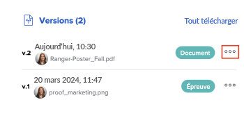

# Afficher les versions des épreuves

Vous pouvez afficher les versions antérieures d’une épreuve.

## Conditions d’accès

+++ Développez pour afficher les exigences d’accès aux fonctionnalités de cet article.

<table style="table-layout:auto"> 
 <col> 
 <col> 
 <tbody> 
  <tr> 
   <td role="rowheader">Package Adobe Workfront</td> 
   <td> 
Tous
 </td> 
  </tr> 
  <tr> 
   <td role="rowheader">Licence Adobe Workfront</td> 
   <td> 
   
Standard

   
Travail ou plan

   </td> 
  </tr> 
  <tr> 
   <td role="rowheader">Profil d'autorisation pour l'épreuve </td> 
   <td>Manager ou version supérieure</td> 
  </tr> 
  <tr> 
   <td role="rowheader">Configurations des niveaux d’accès</td> 
   <td> 
Modifier l’accès aux documents
 </td> 
  </tr> 
 </tbody> 
</table>

Pour plus d’informations, voir [Conditions d’accès requises dans la documentation Workfront](/help/quicksilver/administration-and-setup/add-users/access-levels-and-object-permissions/access-level-requirements-in-documentation.md).

+++

## Afficher la liste de toutes les versions d’une épreuve

1. Dans la liste des documents, sélectionnez l’épreuve.
1. Dans le résumé, faites défiler la section jusqu’à la vue **Toutes les versions**. Ici, vous pouvez consulter toutes les versions d’une épreuve.

   

## Prévisualiser une version antérieure d’une épreuve

Les fichiers qui ne peuvent pas être prévisualisés (tels que XLSX et DOC) sont téléchargés.

1. Accédez à la liste des documents et sélectionnez une épreuve.
1. Dans le résumé, faites défiler l’écran jusqu’à **Versions**, cliquez sur le menu **Plus**, puis sélectionnez **Aperçu**.

   

## Afficher une version antérieure d’une épreuve

Toute personne utilisant Workfront ayant accès à l’affichage d’un document peut consulter les versions antérieures d’un document relu. Il n’est pas nécessaire que l’utilisateur ou que l’utilisatrice dispose d’une licence de relecture.

1. Accédez au projet, à la tâche ou au problème qui contient le document, puis sélectionnez **Documents**.
1. Trouvez l’épreuve dont vous avez besoin.
1. Dans le résumé, faites défiler l’écran jusqu’à **Versions**, cliquez sur le menu **Plus**, puis sélectionnez **Ouvrir l’épreuve**.

   
