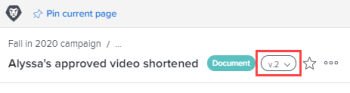

# Consulter et gérer les détails des versions des épreuves

Vous pouvez afficher et gérer les détails de l’épreuve.

## Conditions d’accès

+++ Développez pour afficher les exigences d’accès aux fonctionnalités de cet article.

Vous devez disposer des accès suivants pour effectuer les étapes décrites dans cet article :

<table style="table-layout:auto"> 
 <col> 
 <col> 
 <tbody> 
  <tr> 
   <td role="rowheader">Formule Adobe Workfront*</td> 
   <td> 
Plan actuel : Pro ou version supérieure
 
ou
 
Formule héritée : Select ou Premium
 
Pour plus d’informations sur la relecture de l’accès avec les différents plans, voir <a href="/help/quicksilver/administration-and-setup/manage-workfront/configure-proofing/access-to-proofing-functionality.md" class="MCXref xref">Accéder aux fonctionnalités de relecture dans Workfront</a>.
 </td> 
  </tr> 
  <tr> 
   <td role="rowheader">Licence Adobe Workfront*</td> 
   <td> 
Plan actuel : travail ou plan
 
Plan hérité : n’importe lequel (la relecture doit être activée pour l’utilisateur ou l’utilisatrice)
 </td> 
  </tr> 
  <tr> 
   <td role="rowheader">Profil d'autorisation pour l'épreuve </td> 
   <td>Manager ou version supérieure</td> 
  </tr> 
  <tr> 
   <td role="rowheader">Configurations du niveau d’accès*</td> 
   <td> 
Modifier l’accès aux documents
 
Pour plus d’informations sur la demande d’accès supplémentaire, voir <a href="../../../../workfront-basics/grant-and-request-access-to-objects/request-access.md" class="MCXref xref">Demander un accès aux objets</a>.
 </td> 
  </tr> 
 </tbody> 
</table>

&#42;Pour connaître le plan, le rôle ou le profil d’autorisation d’épreuve dont vous disposez, contactez votre administrateur ou administratrice Workfront ou Workfront Proof.

+++

## Afficher et gérer les détails d’une version précédente de l’épreuve

1. Dans une liste de documents, pointez sur la ligne contenant l’épreuve, puis cliquez sur **Détails du document**.
1. En haut de la page Détails du document, cliquez sur le menu déroulant en regard du nom, puis sur le nom de la version que vous souhaitez afficher et gérer.

   

   Outre l’affichage des détails de la version, vous pouvez apporter des modifications à la version, telles que son nom, ses métadonnées et ses paramètres de relecture (s’il s’agit d’une épreuve de document).

## Afficher les détails de la relecture d’une version précédente

Les personnes doivent disposer d’une licence de relecture pour pouvoir afficher les détails de la relecture d’une ancienne version d’un document relu.

1. Accédez au projet, à la tâche ou au problème qui contient le document, puis sélectionnez **Documents**.
1. Trouvez l’épreuve dont vous avez besoin.
1. Dans la zone **Version** du résumé, cliquez sur la version, puis sur **Détails** dans la liste déroulante qui s’affiche.

1. Sur la page Détails du document, cliquez sur **Workflow de relecture** dans le panneau de gauche pour effectuer l’une des opérations suivantes :

   * Ajoutez un workflow automatisé. Pour plus d’informations, reportez-vous à la section de l’article .
   * Partagez l’URL publique de l’épreuve. Pour plus d’informations, voir [Partager un lien d’épreuve](../../../../review-and-approve-work/proofing/managing-proofs-within-workfront/share-a-proof-in-workfront.md#share) dans [Partager une épreuve dans Adobe Workfront](../../../../review-and-approve-work/proofing/managing-proofs-within-workfront/share-a-proof-in-workfront.md).
   * Affichez toutes les activités qui ont eu lieu sur l’épreuve.
   * Envoyez des messages de rappel aux personnes réviseuses sur l’épreuve.

1. Cliquez sur **Terminé**.
