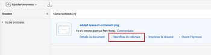

# Envoyer des e-mails aux réviseurs et réviseuses d’une épreuve

Au cours du processus de révision et d’approbation, vous pouvez envoyer un message à un réviseur ou une réviseuse d’une épreuve, ou bien à l’ensemble. Les messages sont un moyen facile de rappeler aux réviseurs et réviseuses de terminer leur révision d’une épreuve ou de fournir d’autres informations relatives à l’épreuve.

Vous pouvez choisir d’envoyer un e-mail de rappel générique ou d’envoyer un message personnalisé à une ou à toutes les personnes associése à une étape donnée.

## Conditions d’accès

+++ Développez pour afficher les exigences d’accès aux fonctionnalités de cet article.

Vous devez disposer des accès suivants pour effectuer les étapes décrites dans cet article :

<table style="table-layout:auto"> 
 <col> 
 <col> 
 <tbody> 
  <tr> 
   <td role="rowheader">Formule Adobe Workfront*</td> 
   <td> 
Plan actuel : Pro ou version supérieure
 
ou
 
Formule héritée : Select ou Premium
 
Pour plus d’informations sur la relecture de l’accès avec les différents plans, voir <a href="/help/quicksilver/administration-and-setup/manage-workfront/configure-proofing/access-to-proofing-functionality.md" class="MCXref xref">Accéder aux fonctionnalités de relecture dans Workfront</a>.
 </td> 
  </tr> 
  <tr> 
   <td role="rowheader">Licence Adobe Workfront*</td> 
   <td> 
Plan actuel : travail ou plan
 
Plan hérité : n’importe lequel (la relecture doit être activée pour l’utilisateur ou l’utilisatrice)
 </td> 
  </tr> 
  <tr> 
   <td role="rowheader">Profil d'autorisation pour l'épreuve </td> 
   <td>Manager ou version supérieure</td> 
  </tr> 
  <tr> 
   <td role="rowheader">Rôle de l’épreuve</td> 
   <td>Auteur ou autrice, ou modérateur ou modératrice</td> 
  </tr> 
  <tr> 
   <td role="rowheader">Configurations du niveau d’accès*</td> 
   <td> 
Modifier l’accès aux documents
 
Remarque : si vous n’avez toujours pas d’accès, demandez à votre équipe d’administration Workfront s’il existe des restrictions supplémentaires à votre niveau d’accès. Pour plus d’informations sur la façon dont l’administration Workfront peut modifier votre niveau d’accès, consultez la section <a href="../../../administration-and-setup/add-users/configure-and-grant-access/create-modify-access-levels.md" class="MCXref xref">Créer ou modifier des niveaux d’accès personnalisés</a>.
 </td> 
  </tr> 
 </tbody> 
</table>

&#42;Pour connaître le plan, le rôle ou le profil d’autorisation d’épreuve dont vous disposez, contactez votre administrateur ou administratrice Workfront ou Workfront Proof.

+++

## Envoyer des e-mails aux utilisateurs et utilisatrices d’une épreuve

1. Recherchez le document de l’épreuve qui contient les utilisateurs et utilisatrices à qui vous voulez envoyer un message.
1. Pointez sur le document, puis cliquez sur **Workflow de relecture**.

   

1. Pour envoyer un message à l’ensemble des utilisateurs et utilisatrices de l’étape, cliquez sur le menu **Plus** sur l’étape et choisissez **Envoyer un message à tous**.

   

1. Pour envoyer un message à une personne en particulier, cliquez sur le menu **Plus** à côté de la personne et choisissez **Envoyer un message**.

   

1. Dans la section **Détails du message**, spécifiez les informations suivantes :

   <table style="table-layout:auto"> 
    <col> 
    <col> 
    <tbody> 
     <tr> 
      <td role="rowheader">Notifier les personnes par e-mail</td> 
      <td>Cette option ne peut pas être désélectionnée. L’ensemble des utilisateurs et utilisatrices reçoivent le message par e-mail.</td> 
     </tr> 
     <tr> 
      <td role="rowheader">Ignorer le message personnalisé</td> 
      <td> 
Cliquez sur <strong>Ignorer le message personnalisé</strong> si vous souhaitez inclure uniquement le contenu de l’e-mail par défaut.
 
L’e-mail de rappel par défaut contient les informations suivantes :
 
       <ul> 
        <li>Lien personnel vers l’épreuve Mignature de l’image de l’épreuve </li> 
        <li>Les informations suivantes sur l’épreuve : nom de l’épreuve, numéro de version, nom du dossier (le cas échéant), liste des réviseurs et réviseuses et leur progression dans l’épreuve.</li> 
       </ul> </td> 
     </tr> 
     <tr> 
      <td role="rowheader">Objet</td> 
      <td>Tapez l’objet du message.</td> 
     </tr> 
     <tr> 
      <td role="rowheader">Message</td> 
      <td>Tapez le contenu de votre message.</td> 
     </tr> 
    </tbody> 
   </table>

1. Cliquez sur **Envoyer**.
