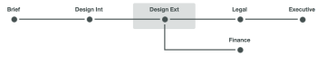
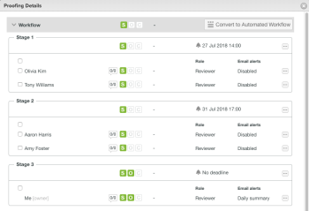

# Vue d’ensemble des étapes du workflow automatisé

Les étapes de l’épreuve sont des segments de temps dans lesquels différentes personnes révisent une épreuve. Au fur et à mesure que l’épreuve passe d’une étape à l’autre, Adobe Workfront avertit les réviseurs et réviseuses pour leur indiquer quand il est temps de travailler dessus.

Les étapes se produisent dans deux situations différentes :

* [Créer une épreuve avec un workflow automatisé](#create-a-proof-with-an-automated-workflow)
* [Attribuer des échéances à différents réviseurs et réviseuses sur une épreuve](#assign-deadlines-for-different-reviewers-on-a-proof)

## Créer une épreuve avec un workflow automatisé {#create-a-proof-with-an-automated-workflow}

Lorsque vous ajoutez un workflow automatisé à une épreuve, vous configurez les étapes du travail de révision que vous souhaitez réaliser.

Lorsque vous configurez des étapes pour une étape avec un workflow automatique, vous pouvez faire ce qui suit :

* Vous pouvez configurer les étapes pour qu’elles s’exécutent consécutivement ou simultanément.
* Vous pouvez configurer certaines étapes pour qu’elles deviennent actives uniquement une fois l’étape précédente terminée.
* Vous pouvez rendre certaines étapes privées. Cela s’avère utile, par exemple, pour une agence qui révise une épreuve avant qu’elle ne soit partagée avec un client ou une cliente, et qui ne souhaite pas que les commentaires qui en résultent soient visibles par le client ou la cliente.

Pour plus d’informations sur la création d’étapes pour une épreuve avec un workflow automatisé, voir [Créer une épreuve avancée avec un workflow automatisé](../../../review-and-approve-work/proofing/creating-proofs-within-workfront/create-automated-proof-workflow.md).

>[!NOTE]
>
>Si une personne n’est incluse dans aucune étape, mais qu’elle a accès au document et ouvre l’épreuve, le système crée une étape appelée *Workfront*.
>
>La personne qui a ouvert l’épreuve se voit attribuer le rôle spécifié dans Configuration > Révision et approbation > Rôles pour les personnes non-destinataires ouvrant une épreuve de document.

## Attribuer des échéances à différents réviseurs et réviseuses sur une épreuve {#assign-deadlines-for-different-reviewers-on-a-proof}

Lorsque vous attribuez des échéances de relecture différentes aux personnes réviseuses sur une épreuve, le système crée une étape pour chaque échéance et regroupe les personnes réviseuses pour chaque échéance dans l’étape correspondante. 

**Exemple :** par exemple, si vous créez une épreuve avec quatre personnes réviseuses :

* Pour les réviseurs Olivia et Tony, vous spécifiez une date limite pour 14:00 dans quelques jours.
* Pour Aaron et Amy, vous spécifiez une date limite pour 17 heures quelques jours plus tard.
* Ne spécifiez pas d’échéance pour vous-même.

Le système crée une étape pour chacun de ces trois « groupes » de personnes chargées de la révision :

Si vous partagez l’épreuve avec une autre personne chargée de la révision et ne spécifiez pas d’échéance, Workfront ajoute cette personne à l’étape 3, où il n’y a pas d’échéance. 
