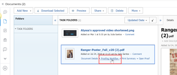

# Vue d’ensemble des statuts et de la progression de la relecture

Vous pouvez afficher des informations sur la progression d’une épreuve tout au long du processus de révision et un résumé global du statut de décision de l’épreuve dans la zone Documents.

## Vue d’ensemble de la progression de la relecture

La progression de la relecture indique le travail effectué sur une épreuve entre le moment où vous envoyez l’épreuve aux personnes destinataires et le moment où elles prennent une décision sur l’épreuve. Les icônes de progression, S, O, C et D, apparaissent en regard du nom de l’épreuve et fournissent des informations sur la progression de la relecture.

<table style="table-layout:auto"> 
 <col> 
 <col> 
 <thead> 
  <tr> 
   <td> 
<strong>Icône de progression</strong> 
 </td> 
   <td> 
<strong>Description</strong> 
 </td> 
  </tr> 
 </thead> 
 <tbody> 
  <tr> 
   <td> 
  
 
<strong>Envoyé</strong> 
 </td> 
   <td> 
L’épreuve a été envoyée aux personnes destinataires concernées.
 </td> 
  </tr> 
  <tr> 
   <td> 
<strong></strong> 
 
<strong>Ouvert</strong> 
 </td> 
   <td> 
Toutes les personnes destinataires concernées ouvrent l’épreuve ou la page des détails de l’épreuve.
 </td> 
  </tr> 
  <tr> 
   <td> 
<strong></strong> 
 
<strong>Commentaire saisi</strong> 
 </td> 
   <td> 
Toutes les personnes destinataires concernées saisissent au moins un commentaire sur l’épreuve.
 
Si aucun réviseur ou aucune réviseuse n’a été affecté à l’épreuve, l’icône <strong>C</strong> n’apparaît pas dans la barre de progression.
 </td> 
  </tr> 
  <tr> 
   <td> 
  
 
<strong>Décision prise</strong> 
 </td> 
   <td> 
Tous les approbateurs et toutes les approbatrices concernés prennent une décision sur l’épreuve, tous les approbateurs et toutes les approbatrices concernés prennent une décision sur l’épreuve, sauf si l’auteur ou l’autrice de l’épreuve indique qu’une seule décision est nécessaire.
 
Si aucun approbateur ou aucune approbatrice (décideur ou décideuse) n’est désigné pour l’épreuve, l’icône <strong>D</strong> n’apparaît pas dans la barre de progression.
 </td> 
  </tr> 
 </tbody> 
</table>

Les icônes de progression peuvent apparaître dans les couleurs suivantes pour indiquer certaines informations sur la progression de l’épreuve :

* **Vert** : terminé.
* **Blanc** : non terminé.
* **Orange** : non terminé et échéance inférieure à 24 heures.
* **Rouge** : non terminé et échéance dépassée.

<!--
<h3 data-mc-conditions="QuicksilverOrClassic.Draft mode">Levels of proof progress</h3>
-->

<!--

Workfront Proof uses the progress icons to track a proof's progress at each of the following levels:

-->

<!--
  <li data-mc-conditions="QuicksilverOrClassic.Draft mode">For each reviewer, based on that person's activity on the proof.&nbsp;</li>
  -->

<!--
  <li data-mc-conditions="QuicksilverOrClassic.Draft mode">For each stage, based on the progress the reviewer on the stage who is most behind in the proofing process.&nbsp;To learn more about stages, see <a href="../../../review-and-approve-work/proofing/proofing-overview/stages.md" class="MCXref xref">Automated Workflow Stages overview</a>.</li>
  -->

<!--
  <li data-mc-conditions="QuicksilverOrClassic.Draft mode">For the proof, based on the progress of the stage (group of reviewers) who is the most behind in the proofing process.</li>
  -->

<!--

For an example of how Workfront Proof determines progress using the reviewer or stage that is most behind,&nbsp;suppose three reviewers on a proof need to make a&nbsp;decision. If two of them have made their&nbsp;decision&nbsp;but the third has not, the progress bar for the proof does not show&nbsp;the D in green because of the outstanding&nbsp;decision.

-->

<!--

If the Primary Decision Maker setting is selected on a proof and the primary decision maker submits a decision, the D in the proof progress bar turns&nbsp;green for all reviewers because no other decisions are required.

-->

<!--

Similarly, if the Only One Decision Required setting is selected on a proof and any reviewer submits a decision, the D in the proof progress bar turns&nbsp;green for all reviewers because no other decisions are required.

-->

## Vue d’ensemble des statuts de l’épreuve

Le statut de l’épreuve indique le statut des décisions requises pour l’épreuve. Le statut de l’épreuve dépend du participant ou de la participante dans le « pire cas ». Par exemple, supposons qu’il y ait trois décisions sur l’épreuve : deux ont le statut **Accepté** et une a le statut **Rejeté**. La décision dans le « pire cas » **Rejeté** est prioritaire sur les autres décisions et le statut global de l’épreuve est affiché comme **Rejeté**.

Les options de statut standard sont les suivantes :

* En attente
* Approuvé
* Approuvé avec des modifications
* Modifications requises
* Non pertinent

Si des décisions personnalisées sont configurées dans votre compte, les options de statut reflètent vos paramètres de décision personnalisés.

<!--
<h2 data-mc-conditions="QuicksilverOrClassic.Draft mode">Viewing proof progress and status</h2>
-->

<!--

 You can view the progress and status of proofs for individual documents. 

-->

<!--
  <li data-mc-conditions="QuicksilverOrClassic.Draft mode"><a href="#view-proof-progress-and-status-for-a-document" class="MCXref xref">View proof progress and status&nbsp;for a document</a> </li>
  -->

<!--
  <li data-mc-conditions="QuicksilverOrClassic.Draft mode"><a href="#view-proof-approval-information-in-home" class="MCXref xref">View proof approval information&nbsp;in Home</a> </li>
  -->

<!--
<h3 data-mc-conditions="QuicksilverOrClassic.Draft mode" id="view-proof-progress-and-status-for-a-document">View proof progress and status&nbsp;for a document</h3>
-->

<!--
   <li value="1" data-mc-conditions="QuicksilverOrClassic.Draft mode">If a proof has not already been generated for the document in Adobe Workfront, generate it, as described in the articles.</li>
   -->

<!--
   <li value="2" data-mc-conditions="QuicksilverOrClassic.Draft mode">In the Documents area, under the proof's name, click <strong>Proof Details</strong>.</li>
   -->

<!--
   <li value="3" data-mc-conditions="QuicksilverOrClassic.Draft mode">In the <strong>Proofing Details</strong> box that appears, the proof's progress for each stage, then click <strong>Done</strong>.</li>
   -->

<!--
   
Under the proof's name, click <strong>Proofing Workflow</strong>.

   -->

<!--
   
 
   
   -->
<!--
   <MadCap:conditionalText data-mc-conditions="QuicksilverOrClassic.Draft mode">
   These screenshots will need to change with new terminology ("Review Workflow" for this one?)
   </MadCap:conditionalText>
     

   -->

<!--
   
In the Workflow information that appears, scroll down to see the proof's progress for each stage:

   -->

<!--
   
  

   -->

<!--
<h3 data-mc-conditions="QuicksilverOrClassic.Draft mode" id="view-proof-approval-information-in-home">View proof approval information&nbsp;in Home</h3>
-->

<!--

You can view information about proofs that you have submitted for approval. Proof approval information is displayed in the Home area only while the proof is pending approval.&nbsp;For information about how to view information about proof approvals in the Home area, see&nbsp;<a href="../../../review-and-approve-work/manage-approvals/view-approvals.md" class="MCXref xref">View approvals </a>.

-->
