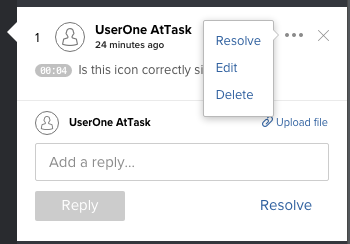

# Supprimer les commentaires d’une épreuve

Vous pouvez supprimer un commentaire ou une réponse à un commentaire tant que personne n’y a répondu. Il est généralement préférable de résoudre un commentaire plutôt que de le supprimer. Pour plus d’informations, voir [Résoudre les commentaires d’une épreuve](../../../../review-and-approve-work/proofing/reviewing-proofs-within-workfront/comment-on-a-proof/resolve-proof-comments.md).

## Conditions d’accès

+++ Développez pour afficher les exigences d’accès aux fonctionnalités de cet article.

Vous devez disposer des accès suivants pour effectuer les étapes décrites dans cet article :

<table style="table-layout:auto"> 
 <col> 
 <col> 
 <tbody> 
  <tr> 
   <td role="rowheader">Formule Adobe Workfront*</td> 
   <td> 
Plan actuel : Pro ou version supérieure
 
ou
 
Formule héritée : Select ou Premium
 
Pour plus d’informations sur la relecture de l’accès avec les différents plans, voir <a href="/help/quicksilver/administration-and-setup/manage-workfront/configure-proofing/access-to-proofing-functionality.md" class="MCXref xref">Accéder aux fonctionnalités de relecture dans Workfront</a>.
 </td> 
  </tr> 
  <tr> 
   <td role="rowheader">Licence Adobe Workfront*</td> 
   <td> 
Plan actuel : travail ou plan
 
Plan hérité : n’importe lequel (la relecture doit être activée pour l’utilisateur ou l’utilisatrice)
 </td> 
  </tr> 
  <tr> 
   <td role="rowheader">Profil d'autorisation pour l'épreuve </td> 
   <td>Superviseur</td> 
  </tr> 
  <tr> 
   <td role="rowheader">Rôle de l’épreuve</td> 
   <td>Modérateur </td> 
  </tr> 
  <tr> 
   <td role="rowheader">Configurations du niveau d’accès*</td> 
   <td> 
Modifier l’accès aux documents
 
Pour plus d’informations sur la demande d’accès supplémentaire, voir <a href="../../../../workfront-basics/grant-and-request-access-to-objects/request-access.md" class="MCXref xref">Demander un accès aux objets</a>.
 </td> 
  </tr> 
 </tbody> 
</table>

&#42;Pour connaître le plan, le rôle ou le profil d’autorisation d’épreuve dont vous disposez, contactez votre administrateur ou administratrice de Workfront ou Workfront Proof.

+++

## Supprimer les commentaires d’une épreuve

1. Accédez au projet, à la tâche ou au problème qui contient le document, puis sélectionnez **Documents**.
1. Recherchez l’épreuve dont vous avez besoin, puis cliquez sur **Ouvrir l’épreuve**.

1. (Le cas échéant) Si la zone de commentaires n’est pas ouverte, cliquez sur **Afficher les commentaires** dans le coin supérieur droit.
1. Sélectionnez le commentaire ou la réponse, puis cliquez sur l’icône **Plus**.

   

1. Cliquez sur **Supprimer** > **Oui, supprimer**. Une fois qu’un commentaire a été supprimé, le système consigne une entrée dans la section des activités de l’épreuve, indiquant que le commentaire a été supprimé.
