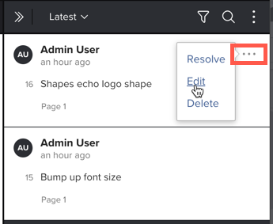

# Modifier les commentaires de l’épreuve

Les commentaires ne peuvent pas être modifiés une fois qu’une réponse a été ajoutée au commentaire. Cette restriction conserve l’intégrité du thread de commentaires. Lorsque vous modifiez un commentaire, l’heure à laquelle le commentaire a été publié n’est pas affectée.

## Conditions d’accès

+++ Développez pour afficher les exigences d’accès aux fonctionnalités de cet article.

Vous devez disposer des accès suivants pour effectuer les étapes décrites dans cet article :

<table style="table-layout:auto"> 
 <col> 
 <col> 
 <tbody> 
  <tr> 
   <td role="rowheader">Formule Adobe Workfront*</td> 
   <td> 
Plan actuel : Pro ou version supérieure
 
ou
 
Formule héritée : Select ou Premium
 
Pour plus d’informations sur la relecture de l’accès avec les différents plans, voir <a href="/help/quicksilver/administration-and-setup/manage-workfront/configure-proofing/access-to-proofing-functionality.md" class="MCXref xref">Accéder aux fonctionnalités de relecture dans Workfront</a>.
 </td> 
  </tr> 
  <tr> 
   <td role="rowheader">Licence Adobe Workfront*</td> 
   <td> 
Plan actuel : travail ou plan
 
Plan hérité : n’importe lequel (la relecture doit être activée pour l’utilisateur ou l’utilisatrice)
 </td> 
  </tr> 
  <tr> 
   <td role="rowheader">Profil d'autorisation pour l'épreuve </td> 
   <td>Superviseur</td> 
  </tr> 
  <tr> 
   <td role="rowheader">Rôle de l’épreuve</td> 
   <td>Auteur ou autrice, ou modérateur ou modératrice</td> 
  </tr> 
  <tr> 
   <td role="rowheader">Configurations du niveau d’accès*</td> 
   <td> 
Modifier l’accès aux documents
 
Pour plus d’informations sur la demande d’accès supplémentaire, voir <a href="../../../../workfront-basics/grant-and-request-access-to-objects/request-access.md" class="MCXref xref">Demander un accès aux objets</a>.
 </td> 
  </tr> 
 </tbody> 
</table>

&#42;Pour connaître le plan, le rôle ou le profil d’autorisation d’épreuve dont vous disposez, contactez votre administrateur ou administratrice Workfront ou Workfront Proof.

+++

## Modifier les commentaires de l’épreuve

Vous pouvez modifier tout commentaire que vous avez publié sur une épreuve. En outre, les utilisateurs et utilisatrices suivants peuvent modifier les commentaires d’autres utilisateurs et utilisatrices :

* Le ou la propriétaire de l’épreuve
* Le créateur ou la créatrice de l’épreuve
* Utilisateurs et utilisatrices disposant d’autorisations de profil de superviseur ou superviseuse
* Utilisateurs et utilisatrices avec un rôle d’épreuve de l’auteur ou l’autrice, ou le modérateur ou la modératrice

Pour modifier les commentaires de l’épreuve :

1. Accédez au projet, à la tâche ou au problème qui contient le document, puis sélectionnez **Documents**.
1. Recherchez l’épreuve dont vous avez besoin, puis cliquez sur **Ouvrir l’épreuve**.

1. (Le cas échéant) Si la zone de commentaires n’est pas ouverte, cliquez sur **Afficher les commentaires** dans le coin supérieur droit.
1. Placez la souris sur le commentaire à modifier, puis cliquez sur l’icône **Plus** qui s’affiche, puis sur **Modifier**.

1. 

1. Apportez des modifications au commentaire, puis cliquez sur **Publier**.

   >[!NOTE]
   >
   >Le libellé « Modifié » apparaît sur le commentaire. Lorsqu’un réviseur ou une réviseuse passe le curseur de la souris sur le libellé, votre nom et la date et l’heure des modifications s’affichent. Si vous modifiez le commentaire plusieurs fois, les informations de la modification la plus récente s’affichent uniquement. Ce libellé apparaît également au-dessus du commentaire lorsque vous sélectionnez le document dans la zone Documents et affichez l’onglet **Mises à jour** dans le résumé.
