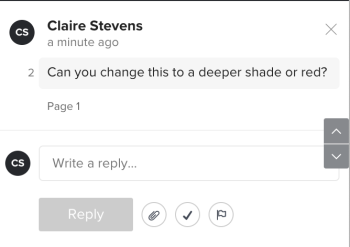

# Résoudre les commentaires des épreuves

Vous pouvez marquer les commentaires comme résolus une fois qu’ils ont été traités. Vous pouvez rouvrir un commentaire que vous ou une autre personne chargée de la révision avez résolu.

## Conditions d’accès

+++ Développez pour afficher les exigences d’accès aux fonctionnalités de cet article.

<table style="table-layout:auto"> 
 <col> 
 <col> 
 <tbody> 
  <tr> 
   <td role="rowheader">Package Adobe Workfront</td> 
   <td> 
Tous
 </td> 
  </tr> 
  <tr> 
   <td role="rowheader">Licence Adobe Workfront</td> 
   <td> 
Tous
</td> 
  </tr> 
  <tr> 
   <td role="rowheader">Profil d'autorisation pour l'épreuve</td> 
   <td>Manager ou version supérieure</td> 
  </tr> 
  <tr> 
   <td role="rowheader">Rôle de l’épreuve</td> 
   <td>Auteur ou autrice, ou modérateur ou modératrice</td> 
  </tr> 
  <tr> 
   <td role="rowheader">Configurations des niveaux d’accès</td> 
   <td> 
Modifier l’accès aux documents
 </td> 
  </tr> 
 </tbody> 
</table>

Pour plus d’informations, voir [Conditions d’accès requises dans la documentation Workfront](/help/quicksilver/administration-and-setup/add-users/access-levels-and-object-permissions/access-level-requirements-in-documentation.md).

+++

## Résoudre un commentaire

1. Accédez au projet, à la tâche ou au problème qui contient le document, puis sélectionnez **Documents**.
1. Recherchez l’épreuve dont vous avez besoin, puis cliquez sur **Ouvrir l’épreuve**.

1. (Le cas échéant) Si la zone de commentaires n’est pas ouverte, cliquez sur **Afficher les commentaires** dans le coin supérieur droit.
1. Sélectionnez le commentaire.
1. Cliquez sur l’icône en forme de coche en bas à droite du commentaire. Une coche verte apparaît en haut à gauche du commentaire, et un libellé et un message « Thread résolu » s’affichent en dessous. La personne qui a envoyé le commentaire reçoit une notification par e-mail lui indiquant que le commentaire a été résolu.

   

## Rouvrir un commentaire résolu

1. Accédez au projet, à la tâche ou au problème qui contient le document, puis sélectionnez **Documents**.
1. Recherchez l’épreuve dont vous avez besoin, puis cliquez sur **Ouvrir l’épreuve**.

1. (Le cas échéant) Si la zone de commentaires n’est pas ouverte, cliquez sur **Afficher les commentaires** dans le coin supérieur droit.
1. Sélectionnez le commentaire.
1. Cliquez sur l’icône en forme de coche verte en bas à droite du commentaire (à droite du bouton **Répondre**). La coche située en haut à gauche du commentaire disparaît et un libellé et un message « Thread rouvert » apparaissent en dessous. La personne qui a envoyé le commentaire reçoit une notification par e-mail l’informant que le commentaire a été rouvert.

   
