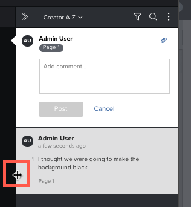

# Afficher et répondre à des commentaires d’épreuve

Vous pouvez afficher les commentaires de l’épreuve rédigés par d’autres réviseurs et réviseuses et y répondre.

## Conditions d’accès

+++ Développez pour afficher les exigences d’accès aux fonctionnalités de cet article.

Vous devez disposer des accès suivants pour effectuer les étapes décrites dans cet article :

<table style="table-layout:auto"> 
 <col> 
 <col> 
 <tbody> 
  <tr> 
   <td role="rowheader">Formule Adobe Workfront*</td> 
   <td> 
Plan actuel : Pro ou version supérieure
 
ou
 
Formule héritée : Select ou Premium
 
Pour plus d’informations sur la relecture de l’accès avec les différents plans, voir <a href="/help/quicksilver/administration-and-setup/manage-workfront/configure-proofing/access-to-proofing-functionality.md" class="MCXref xref">Accéder aux fonctionnalités de relecture dans Workfront</a>.
 </td> 
  </tr> 
  <tr> 
   <td role="rowheader">Licence Adobe Workfront*</td> 
   <td> 
Plan actuel : travail ou plan
 
Plan hérité : n’importe lequel (la relecture doit être activée pour l’utilisateur ou l’utilisatrice)
 </td> 
  </tr> 
  <tr> 
   <td role="rowheader">Profil d'autorisation pour l'épreuve </td> 
   <td>Manager ou version supérieure</td> 
  </tr> 
  <tr> 
   <td role="rowheader">Configurations du niveau d’accès*</td> 
   <td> 
Modifier l’accès aux documents
 
Pour plus d’informations sur la demande d’accès supplémentaire, voir <a href="../../../../workfront-basics/grant-and-request-access-to-objects/request-access.md" class="MCXref xref">Demander un accès aux objets</a>.
 </td> 
  </tr> 
 </tbody> 
</table>

&#42;Pour connaître le plan, le rôle ou le profil d’autorisation d’épreuve dont vous disposez, contactez votre administrateur ou administratrice Workfront ou Workfront Proof.

+++

## Afficher des commentaires dans la visionneuse de relecture

Chaque commentaire affiche les informations suivantes :

* Nom de l’utilisateur ou de l’utilisatrice qui a rédigé le commentaire.
* Numéro de la page où a été fait le commentaire (dans les épreuves statiques contenant plusieurs pages).
* Numéro de l’image ou de la plage d’enregistrement où été fait le commentaire (dans les épreuves vidéo).

  Si le commentaire que vous affichez a été fait sur une plage d’enregistrement vidéo, vous pouvez cliquer sur le bouton Lecture pour réviser la plage.

* Texte inclus dans le commentaire
* Toute pièce jointe chargée dans le commentaire

Pour afficher les commentaires dans la visionneuse de relecture, procédez comme suit :

1. Accédez au projet, à la tâche ou au problème qui contient le document, puis sélectionnez **Documents**.
1. Recherchez l’épreuve dont vous avez besoin, puis cliquez sur **Ouvrir l’épreuve**.

1. (Le cas échéant) Si la zone de commentaires n’est pas ouverte, cliquez sur **Afficher les commentaires** dans le coin supérieur droit.
1. Cliquez sur un commentaire pour afficher les marques de commentaire sur l’épreuve,
1. ou
1. dans une épreuve vidéo, passez la souris sur le point de la chronologie où un commentaire a été fait, puis cliquez sur le ballon numéroté qui s’affiche.
1. 

1. (Facultatif) Pour ajuster la taille de la liste de commentaires, pointez sur le bord gauche de la zone de commentaire (et non sur le commentaire actuellement ouvert) jusqu’à ce que le pointeur de la souris change pour le redimensionnement horizontal, puis faites glisser le bord là où vous le souhaitez.
1. 

## Afficher les commentaires d’épreuve dans l’onglet Mises à jour

Dans Workfront, vous pouvez afficher les commentaires d’épreuve sans lancer la visionneuse de relecture.

1. Accédez au projet, à la tâche ou au problème qui contient le document, puis sélectionnez **Documents**.
1. Cliquez sur la ligne contenant le document, puis sur l’icône **Résumé**  sur le côté droit de la page.\
   Les commentaires s’affichent dans la section Mises à jour du résumé du document.

## Marquer tous les commentaires comme lus

En tant que réviseur ou réviseuse d’une épreuve, vous pouvez rapidement marquer tous les commentaires comme lus.

1. Accédez au projet, à la tâche ou au problème qui contient le document, puis sélectionnez **Documents**.
1. Recherchez l’épreuve dont vous avez besoin, puis cliquez sur **Ouvrir l’épreuve**.

1. (Le cas échéant) Si la zone de commentaires n’est pas ouverte, cliquez sur **Afficher les commentaires** dans le coin supérieur droit.

1. Au-dessus de la liste des commentaires, cliquez sur l’icône **Plus** puis cliquez sur **Marquer tout comme lu**.

1. 

## Répondre aux commentaires d’épreuve à partir de la visionneuse de relecture

1. Accédez au projet, à la tâche ou au problème qui contient le document, puis sélectionnez **Documents**.
1. Recherchez l’épreuve dont vous avez besoin, puis cliquez sur **Ouvrir l’épreuve**.

1. (Le cas échéant) Si la zone de commentaires n’est pas ouverte, cliquez sur **Afficher les commentaires** dans le coin supérieur droit.
1. Cliquez sur un commentaire pour afficher les marques de commentaire sur l’épreuve,

   >[!TIP]
   >
   >Utilisez les boutons **Commentaire précédent** et **Commentaire suivant** sur le bord droit de l’écran pour parcourir les commentaires.

1. Saisissez votre réponse dans la zone **Ajouter une réponse**.
1. (Facultatif) Pour informer une autre personne réviseuse de votre réponse, saisissez @ dans la zone de commentaire, puis saisissez le nom ou l’adresse e-mail de la personne. Pour plus d’informations, voir [Taguer des personnes pour partager une épreuve](../../../../review-and-approve-work/proofing/reviewing-proofs-within-workfront/comment-on-a-proof/tag-users-to-share-proof.md).
1. (Facultatif) Pour ajouter un fichier à un commentaire, effectuez l’une des opérations suivantes :

   * Cliquez sur l’icône de trombone, puis sélectionnez le fichier à charger.
   * Faites glisser un fichier d’un emplacement de votre ordinateur jusque dans la zone de commentaire.

1. Cliquez sur **Répondre**.
