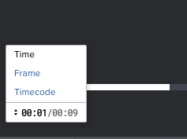

# Modification de l’unité de mesure de la chronologie dans un BAT vidéo

Vous pouvez ajuster l’unité de mesure utilisée dans la chronologie vidéo. Vous pouvez afficher la chronologie dans l’heure, l’image ou le code temporel.

## Exigences d’accès

Vous devez disposer des accès suivants pour effectuer les étapes de cet article :

<table style="table-layout:auto"> 
 <col> 
 <col> 
 <tbody> 
  <tr> 
   <td role="rowheader">Formule Adobe Workfront*</td> 
   <td> 
Formule actuelle : Pro ou version ultérieure
 
ou
 
Plan hérité : Sélectionner ou Premium
 
Pour plus d’informations sur la vérification de l’accès avec les différents plans, voir <a href="/help/quicksilver/administration-and-setup/manage-workfront/configure-proofing/access-to-proofing-functionality.md" class="MCXref xref">Accès aux fonctionnalités de vérification dans Workfront</a>.
 </td> 
  </tr> 
  <tr> 
   <td role="rowheader">Licence Adobe Workfront*</td> 
   <td> 
Formule actuelle : Travail ou plan
 
Plan hérité : N’importe quel (la vérification doit être activée pour l’utilisateur)
 </td> 
  </tr> 
  <tr> 
   <td role="rowheader">Profil d'autorisation pour l'épreuve </td> 
   <td>Manager ou version ultérieure</td> 
  </tr> 
  <tr> 
   <td role="rowheader">Paramétrages du niveau d'accès*</td> 
   <td> 
Modifier l’accès aux documents
 
Pour plus d’informations sur la demande d’accès supplémentaire, voir <a href="../../../../workfront-basics/grant-and-request-access-to-objects/request-access.md" class="MCXref xref">Demande d’accès aux objets </a>.
 </td> 
  </tr> 
 </tbody> 
</table>

&#42;Pour connaître le plan, le rôle ou le profil d’autorisation de BAT dont vous disposez, contactez votre administrateur Workfront ou Workfront BAT.

## Modifier l’unité de mesure de la chronologie

1. Accédez au projet, à la tâche ou au problème qui contient le document, puis sélectionnez **Documents**.
1. Recherchez le BAT dont vous avez besoin, puis cliquez sur **BAT ouvert**.

1. Dans le coin inférieur gauche de la visionneuse de vérification, cliquez sur l’unité de mesure actuelle.

   

1. Sélectionnez l’une des options suivantes :

   <table style="table-layout:auto"> 
    <col> 
    <col> 
    <tbody> 
     <tr> 
      <td role="rowheader">Heure</td> 
      <td>Affiche la chronologie de la vidéo en minutes/secondes. Cette option est sélectionnée par défaut.</td> 
     </tr> 
     <tr> 
      <td role="rowheader">Cadre</td> 
      <td>Affiche la chronologie de la vidéo en images. La visionneuse de vérification utilise les informations du fichier d’origine pour déterminer le nombre d’images affichées par seconde.</td> 
     </tr> 
     <tr> 
      <td role="rowheader">Timecode</td> 
      <td>Affiche la chronologie de la vidéo en code temporel. Les nombres du code temporel représentent les heures, les minutes, les secondes et les images. 
Example: </b>"><b>Exemple : </b>Un code temporel de 1:48:36:18 représente 1 heure, 48 minutes, 36 secondes et 18 images dans la vidéo.
</td> 
     </tr> 
    </tbody> 
   </table>
