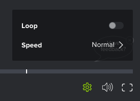

# Activer une boucle dans une épreuve vidéo

Vous pouvez configurer la vidéo pour qu’elle soit en boucle continue (la lecture de la vidéo recommence une fois qu’elle est terminée). 

## Conditions d’accès

Vous devez disposer des accès suivants pour effectuer les étapes de cet article :

<table style="table-layout:auto"> 
 <col> 
 <col> 
 <tbody> 
  <tr> 
   <td role="rowheader">Forfait Adobe Workfront*</td> 
   <td> 
Formule actuelle : Pro ou supérieure
 
ou
 
Formule héritée : sélectionnez ou Premium
 
Pour plus d’informations sur la vérification de l’accès avec les différents plans, voir <a href="/help/quicksilver/administration-and-setup/manage-workfront/configure-proofing/access-to-proofing-functionality.md" class="MCXref xref">Accès aux fonctionnalités de vérification dans Workfront</a>.
 </td> 
  </tr> 
  <tr> 
   <td role="rowheader">Licence Adobe Workfront*</td> 
   <td> 
Plan actuel : travail ou plan
 
Formule héritée : Toutes (la vérification doit être activée pour l’utilisateur).
 </td> 
  </tr> 
  <tr> 
   <td role="rowheader">Profil d'autorisation pour l'épreuve </td> 
   <td>Manager ou version ultérieure</td> 
  </tr> 
  <tr> 
   <td role="rowheader">Configurations des niveau d’accès*</td> 
   <td> 
Accès en modification aux documents
 
Pour plus d’informations sur la demande d’accès supplémentaire, voir <a href="../../../../workfront-basics/grant-and-request-access-to-objects/request-access.md" class="MCXref xref">Demander l’accès aux objets</a>.
 </td> 
  </tr> 
 </tbody> 
</table>

&#42;Pour connaître le plan, le rôle ou le profil d’autorisation de BAT dont vous disposez, contactez votre administrateur Workfront ou Workfront Proof.

## Activer une boucle dans une épreuve vidéo

1. Accédez au projet, à la tâche ou au problème qui contient le document, puis sélectionnez **Documents**.
1. Recherchez le BAT dont vous avez besoin, puis cliquez sur **Ouvrir le BAT**.

1. Dans le coin inférieur droit de la visionneuse de vérification, cliquez sur l’icône **Paramètres** .

   

1. Activez l’option **Boucle** .
