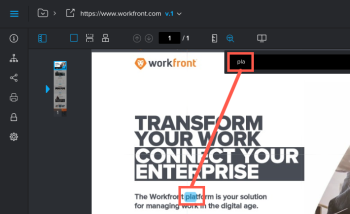

# Rechercher du contenu dans une épreuve

Vous pouvez rapidement localiser du texte dans une épreuve créée pour les types de documents suivants :

* PDF
* Office (.doc, .docx, .odt)
* Page web statique

>[!NOTE]
>
>Il est possible que les épreuves créés avant le 26 avril 2017 ne puissent pas faire l’objet de recherches.

## Conditions d’accès

+++ Développez pour afficher les exigences d’accès aux fonctionnalités de cet article.

<table style="table-layout:auto"> 
 <col> 
 <col> 
 <tbody> 
  <tr> 
   <td role="rowheader">Package Adobe Workfront</td> 
   <td> 
Tous
 </td> 
  </tr> 
  <tr> 
   <td role="rowheader">Licence Adobe Workfront</td> 
   <td> 
Tous
 </td> 
  </tr> 
  <tr> 
   <td role="rowheader">Rôle de l’épreuve </td> 
   <td>Réviseur, Réviseur et approbateur, Auteur, Modérateur</td> 
  </tr> 
  <tr> 
   <td role="rowheader">Profil d'autorisation pour l'épreuve </td> 
   <td>Manager ou version supérieure</td> 
  </tr> 
  <tr> 
   <td role="rowheader">Configurations des niveaux d’accès</td> 
   <td> 
Modifier l’accès aux documents
 </td> 
  </tr> 
 </tbody> 
</table>

Pour plus d’informations, voir [Conditions d’accès requises dans la documentation Workfront](/help/quicksilver/administration-and-setup/add-users/access-levels-and-object-permissions/access-level-requirements-in-documentation.md).

+++

## Rechercher du contenu dans une épreuve

1. Ouvrez l’épreuve dans laquelle vous souhaitez effectuer une recherche.
1. Dans la barre d’outils située au-dessus de l’épreuve, cliquez sur l’icône **Rechercher dans le document**.

   

1. Commencez à saisir le texte à rechercher.

   L’outil de recherche met le texte en surbrillance dans le document au fur et à mesure que vous tapez.

   

1. Terminez la saisie du texte à rechercher, puis cliquez sur les flèches du **haut** et du **bas** pour analyser les résultats de la recherche dans l’épreuve.
