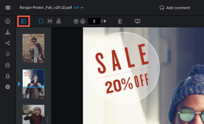

# Afficher le contenu dans un BAT

## Exigences d’accès

Vous devez disposer des accès suivants pour effectuer les étapes de cet article :

<table style="table-layout:auto"> 
 <col> 
 <col> 
 <tbody> 
  <tr> 
   <td role="rowheader">Formule Adobe Workfront*</td> 
   <td> 
Formule actuelle : Pro ou version ultérieure
 
ou
 
Plan hérité : Sélectionner ou Premium
 
Pour plus d’informations sur la vérification de l’accès avec les différents plans, voir <a href="/help/quicksilver/administration-and-setup/manage-workfront/configure-proofing/access-to-proofing-functionality.md" class="MCXref xref">Accès aux fonctionnalités de vérification dans Workfront</a>.
 </td> 
  </tr> 
  <tr> 
   <td role="rowheader">Licence Adobe Workfront*</td> 
   <td> 
Formule actuelle : Travail ou plan
 
Plan hérité : N’importe quel (la vérification doit être activée pour l’utilisateur)
 </td> 
  </tr> 
  <tr> 
   <td role="rowheader">Profil d'autorisation pour l'épreuve </td> 
   <td>Manager ou version ultérieure</td> 
  </tr> 
  <tr> 
   <td role="rowheader">Paramétrages du niveau d'accès*</td> 
   <td> 
Modifier l’accès aux documents
 
Pour plus d’informations sur la demande d’accès supplémentaire, voir <a href="../../../../workfront-basics/grant-and-request-access-to-objects/request-access.md" class="MCXref xref">Demande d’accès aux objets </a>.
 </td> 
  </tr> 
 </tbody> 
</table>

&#42;Pour connaître le plan, le rôle ou le profil d’autorisation de BAT dont vous disposez, contactez votre administrateur Workfront ou Workfront BAT.

## Modifier l&#39;affichage de votre BAT

Vous pouvez afficher un BAT statique qui contient plusieurs pages en une seule vue, dans une vue continue ou dans une vue magazine.

1. Accédez au projet, à la tâche ou au problème qui contient le document, puis sélectionnez **Documents**.
1. Recherchez le BAT dont vous avez besoin, puis cliquez sur **BAT ouvert**.

1. Recherchez les options d’affichage dans la zone supérieure gauche de la visionneuse de vérification.\
   

1. Cliquez sur l’une des options suivantes :

   <table style="table-layout:auto"> 
    <col> 
    <col> 
    <tbody> 
     <tr> 
      <td role="rowheader">Affichage unique</td> 
      <td>Affiche une seule page à la fois. Cliquez sur la miniature de la page à afficher ou appuyez sur les touches fléchées Gauche et Droite pour naviguer entre les pages. </td> 
     </tr> 
     <tr> 
      <td role="rowheader">Vue continue</td> 
      <td>Affiche toutes les pages dans une seule vue empilée. Cliquez sur la miniature de la page à afficher ou appuyez sur les touches fléchées Gauche et Droite pour faire défiler toutes les pages vers le haut ou vers le bas dans une vue continue. </td> 
     </tr> 
     <tr> 
      <td role="rowheader">Mode Magazine</td> 
      <td>Affiche toutes les pages en une seule vue magazine (côte à côte et empilée). Cliquez sur la miniature de la page à afficher ou appuyez sur les touches fléchées Gauche et Droite pour faire défiler toutes les pages. </td> 
     </tr> 
    </tbody> 
   </table>

## Utilisation de miniatures

Le panneau des miniatures s’affiche sur le côté gauche de la visionneuse de vérification. Vous pouvez utiliser la zone des miniatures pour parcourir le BAT. Les miniatures sont particulièrement utiles lorsqu’un BAT contient plusieurs pages.

* [Masquer et afficher le panneau des miniatures](#hide-and-display-the-thumbnails-panel)
* [Zoom et panoramique dans la vue miniature](#zoom-and-pan-in-the-thumbnail-view)

### Masquer et afficher le panneau des miniatures {#hide-and-display-the-thumbnails-panel}

Le panneau des miniatures s’affiche par défaut. Vous pouvez masquer ou ajuster la taille du panneau.

1. Accédez au projet, à la tâche ou au problème qui contient le document, puis sélectionnez **Documents**.
1. Recherchez le BAT dont vous avez besoin, puis cliquez sur **BAT ouvert**.

1. Cliquez sur le bouton **Miniature** dans le coin supérieur gauche de la visionneuse de vérification.\
   

1. (Facultatif) Cliquez à nouveau sur l’icône Miniature pour afficher le panneau Miniatures.

   >[!TIP]
   >
   >Vous pouvez placer le pointeur de la souris sur le bord droit du panneau des miniatures pour redimensionner le panneau.

### Zoom et panoramique dans la vue miniature {#zoom-and-pan-in-the-thumbnail-view}

La zone de zoom du panneau des miniatures affiche la zone du BAT que vous êtes en train de consulter. Vous pouvez ajuster le zoom dans la zone miniature ou effectuer un panoramique sur la zone pour afficher une autre partie du BAT.

Pour effectuer un zoom et un panoramique dans la vue miniature :

1. Accédez au projet, à la tâche ou au problème qui contient le document, puis sélectionnez **Documents**.
1. Recherchez le BAT dont vous avez besoin, puis cliquez sur **BAT ouvert**.

1. Localisez la zone de zoom active dans le panneau des miniatures.\
   La zone de zoom s’affiche sous la forme d’un cadre bleu autour des bords de la miniature.

   

1. Pour ajuster la taille de la zone de zoom, faites glisser le coin inférieur droit de la zone de zoom jusqu’à obtenir la taille souhaitée.
1. Pour déplacer la zone de zoom vers une autre partie du BAT, faites glisser la zone de zoom jusqu’à ce qu’elle couvre la partie du BAT que vous souhaitez afficher.

## Faire pivoter un BAT

Vous pouvez faire pivoter le BAT dans la visionneuse de vérification. Lorsque vous faites pivoter un BAT qui contient plusieurs pages, toutes les pages sont pivotées simultanément.

1. Accédez au projet, à la tâche ou au problème qui contient le document, puis sélectionnez **Documents**.
1. Recherchez le BAT dont vous avez besoin, puis cliquez sur **BAT ouvert**.

1. Cliquez sur le bouton **Rotation** au bas de la visionneuse de vérification.

   

   Le BAT est pivoté de 90 degrés chaque fois que vous cliquez sur le bouton **Rotation** icône .

## Zoom et panoramique sur un BAT

Vous pouvez ajuster le pourcentage de zoom lors de l’affichage du BAT. Lorsque vous affichez un BAT avec un pourcentage de zoom plus élevé, l’option Panoramique vous permet d’utiliser le curseur pour accéder à différentes zones du BAT.

1. Accédez au projet, à la tâche ou au problème qui contient le document, puis sélectionnez **Documents**.
1. Recherchez le BAT dont vous avez besoin, puis cliquez sur **BAT ouvert**.

1. Effectuez l’une des opérations suivantes pour ajuster le pourcentage de zoom du BAT :

   * Cliquez sur le bouton **Zoom** , puis cliquez sur le BAT pour afficher le BAT à un niveau de zoom supérieur, ou faites glisser le curseur sur une zone du BAT pour afficher uniquement cette zone.

      

   * Cliquez sur le pourcentage de zoom actuel, puis sur un nouveau pourcentage de zoom ou cliquez sur **Ajuster à la largeur**, **Ajuster à la hauteur** ou **Ajuster à la page**.

      

   * Cliquez sur le bouton **Plus** ou **Moins** pour augmenter ou diminuer le pourcentage de zoom.

      

1. Si vous devez effectuer un panoramique sur une certaine zone du BAT vidéo, cliquez sur le bouton **Panoramique** , puis faites glisser le BAT selon vos besoins.

   

   >[!TIP]
   >
   >Pour basculer facilement entre les outils Zoom et Panoramique, maintenez la barre d’espace enfoncée lorsque vous utilisez l’icône Zoom pour effectuer un panoramique.
