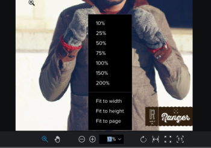

# Afficher le contenu dans une épreuve

Vous pouvez utiliser la visionneuse de relecture pour afficher et baliser des fichiers dans Workfront.

>[!NOTE]
>
>Si votre instance Workfront se trouve dans l’expérience unifiée, la visionneuse de relecture s’ouvre dans un nouvel onglet.

## Conditions d’accès

+++ Développez pour afficher les exigences d’accès aux fonctionnalités de cet article.

<table style="table-layout:auto"> 
 <col> 
 <col> 
 <tbody> 
  <tr> 
   <td role="rowheader">Package Adobe Workfront</td> 
   <td> 
Tous
 </td> 
  </tr> 
  <tr> 
   <td role="rowheader">Licence Adobe Workfront</td> 
   <td> 
Tous
 </td> 
  </tr> 
  <tr> 
   <td role="rowheader">Rôle de l’épreuve </td> 
   <td>Réviseur, Réviseur et approbateur, Auteur, Modérateur</td> 
  </tr> 
  <tr> 
   <td role="rowheader">Profil d'autorisation pour l'épreuve </td> 
   <td>Manager ou version supérieure</td> 
  </tr> 
  <tr> 
   <td role="rowheader">Configurations des niveaux d’accès</td> 
   <td> 
Modifier l’accès aux documents
 </td> 
  </tr> 
 </tbody> 
</table>

Pour plus d’informations, voir [Conditions d’accès requises dans la documentation Workfront](/help/quicksilver/administration-and-setup/add-users/access-levels-and-object-permissions/access-level-requirements-in-documentation.md).

+++

## Modifier l’affichage de votre épreuve

Vous pouvez afficher une épreuve statique contenant plusieurs pages dans une vue unique, dans une vue continue ou dans une vue magazine.

1. Accédez au projet, à la tâche ou au problème qui contient le document, puis sélectionnez **Documents**.
1. Recherchez l’épreuve dont vous avez besoin, puis cliquez sur **Ouvrir l’épreuve**.

1. Dans la partie supérieure gauche de la visionneuse de relecture, repérez les options de visualisation.\
   

1. Cliquez sur l’une des options suivantes :

   <table style="table-layout:auto"> 
    <col> 
    <col> 
    <tbody> 
     <tr> 
      <td role="rowheader">Vue unique</td> 
      <td>Affiche une seule page à la fois. Cliquez sur la miniature de la page que vous souhaitez afficher ou appuyez sur les touches fléchées gauche et droite pour naviguer entre les pages. </td> 
     </tr> 
     <tr> 
      <td role="rowheader">Vue continue</td> 
      <td>Affiche toutes les pages dans une seule vue empilée.Cliquez sur la miniature de la page que vous souhaitez afficher ou appuyez sur les touches fléchées gauche et droite pour faire défiler toutes les pages vers le haut ou vers le bas dans une vue continue. </td> 
     </tr> 
     <tr> 
      <td role="rowheader">Vue magazine</td> 
      <td>Affiche toutes les pages dans une seule vue magazine (côte à côte et empilées).Cliquez sur la miniature de la page que vous souhaitez afficher ou appuyez sur les touches fléchées gauche et droite pour faire défiler toutes les pages. </td> 
     </tr> 
    </tbody> 
   </table>

## Utiliser des miniatures

Le panneau des miniatures s’affiche sur le côté gauche de la visionneuse de relecture. Vous pouvez utiliser la zone des miniatures pour naviguer dans l’épreuve. Les miniatures sont particulièrement utiles lorsqu’une épreuve contient plusieurs pages.

* [Masquer et afficher le panneau des miniatures](#hide-and-display-the-thumbnails-panel)
* [Zoomer et effectuer un panoramique dans l’affichage des miniatures](#zoom-and-pan-in-the-thumbnail-view)

### Masquer et afficher le panneau des miniatures {#hide-and-display-the-thumbnails-panel}

Le panneau des miniatures s’affiche par défaut. Vous pouvez masquer ou ajuster la taille du panneau.

1. Accédez au projet, à la tâche ou au problème qui contient le document, puis sélectionnez **Documents**.
1. Trouvez l’épreuve dont vous avez besoin, puis cliquez sur **Ouvrir l’épreuve**.

1. Cliquez sur l’icône **Miniature** dans le coin supérieur gauche de la visionneuse de relecture.\
   

1. (Facultatif) Cliquez à nouveau sur l’icône Miniature pour afficher le panneau des miniatures.

   >[!TIP]
   >
   >Vous pouvez pointer sur le bord droit du panneau des miniatures pour le redimensionner.

### Zoomer et effectuer un panoramique dans l’affichage des miniatures {#zoom-and-pan-in-the-thumbnail-view}

La zone de zoom dans le panneau des miniatures affiche la zone de l’épreuve que vous êtes en train de visualiser. Vous pouvez ajuster le zoom dans la zone des miniatures ou effectuer un panoramique pour visualiser une autre partie de l’épreuve.

Pour effectuer un zoom et un panoramique dans l’affichage des miniatures, procédez comme suit :

1. Accédez au projet, à la tâche ou au problème qui contient le document, puis sélectionnez **Documents**.
1. Trouvez l’épreuve dont vous avez besoin, puis cliquez sur **Ouvrir l’épreuve**.

1. Localisez la zone de zoom actuelle dans le panneau des miniatures.\
   La zone de zoom s’affiche sous la forme d’un cadre bleu autour des bords de la miniature.

   

1. Pour ajuster la taille de la zone de zoom, faites glisser le coin inférieur droit de la zone de zoom jusqu’à ce qu’elle atteigne la taille souhaitée.
1. Pour déplacer la zone de zoom vers une autre partie de l’épreuve, faites glisser la zone de zoom jusqu’à ce qu’elle couvre la partie de l’épreuve que vous souhaitez visualiser.

## Faire pivoter une épreuve

Vous pouvez faire pivoter l’épreuve dans la visionneuse de relecture. Lorsque vous faites pivoter une épreuve contenant plusieurs pages, toutes les pages sont pivotées simultanément.

1. Accédez au projet, à la tâche ou au problème qui contient le document, puis sélectionnez **Documents**.
1. Trouvez l’épreuve dont vous avez besoin, puis cliquez sur **Ouvrir l’épreuve**.

1. Cliquez sur l’icône **Faire pivoter** en bas de la visionneuse de relecture.

   

   L’épreuve pivote de 90 degrés chaque fois que vous cliquez sur l’icône **Faire pivoter**.

## Zoomer et effectuer un panoramique sur une épreuve

Vous pouvez ajuster le pourcentage de zoom lors de la visualisation de l’épreuve. Lorsque vous visualisez une épreuve avec un pourcentage de zoom plus élevé, l’option Panoramique vous permet d’utiliser le curseur pour naviguer dans différentes zones de l’épreuve.

1. Accédez au projet, à la tâche ou au problème qui contient le document, puis sélectionnez **Documents**.
1. Trouvez l’épreuve dont vous avez besoin, puis cliquez sur **Ouvrir l’épreuve**.

1. Effectuez l’une des opérations suivantes pour ajuster le pourcentage de zoom de l’épreuve :

   * Cliquez sur l’icône **Zoom**, puis cliquez sur l’épreuve pour l’afficher à une échelle plus grande ou faites glisser le curseur sur une zone de l’épreuve pour n’afficher que cette zone.

     

   * Cliquez sur le pourcentage de zoom actuel, puis sur un nouveau pourcentage de zoom ou sur **Ajuster à la largeur**, **Ajuster à la hauteur** ou **Ajuster à la page**.

     

   * Cliquez sur les icônes **Plus** ou **Moins** pour augmenter ou diminuer le pourcentage de zoom.

     

1. Si vous avez besoin d’effectuer un panoramique sur une certaine zone de l’épreuve vidéo, cliquez sur l’icône **Panoramique**, puis faites glisser l’épreuve comme vous le souhaitez.

   

   >[!TIP]
   >
   >Pour passer facilement de l’outil Zoom à l’outil Panoramique, maintenez la barre d’espace enfoncée lorsque vous utilisez l’icône Zoom pour effectuer un panoramique.
