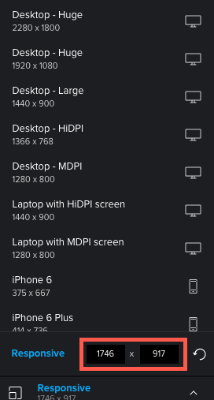

# Modification de la résolution du BAT interactif dans la visionneuse de correctifs

Vous pouvez prévisualiser l’aspect d’un BAT interactif sur divers appareils, ce qui vous permet de voir comment le contenu s’affiche et répond en fonction de résolutions différentes.

## Exigences d’accès

Vous devez disposer des accès suivants pour effectuer les étapes de cet article :

<table style="table-layout:auto"> 
 <col> 
 <col> 
 <tbody> 
  <tr> 
   <td role="rowheader">Formule Adobe Workfront*</td> 
   <td> 
Formule actuelle : Pro ou version ultérieure
 
ou
 
Plan hérité : Sélectionner ou Premium
 
Pour plus d’informations sur la vérification de l’accès avec les différents plans, voir <a href="/help/quicksilver/administration-and-setup/manage-workfront/configure-proofing/access-to-proofing-functionality.md" class="MCXref xref">Accès aux fonctionnalités de vérification dans Workfront</a>.
 </td> 
  </tr> 
  <tr> 
   <td role="rowheader">Licence Adobe Workfront*</td> 
   <td> 
Formule actuelle : Travail ou plan
 
Plan hérité : N’importe quel (la vérification doit être activée pour l’utilisateur)
 </td> 
  </tr> 
  <tr> 
   <td role="rowheader">Profil d'autorisation pour l'épreuve </td> 
   <td>Manager ou version ultérieure</td> 
  </tr> 
  <tr> 
   <td role="rowheader">Paramétrages du niveau d'accès*</td> 
   <td> 
Modifier l’accès aux documents
 
Pour plus d’informations sur la demande d’accès supplémentaire, voir <a href="../../../../workfront-basics/grant-and-request-access-to-objects/request-access.md" class="MCXref xref">Demande d’accès aux objets </a>.
 </td> 
  </tr> 
 </tbody> 
</table>

&#42;Pour connaître le plan, le rôle ou le profil d’autorisation de BAT dont vous disposez, contactez votre administrateur Workfront ou Workfront BAT.

## Affichages des appareils et des résolutions dans la visionneuse de vérification de l’appli de bureau par rapport à la visionneuse de vérification de l’évocation web

Votre administrateur Adobe Workfront a configuré votre système de sorte que vous puissiez passer en revue le contenu interactif dans la visionneuse de vérification de l’appli de bureau ou, en tant que contenu groupé dans un fichier ZIP, dans la visionneuse de vérification de l’efficacité web :

* Dans la visionneuse de vérification de l’appli de bureau, vous pouvez voir comment le contenu apparaît et répond à la fois dans différentes résolutions et sur différents appareils. Lorsqu’un réviseur spécifie un appareil donné, le contenu s’affiche comme il le ferait sur cet appareil, avec les spécifications de l’interface utilisateur de l’appareil. Par exemple, un bouton rouge sur une marque de smartphone peut être bleu sur une autre marque.

* Dans la visionneuse de tests de performance Web, vous pouvez afficher le contenu interactif tel qu’il apparaît dans les résolutions des différents appareils. Toutefois, la visionneuse de vérification de l’intégrité web n’émule pas le contenu à l’aide des spécifications de l’interface sur ces appareils, telles que la couleur des boutons.

   >[!NOTE]
   >
   >Votre administrateur Workfront peut configurer des appareils personnalisés pour les utilisateurs de votre entreprise, comme décrit dans la section Configuration de périphériques personnalisés pour les bons à tirer interactifs de l’article .

## Affichage d’un BAT avec un appareil prédéfini ou un paramètre de résolution

1. Accédez à la liste des documents qui contient le BAT que vous souhaitez ouvrir.
1. Passez la souris sur le document, puis cliquez sur **BAT ouvert**.
1. Cliquez sur **Responsive** au centre-bas de la visionneuse de vérification.

   

1. Dans la liste des périphériques et résolutions qui s’affiche dans la visionneuse de vérification de l’appli de bureau, cliquez sur celui qui vous intéresse.

   Ou

   Dans la liste des résolutions qui s’affichent dans la visionneuse de BAT Web, cliquez sur celle qui vous intéresse.

   Si vous avez besoin d’informations sur les différences entre ces deux visionneuses, reportez-vous à la section [Présentation des différences entre la visionneuse de test Web et la visionneuse de test de bureau](../../../../review-and-approve-work/proofing/proofing-overview/understand-differences-between-web-viewer.md).

   Le BAT interactif est rendu dans la résolution que vous sélectionnez.

## Affichage d’un BAT avec un paramètre de résolution personnalisé

1. Accédez à la liste des documents qui contient le BAT que vous souhaitez ouvrir.
1. Passez la souris sur le document, puis cliquez sur **BAT ouvert**.
1. Cliquez sur **Responsive** au centre-bas de la visionneuse de vérification.
1. Saisissez une **Responsive** Résolution.

   

   Ou

   Placez le pointeur de la souris sur votre contenu interactif et faites glisser la bordure bleue dans le coin inférieur droit, ou le bord droit ou inférieur, jusqu’à la résolution souhaitée.

   

   La résolution personnalisée s’affiche aux emplacements suivants :

   * Dans le **Résolution** au centre inférieur de la visionneuse.\
      

   * Dans tous les commentaires, les réviseurs ajoutent au BAT. Chaque commentaire comprend la résolution d’écran qui a été sélectionnée lorsque le réviseur a créé le commentaire.
