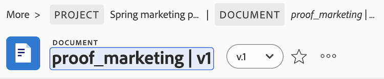

# Le nom du document a changé après le chargement et contient un caractère non valide

## Problème

Certains documents ne peuvent pas être convertis en épreuves.

## Cause

Certains caractères ne peuvent pas figurer dans le nom des fichiers téléchargés vers Workfront. Si le nom d’un fichier contient l’un des caractères suivants, ces caractères sont supprimés du nom du fichier lorsque celui-ci est téléchargé : `! # % * \ | ' " / ? < > { } [ ]`.

Si un nom de document est mis à jour pour inclure un caractère non valide après le chargement initial, la génération de l’épreuve échoue.

## Solution

Supprimez le caractère non valide du nom du document :

1. Sélectionnez le document, puis cliquez sur **Détails du document**.
1. Cliquez sur le nom du document et supprimez le caractère non valide, puis appuyez sur Entrée.

   Caractères non valides : `! # % * \ | ' " / ? < > { } [ ]`

   

1. Actualisez la page et générez l’épreuve.
