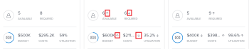

# Créer et comparer des scénarios de plan dans le [!DNL Scenario Planner]

<!--Audited: 07/2024-->

Lorsque vous planifiez la stratégie à long terme de votre entreprise, il y a de nombreuses informations dont vous ne disposez pas ou auxquelles vous ne pensez pas au début. Il faut du temps et de l’expérience pour arriver à une stratégie finale que vos parties prenantes peuvent accepter. La réalisation d’une analyse d’hypothèses afin de créer plusieurs scénarios pour votre plan peut vous aider à prévoir et évaluer précisément les circonstances potentielles et, en fin de compte, à élaborer le meilleur plan possible.

## Conditions d’accès

+++ Développez pour afficher les exigences d’accès aux fonctionnalités de cet article. 

<table style="table-layout:auto"> 
 <col> 
 <col> 
 <tbody> 
  <tr> 
   <td> 
[!DNL Adobe Workfront] paquet
 </td> 
   <td> 
   
Workfront Ultimate

<b>NOTE</b>

Contactez votre représentant Workfront si vous disposez d’un autre package Workfront.

   </td> 
  </tr> 
  <tr> 
   <td> 
[!DNL Adobe Workfront] licence
 </td> 
   <td> 
[!UICONTROL Light] ou version ultérieure
 
   
[!UICONTROL Review] ou niveau supérieur
 </td> 
  </tr> 
    <tr> 
   <td>Configurations des niveaux d’accès</td> 
   <td> 
Accès [!UICONTROL Edit] à [!DNL Scenario Planner]
 </td> 
  </tr> 
  <tr> 
   <td> 
Autorisations d’objet 
 </td> 
   <td> 
Autorisations [!UICONTROL Manage] pour un plan
 </td> 
  </tr> 
 </tbody> 
</table>

Pour plus d’informations sur l’accès au planificateur de scénarios, voir [ Accès nécessaire pour utiliser le  [!DNL Scenario Planner]](../scenario-planner/access-needed-to-use-sp.md).

Pour plus d’informations sur les exigences d’accès à Workfront, voir [Documentation sur les exigences d’accès à Workfront](/help/quicksilver/administration-and-setup/add-users/access-levels-and-object-permissions/access-level-requirements-in-documentation.md).

+++

<!--Old:

<table style="table-layout:auto"> 
 <col> 
 <col> 
 <tbody> 
  <tr> 
   <td> 
[!DNL Adobe Workfront] plan*
 </td> 
   <td> <ul></li>
   <li>
New: Ultimate 
</li>
   
The Scenario Planner is not available for the new Workfront Select or Workfront Prime plans. 

   <li>
Current: [!UICONTROL Business] or higher
</ul>
   </td> 
  </tr> 
  <tr> 
   <td> 
[!DNL Adobe Workfront] license*
 </td> 
   <td> 
New: Light or higher
 
   
Current: [!UICONTROL Review] or higher
 </td> 
  </tr> 
  <tr> 
   <td>Product* </td> 
   <td> <ul><li>
For the new Workfront plans:

 Adobe Workfront</li>

   <li>
For the current Workfront plans: 

   
Adobe Workfront
 
Adobe Workfront Scenario Planner
</li></ul>
   
   
For more information, see <a href="../scenario-planner/access-needed-to-use-sp.md" class="MCXref xref">Access needed to use the [!DNL Scenario Planner]</a>. 
 </td> 
  </tr> 
  <tr data-mc-conditions=""> 
   <td>Access level </td> 
   <td> 
[!UICONTROL Edit] access to the [!DNL Scenario Planner]
 </td> 
  </tr> 
  <tr data-mc-conditions=""> 
   <td> 
Object permissions 
 </td> 
   <td> 
[!UICONTROL Manage] permissions to a plan
 
For information on requesting additional access to a plan, see <a href="../scenario-planner/request-access-to-plan.md" class="MCXref xref">Request access to a plan in the [!DNL Scenario Planner]</a>.
 </td> 
  </tr> 
 </tbody> 
</table>-->

## Créer des scénarios

Un scénario est une copie d’un plan. Vous pouvez créer autant de scénarios que nécessaire. Cependant, nous vous recommandons de limiter le nombre de scénarios afin de pouvoir facilement les comparer.

{{step1-to-scenario-planner}}

1. Créez un plan ou cliquez sur le nom d’un plan existant.

   Pour plus d’informations sur la création de plans, voir [Créer et modifier des plans dans le  [!DNL Scenario Planner]](../scenario-planner/create-and-edit-plans.md).

   Le premier plan que vous créez est automatiquement enregistré comme « [!UICONTROL Scénario initial] ».

1. Cliquez sur la flèche pointant vers le bas en regard d’un scénario existant, puis cliquez sur l’icône **[!UICONTROL Copier]**.

   

   Un nouveau scénario est ainsi créé avec les mêmes informations que le scénario copié. Il est automatiquement nommé « [!UICONTROL Scénario 2] » si c’est le deuxième scénario de votre plan, « [!UICONTROL Scénario 3] » s’il s’agit du troisième, etc. Vous ne pouvez pas renommer vos scénarios. Le nombre de copies que vous pouvez effectuer n’est pas limité.

   <!--
   <MadCap:conditionalText data-mc-conditions="QuicksilverOrClassic.Draft mode">
   (NOTE:this might change)
   </MadCap:conditionalText>
   -->

1. Mettez à jour votre nouveau scénario de l’une des manières suivantes :

   * Créer, mettre à jour ou supprimer des initiatives

     >[!TIP]
     >
     >Lorsque vous supprimez une initiative dans un scénario, elle n’est supprimée que du scénario sélectionné, et non de tous les scénarios.

     Pour plus d’informations sur la création d’initiatives, voir [Créer et modifier des initiatives dans le  [!DNL Scenario Planner]](../scenario-planner/create-and-edit-initiatives.md).

   * Mettre à jour les priorités de vos initiatives
   * Ajuster les informations sur les personnes ou les budgets
   * Réviser et ajuster les conflits d’initiative dans votre scénario

     Pour plus d’informations sur la résolution des conflits, voir [Résoudre les conflits d’initiative dans le  [!DNL Scenario Planner]](../scenario-planner/resolve-conflicts-in-sp.md).

1. Cliquez sur **[!UICONTROL Enregistrer le plan]** pour enregistrer vos modifications.

## Comparer les scénarios

Après avoir créé vos scénarios, vous pouvez les comparer afin de trouver le meilleur pour votre entreprise.

1. Accédez au plan pour lequel vous souhaitez comparer des scénarios.
1. Cliquez sur **[!UICONTROL Comparer les scénarios]**. La page de comparaison des scénarios s’affiche.

   Tous les scénarios existants pour le plan s’affichent côte à côte, au format carte. Le scénario initial est toujours répertorié en premier et il est statique.

   

1. (Facultatif) Faites défiler l’écran vers la droite pour afficher toutes les cartes de scénario.

   Les informations suivantes s’affichent sur une carte de scénario :

   <table style="table-layout:auto"> 
    <col> 
    <col> 
    <tbody> 
     <tr> 
      <td>Nom du scénario</td> 
      <td> 
Nom généré automatiquement par Workfront, qui ne peut pas être modifié. Par exemple, « [!UICONTROL Initial scenario] », « [!UICONTROL Scenario 2] », etc. 
 </td> 
     </tr> 
     <tr> 
      <td>Description du scénario</td> 
      <td>Entrée manuelle dans laquelle vous pouvez décrire les détails du scénario. </td> 
     </tr> 
     <tr> 
      <td>Fonctions disponibles</td> 
      <td>Nombre de fonctions disponibles dans le budget de la formule pour la durée de la formule. </td> 
     </tr> 
     <tr> 
      <td>Fonctions requises</td> 
      <td>Nombre de fonctions requises, en fonction de vos initiatives. </td> 
     </tr> 
     <tr> 
      <td>Budget</td> 
      <td>Budget total défini pour la formule dans ce scénario. Pour plus d’informations budgétaires à propos des formules, voir la section <a href="../scenario-planner/plans-overview.md" class="MCXref xref">Vue d’ensemble des formules dans [!DNL Scenario Planner]</a>. </td> 
     </tr> 
     <tr> 
      <td>Coûts</td> 
      <td>Les coûts associés aux initiatives dans le scénario. Pour plus d’informations sur les coûts, voir la section <a href="../scenario-planner/initiatives-overview.md" class="MCXref xref">Vue d’ensemble des initiatives dans [!DNL Scenario Planner]</a>. </td> 
     </tr> 
     <tr> 
      <td>Utilisation</td> 
      <td>Pourcentage d’[!UICONTROL Budget Utilization] pour la formule dans ce scénario. Pour plus d’informations sur le pourcentage d’[!UICONTROL Budget Utilization], voir la section <a href="../scenario-planner/plans-overview.md" class="MCXref xref">Vue d’ensemble des formules dans [!DNL Scenario Planner]</a>. </td> 
     </tr> 
     <tr> 
      <td>Valeur nette</td> 
      <td>La [!UICONTROL Net Value] de la formule dans ce scénario. Pour plus d’informations sur la [!UICONTROL Net Value] d’une formule, voir la section <a href="../scenario-planner/plans-overview.md" class="MCXref xref">Vue d’ensemble des formules dans [!DNL Scenario Planner]</a>. </td> 
     </tr> 
     <tr> 
      <td>Initiatives</td> 
      <td>Nombre d’initiatives pour la formule dans ce scénario.</td> 
     </tr> 
     <tr> 
      <td>Conflit</td> 
      <td>Nombre d’initiatives qui montrent n’importe quel type de conflit dans la formule pour ce scénario. Pour plus d’informations sur les conflits d’initiatives, voir la section <a href="../scenario-planner/resolve-conflicts-in-sp.md" class="MCXref xref">Résoudre les conflits d’initiative dans [!DNL Scenario Planner]</a>. </td> 
     </tr> 
    </tbody> 
   </table>

   >[!NOTE]
   >
   >Lorsque les informations diffèrent entre le scénario initial et les scénarios supplémentaires, une flèche vers le haut ou vers le bas s’affiche en regard de la valeur modifiée pour indiquer une augmentation ou une diminution de cette valeur par rapport au scénario initial.
   >
   >
   >
   >
   >Par exemple, le budget, le nombre de fonctions et le nombre d’initiatives peuvent changer d’un scénario à l’autre.

1. Cliquez sur le nom d’un scénario pour y accéder et y apporter des modifications.

   Pour plus d’informations, voir la section [Créer des scénarios](#create-scenarios) dans cet article.

1. Cliquez sur **[!UICONTROL Ajouter une description]** pour ajouter une description relative au scénario.

   Ou

   Cliquez sur le champ de description pour le mettre à jour, puis cliquez n’importe où à l’écran pour enregistrer vos modifications.

1. (Facultatif) Cliquez sur le menu **[!UICONTROL Plus]**  pour **[!UICONTROL Copier]** ou **[!UICONTROL Supprimer]** le scénario.

   

   Lorsque vous copiez un scénario, il apparaît automatiquement sur la page de carte et est renommé selon ce modèle : « [!UICONTROL Scénario] `<next number in order>` ».

1. (Le cas échéant) Si vous avez cliqué sur **[!UICONTROL Supprimer]**, cliquez sur **[!UICONTROL Oui, supprimer]** pour confirmer.

   Les scénarios supprimés ne peuvent pas être récupérés.

   Pour plus d’informations sur la suppression des scénarios, voir la section [Supprimer des formules dans  [!DNL Scenario Planner]](../scenario-planner/delete-plans.md).

1. Cliquez sur **[!UICONTROL Enregistrer la formule]** pour enregistrer vos scénarios et votre formule.
