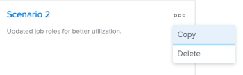

# Créez et comparez des scénarios de plan dans le [!DNL Scenario Planner]

<!--Audited: 07/2024-->

Lorsque vous planifiez la stratégie à long terme de votre entreprise, il y a de nombreuses informations dont vous ne disposez pas ou auxquelles vous ne pensez pas au début. Il faut du temps et de l’expérience pour arriver à une stratégie finale que vos parties prenantes peuvent accepter. La réalisation d’une analyse &quot;et si&quot; afin de créer plusieurs scénarios pour votre plan peut vous aider à prévoir et évaluer précisément les circonstances potentielles et, en fin de compte, à élaborer le meilleur plan possible.

## Conditions d’accès

+++ Développez pour afficher les exigences d’accès aux fonctionnalités de cet article.

<table style="table-layout:auto"> 
 <col> 
 <col> 
 <tbody> 
  <tr> 
   <td> 
[!DNL Adobe Workfront] forfait*
 </td> 
   <td> 
Actuel : [!UICONTROL Entreprise] ou version ultérieure

   
Nouveau : Ultimate 

   </td> 
  </tr> 
  <tr> 
   <td> 
[!DNL Adobe Workfront] licence*
 </td> 
   <td> 
Nouveau : Léger ou supérieur
 
   
Actuel : [!UICONTROL Révision] ou version ultérieure
 </td> 
  </tr> 
  <tr> 
   <td>Produit* </td> 
   <td> 
   
Pour les plans Workfront actuels : 

   
Vous devez acheter une licence supplémentaire pour le [!DNL Adobe Workfront Scenario Planner] afin d’accéder aux fonctionnalités décrites dans cet article.
 
Pour plus d’informations sur l’accès et les autorisations pour [!DNL Workfront Scenario Planner], voir <a href="../scenario-planner/access-needed-to-use-sp.md" class="MCXref xref">Accès nécessaire pour utiliser le [!DNL Scenario Planner]</a>. 
 </td> 
  </tr> 
  <tr data-mc-conditions=""> 
   <td>Niveau d’accès </td> 
   <td> 
Accès à l’accès à la fonction [!UICONTROL Modifier] [!DNL Scenario Planner]
 </td> 
  </tr> 
  <tr data-mc-conditions=""> 
   <td> 
Autorisations d’objet 
 </td> 
   <td> 
Autorisations [!UICONTROL Gérer] pour un plan
 
Pour plus d’informations sur la demande d’un accès supplémentaire à un plan, voir <a href="../scenario-planner/request-access-to-plan.md" class="MCXref xref">Demander l’accès à un plan dans le [!DNL Scenario Planner]</a>.
 </td> 
  </tr> 
 </tbody> 
</table>

*Pour plus d’informations, voir [Exigences d’accès à la documentation Workfront](/help/quicksilver/administration-and-setup/add-users/access-levels-and-object-permissions/access-level-requirements-in-documentation.md).

+++

## Création de scénarios

Un scénario est une copie d’un plan. Vous pouvez créer autant de scénarios que nécessaire. Cependant, nous vous recommandons de limiter le nombre de scénarios afin de pouvoir facilement les comparer.

{{step1-to-scenario-planner}}

1. Créez un plan ou cliquez sur le nom d&#39;un plan existant.

   Pour plus d’informations sur la création de plans, voir [Création et modification de plans dans le  [!DNL Scenario Planner]](../scenario-planner/create-and-edit-plans.md).

   Le premier plan que vous créez est automatiquement enregistré comme &quot;[!UICONTROL scénario initial]&quot;.

1. Cliquez sur la flèche pointant vers le bas en regard d’un scénario existant, puis cliquez sur l’icône **[!UICONTROL Copier]** .

   

   Un nouveau scénario est ainsi créé avec les mêmes informations que le scénario copié. Il est automatiquement nommé &quot;[!UICONTROL Scénario 2]&quot; s’il s’agit du deuxième scénario de votre plan, &quot;[!UICONTROL Scénario 3]&quot; s’il s’agit du troisième, etc. Vous ne pouvez pas renommer vos scénarios. Le nombre de copies que vous pouvez effectuer n’est pas limité.

   <!--
   <MadCap:conditionalText data-mc-conditions="QuicksilverOrClassic.Draft mode">
   (NOTE:this might change)
   </MadCap:conditionalText>
   -->

1. Mettez à jour votre nouveau scénario de l’une des manières suivantes :

   * Créer, mettre à jour ou supprimer des initiatives

     >[!TIP]
     >
     >Lorsque vous supprimez une initiative dans un scénario, elle n’est supprimée que du scénario sélectionné, et non de tous les scénarios.

     Pour plus d’informations sur la création d’initiatives, consultez la section [Créer et modifier des initiatives dans le [!DNL Scenario Planner]](../scenario-planner/create-and-edit-initiatives.md).

   * Mettre à jour les priorités de vos initiatives
   * Ajuster les informations sur les personnes ou les budgets
   * Réviser et ajuster les conflits d’initiative dans votre scénario

     Pour plus d&#39;informations sur la résolution des conflits, voir [Résoudre les conflits d&#39;initiative dans le  [!DNL Scenario Planner]](../scenario-planner/resolve-conflicts-in-sp.md).

1. Cliquez sur **[!UICONTROL Enregistrer le plan]** pour enregistrer vos modifications.

## Comparer les scénarios

Après avoir créé vos scénarios, vous pouvez les comparer afin d’en trouver le meilleur pour votre entreprise.

1. Accédez au plan pour lequel vous souhaitez comparer des scénarios.
1. Cliquez sur **[!UICONTROL Comparer des scénarios]**. La page de comparaison des scénarios s’affiche.

   Tous les scénarios existants pour le plan s’affichent côte à côte. Le scénario initial est toujours répertorié en premier et il est statique.

   

1. (Facultatif) Faites défiler l’écran vers la droite pour afficher toutes les cartes de scénario.

   Les informations suivantes s’affichent sur une carte de scénario :

   <table style="table-layout:auto"> 
    <col> 
    <col> 
    <tbody> 
     <tr> 
      <td>Nom du scénario</td> 
      <td> 
Un nom généré automatiquement par Workfront et ne peut pas être modifié. Par exemple, "[!UICONTROL Scénario initial]", "[!UICONTROL Scénario 2]", etc. 
 </td> 
     </tr> 
     <tr> 
      <td>Description du scénario</td> 
      <td>Entrée manuelle où vous pouvez décrire les détails du scénario. </td> 
     </tr> 
     <tr> 
      <td>Rôles de tâche disponibles</td> 
      <td>Nombre de rôles d’emploi disponibles dans le budget du plan pour la durée du plan. </td> 
     </tr> 
     <tr> 
      <td>Fonctions requises</td> 
      <td>Nombre de rôles d’emploi requis, en fonction de vos initiatives. </td> 
     </tr> 
     <tr> 
      <td>Budget</td> 
      <td>Le budget total défini pour le plan dans ce scénario. Pour plus d'informations sur le budget des plans, consultez la <a href="../scenario-planner/plans-overview.md" class="MCXref xref">présentation des plans dans le [!DNL Scenario Planner]</a>. </td> 
     </tr> 
     <tr> 
      <td>Coûts</td> 
      <td>Les coûts associés aux initiatives dans le scénario. Pour plus d'informations sur les coûts, consultez la <a href="../scenario-planner/initiatives-overview.md" class="MCXref xref">présentation des initiatives dans [!DNL Scenario Planner]</a>. </td> 
     </tr> 
     <tr> 
      <td>Utilisation</td> 
      <td>Pourcentage d’[!UICONTROL utilisation du budget] pour le plan dans ce scénario. Pour plus d’informations sur le pourcentage d’[!UICONTROL utilisation du budget], voir <a href="../scenario-planner/plans-overview.md" class="MCXref xref">Présentation des plans dans le [!DNL Scenario Planner]</a>. </td> 
     </tr> 
     <tr> 
      <td>Valeur nette</td> 
      <td>La [!UICONTROL Valeur nette] du plan dans ce scénario. Pour plus d’informations sur la [!UICONTROL Valeur nette] d’un plan, consultez la <a href="../scenario-planner/plans-overview.md" class="MCXref xref">présentation des plans dans le [!DNL Scenario Planner]</a>. </td> 
     </tr> 
     <tr> 
      <td>Initiatives</td> 
      <td>Nombre d’initiatives pour le plan dans ce scénario.</td> 
     </tr> 
     <tr> 
      <td>Conflit</td> 
      <td>Le nombre d’initiatives qui montrent tout type de conflit dans le plan pour ce scénario. Pour plus d'informations sur les conflits d'initiatives, voir <a href="../scenario-planner/resolve-conflicts-in-sp.md" class="MCXref xref">Résoudre les conflits d'initiatives dans [!DNL Scenario Planner]</a>. </td> 
     </tr> 
    </tbody> 
   </table>

   >[!NOTE]
   >
   >Lorsque les informations diffèrent entre le scénario initial et les scénarios supplémentaires, une flèche vers le haut ou vers le bas s’affiche en regard de la valeur modifiée pour indiquer une augmentation ou une diminution de cette valeur par rapport au scénario initial.
   >
   >
   >
   >
   >Par exemple, le budget, le nombre de rôles d’emploi et le nombre d’initiatives peuvent changer d’un scénario à l’autre.

1. Cliquez sur le nom d&#39;un scénario pour y accéder et y apporter des modifications.

   Pour plus d’informations, reportez-vous à la section [Créer des scénarios](#create-scenarios) de cet article.

1. Cliquez sur **[!UICONTROL Ajouter une description]** pour ajouter une description pour le scénario.

   Ou

   Cliquez sur le champ de description pour le mettre à jour, puis cliquez n’importe où à l’écran pour enregistrer vos modifications.

1. (Facultatif) Cliquez sur le menu **[!UICONTROL Plus]**  pour **[!UICONTROL Copier]** ou **[!UICONTROL Supprimer]** du scénario.

   

   Lorsque vous copiez un scénario, il apparaît automatiquement sur la page de carte et est renommé selon ce modèle : &quot;[!UICONTROL Scénario] `<next number in order>`&quot;.

1. (Conditionnel) Si vous avez cliqué sur **[!UICONTROL Supprimer]**, cliquez sur **[!UICONTROL Oui, supprimez-le]** pour confirmer.

   Les scénarios supprimés ne peuvent pas être récupérés.

   Pour plus d’informations sur la suppression de scénarios, voir [Suppression de plans dans la  [!DNL Scenario Planner]](../scenario-planner/delete-plans.md).

1. Cliquez sur **[!UICONTROL Enregistrer le plan]** pour enregistrer vos scénarios et votre plan.
