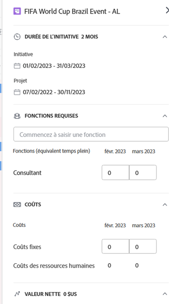

# Créer et modifier des initiatives dans le [!DNL Scenario Planner]

<!--Audited: 07/2024-->

Lors de l’utilisation du [!UICONTROL planificateur de scénarios Adobe Workfront], vous pouvez créer des initiatives dans un plan que vous avez créé ou qui a été partagé avec vous. En créant des initiatives, vous pouvez montrer comment les petites entités organisationnelles contribuent à l’achèvement du plan. Par exemple, si votre organisation a un plan pour les trois prochaines années pour se développer dans un nouveau marché, vous pouvez créer des initiatives dans le cadre de ce plan pour que chaque service évalue les besoins en personnel et en budget de chaque service pour réaliser ce plan.

## Conditions d’accès

+++ Développez pour afficher les exigences d’accès aux fonctionnalités de cet article.

<table style="table-layout:auto"> 
 <col> 
 <col> 
 <tbody> 
  <tr> 
   <td> 
[!DNL Adobe Workfront] formule*
 </td> 
   <td> <ul></li>
   <li>
Nouveau : Ultimate 
</li>
   
Le planificateur de scénario n’est pas disponible pour les nouveaux plans Workfront Select ou Workfront Prime. 

   <li>
Actuel : [!UICONTROL Business] ou de niveau supérieur
</ul>
   </td> 
  </tr> 
  <tr> 
   <td> 
[!DNL Adobe Workfront] licence*
 </td> 
   <td> 
Nouveau : Light ou supérieur
 
   
Actuel : [!UICONTROL Révision] ou version ultérieure
 </td> 
  </tr> 
  <tr> 
   <td>Produit* </td> 
   <td> <ul><li>
Pour les nouveaux plans Workfront :

 Adobe Workfront</li>

   <li>
Pour les plans Workfront actuels : 

   
Adobe Workfront
 
Planificateur de scénarios Adobe Workfront
</li></ul>

Pour plus d’informations, voir <a href="../scenario-planner/access-needed-to-use-sp.md" class="MCXref xref">Accès nécessaire pour utiliser [!DNL Scenario Planner]</a>. 
 </td> 
  </tr> 
  <tr data-mc-conditions=""> 
   <td>Niveau d’accès </td> 
   <td> 
Accès [!UICONTROL Edit] à [!DNL Scenario Planner]
 </td> 
  </tr> 
  <tr data-mc-conditions=""> 
   <td> 
Autorisations d’objet 
 </td> 
   <td> 
Autorisations [!UICONTROL Manage] pour un plan
 
Pour plus d’informations sur la demande d’un accès supplémentaire à un plan, consultez <a href="../scenario-planner/request-access-to-plan.md" class="MCXref xref">Demander l’accès à un plan dans le [!DNL Scenario Planner]</a>.
 </td> 
  </tr> 
 </tbody> 
</table>

*Pour plus d’informations, voir [Exigences d’accès à la documentation Workfront](/help/quicksilver/administration-and-setup/add-users/access-levels-and-object-permissions/access-level-requirements-in-documentation.md).

+++

## Conditions préalables

Vous devez créer un plan ou une autre personne doit partager un plan avec vous avant de pouvoir créer une initiative dans ce plan. Pour plus d’informations sur la création de plans, voir [Créer et modifier des plans dans le  [!DNL Scenario Planner]](../scenario-planner/create-and-edit-plans.md).

Pour plus d’informations sur les initiatives, voir [Vue d’ensemble des initiatives dans le  [!DNL Scenario Planner]](../scenario-planner/initiatives-overview.md).

## Créer des initiatives

Vous pouvez créer des initiatives comme suit :

* À partir de zéro.
* En important des projets dans un plan.

  Pour plus d’informations sur l’importation de projets en tant qu’initiatives dans un plan, voir [Importer des projets dans des plans dans le [!DNL Scenario Planner]](../scenario-planner/import-projects-to-plans.md).

* En copiant des initiatives existantes.

  Pour plus d’informations sur la copie d’initiatives, voir [Copier des initiatives dans le  [!DNL Scenario Planner]](../scenario-planner/copy-initiatives.md).

Pour créer des initiatives à partir de zéro :

{{step1-to-scenario-planner}}

1. Cliquez sur le nom du plan pour lequel vous souhaitez créer une initiative.
1. Cliquez sur l’**Icône +** à gauche de **[!UICONTROL Nouvelle initiative]**.

   Ou

   Cliquez sur le menu déroulant **[!UICONTROL Nouvelle initiative]** et sélectionnez l’une des options suivantes : **[!UICONTROL Nouvelle initiative]** ou **[!UICONTROL Importer des projets].**

1. Saisissez le nom de votre initiative dans le champ **[!UICONTROL Initiative sans titre]**, puis appuyez sur Entrée ou cliquez n’importe où ailleurs sur la page.

   L’initiative s’affiche dans la chronologie du plan, sous la forme d’une barre bleue. Par défaut, la durée d’une initiative est d’un mois et elle commence toujours le premier mois du plan.

1. (Facultatif) Faites glisser la barre de séparation entre le panneau de gauche et la chronologie pour redimensionner le panneau de gauche.

1. (Facultatif) Faites glisser la fin de la barre d’initiative pour prolonger sa durée au-delà d’un mois et relâchez-la là où vous souhaitez que le mois de fin de l’initiative se situe.
1. (Facultatif et le cas échéant) Si la durée de l’initiative est inférieure à celle du plan, faites glisser et déposez la barre d’initiative à une autre position dans la chronologie du plan, pour la déplacer vers une autre période.

   

   >[!IMPORTANT]
   >
   >Vous pouvez uniquement sélectionner une durée en mois. La durée d’une initiative que vous créez de toutes pièces ne peut jamais dépasser la durée du plan.

1. (Facultatif) Dans le menu déroulant **[!UICONTROL Mois]**, sélectionnez l’une des options suivantes pour modifier la chronologie du plan :

   | Option de menu déroulant | Description |
   |---|---|
   | [!UICONTROL Mois] | Affiche la chronologie par mois. Il s’agit de l’option par défaut pour un plan d’un an. |
   | [!UICONTROL Trimestre] | Affiche la chronologie par trimestre. Cette option est disponible uniquement lorsque la [!UICONTROL durée] de ce plan est de 3 ou 5 ans. Il s’agit de l’option par défaut pour un plan de 3 ans. |
   | [!UICONTROL Année] | Affiche la chronologie par année. Cette option est disponible uniquement lorsque la [!UICONTROL durée] du plan est de 5 ans. Il s’agit de l’option par défaut pour un plan sur 5 ans. |

1. (Facultatif) Faites défiler la page de gauche à droite pour afficher toute la durée de l’initiative.
1. (Facultatif) Cliquez sur la ligne de l’indicateur **[!UICONTROL Aujourd’hui]** pour revenir à la date actuelle.

   

   >[!TIP]
   >
   >Si votre plan se situe dans le futur ou dans le passé et ne comprend pas la date actuelle, l’indicateur Aujourd’hui ne s’affiche pas.

1. Cliquez sur la barre d’une initiative. Le panneau Détails de l’initiative s’ouvre à droite.

   

   Spécifiez ou passez en revue les informations suivantes :

   <table style="table-layout:auto"> 
    <col> 
    <col> 
    <tbody> 
     <tr data-mc-conditions=""> 
      <td role="rowheader">Durée de l’initiative</td> 
      <td>Durée de l’initiative en mois. </td> 
     </tr> 
     <tr data-mc-conditions=""> 
      <td role="rowheader">Dates de début et de fin</td> 
      <td>Dates de début et de fin de l’initiative.
</td> 
     </tr> 
     <tr> 
      <td role="rowheader">Section Fonctions requises </td> 
      <td> 
Cliquez sur le champ <strong>[!UICONTROL Start typing job role]</strong> et sélectionnez un rôle dans la liste ou commencez à saisir le nom d’une fonction active. 
 
Selon que le plan est configuré pour utiliser des équivalents temps complet ou des heures, ajoutez le nombre de fonctions requises pour cette initiative en équivalents temps complet ou en heures pour chaque mois de l’initiative. Les trois premiers mois de l’initiative s’affichent par défaut.
 
La mise à jour des informations sur les fonctions pour l’initiative met également à jour les informations sur les fonctions requises pour le plan. 
 
Pour plus d’informations sur la configuration du plan pour utiliser l’équivalent temps complet ou les heures, voir <a href="../scenario-planner/create-and-edit-plans.md" class="MCXref xref">Créer et modifier des plans dans le [!DNL Scenario Planner]</a>. 

      
<b>IMPORTANT</b>
  
      
Pour tous les calculs dans le [!DNL Scenario Planner], [!DNL Workfront] utilise la valeur suivante : 1 ETC = 8 heures. 

   
<b>CONSEIL</b>

   <ul> 
       <li> 
Appuyez sur la touche [!UICONTROL Tab] pour passer au mois suivant. 
 </li> 
      <li> 
 Toutes les fonctions actives dans le système sont répertoriées lorsque vous cliquez sur ce champ. 
 </li> 
       <li> 
Les fonctions qui ont déjà été ajoutées aux Fonctions disponibles du plan s’affichent en premier. Pour plus d’informations sur l’ajout de fonctions disponibles à un plan, voir <a href="../scenario-planner/create-and-edit-plans.md" class="MCXref xref">Créer et modifier des plans dans le planificateur de scénarios</a>. 
 </li> 
       <li> 
[!DNL Workfront] considère qu’un équivalent temps complet est de 160 heures pour un mois. 
 
Pour tous les calculs dans le planificateur de scénarios, Workfront utilise la valeur suivante : 1 FTE = 8 heures. 
</li> 
      </ul> 
 
Vous pouvez saisir un nombre inférieur à 1 ETC ou des nombres décimaux pour l’ETC ou les heures. Par exemple, une fonction de consultant 0,5 signifie qu’un consultant consacrerait la moitié de son ETC (généralement, 4 heures, si 8 heures équivalent à 1 EPT) à travailler sur cette initiative. 
  </td> 
     </tr> 
     <tr> 
      <td rowspan="3" role="rowheader">Section Coûts</td> 
      <td> 
Les coûts totaux de l’initiative s’affichent à droite de la section [!UICONTROL Costs]. [!DNL Workfront] calcule les coûts d’une initiative à l’aide de la formule suivante :
 
<code>[!UICONTROL Initiative Costs] = [!UICONTROL Fixed Costs] + [!UICONTROL People] Costs</code> 
 </td> 
     </tr> 
     <tr> 
      <td> 
Dans le champ <strong>[!UICONTROL Fixed Costs]</strong>, saisissez manuellement une estimation approximative du coût pour mener à bien cette initiative. Cela ne doit pas inclure les coûts associés aux fonctions estimées pour l’initiative.
 
Saisissez un montant pour chaque mois de l’initiative en passant d’un mois à un autre lorsque vous utilisez la touche de tabulation. 
 </td> 
     </tr> 
     <tr> 
      <td> 
       
 
        
Selon que le plan est configuré pour utiliser des ETC ou des heures, [!UICONTROL Workfront] utilise les formules suivantes pour calculer le [!UICONTROL People Cost] :
 
        <ul> 
         <li> 
Si vous utilisez des ETC  : 
 
<code>[!UICONTROL People Costs] = SUM(Job role hourly rate * Number of months in the Duration * 160 * Number of FTEs)</code>, où 160 est le nombre total d’heures de travail dans un mois. 
 </li> 
         <li> 
Lors de l’utilisation des heures : 
 
<code>Monthly People Costs = SUM(Job role hourly rate * Number of hours estimated for an initiative)</code> 
 
Pour plus d’informations sur la configuration du plan pour utiliser les heures ou l’équivalent temps complet, voir <a href="../scenario-planner/create-and-edit-plans.md" class="MCXref xref">Créer et modifier des plans dans le planificateur de scénarios</a>.
 </li> 
        </ul> 
        
Les coûts des personnes sont calculés dans la devise de base sélectionnée dans vos préférences de taux de change. Pour plus d’informations sur les taux de change, voir <a href="../administration-and-setup/manage-workfront/exchange-rates/set-up-exchange-rates.md" class="MCXref xref">Configurer les taux de change</a>.
 
        
La mise à jour des informations sur les coûts d’une initiative met également à jour la zone [!UICONTROL Costs] du plan. 
 
       
 </td> 
     </tr> 
     <tr> 
      <td colspan="2" role="rowheader"> 
Une fois que vous avez défini les valeurs de fonction et de coût requises pour votre initiative et que vous avez modifié la durée de l’initiative, l’un des scénarios suivants peut se produire :
 
       <ul> 
        <li> 
Si vous raccourcissez l’initiative, [!DNL Workfront] supprime le montant requis des ressources et les coûts associés au temps supprimé du plan. Les fonctions restent dans le plan, mais elles n’ont pas d’équivalent temps complet ou d’heures requis. Les ressources disponibles pour le plan et le budget restent inchangées. Pour obtenir des informations à jour sur le plan, voir <a href="../scenario-planner/create-and-edit-plans.md" class="MCXref xref">Créer et modifier des plans dans le [!DNL Scenario Planner]</a>. 
 </li> 
        <li> 
Si vous rallongez l’initiative, vous devez indiquer le nombre de fonctions et les coûts pour les nouveaux mois ajoutés à l’initiative. 
 </li> 
       </ul> </td> 
     </tr> 
     <tr> 
      <td role="rowheader">[!DNL Net Value] section</td> 
      <td>Dans la section <strong>[!DNL Net Value]</strong>, saisissez manuellement une estimation approximative du montant dans le champ <strong>[!UICONTROL Planned Benefit]</strong>. C’est ce que vous pensez que l’intérêt de cette initiative sera. </td> 
     </tr> 
    </tbody> 
   </table>

   >[!NOTE]
   >
   >Si vous avez déjà défini le nombre de fonctions et le budget pour votre plan, le nombre de fonctions et les coûts de l’initiative que vous modifiez, ainsi que de toutes les initiatives qui y sont supérieures, et qu’elles dépassent toutes les sommes spécifiées pour le plan, il se peut que [!DNL Workfront] trouve que vous ne disposez pas des ressources suffisantes pour terminer l’initiative. [!DNL Workfront] indique qu’il s’agit d’un conflit lors de la tentative de réalisation de cette initiative et il l’affiche comme une barre rouge. Toutes les initiatives qui suivent l’initiative conflictuelle s’affichent sur un fond rouge. Vous devrez peut-être ajuster certains besoins de vos initiatives, en commençant par la première disposant de ressources insuffisantes. Pour plus d’informations sur l’ajustement des initiatives en conflit, voir [Résoudre les conflits d’initiatives dans le  [!DNL Scenario Planner]](../scenario-planner/resolve-conflicts-in-sp.md).

1. (Facultatif) Pointez sur le nom d’une fonction, puis cliquez sur l’**[!UICONTROL icône de corbeille]**  pour la supprimer de l’initiative.

1. (Le cas échéant) Si vous avez apporté des modifications à l’initiative, cliquez sur **[!UICONTROL Appliquer]**.

   <!--
   <MadCap:conditionalText data-mc-conditions="QuicksilverOrClassic.Draft mode">
   (NOTE: Add more steps here as you can do more in the Initiative box over time)
   </MadCap:conditionalText>
   -->

1. (Le cas échéant) Si vous n’avez apporté aucune modification, cliquez sur l’icône **X** dans l’angle supérieur droit du panneau des détails de l’initiative pour le fermer.
1. (Facultatif) Mettez à jour la priorité de vos initiatives.

   Pour plus d’informations sur la hiérarchisation des initiatives, voir [Mettre à jour les priorités des initiatives dans le planificateur de scénarios](../scenario-planner/prioritize-initiatives.md).

   >[!TIP]
   >
   >Les initiatives répertoriées en premier dans la liste ont une priorité plus élevée et obtiennent des ressources avant les initiatives répertoriées plus bas dans la liste.

1. Cliquez sur **[!UICONTROL Enregistrer le plan]**.

   L’initiative est maintenant incluse dans votre plan.

   Pour plus d’informations sur la suppression d’initiatives d’un plan, voir [Supprimer des initiatives dans le  [!DNL Scenario Planner]](../scenario-planner/delete-initiatives.md).
