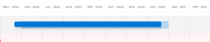

# Créer et modifier des initiatives dans le [!DNL Scenario Planner]

<!--Audited: 07/2024-->

Lorsque vous utilisez le [!UICONTROL planificateur de scénario Adobe Workfront], vous pouvez créer des initiatives dans un plan que vous avez créé ou qui a été partagé avec vous. En créant des initiatives, vous pouvez montrer comment les petites entités organisationnelles contribuent à l&#39;achèvement du plan. Par exemple, si votre organisation a un plan pour les trois prochaines années pour se développer dans un nouveau marché, vous pouvez créer des initiatives dans le cadre de ce plan pour que chaque ministère évalue les besoins en personnel et en budget de chaque ministère pour réaliser ce plan.

## Conditions d’accès

+++ Développez pour afficher les exigences d’accès aux fonctionnalités de cet article.

<table style="table-layout:auto"> 
 <col> 
 <col> 
 <tbody> 
  <tr> 
   <td> 
[!DNL Adobe Workfront] forfait*
 </td> 
   <td> 
Actuel : [!UICONTROL Entreprise] ou version ultérieure

   
Nouveau : Ultimate 

   </td> 
  </tr> 
  <tr> 
   <td> 
[!DNL Adobe Workfront] licence*
 </td> 
   <td> 
Nouveau : Léger ou supérieur
 
   
Actuel : [!UICONTROL Révision] ou version ultérieure
 </td> 
  </tr> 
  <tr> 
   <td>Produit*</td> 
   <td> 
   
Pour les plans Workfront actuels : 

   
Vous devez acheter une licence supplémentaire pour le [!DNL Adobe Workfront Scenario Planner] afin d’accéder aux fonctionnalités décrites dans cet article.
 
Pour plus d’informations sur l’accès et les autorisations pour [!DNL Workfront Scenario Planner], voir <a href="../scenario-planner/access-needed-to-use-sp.md" class="MCXref xref">Accès nécessaire pour utiliser le [!DNL Scenario Planner]</a>. 
 </td> 
  </tr> 
  <tr data-mc-conditions=""> 
   <td>Niveau d’accès </td> 
   <td> 
Accès à l’accès à la fonction [!UICONTROL Modifier] [!DNL Scenario Planner]
 </td> 
  </tr> 
  <tr data-mc-conditions=""> 
   <td> 
Autorisations d’objet 
 </td> 
   <td> 
Autorisations [!UICONTROL Gérer] pour un plan
 
Pour plus d’informations sur la demande d’un accès supplémentaire à un plan, voir <a href="../scenario-planner/request-access-to-plan.md" class="MCXref xref">Demander l’accès à un plan dans le [!DNL Scenario Planner]</a>.
 </td> 
  </tr> 
 </tbody> 
</table>

*Pour plus d’informations, voir [Exigences d’accès à la documentation Workfront](/help/quicksilver/administration-and-setup/add-users/access-levels-and-object-permissions/access-level-requirements-in-documentation.md).

+++

## Conditions préalables

Vous devez créer un plan ou un autre utilisateur doit partager un plan avec vous avant de pouvoir créer une initiative dans ce plan. Pour plus d’informations sur la création de plans, voir [Création et modification de plans dans le  [!DNL Scenario Planner]](../scenario-planner/create-and-edit-plans.md).

Pour plus d&#39;informations sur les initiatives, consultez la [présentation des initiatives dans le  [!DNL Scenario Planner]](../scenario-planner/initiatives-overview.md).

## Créer des initiatives

Vous pouvez créer des initiatives comme suit :

* À partir de zéro.
* En important des projets dans un plan

  Pour plus d’informations sur l’importation de projets en tant qu’initiatives dans un plan, voir [Importation de projets dans des plans dans le  [!DNL Scenario Planner]](../scenario-planner/import-projects-to-plans.md).

* En copiant les initiatives existantes.

  Pour plus d’informations sur la copie d’initiatives, voir [Copie d’initiatives dans le  [!DNL Scenario Planner]](../scenario-planner/copy-initiatives.md).

Pour créer des initiatives à partir de zéro :

{{step1-to-scenario-planner}}

1. Cliquez sur le nom du plan pour lequel vous souhaitez créer une initiative.
1. Cliquez sur l’icône **+** à gauche de **[!UICONTROL Nouvelle initiative]**

   Ou

   Cliquez sur le menu déroulant **[!UICONTROL Nouvelle initiative]** et sélectionnez **[!UICONTROL Nouvelle initiative]** ou **[!UICONTROL Importer des projets].**

1. Saisissez un nom pour votre initiative dans le champ **[!UICONTROL Untitled Initiative]** , puis appuyez sur Entrée ou cliquez n’importe où ailleurs sur la page.

   L’initiative s’affiche dans la chronologie du plan, sous la forme d’une barre bleue. Par défaut, la durée d’une initiative est d’un mois et commence toujours le premier mois du plan.

1. (Facultatif) Faites glisser la barre de séparation entre le panneau de gauche et la chronologie pour redimensionner le panneau de gauche.

1. (Facultatif) Faites glisser la fin de la barre d’initiatives pour prolonger sa durée à plus d’un mois et publiez-la là où vous souhaitez que le mois de fin de l’initiative se situe.
1. (Facultatif et conditionnel) Si la durée de l’initiative est inférieure à celle du plan, faites glisser et déposez la barre d’initiative à une autre position dans le calendrier du plan, pour la déplacer vers une autre période.

   

   >[!IMPORTANT]
   >
   >Vous pouvez uniquement sélectionner une durée en mois. La durée d’une initiative que vous créez de toutes pièces ne peut jamais dépasser la durée du plan.

1. (Facultatif) Dans le menu déroulant **[!UICONTROL Mois]** , sélectionnez l’une des options suivantes pour modifier la chronologie du plan :

   | Option de menu déroulant | Description |
   |---|---|
   | [!UICONTROL Mois] | Affiche la chronologie par mois. Il s’agit de l’option par défaut pour un abonnement d’un an. |
   | [!UICONTROL Trimestre] | Affiche la chronologie par trimestre. Cette option est disponible uniquement lorsque la [!UICONTROL durée] du plan est de 3 ou 5 ans. Il s’agit de l’option par défaut pour un plan sur 3 ans. |
   | [!UICONTROL Year] | Affiche la chronologie par année. Cette option est disponible uniquement lorsque la [!UICONTROL durée] du plan est de 5 ans. Il s’agit de l’option par défaut pour un plan de 5 ans. |

1. (Facultatif) Faites défiler la page de gauche à droite pour afficher toute la durée de l’initiative.
1. (Facultatif) Cliquez sur la ligne d’indicateur **[!UICONTROL Today]** pour revenir à la date actuelle.

   

   >[!TIP]
   >
   >Si votre plan se situe dans le futur ou dans le passé et ne comprend pas la date actuelle, l’indicateur Aujourd’hui ne s’affiche pas.

1. Cliquez sur la barre d&#39;une initiative. Le panneau Détails de l’initiative s’ouvre à droite.

   

   Spécifiez ou passez en revue les informations suivantes :

   <table style="table-layout:auto"> 
    <col> 
    <col> 
    <tbody> 
     <tr data-mc-conditions=""> 
      <td role="rowheader">Durée de l’initiative</td> 
      <td>Durée de l’initiative en mois. </td> 
     </tr> 
     <tr data-mc-conditions=""> 
      <td role="rowheader">Dates de début et de fin</td> 
      <td>Les dates de début et de fin de l’initiative.</td> 
     </tr> 
     <tr> 
      <td role="rowheader">Section Rôles de tâche requis </td> 
      <td> 
Cliquez sur le champ <strong>[!UICONTROL Démarrage du rôle de la tâche de saisie]</strong> et sélectionnez un rôle dans la liste ou commencez à saisir le nom d’un rôle de tâche n active. 
 
Selon que le plan est configuré pour utiliser des FTE ou des heures, ajoutez le nombre de rôles d’emploi nécessaires pour cette initiative dans l’éditeur de texte enrichi ou heures pour chaque mois de l’initiative . Les trois premiers mois de l’initiative s’affichent par défaut.
 
La mise à jour des informations de rôle de tâche pour l’initiative met également à jour les informations de rôle de tâche requises pour le plan. 
 
Pour plus d’informations sur la configuration du plan d’utilisation de l’éditeur de texte enrichi ou sur les heures, voir <a href="../scenario-planner/create-and-edit-plans.md" class="MCXref xref">Création et modification de plans dans [!DNL Scenario Planner]</a>. 

      
<b>IMPORTANT</b>
  
      
Pour tous les calculs dans [!DNL Scenario Planner], [!DNL Workfront] utilise la valeur suivante : 1 ETR = 8 Heures. 

   
<b>CONSEIL</b>

   <ul> 
       <li> 
Utilisez la touche [!UICONTROL] pour passer au mois suivant. 
 </li> 
      <li> 
 Tous les rôles de tâche active du système sont répertoriés lorsque vous cliquez sur ce champ. 
 </li> 
       <li> 
Les rôles de tâche qui ont déjà été ajoutés aux rôles de tâche Disponible du plan s’affichent en premier. Pour plus d’informations sur l’ajout de rôles de tâche disponibles à un plan, voir <a href="../scenario-planner/create-and-edit-plans.md" class="MCXref xref">Création et modification de plans dans le planificateur de scénario</a>. 
 </li> 
       <li> 
[!DNL Workfront] considère qu’un équivalent temps plein est de 160 heures pour un mois. 
 
Pour tous les calculs dans le planificateur de scénario, Workfront utilise la valeur suivante : 1 ETR = 8 Heures. 
</li> 
      </ul> 
 
Vous pouvez saisir un nombre inférieur à 1 ETR ou des nombres décimaux pour l’ETR  ou  heures. Par exemple, un rôle de consultant 0,5 signifie qu’un consultant consacrerait la moitié de son EPT (généralement, 4 heures, où 8 heures équivaut à 1 EPT) à travailler sur cette initiative. 
  </td> 
     </tr> 
     <tr> 
      <td rowspan="3" role="rowheader">Section Coûts</td> 
      <td> 
Les coûts totaux de l’initiative s’affichent à droite de la section [!UICONTROL Coûts] . [!DNL Workfront] calcule les coûts d’une initiative à l’aide de la formule suivante :
 
<code>[!UICONTROL Initiative Costs] = [!UICONTROL Fixed Costs] + [!UICONTROL People] Costs</code> 
 </td> 
     </tr> 
     <tr> 
      <td> 
Dans le champ <strong>[!UICONTROL Coûts fixes]</strong> , saisissez manuellement une estimation approximative de ce que vous pensez que cela coûtera pour terminer cette initiative. Cela ne doit pas inclure les coûts associés aux rôles d’emploi estimés pour l’initiative.
 
Saisissez un montant pour chaque mois de l’initiative en passant d’un mois à un autre lorsque vous utilisez la touche de tabulation. 
 </td> 
     </tr> 
     <tr> 
      <td> 
       
 
        
Selon que le plan est configuré pour utiliser des ETR ou des heures, [!UICONTROL Workfront] utilise les formules suivantes pour calculer le coût des personnes :
 
        <ul> 
         <li> 
Lors de l’utilisation d’ETR : 
 
<code>[!UICONTROL People Costs] = SUM(Job role hourly rate * Number of months in the Duration * 160 * Number of FTEs)</code>, où 160 est le nombre total d’heures de travail dans un mois. 
 </li> 
         <li> 
Lors de l’utilisation des heures : 
 
<code>Monthly People Costs = SUM(Job role hourly rate * Number of hours estimated for an initiative)</code> 
 
Pour plus d’informations sur la configuration du plan pour l’utilisation des heures ou de l’éditeur de texte enrichi, voir <a href="../scenario-planner/create-and-edit-plans.md" class="MCXref xref">Création et modification de plans dans le planificateur de scénario</a>.
 </li> 
        </ul> 
        
Les coûts des personnes sont calculés dans la devise de base sélectionnée dans vos préférences de taux d'Exchange. Pour plus d'informations sur les taux d'Exchange, voir <a href="../administration-and-setup/manage-workfront/exchange-rates/set-up-exchange-rates.md" class="MCXref xref">Configuration des taux d'exchange</a>.
 
        
La mise à jour des informations sur les coûts d’une initiative met également à jour la zone [!UICONTROL Coûts] du plan. 
 
       
 </td> 
     </tr> 
     <tr> 
      <td colspan="2" role="rowheader"> 
Une fois que vous avez défini les valeurs de rôle et de coût d’emploi requises pour votre initiative et que vous avez modifié la durée de l’initiative, l’un des scénarios suivants peut se produire :
 
       <ul> 
        <li> 
Si vous raccourcissez l’initiative, [!DNL Workfront] supprime la quantité de ressources requise et les coûts associés au temps supprimé du plan. Les rôles de tâche restent sur le plan, mais ils n’ont pas d’éditeur de texte enrichi requis ni de heures. Les ressources disponibles pour le plan et le budget restent inchangées. Pour mettre à jour les informations sur le plan, voir <a href="../scenario-planner/create-and-edit-plans.md" class="MCXref xref">Créer et modifier des plans dans le [!DNL Scenario Planner]</a>. 
 </li> 
        <li> 
Si vous rallongez l’opération, vous devez indiquer le nombre de rôles d’emploi et de coûts pour les nouveaux mois ajoutés à l’opération. 
 </li> 
       </ul> </td> 
     </tr> 
     <tr> 
      <td role="rowheader">[!DNL Net Value] section</td> 
      <td>Dans la section <strong>[!DNL Net Value]</strong> , saisissez manuellement une estimation approximative dans le champ <strong>[!UICONTROL Scheduling]</strong> . C'est ce que vous pensez que l'intérêt de cette initiative sera. </td> 
     </tr> 
    </tbody> 
   </table>

   >[!NOTE]
   >
   >Si vous avez déjà défini le nombre de rôles d’emploi et le budget pour votre plan, le nombre de rôles d’emploi et les coûts de l’initiative que vous modifiez, ainsi que de toutes les initiatives qui y sont supérieures, et qu’elles dépassent toutes les sommes spécifiées pour le plan, [!DNL Workfront] peut découvrir que vous n’avez pas assez de ressources pour terminer l’initiative. [!DNL Workfront] indique qu’il s’agit d’un conflit lors de la tentative d’exécution de cette initiative et qu’il s’affiche sous la forme d’une barre rouge. Toutes les initiatives qui suivent l&#39;initiative conflictuelle s&#39;affichent sur un fond rouge. Vous devrez peut-être ajuster certains besoins de vos initiatives, en commençant par le premier qui dispose de ressources insuffisantes. Pour plus d&#39;informations sur l&#39;ajustement des initiatives en conflit, voir [Résoudre les conflits d&#39;initiatives dans le  [!DNL Scenario Planner]](../scenario-planner/resolve-conflicts-in-sp.md).

1. (Facultatif) Pointez sur le nom d’un rôle de tâche, puis cliquez sur l’icône **[!UICONTROL corbeille]**  pour le supprimer de l’initiative.

1. (Conditionnel) Si vous avez apporté des modifications à l’initiative, cliquez sur **[!UICONTROL Appliquer]**.

   <!--
   <MadCap:conditionalText data-mc-conditions="QuicksilverOrClassic.Draft mode">
   (NOTE: Add more steps here as you can do more in the Initiative box over time)
   </MadCap:conditionalText>
   -->

1. (Conditionnel) Si vous n’avez apporté aucune modification, cliquez sur l’icône **X** dans le coin supérieur droit du panneau des détails de l’initiative pour la fermer.
1. (Facultatif) Mettez à jour la priorité de vos initiatives.

   Pour plus d’informations sur la hiérarchisation des initiatives, voir [Mise à jour des priorités des initiatives dans le planificateur de scénario](../scenario-planner/prioritize-initiatives.md).

   >[!TIP]
   >
   >Les initiatives répertoriées en premier dans la liste ont une priorité plus élevée et obtiennent des ressources avant les initiatives répertoriées en premier dans la liste.

1. Cliquez sur **[!UICONTROL Enregistrer le plan]**.

   L’initiative est maintenant incluse dans votre plan.

   Pour plus d’informations sur la suppression d’initiatives d’un plan, voir [Suppression d’initiatives dans le  [!DNL Scenario Planner]](../scenario-planner/delete-initiatives.md).
