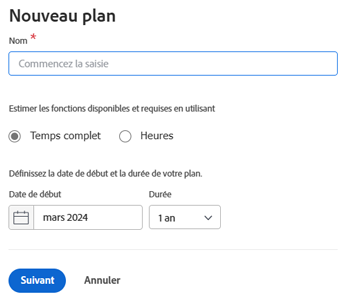
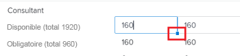
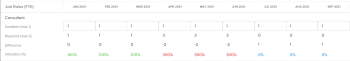

# Créer et modifier des plans dans le [!DNL Scenario Planner]

Vous pouvez créer des plans dans le cadre de l’utilisation du [!DNL Workfront Scenario Planner], lorsque vous établissez les priorités de la stratégie de haut niveau de votre entreprise. Pour plus d’informations sur les plans, consultez [Vue d’ensemble des plans dans le  [!DNL Scenario Planner]](../scenario-planner/plans-overview.md).

<!--

(NOTE: talk about:

- Show people conflicts >> this impacts the conflicts calculation for initiatives>> link to the conflicts article

- explain what hovering over the green upward-pointing arrow does, with screen shot)

-->

## Conditions d’accès

+++ Développez pour afficher les exigences d’accès aux fonctionnalités de cet article.

<table style="table-layout:auto"> 
 <col> 
 <col> 
 <tbody> 
  <tr> 
   <td> 
[!DNL Adobe Workfront] formule*
 </td> 
   <td> 
Actuel : [!UICONTROL Business] ou de niveau supérieur

   
Nouveau : Ultimate 

   </td> 
  </tr> 
  <tr> 
   <td> 
[!DNL Adobe Workfront] licence*
 </td> 
   <td> 
Nouveau : Light ou supérieur
 
   
Actuel : [!UICONTROL Révision] ou version ultérieure
 </td> 
  </tr> 
  <tr> 
   <td>Produit* </td> 
   <td> 
   
Pour les plans Workfront actuels : 

   
Vous devez acheter une licence supplémentaire pour qu’[!DNL Adobe Workfront Scenario Planner] puisse accéder aux fonctionnalités décrites dans cet article.
 
Pour plus d’informations sur l’accès et les autorisations pour [!DNL Workfront Scenario Planner], voir <a href="../scenario-planner/access-needed-to-use-sp.md" class="MCXref xref">Accès nécessaire pour utiliser le [!DNL Scenario Planner]</a>. 
 </td> 
  </tr> 
  <tr data-mc-conditions=""> 
   <td>Niveau d’accès </td> 
   <td> 
Accès [!UICONTROL Edit] à [!DNL Scenario Planner]
 </td> 
  </tr> 
  <tr data-mc-conditions=""> 
   <td> 
Autorisations d’objet 
 </td> 
   <td> 
Autorisations [!UICONTROL Manage] pour un plan
 
Pour plus d’informations sur la demande d’un accès supplémentaire à un plan, consultez <a href="../scenario-planner/request-access-to-plan.md" class="MCXref xref">Demander l’accès à un plan dans le [!DNL Scenario Planner]</a>.
 </td> 
  </tr> 
 </tbody> 
</table>

*Pour plus d’informations, voir [Exigences d’accès à la documentation Workfront](/help/quicksilver/administration-and-setup/add-users/access-levels-and-object-permissions/access-level-requirements-in-documentation.md).

+++

## Créer ou modifier des plans

Vous pouvez créer un plan à partir de zéro ou modifier un plan existant qui a été partagé avec vous.

>[!NOTE]
>
>Une fois que vous avez créé un plan, vous devenez le créateur ou la créatrice et le ou la propriétaire du plan. Lors de la désactivation d’un utilisateur ou d’une utilisatrice, le plan n’a plus de propriétaire et n’est visible par personne, sauf s’il a été préalablement partagé avec un lien.

Cet article décrit comment vous pouvez créer un plan à partir de zéro ou modifier un plan existant.

Pour tout ce qui concerne les plans, y compris les informations disponibles pour un plan, consultez [Vue d’ensemble des plans dans le  [!DNL Scenario Planner]](../scenario-planner/plans-overview.md).

Pour plus d’informations sur la suppression des plans, consultez [Supprimer des plans dans le  [!DNL Scenario Planner]](../scenario-planner/delete-plans.md).

Pour créer ou modifier un plan :

{{step1-to-scenario-planner}}

Une liste des plans que vous avez créés s’affiche dans le [!DNL Workfront Scenario Planner].

1. (Facultatif) Cliquez sur l’icône **[!UICONTROL Filtrer]**  dans le coin supérieur droit de la liste des plans, et sélectionnez l’une des options suivantes :

   | Filtre | Description |
   |---|---|
   | [!UICONTROL Tout] | Affiche tous les plans que vous avez créés ou qui ont été partagés avec vous. |
   | [!UICONTROL Mes plans] | Affiche les plans que vous avez créés. |
   | [!UICONTROL Partagé(s) avec moi] | Affiche les plans partagés avec vous. |

   

1. (Facultatif) Cliquez sur l’icône **[!UICONTROL Rechercher]**  pour saisir un mot-clé et retrouver rapidement un plan dans la liste.

1. Cliquez sur le nom d’un plan existant pour le modifier et passez à l’étape 7.

   <!--
   
(NOTE: is the step still accurate) 

   -->

   Ou

   Cliquez sur **[!UICONTROL Nouveau plan]** dans le coin supérieur gauche pour créer un plan et passez à l’étape 5.

   <!--
   
(NOTE: is the step still accurate)

   -->

   

   La zone [!UICONTROL Nouveau plan] s’affiche.

   

1. (Le cas échéant) Lorsque vous créez un nouveau plan, indiquez les informations suivantes :

   <table style="table-layout:auto"> 
    <col> 
    <col> 
    <tbody> 
     <tr> 
      <td role="rowheader">[!UICONTROL Name]</td> 
      <td>Saisissez un nom pour le plan. Champ obligatoire.</td> 
     </tr> 
     <tr> 
      <td role="rowheader" colspan="2"> 
Important : vous ne pouvez pas modifier les sélections suivantes après avoir créé et enregistré le plan. 
 </td> 
     </tr> 
     <tr data-mc-conditions=""> 
      <td role="rowheader">Équivalent temps complet ([!UICONTROL Full Time Equivalent]) ou [!UICONTROL Hours]. </td> 
      <td> 
Sélectionnez l’une des options suivantes pour indiquer comment vous souhaitez estimer les informations relatives aux fonctions pour ce plan : 
 
       <ul> 
      <li> 
<strong>Équivalent temps complet</strong>. Il s’agit de la valeur par défaut . 
 
      
<b>IMPORTANT</b>
  
      
Pour tous les calculs effectués dans le [!DNL Scenario Planner], [!DNL Workfront] utilise la valeur suivante : 1 équivalent temps complet = 8 heures. 
 </li> 
      <li> 
<strong>[!UICONTROL Hours]</strong> 
 </li> 
       </ul> 
<b>IMPORTANT</b>

   L’option que vous sélectionnez ici détermine la manière dont les informations sur les fonctions s’affichent pour le plan, les scénarios du plan et les initiatives.
 </td>
   </tr> 
     <tr> 
      <td role="rowheader">[!UICONTROL Start date]</td> 
      <td> 
Sélectionnez le mois et l’année où vous souhaitez que le plan commence. Vous ne pouvez sélectionner que des mois dans ce champ. [!DNL Workfront] suppose que la date de début du plan est le premier jour du mois sélectionné et que la date de fin est le dernier jour de la fin du mois de sa durée. 
 </td> 
     </tr> 
     <tr> 
      <td role="rowheader">[!UICONTROL Duration]</td> 
      <td> 
Dans le menu déroulant, sélectionnez l’une des durées suivantes :
 
       <ul> 
        <li>1 an Il s’agit de la durée par défaut. </li> 
        <li>3 ans</li> 
        <li> 
5 ans
 </li> 
       </ul> </td> 
     </tr> 
    </tbody> 
   </table>

<!--for table above - how FTE is calcualted: NOTE: snippet below: this is per Ani; it does NOT look at the system FTE.) 
-->

1. (Le cas échéant) Cliquez sur **[!UICONTROL Suivant]**.

   La chronologie du plan s’affiche en tant que **[!UICONTROL Scénario initial]**.

   Pour plus d’informations sur la création de scénarios supplémentaires, voir [Créer et comparer des scénarios de plan sur le site [!DNL Scenario Planner]](../scenario-planner/create-and-compare-scenarios-for-a-plan.md).

1. (Facultatif) Dans le menu déroulant de la chronologie, sélectionnez l’une des options du tableau suivant pour modifier la façon dont vous visualisez la chronologie du plan.

   

   | Option de menu déroulant | Description |
   |---|---|
   | [!UICONTROL Mois] | Affiche la chronologie par mois. Il s’agit de l’option par défaut et de la seule option pour un plan d’un an. |
   | [!UICONTROL Trimestre] | Affiche la chronologie par trimestre. Cette option est disponible uniquement lorsque la [!UICONTROL durée] de ce plan est de 3 ou 5 ans. Il s’agit de l’option par défaut pour un plan de 3 ans. |
   | [!UICONTROL Année] | Affiche la chronologie par année. Cette option est disponible uniquement lorsque la [!UICONTROL durée] du plan est de 5 ans. Il s’agit de l’option par défaut pour un plan sur 5 ans. |

1. (Facultatif) Faites défiler l’écran de gauche à droite pour afficher la durée totale du plan.
1. (Facultatif) Cliquez sur la ligne de l’indicateur **[!UICONTROL Aujourd’hui]** pour revenir à la journée en cours.

   

1. Cliquez sur la boîte **[!UICONTROL Fonctions]** dans l’en-tête du plan pour ajouter des fonctions qui seront disponibles pour exécuter le plan.

   Les détails de la boîte [!UICONTROL Fonctions] s’affichent.

   >[!TIP]
   >
   >L’unité d’allocation des rôles (équivalents temps complet ou heures) que [!DNL Workfront] utilise pour ce plan s’affiche entre parenthèses dans le titre de la boîte.

   

1. Cliquez sur le champ **[!UICONTROL Commencer à saisir la fonction]** et sélectionnez un rôle dans la liste ou commencez à saisir le nom d’une fonction active.

   Toutes les fonctions actives dans le système sont répertoriées lorsque vous cliquez sur ce champ.

   Ceci ajoute la fonction à la colonne Fonctions.

1. Mettez à jour ou révisez les informations suivantes pour la fonction :

   <table style="table-layout:auto"> 
    <col> 
    <col> 
    <tbody> 
     <tr> 
      <td role="rowheader"> 
[!UICONTROL Max available] (pour les équivalents temps complet) 
 
ou 
 
[!UICONTROL Total available] (pour les heures) 
 </td> 
      <td> 
Selon que vous avez choisi d’utiliser des heures ou des équivalents temps complet pour votre plan, saisissez le nombre d’équivalents temps complet ou d’heures des fonctions disponibles pour exécuter le travail sur le plan dans les champs suivants : 
 
       <ul> 
        <li> 
<strong>[!UICONTROL Total available]</strong> (pour les heures) : indiquez le nombre total d’heures pour tous les mois pendant la durée du scénario. Par défaut, [!DNL Workfront] divise le nombre total disponible de manière égale sur tous les mois de la durée du scénario. 
 
Example: </b>"><b>Exemple : </b>si vous saisissez 1 200 heures pour un créateur ou une créatrice, cela signifie que la personne est disponible pendant 100 heures pour chaque mois pendant la durée du plan, lorsque le plan [!UICONTROL Duration] est de 1 an. 
 </li> 
        <li> 
<b>[!UICONTROL Max available]</b> (pour les équivalents temps complet) : indiquez le nombre d’équivalents temps complet pour lesquels la fonction est disponible chaque mois pendant la durée du plan. Par défaut, <strong>Workfront</strong> attribue le nombre [!UICONTROL Max available] à chaque mois de la durée du scénario.
 
Example: </b>"><b>Exemple : </b>si vous indiquez 1 équivalent temps complet pour un consultant ou une consultante, cela signifie que cette personne est disponible pour 1 équivalent temps complet chaque mois pendant la durée du plan. 
 
Vous pouvez saisir un nombre inférieur à 1 équivalent temps complet. 
 
Example: </b>"><b>Exemple : </b>une fonction de consultant ou consultante de 0,5 signifie que cette personne consacre la moitié de son équivalent temps complet (en général, 4 heures, alors que 8 heures correspondent à 1 équivalent temps complet) au travail sur ce plan. Pour tous les calculs dans le planificateur de scénarios, Workfront utilise la valeur suivante : 1 FTE = 8 heures. 
 </li> 
       </ul> </td> 
     </tr> 
     <tr> 
      <td role="rowheader"> 
[!UICONTROL Max required] (pour les équivalents temps complet)
 
ou 
 
[!UICONTROL Total required] (pour les heures) 
 </td> 
      <td> 
Selon que vous avez choisi d’utiliser des heures ou des équivalents temps complet pour votre plan, passez en revue le nombre d’équivalents temps complet ou d’heures des fonctions qui sont nécessaires pour mener à bien les initiatives du scénario. Passez en revue les champs suivants :
 
       <ul> 
        <li> 
<strong>[!UICONTROL Total required]</strong> (pour les heures) : le nombre total d’heures requises pour tous les mois pendant la durée du plan.
 </li> 
        <li> 
<strong>[!UICONTROL Max required]</strong> (pour les équivalents temps complet) : le nombre maximum d’équivalents temps complet obligatoires pour n’importe quel mois pendant la durée du plan. 
 </li> 
       </ul> 
Conseil : le nombre maximal d’équivalents temps complet ou le nombre total d’heures requis pour cette fonction s’affiche une fois que vous avez commencé à ajouter des initiatives. Pour plus d’informations sur l’ajout d’initiatives à un plan, voir <a href="../scenario-planner/create-and-edit-initiatives.md" class="MCXref xref">Créer et modifier des initiatives dans le [!DNL Scenario Planner]</a>.
 </td> 
     </tr> <!--
      <tr data-mc-conditions="QuicksilverOrClassic.Draft mode"> 
       <td role="rowheader">[!UICONTROL Avg utilization]</td> 
       <td> 
(NOTE: this field was removed in 21.2 - May 2021) 
 
[!DNL Workfront] calculates the average utilization for each job role using the job role FTEs associated with initiatives (required) and the job role FTEs associated with the plan (available). 
 
 [!DNL Workfront] calculates the job role utilization percentage for a plan using the following formula: 
 
<code>Job role utilization percentage = Sum [(Required job roles for each month of the plan *100)/ (Available job roles for each month of the plan)] / Number of months in the Duration of the plan</code> 
 
        
Example: </b>"> <b>Example: </b> 
         
For example, if you have a plan with a duration of 12 months and an initiative with the duration of 2 months, where you use 1 Designer for your initiative (required job role) and there are 2 Designers available on the plan (available), the Utilization percentage for the Designer job role is calculated as follows:
 
         
<code>Designer utilization percentage = [(1/2 + 1/2) * 100] / 12 = 100 / 12 = 8.3%</code> 
 
        
 
As you add job roles to the plan and indicate the Available amount for each one, the [!UICONTROL Utilization] value for each role also updates and [!DNL Workfront] calculates a utilization percentage for the plan. For information about how [!DNL Workfront] calculates the Job Role Utilization for a plan, see <a href="../scenario-planner/plans-overview.md" class="MCXref xref">Plans overview in the [!DNL Scenario Planner]</a>. 
 
Tip: The Utilization percentage is rounded and has one decimal. 
 </td> 
      </tr>
     --> 
     <tr> 
      <td role="rowheader">[!UICONTROL Hourly rate]</td> 
      <td> 
Il s’agit du taux [!UICONTROL Cost Hour] pour la fonction. Le taux horaire s’affiche dans la devise de votre système. Pour plus d’informations sur la configuration des taux de change pour votre système, voir <a href="../administration-and-setup/manage-workfront/exchange-rates/set-up-exchange-rates.md" class="MCXref xref">Configurer les taux de change</a>.
 </td> 
     </tr> 
    </tbody> 
   </table>

1. (Facultatif) Pointez sur le nom d’une fonction ou cliquez sur l’onglet après avoir mis à jour les informations relatives au rôle, puis cliquez sur l’**[!UICONTROL icône de la corbeille]**  pour la supprimer du plan.
1. Cliquez sur **[!UICONTROL Distribution des fonctions]**.

   Le panneau de répartition des fonctions affiche tous les mois de la durée du scénario.

   

1. Saisissez le nom d’une fonction pour l’ajouter au plan dans le **[!UICONTROL champ Commencer à saisir la fonction]**, puis cliquez sur Entrée lorsqu’elle apparaît dans la liste. Cette opération ajoute la fonction à la colonne [!UICONTROL Fonctions].
1. Mettez à jour ou révisez les informations suivantes pour chaque mois du scénario :

   <table style="table-layout:auto"> 
    <col> 
    <col> 
    <tbody> 
     <tr> 
      <td role="rowheader">[!UICONTROL Job Roles] (équivalents temps complet ou heures)</td> 
      <td>Les fonctions disponibles pour le scénario et celles requises pour les initiatives du scénario s’affichent dans le panneau de distribution des fonctions. L’en-tête de la colonne indique si les estimations des fonctions sont exprimées en équivalents temps complet ou en heures. </td> 
     </tr> 
     <tr> 
      <td role="rowheader"> 
[!UICONTROL Available] (max &lt;number of FTEs&gt;) 
 
       
 
        
ou
 
        
[!UICONTROL Available] (total &lt;number of hours&gt;) 
 
       
 </td> 
      <td> 
Selon que vous avez choisi d’utiliser des heures ou des équivalents temps complet pour votre plan, vérifiez ou mettez à jour le nombre mensuel d’équivalents temps complet ou d’heures des fonctions disponibles pour le scénario dans les champs suivants :
 
       <ul> 
        <li> 
<strong>[!UICONTROL Available] (max &lt;number of FTEs&gt;)</strong> le nombre entre parenthèses indique le nombre maximum de rôles disponibles pour l’un des mois du scénario. Révisez ou mettez à jour le nombre d’équivalents temps complet pour chaque mois du scénario. La modification de l’allocation mensuelle peut entraîner une mise à jour du nombre d’équivalents temps complet entre parenthèses. 
 </li> 
        <li> 
<strong>[!UICONTROL Available] (total &lt;number of hours&gt;)</strong> : le nombre entre parenthèses affiche le nombre total d’heures disponibles pour tous les mois du scénario. Révisez ou mettez à jour le nombre d’heures pour chaque mois du scénario. La modification de l’allocation mensuelle met à jour le nombre d’heures entre parenthèses. 
 </li> 
       </ul> 
La mise à jour manuelle des allocations mensuelles de fonctions est un autre moyen de résoudre les conflits de fonctions entre les initiatives du scénario. 
 
Conseil :   
Pour mettre à jour la disponibilité mensuelle des rôles pour plusieurs mois, saisissez le nombre d’heures ou d’équivalents temps complet dans le champ [!UICONTROL Available] de n’importe quel mois, puis faites glisser le coin du champ sur les mois adjacents pour copier la même valeur pour chaque mois. Déposez-le pour mettre à jour tous les mois. 
 
  
 
 </td> 
     </tr> 
     <tr> 
      <td role="rowheader"> 
[!UICONTROL Required] (max &lt;number&gt;)
 
       
 
        
ou
 
        
[!UICONTROL Required] (total &lt;number&gt;)
 
       
 </td> 
      <td> 
Selon que vous avez choisi d’utiliser des heures ou des équivalents temps complet pour votre plan, vérifiez le nombre mensuel d’équivalents temps complet ou d’heures requis pour le scénario dans les champs suivants : 
 
       <ul> 
        <li> 
<strong>[!UICONTROL Required] (&lt;number of FTEs&gt; max)</strong> : le nombre entre parenthèses indique le nombre maximum de fonctions requis pour l’un des mois du scénario. 
 </li> 
        <li> 
<strong>[!UICONTROL Required] (&lt;number of hours&gt; au total)</strong> : le nombre entre parenthèses affiche le nombre total d’heures requises pour tous les mois du scénario. 
 </li> 
       </ul> 
Conseil : vous ne pouvez pas modifier le nombre requis d’équivalent temps complet ni d’heures pour la fonction. Ce nombre s’affiche pour le scénario une fois que vous avez commencé à ajouter des initiatives et les exigences relatives à leur fonction. 
 </td> 
     </tr> 
     <tr> 
      <td role="rowheader">[!UICONTROL Difference]</td> 
      <td> 
       
 
        
La différence mensuelle entre le nombre de fonctions requises et disponibles pour le scénario. [!DNL Workfront] calcule la différence pour chaque fonction et pour chaque mois à l'aide de la formule suivante :
 
        
<code>Monthly role difference = Monthly required roles - Monthly available roles</code> (en équivalent temps complet ou en heures) 
 
        
Conseil : lorsque la différence affiche un nombre négatif, cela signifie que le scénario nécessite plus de fonctions que le plan n’en a à sa disposition. Vos ressources sont sur-affectées. 
 
       
 </td> 
     </tr> 
     <tr> 
      <td role="rowheader">[!UICONTROL Utilization] %</td> 
      <td> 
       
 
        
Le pourcentage d’utilisation indique le nombre de fonctions disponibles qui sont réellement utilisées (ou requises) dans le cadre des initiatives du scénario. 
 
        
[!DNL Workfront] calcule l’utilisation par fonction et par mois à l’aide de la formule suivante : 
 
        
<code>Monthly role utilization % = Monthly required roles / Monthly available roles * 100</code> 
 
        
Le pourcentage d’utilisation peut s’afficher dans les couleurs suivantes, en fonction de l’affectation de vos ressources :
 
        <ul> 
         <li> 
<b>Vert</b> : le nombre de fonctions disponibles et requises correspond. Les ressources sont entièrement affectées et le pourcentage d’utilisation est de 100 %. 
 </li> 
         <li> 
<b>Rouge</b> : le nombre de fonctions requises est supérieur au nombre de fonctions disponibles dans le plan. Les ressources sont sur-affectées et le pourcentage d’utilisation est supérieur à 100 %.
 </li> 
         <li> 
<b>Bleu</b> : le nombre de fonctions disponibles est supérieur au nombre de fonctions requises. Les ressources sont sous-affectées et le pourcentage d’utilisation est inférieur à 100 %. 
 </li> 
        </ul> 
       
 
  
 </td> 
     </tr> 
    </tbody> 
   </table>

1. Cliquez sur **[!UICONTROL Appliquer]** pour enregistrer la distribution mensuelle des fonctions.

   Ou

   Cliquez sur **[!UICONTROL Annuler]** pour fermer la liste de distribution des fonctions et revenir au scénario.

1. Cliquez sur la zone **[!UICONTROL Éléments financiers]** dans l’en-tête du plan pour ajouter le budget de ce plan.

   Les détails de la zone [!UICONTROL Éléments financiers] s’affichent.

   >[!TIP]
   >
   >La devise utilisée par [!DNL Workfront] pour ce plan apparaît entre parenthèses dans le titre de la zone.

1. Précisez le **[!UICONTROL Budget annuel]**.

   >[!NOTE]
   >
   >Si votre plan s’étend sur plusieurs années, vous devez spécifier un budget pour chaque année.

1. Appuyez sur Entrée pour enregistrer le budget annuel, puis sur [!UICONTROL Tabulation] pour passer à l’année suivante.

   Le budget annuel est automatiquement distribué de manière égale pour chaque mois de l’année sélectionnée.

1. Cliquez sur **[!UICONTROL Avancé]** pour voir la distribution du budget mensuel. Les budgets annuels et mensuels sont toujours des chiffres arrondis. Lorsque le montant du budget ne peut pas être distribué de manière égale entre tous les mois d’une année en raison de la présence de décimales, un indicateur **[!UICONTROL Restant]** s’affiche sous la distribution du budget annuel.

   

1. Ajustez manuellement les budgets mensuels pour éliminer les dépassements.

   Lorsque le total des montants des budgets mensuels est supérieur au budget annuel, un indicateur d’avertissement **[!UICONTROL En excès]** s’affiche sous la distribution du budget annuel. Ajustez manuellement les montants des budgets mensuels jusqu’à ce qu’ils soient égaux ou inférieurs au budget disponible pour le plan.

   

1. Désactivez le paramètre **[!UICONTROL Inclure les coûts de main-d’œuvre]** pour exclure les coûts associés aux fonctions du calcul du coût global du plan. Les coûts fixes sont toujours pris en compte dans le coût global du plan. Ce paramètre est activé par défaut et affecte tous les scénarios du plan.
1. Cliquez n’importe où en dehors de la zone [!UICONTROL Éléments financiers] pour la fermer. Les informations que vous avez saisies sont automatiquement enregistrées.

   Vous pouvez maintenant commencer à créer les initiatives sur le plan et à ajouter des scénarios.

1. (Recommandé) Cliquez sur **[!UICONTROL Nouvelle initiative]** pour ajouter une nouvelle initiative.

   <!--
   
(NOTE: Should this include information on how to create scenarios - see also information about scenarios in Manage Plans?)

   -->

   Pour plus d’informations sur l’ajout d’initiatives, voir l’article [Créer et modifier des initiatives dans le  [!DNL Scenario Planner]](../scenario-planner/create-and-edit-initiatives.md).

1. (Facultatif) Faites une copie du scénario existant pour créer un scénario du même plan. Pour plus d’informations sur la création et l’utilisation de scénarios multiples, voir la section [Créer et comparer des scénarios de plan dans le  [!DNL Scenario Planner]](../scenario-planner/create-and-compare-scenarios-for-a-plan.md).
1. Cliquez sur **[!UICONTROL Enregistrer le plan]**.

   Votre plan est créé ou mis à jour.

1. (Facultatif) Cliquez sur l’**[!UICONTROL icône Favoris]**  à droite du nom du plan pour ajouter le plan à votre liste de favoris.

1. (Facultatif) Copiez l’URL du plan et envoyez-la à toute autre personne qui pourrait avoir besoin de le réviser ou de le mettre à jour. Cette personne doit avoir au moins l’accès [!UICONTROL Afficher] dans leur niveau d’accès pour pouvoir visualiser le plan. Elle doit avoir un accès [!UICONTROL Modifier] pour le modifier. Si elle doit consulter des données financières sur le plan, telles que des informations relatives aux budgets, aux coûts et aux taux des fonctions, elle doit également avoir accès aux [!UICONTROL Données financières] dans son niveau d’accès. Pour plus d’informations sur l’accès nécessaire pour le [!DNL Scenario Planner], voir [Accès nécessaire pour l’utilisation du  [!DNL Scenario Planner]](../scenario-planner/access-needed-to-use-sp.md).
