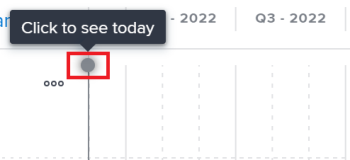

# Créez et modifiez des plans dans le [!DNL Scenario Planner]

Vous pouvez créer des plans dans le cadre de l’utilisation de la variable [!DNL Workfront Scenario Planner], lors de la hiérarchisation de la stratégie de niveau supérieur de votre entreprise. Pour plus d’informations sur les plans, voir [Présentation des plans dans [!DNL Scenario Planner]](../scenario-planner/plans-overview.md).

<!--

(NOTE: talk about:

- Show people conflicts >> this impacts the conflicts calculation for initiatives>> link to the conflicts article

- explain what hovering over the green upward-pointing arrow does, with screen shot)

-->

## Exigences d’accès

Vous devez disposer des éléments suivants :

<table style="table-layout:auto"> 
 <col> 
 <col> 
 <tbody> 
  <tr> 
   <td> 
[!DNL Adobe Workfront] plan*
 </td> 
   <td>[!UICONTROL Business] ou version ultérieure</td> 
  </tr> 
  <tr> 
   <td> 
[!DNL Adobe Workfront] license*
 </td> 
   <td> 
[!UICONTROL Review] ou version ultérieure
 </td> 
  </tr> 
  <tr> 
   <td>Produit</td> 
   <td> 
Vous devez acheter une licence supplémentaire pour la variable [!DNL Adobe Workfront Scenario Planner] pour accéder aux fonctionnalités décrites dans cet article.
 
Pour plus d’informations sur l’obtention du [!UICONTROL Workfront Scenario Planner], voir <a href="../scenario-planner/access-needed-to-use-sp.md" class="MCXref xref">Accès nécessaire à l’utilisation du [!UICONTROL Scenario Planner]</a>. 
 </td> 
  </tr> 
  <tr data-mc-conditions=""> 
   <td>Paramétrages du niveau d'accès* </td> 
   <td> 
Accès à [!UICONTROL Modifier] ou supérieur à la variable [!DNL Scenario Planner]
 
Remarque : Si vous n’avez toujours pas accès à , demandez à votre administrateur Workfront s’il définit des restrictions supplémentaires à votre niveau d’accès. Pour plus d’informations sur la manière dont une [!DNL Workfront] l’administrateur peut modifier votre niveau d’accès, voir <a href="../administration-and-setup/add-users/configure-and-grant-access/create-modify-access-levels.md" class="MCXref xref">Création ou modification de niveaux d’accès personnalisés</a>.
 </td> 
  </tr> 
  <tr data-mc-conditions=""> 
   <td> 
Autorisations d’objet 
 </td> 
   <td> 
[!DNL Manage] autorisations d’un plan
 
Pour plus d’informations sur la demande d’un accès supplémentaire à un plan, voir <a href="../scenario-planner/request-access-to-plan.md" class="MCXref xref">Demandez l’accès à un plan dans la [!DNL Scenario Planner]</a>.
 </td> 
  </tr> 
 </tbody> 
</table>

&#42;Pour connaître le plan, le type de licence ou l’accès dont vous disposez, contactez votre [!DNL Workfront] administrateur.

## Créer ou modifier des plans

Vous pouvez créer entièrement un plan ou en modifier un existant qui a été partagé avec vous.

>[!NOTE]
>
>Après avoir créé un plan, vous êtes considéré comme le créateur et le propriétaire du plan. Lorsqu’un utilisateur est désactivé, le plan n’a pas de propriétaire et n’est visible par personne, sauf s’il a été partagé avec un lien.

Cet article décrit comment créer entièrement un plan ou modifier un plan existant.

Pour toutes les considérations relatives aux plans, y compris les informations disponibles pour un plan, voir [Présentation des plans dans [!DNL Scenario Planner]](../scenario-planner/plans-overview.md).

Pour plus d’informations sur la suppression de plans, voir [Suppression de plans dans la [!DNL Scenario Planner]](../scenario-planner/delete-plans.md).

Pour créer ou modifier un plan :

1. Cliquez sur le bouton **[!UICONTROL Menu Principal]** icon , puis cliquez sur [!UICONTROL Scénarios].

   Une liste des plans existants que vous avez créés s’affiche dans la [!DNL Workfront Scenario Planner].

1. (Facultatif) Cliquez sur le **[!UICONTROL Filtrer]** icon dans le coin supérieur droit de la liste des plans, puis sélectionnez l’une des options suivantes :

   | Filtre | Description |
   |---|---|
   | [!UICONTROL Tout] | Affiche tous les plans que vous avez créés ou qui ont été partagés avec vous. |
   | [!UICONTROL Mes plans] | Affiche les plans que vous avez créés. |
   | [!UICONTROL Partagé avec moi] | Affiche les plans partagés avec vous. |

   

1. (Facultatif) Cliquez sur le **[!UICONTROL Rechercher]** icon  pour saisir un mot-clé et localiser rapidement un plan dans la liste.

1. Cliquez sur le nom d&#39;un plan existant pour le modifier et passez à l&#39;étape 7.

   <!--
   
(NOTE: is the step still accurate) 

   -->

   Ou

   Cliquez sur **[!UICONTROL Nouveau plan]** dans le coin supérieur gauche pour créer un plan et passez à l’étape 5.

   <!--
   
(NOTE: is the step still accurate)

   -->

   

   Le [!UICONTROL Nouveau plan] s’affiche.

   

1. (Conditionnel) Lorsque vous créez un plan, indiquez les informations suivantes :

   <table style="table-layout:auto"> 
    <col> 
    <col> 
    <tbody> 
     <tr> 
      <td role="rowheader">[!UICONTROL Name]</td> 
      <td>Saisissez le nom du plan. Champ obligatoire.</td> 
     </tr> 
     <tr> 
      <td role="rowheader" colspan="2"> 
Important : Vous ne pouvez pas modifier les sélections suivantes après avoir créé et enregistré le plan. 
 </td> 
     </tr> 
     <tr data-mc-conditions=""> 
      <td role="rowheader">ETR ([!UICONTROL équivalent temps plein]) ou [!UICONTROL Hours] </td> 
      <td> 
Sélectionnez l’une des options suivantes pour indiquer comment estimer les informations sur les rôles de tâche pour ce plan : 
 
       <ul> 
      <li> 
<strong>FTE</strong>. Il s’agit de la valeur par défaut  
 
      
<b>IMPORTANT</b>
  
      
Pour tous les calculs dans la variable [!DNL Scenario Planner], [!DNL Workfront] utilise la valeur suivante : 1 ETR = 8 heures. 
 </li> 
      <li> 
<strong>[!UICONTROL Hours]</strong> 
 </li> 
       </ul> 
<b>IMPORTANT</b>

   L’option que vous sélectionnez ici détermine l’affichage des informations sur les rôles de tâche pour le plan, les scénarios du plan et les initiatives.
 </td>
   </tr> 
     <tr> 
      <td role="rowheader">[!UICONTROL Date de début]</td> 
      <td> 
Sélectionnez le mois et l'année auxquels le plan doit commencer. Vous ne pouvez sélectionner que les mois dans ce champ. [!DNL Workfront] suppose que la date de début du forfait est le premier jour du mois sélectionné et que la date de fin est le dernier jour de fin du mois de sa durée. 
 </td> 
     </tr> 
     <tr> 
      <td role="rowheader">[!UICONTROL Duration]</td> 
      <td> 
Dans le menu déroulant, sélectionnez l’une des durées suivantes :
 
       <ul> 
        <li>1 an. Il s’agit de la durée par défaut. </li> 
        <li>3 ans</li> 
        <li> 
5 ans
 </li> 
       </ul> </td> 
     </tr> 
    </tbody> 
   </table>

<!--for table above - how FTE is calcualted: NOTE: snippet below: this is per Ani; it does NOT look at the system FTE.) 
-->

1. (Conditionnel) Cliquez sur **[!UICONTROL Suivant]**.

   La chronologie du plan s’affiche sous la forme **[!UICONTROL Scénario initial]**.

   Pour plus d’informations sur la création de scénarios supplémentaires, voir [Créez et comparez des scénarios de plan dans la section [!DNL Scenario Planner]](../scenario-planner/create-and-compare-scenarios-for-a-plan.md).

1. (Facultatif) Dans le menu déroulant de la frise chronologique, sélectionnez l’une des options du tableau suivant pour modifier l’affichage de la frise chronologique du plan.

   

   | Option de menu déroulant | Description |
   |---|---|
   | [!UICONTROL Mois] | Affiche la chronologie par mois. Il s’agit de la seule option par défaut pour un abonnement d’un an. |
   | [!UICONTROL Trimestre] | Affiche la chronologie par trimestre. Cette option est disponible uniquement lorsque la variable [!UICONTROL Durée] de ce plan est de 3 ou 5 ans. Il s’agit de l’option par défaut pour un plan sur 3 ans. |
   | [!UICONTROL Année] | Affiche la chronologie par année. Cette option est disponible uniquement lorsque la variable [!UICONTROL Durée] du plan est de 5 ans. Il s’agit de l’option par défaut pour un plan de 5 ans. |

1. (Facultatif) Faites défiler la page de gauche à droite pour afficher toute la durée du plan.
1. (Facultatif) Cliquez sur le **[!UICONTROL Aujourd&#39;hui]** pour revenir au jour en cours.

   

1. Cliquez sur le bouton **[!UICONTROL Rôles de tâche]** dans l’en-tête du plan pour ajouter des rôles de tâche qui seront disponibles pour exécuter le plan.

   Les détails de la variable [!UICONTROL Rôles de tâche] s’affiche.

   >[!TIP]
   >
   >L’unité d’affectation des rôles (ETR ou heures) qui [!DNL Workfront] Les utilisateurs de ce plan s’affichent entre parenthèses dans le titre de la zone.

   

1. Cliquez sur le bouton **[!UICONTROL Commencer à saisir le rôle de tâche]** et sélectionnez un rôle dans la liste ou commencez à saisir le nom d’un rôle de tâche principal.

   Tous les rôles de tâche principaux dans le système sont répertoriés lorsque vous cliquez sur ce champ.

   Le rôle de tâche est alors ajouté à la colonne Rôles de tâche .

1. Mettez à jour ou passez en revue les informations suivantes pour le rôle de tâche :

   <table style="table-layout:auto"> 
    <col> 
    <col> 
    <tbody> 
     <tr> 
      <td role="rowheader"> 
[!UICONTROL Max disponible] (pour l’éditeur de texte enrichi) 
 
ou 
 
[!UICONTROL Total disponible] (en heures) 
 </td> 
      <td> 
Selon que vous avez choisi d’utiliser des heures ou l’éditeur de texte enrichi pour votre formule, saisissez le nombre d’EPT de rôle de tâche ou heures qui sont disponibles pour exécuter les travaux sur le plan dans les champs suivants : 
 
       <ul> 
        <li> 
<strong>[!UICONTROL Total disponible]</strong> (pour les heures) : Indiquez le nombre total d'heures pour tous les mois pendant la durée du scénario. Par défaut, [!DNL Workfront] divise le nombre total disponible de manière égale sur tous les mois de la durée du scénario. 
 
Example: </b>"><b>Exemple : </b>Si vous saisissez 1200 heures pour un Designer, cela signifie que ce dernier est disponible pendant 100 heures pour chaque mois pendant la durée du forfait, lorsque la durée du forfait [!UICONTROL] est d’un an. 
 </li> 
        <li> 
<b>[!UICONTROL Max disponible]</b> (pour l’éditeur de texte enrichi) : Indiquez le nombre d’ETR dont le rôle de tâche est disponible pour chaque mois pendant la durée du plan. Par défaut, <strong>Workfront</strong> attribue le nombre [!UICONTROL Max disponible] à chaque mois pendant la durée du scénario.
 
Example: </b>"><b>Exemple : </b>Si vous indiquez 1 ETR pour un consultant, cela signifie que ce dernier est disponible pour 1 ETR pour chaque mois pendant la durée du plan. 
 
Vous pouvez saisir un nombre inférieur à 1 ETR. 
 
Example: </b>"><b>Exemple : </b>Un rôle de consultant 0,5 signifie qu’un consultant consacrerait la moitié de son EPT (généralement, 4 heures, où 8 heures équivaut à 1 EPT) à travailler sur ce plan. Pour tous les calculs dans le planificateur de scénario, Workfront utilise la valeur suivante : 1 ETR = 8 heures. 
 </li> 
       </ul> </td> 
     </tr> 
     <tr> 
      <td role="rowheader"> 
[!UICONTROL Max requis] (pour l’éditeur de texte enrichi)
 
ou 
 
[!UICONTROL Total requis] (pour les heures) 
 </td> 
      <td> 
Selon que vous avez choisi d’utiliser des heures ou l’éditeur de texte enrichi pour votre plan, passez en revue les le nombre d’EPT de rôle de tâche ou heures qui sont nécessaires pour terminer les initiatives dans le scénario. Vérifiez les champs suivants :
 
       <ul> 
        <li> 
<strong>[!UICONTROL Total requis]</strong> (pour les heures) : Nombre total d’heures requises pour tous les mois pendant la durée du plan.
 </li> 
        <li> 
<strong>[!UICONTROL Max requis]</strong> (pour l’éditeur de texte enrichi) : Nombre maximal d’EPT requis pour n’importe quel mois pendant la durée du plan. 
 </li> 
       </ul> 
Conseil : Le maximum nombre d’ETR ou le nombre total d’heures requis pour ce rôle de tâche s’affiche une fois que vous avez commencé à ajouter des initiatives. Pour plus d’informations sur l’ajout d’initiatives à un plan, voir <a href="../scenario-planner/create-and-edit-initiatives.md" class="MCXref xref">Créez et modifiez des initiatives dans le [!DNL Scenario Planner]</a>.
 </td> 
     </tr> <!--
      <tr data-mc-conditions="QuicksilverOrClassic.Draft mode"> 
       <td role="rowheader">[!UICONTROL Avg utilization]</td> 
       <td> 
(NOTE: this field was removed in 21.2 - May 2021) 
 
[!DNL Workfront] calculates the average utilization for each job role using the job role FTEs associated with initiatives (required) and the job role FTEs associated with the plan (available). 
 
 [!DNL Workfront] calculates the job role utilization percentage for a plan using the following formula: 
 
<code>Job role utilization percentage = Sum [(Required job roles for each month of the plan *100)/ (Available job roles for each month of the plan)] / Number of months in the Duration of the plan</code> 
 
        
Example: </b>"> <b>Example: </b> 
         
For example, if you have a plan with a duration of 12 months and an initiative with the duration of 2 months, where you use 1 Designer for your initiative (required job role) and there are 2 Designers available on the plan (available), the Utilization percentage for the Designer job role is calculated as follows:
 
         
<code>Designer utilization percentage = [(1/2 + 1/2) * 100] / 12 = 100 / 12 = 8.3%</code> 
 
        
 
As you add job roles to the plan and indicate the Available amount for each one, the [!UICONTROL Utilization] value for each role also updates and [!DNL Workfront] calculates a utilization percentage for the plan. For information about how [!DNL Workfront] calculates the Job Role Utilization for a plan, see <a href="../scenario-planner/plans-overview.md" class="MCXref xref">Plans overview in the [!DNL Scenario Planner]</a>. 
 
Tip: The Utilization percentage is rounded and has one decimal. 
 </td> 
      </tr>
     --> 
     <tr> 
      <td role="rowheader">[!UICONTROL Taux horaire]</td> 
      <td> 
Il s’agit du taux d’[!UICONTROL Heure de coût] pour le rôle de tâche. Le taux horaire s’affiche dans la devise de votre système. Pour plus d’informations sur la configuration des taux de change pour votre système, voir <a href="../administration-and-setup/manage-workfront/exchange-rates/set-up-exchange-rates.md" class="MCXref xref">Configurer les taux de change</a>.
 </td> 
     </tr> 
    </tbody> 
   </table>

1. (Facultatif) Passez la souris sur le nom d’un rôle de tâche ou cliquez sur l’onglet après avoir mis à jour les informations sur le rôle, puis cliquez sur le bouton **[!UICONTROL icône de corbeille]**  pour le retirer du plan.
1. Cliquez sur **[!UICONTROL Répartition des rôles de tâche]**.

   Le panneau de distribution des rôles de tâche s’affiche pour tous les mois de la durée du scénario.

   

1. Saisissez le nom d’un rôle de tâche à ajouter au plan dans la variable **[!UICONTROL Commencer à saisir le champ de rôle de tâche]**, puis cliquez sur Entrée lorsqu’il apparaît dans la liste. Cela ajoute le rôle de tâche à la fonction [!UICONTROL Rôles de tâche] colonne .
1. Mettez à jour ou passez en revue les informations suivantes pour chaque mois du scénario :

   <table style="table-layout:auto"> 
    <col> 
    <col> 
    <tbody> 
     <tr> 
      <td role="rowheader">[!UICONTROL Rôles de tâche] (ETR ou heures)</td> 
      <td>Le rôle de tâche disponible pour le scénario et ceux requis pour les initiatives du scénario s’affichent tous deux dans le panneau de distribution des rôles de tâche. Il existe une indication indiquant si les estimations de rôle de tâche se trouvent dans les ETR ou les heures dans l’en-tête de colonne. </td> 
     </tr> 
     <tr> 
      <td role="rowheader"> 
[!UICONTROL Disponible] (max &lt;number of="" ftes=""&gt;) 
 
       
 
        
ou
 
        
[!UICONTROL Disponible] (total) &lt;number of="" hours=""&gt;) 
 
       
 </td> 
      <td> 
Selon que vous avez choisi d’utiliser des heures ou l’éditeur de texte enrichi pour votre plan, passez en revue ou mettez à jour le nombre mensuel d’ETR pour les rôles de tâche ou heures disponibles pour le scénario dans les champs suivants :
 
       <ul> 
        <li> 
<strong>[!UICONTROL Disponible] (max &lt;number of="" ftes=""&gt;)</strong>: Le nombre entre parenthèses affiche le nombre maximal de rôles disponibles pour l’un des mois du scénario. Vérifiez ou mettez à jour le nombre d’ETR pour chaque mois du scénario. La modification de l’allocation mensuelle peut mettre à jour le nombre d’ETR entre parenthèses. 
 </li> 
        <li> 
<strong>[!UICONTROL Disponible] (total) &lt;number of="" hours=""&gt;)</strong>: Le nombre entre parenthèses affiche le nombre total d’heures disponibles pour tous les mois du scénario. Vérifiez ou mettez à jour le nombre d’heures pour chaque mois du scénario. La modification de l’allocation mensuelle met à jour le nombre d’heures entre parenthèses. 
 </li> 
       </ul> 
La mise à jour manuelle des affectations mensuelles de rôles de tâche est une autre manière de résoudre les conflits de rôles entre les initiatives dans le scénario. 
 
Conseil :   
Pour mettre à jour la disponibilité mensuelle des rôles pendant plusieurs mois, saisissez le nombre d’heures ou d’ETR dans le champ [!UICONTROL Disponible] d’un mois, puis faites glisser le coin du champ sur les mois adjacents pour copier la même valeur pour chaque mois. Déposez-le pour mettre à jour tous les mois. 
 
  
 
 </td> 
     </tr> 
     <tr> 
      <td role="rowheader"> 
[!UICONTROL Obligatoire] (max &lt;number&gt;)
 
       
 
        
ou
 
        
[!UICONTROL Obligatoire] (total) &lt;number&gt;)
 
       
 </td> 
      <td> 
Selon que vous avez choisi d’utiliser des heures ou l’éditeur de texte enrichi pour votre plan, passez en revue les le nombre mensuel d’heures ou d’EPT de rôle professionnel requis pour le scénario dans les champs suivants : 
 
       <ul> 
        <li> 
<strong>[!UICONTROL Obligatoire] (max &lt;number of="" ftes=""&gt;)</strong>: Le nombre entre parenthèses affiche le nombre maximal de rôles requis pour l’un des mois du scénario. 
 </li> 
        <li> 
<strong>[!UICONTROL Obligatoire] (total) &lt;number of="" hours=""&gt;)</strong>: Le nombre entre parenthèses affiche le nombre total d’heures nécessaires pour tous les mois du scénario. 
 </li> 
       </ul> 
Conseil : Vous ne pouvez pas modifier le nombre requis d’ETR ou heures pour le rôle de tâche. Ce nombre est renseigné pour le scénario une fois que vous avez commencé à ajouter des initiatives et leurs exigences en termes de rôle professionnel. 
 </td> 
     </tr> 
     <tr> 
      <td role="rowheader">[!UICONTROL Différence]</td> 
      <td> 
       
 
        
Différence mensuelle entre le nombre de rôles de tâche requis et disponibles pour le scénario. [!DNL Workfront] calcule la différence pour chaque rôle de tâche pour chaque mois à l’aide de la formule suivante :
 
        
<code>Monthly role difference = Monthly required roles - Monthly available roles</code> (en ETP ou heures) 
 
        
Conseil : Lorsque la différence affiche un nombre négatif, le scénario nécessite davantage de rôles d’emploi que le plan disponible. Vos ressources sont surchargées. 
 
       
 </td> 
     </tr> 
     <tr> 
      <td role="rowheader">[!UICONTROL Utilisation] %</td> 
      <td> 
       
 
        
Le pourcentage d’utilisation affiche le nombre de rôles de tâche disponibles réellement utilisés (ou requis) sur les initiatives dans le scénario. 
 
        
[!DNL Workfront] calcule l’utilisation par rôle de tâche par mois à l’aide de la formule suivante : 
 
        
<code>Monthly role utilization % = Monthly required roles / Monthly available roles * 100</code> 
 
        
Le pourcentage d’utilisation peut s’afficher dans les couleurs suivantes, selon l’allocation de vos ressources :
 
        <ul> 
         <li> 
<b>Vert</b>: Le nombre de rôles de tâche disponibles et requis correspond. Les ressources sont entièrement allouées et le pourcentage d’utilisation est de 100 %. 
 </li> 
         <li> 
<b>Rouge</b>: Il existe plus de rôles de travail requis que le plan disponible. Les ressources sont surchargées et le pourcentage d’utilisation est supérieur à 100 %.
 </li> 
         <li> 
<b>Bleu</b>: Il existe plus de rôles de tâche disponibles qu’ils ne sont requis. Les ressources sont sous-affectées et le pourcentage d’utilisation est inférieur à 100 %. 
 </li> 
        </ul> 
       
 
  
 </td> 
     </tr> 
    </tbody> 
   </table>

1. Cliquez sur **[!UICONTROL Appliquer]** pour enregistrer la distribution mensuelle des rôles de tâche

   Ou

   Cliquez sur **[!UICONTROL Annuler]** pour fermer la liste de distribution des rôles de tâche et revenir au scénario.

1. Cliquez sur le bouton **[!UICONTROL Financière]** dans l’en-tête du plan, pour ajouter le budget de ce plan.

   Les détails de la variable [!UICONTROL Financière] s’affiche.

   >[!TIP]
   >
   >La devise [!DNL Workfront] Les utilisateurs de ce plan s’affichent entre parenthèses dans le titre de la zone.

1. Spécifiez la variable **[!UICONTROL Budget annuel]**.

   >[!NOTE]
   >
   >Si votre plan s’étend sur plusieurs années, vous devez indiquer un montant budgétaire pour chaque année.

1. Appuyez sur Entrée pour enregistrer le budget annuel, puis [!UICONTROL Onglet] pour passer à l’année suivante.

   Le budget annuel est automatiquement réparti à parts égales pour chaque mois de l&#39;année sélectionnée.

1. Cliquez sur **[!UICONTROL Avancé]** pour consulter la répartition du budget mensuel. Les budgets annuel et mensuel sont toujours des nombres arrondis. Lorsque le montant du budget ne peut pas être réparti uniformément sur tous les mois de l&#39;année en raison des décimales a **[!UICONTROL Restant]** s’affiche sous la répartition du budget annuel.

   

1. Ajustez manuellement les budgets mensuels afin d’éliminer les montants excédentaires.

   Lorsque le total de tous les montants du budget mensuel est supérieur au budget annuel, un **[!UICONTROL Dépassement]** indicateur d’avertissement s’affiche sous la répartition du budget annuel. Ajustez manuellement les montants du budget mensuel jusqu&#39;à ce qu&#39;ils soient égaux ou inférieurs au budget disponible pour le plan.

   

1. Désactivez le **[!UICONTROL Inclure les coûts des personnes]** pour exclure du comptage les coûts associés aux rôles d’emploi par rapport au coût global du plan. Les coûts fixes sont toujours comptabilisés dans le coût global du plan. Ce paramètre est activé par défaut et affecte tous les scénarios du plan.
1. Cliquez n’importe où en dehors de [!UICONTROL Financière] pour le fermer. Les informations que vous avez saisies sont automatiquement enregistrées.

   Vous pouvez maintenant commencer à créer les initiatives sur le plan et ajouter des scénarios.

1. (Recommandé) Cliquez sur **[!UICONTROL Nouvelle initiative]** ajouter une nouvelle initiative.

   <!--
   
(NOTE: Should this include information on how to create scenarios - see also information about scenarios in Manage Plans?)

   -->

   Pour plus d’informations sur l’ajout d’initiatives, reportez-vous à l’article [Créez et modifiez des initiatives dans le [!DNL Scenario Planner]](../scenario-planner/create-and-edit-initiatives.md).

1. (Facultatif) Effectuez une copie du scénario existant pour créer un nouveau scénario du même plan. Pour plus d’informations sur la création et l’utilisation de plusieurs scénarios, voir [Créez et comparez des scénarios de plan dans la section [!DNL Scenario Planner]](../scenario-planner/create-and-compare-scenarios-for-a-plan.md).
1. Cliquez sur **[!UICONTROL Enregistrer le plan]**.

   Votre plan est créé ou mis à jour.

1. (Facultatif) Cliquez sur le **[!UICONTROL Icône Favoris]**  à droite du nom du plan pour ajouter le plan à votre liste de Favoris.

1. (Facultatif) Copiez l’URL du plan et envoyez-la à tout autre utilisateur qui aura besoin de la consulter ou de la mettre à jour. Ils doivent avoir au moins [!UICONTROL Affichage] accès à leur niveau d’accès pour pouvoir visualiser le plan. Ils doivent avoir [!UICONTROL Modifier] accéder à pour le modifier. S&#39;ils doivent consulter des informations financières sur le plan, telles que les informations sur les budgets, les coûts et les taux de rôle professionnel, ils doivent également avoir accès à [!UICONTROL Données financières] dans leur niveau d’accès. Pour plus d’informations sur l’accès requis pour la variable [!DNL Scenario Planner], voir [Accès nécessaire pour utiliser la variable [!DNL Scenario Planner]](../scenario-planner/access-needed-to-use-sp.md).
